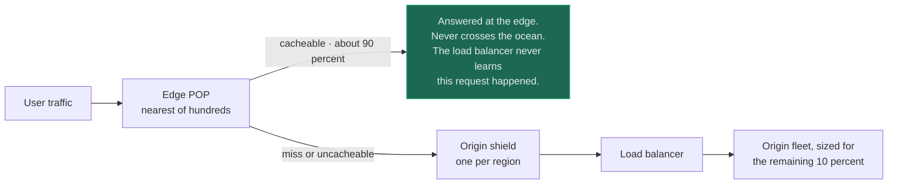
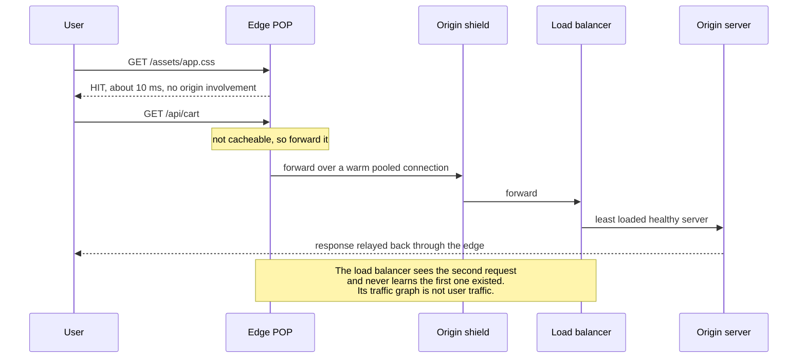

# CDN / Edge + Load Balancer

`[INTERMEDIATE]` · The load balancer divides work; the edge removes it — and removes it before it has crossed an ocean, which is the one latency term no amount of engineering behind the load balancer can touch.

---

## 1. Why combine them

A [load balancer](../../03-load-balancing/fundamentals/) answers "one server is not enough". A CDN
answers something the load balancer cannot even see: **the user is 15,000 km away and light is slow.**
Adding servers does not shorten a fibre route. Optimising a query does not change a 150 ms round trip.

The two therefore act on different terms of the same total, which is why they compose so cleanly and
why the composition is the default shape of every consumer product on the internet. Everything
interesting about the pair comes from a boundary that now exists: **the edge decides what the load
balancer is allowed to see.**

## 2. What happens WITHOUT the combination

**Load balancer, no edge.** Every byte crosses the long-haul path, including bytes that have been
identical for six months. A user 150 ms from your origin pays that distance repeatedly before any of
your code runs:

| Step | Cost at 150 ms RTT |
|---|---|
| TCP handshake | 1 RTT — 150 ms |
| TLS 1.3 handshake | 1 RTT — 150 ms |
| Request and first byte | 1 RTT — 150 ms |
| **Total before your server has done anything** | **~450 ms** |

That table is the whole argument. The logo is 4 KB and takes 450 ms, and no amount of capacity behind
the load balancer changes a single row of it.

**Edge, no load balancer.** Every miss funnels into one origin server. The CDN has made the cacheable
fraction fast and left the uncacheable fraction with no capacity story at all — and the uncacheable
fraction is where the product lives.

## 3. What the combination solves

The obvious win is offload: the load balancer sees misses and uncacheable requests only, so a 90%
offload ratio means the origin fleet is sized for a tenth of the traffic.

**The underrated win is that the edge accelerates traffic it cannot cache.** Terminating TLS 10 ms
from the user turns three long-haul round trips into three short ones plus a single long-haul leg —
and that leg travels over a pooled, already-open connection with a warmed congestion window, often on
the provider's private backbone rather than the public internet.

| Path | Uncacheable request, user 150 ms from origin |
|---|---|
| Direct to origin | ~450 ms of handshaking, then the response |
| Via an edge 10 ms away | ~30 ms to the edge, one warm 150 ms leg — roughly **180 ms** |

**A CDN with a 0% hit rate still makes dynamic requests substantially faster**, which is the fact most
often missing from the "we have nothing cacheable" conversation.

Read the split, then read the shield. Without it, a purge or a TTL expiry makes hundreds of POPs miss
the same key simultaneously and the load balancer receives a globally synchronised thundering herd.
The shield collapses those hundreds of misses into one per region — **it exists purely because the
edge is a fleet, and fleets miss together.**

## 4. What NEW problem the combination creates

**The client's IP address is gone, and everything that depended on it is now trusting a header.** To
the load balancer, every request in the world originates from a few hundred edge IPs. Per-IP rate
limiting, geo-routing, abuse detection, allow-lists and audit logs all stop working unless they read
`X-Forwarded-For` or an equivalent — and reading it is a security decision, not a plumbing one. If the
load balancer accepts that header from any source, **any client can spoof any IP** and walk straight
through per-IP limits and IP allow-lists. The correct configuration is narrow: strip the header at
ingress, repopulate it only from the CDN's published address ranges, and take the client IP from a
fixed position rather than from the end of a list an attacker can prepend to.

This is the most common real defect produced by this pair, and it converts a caching decision into an
authentication bypass.

**Cacheability becomes a contract, and violating it leaks data.** The cache key is a set of request
attributes the edge decides are significant. Get it wrong in one direction and offload collapses;
get it wrong in the other and one user's personalised response is served to everybody. A single
`Cache-Control: public` on an authenticated endpoint, a forgotten `Vary`, a session identifier moved
from a cookie into a query parameter — each is a routine change that becomes a cross-user data leak
because the edge did exactly what it was told.

**You now have two routing brains with different opinions.** The CDN health-checks your origin, and
the load balancer health-checks your servers, on different intervals with different thresholds and
different failure semantics — usually configured by different teams in different consoles. During a
partial failure they can disagree: the load balancer ejects a server the CDN still considers a viable
origin, or the CDN fails over to a secondary origin the load balancer has already drained.

And **the origin's load shape changes character.** Behind an edge, origin traffic is no longer a smooth
function of user traffic. It is misses — which arrive in bursts at purges, deploys and TTL boundaries.
Capacity planning against average origin load is now wrong in a way it was not before.

## 5. Request flow

The final note is the operational trap. Origin dashboards show misses, not demand — so a CDN
configuration change can halve or double load-balancer traffic with no change in user behaviour, and
the graph gives no hint that the cause was upstream.

## 6. Data flow

Only two questions decide everything: **is this response cacheable, and what is its key?**

| Attribute | Include in the cache key | Consequence of getting it wrong |
|---|---|---|
| Path | Always | — |
| Query string | Only the parameters that change the response | Include tracking parameters and offload collapses — every share link is a unique object |
| `Accept-Encoding` | Normalised to a small set | Unnormalised, you store one copy per client variation |
| Cookies | Almost never — strip them | One session cookie in the key means a per-user cache with a 0% hit rate |
| `Authorization` | Never cache the response at all | The classic cross-user leak |
| Device class or country | Only if the response genuinely differs | Each dimension multiplies the number of stored objects |

**Every attribute added to the key divides the hit rate.** Two boolean dimensions is four copies of
every object, each filled independently, each expiring independently. Offload ratio is not a property
of your traffic — it is a property of your cache key, and it is the number to put on the dashboard
next to origin load.

Invalidation flows the other way and is eventually consistent by nature: a purge propagates to
hundreds of POPs over seconds, so "we purged it" and "every user sees the new version" are separated
by a window you do not control. Content-hashed asset filenames sidestep this entirely by making every
version a different object, which is why that convention exists.

## 7. Trade-offs

| Choose | Get | Pay |
|---|---|---|
| Edge in front of the load balancer | Distance removed for cacheable traffic; faster handshakes for the rest | Client IP obscured; a second cache layer and TTL to reason about; a vendor in the critical path |
| Long edge TTLs | High offload, low origin cost | Purge latency becomes user-visible staleness |
| Short edge TTLs | Fresh content without purging | Origin sees far more misses, in synchronised bursts |
| Origin shield / tiered caching | POP misses collapse to one per region | An extra hop on every miss; another layer to debug |
| Cache authenticated responses at the edge | Large offload on personalised pages | A single key mistake becomes a cross-user data leak |
| Terminate TLS at the edge | One RTT saved; certificate management outsourced | Plaintext exists inside the provider unless you re-encrypt to origin |
| No CDN, load balancer only | One system, one set of logs, real client IPs | Distance paid on every byte, forever |

## 8. Failure modes

| What fails | Effect | Survivable? | Mitigation |
|---|---|---|---|
| Edge provider outage or misroute | Users cannot reach you, and your origin looks perfectly healthy | Depends entirely on preparation | Second CDN with DNS failover; keep origin able to serve directly; test the bypass |
| Purge storm or TTL alignment | Hundreds of POPs miss the same objects at once; the load balancer sees a global herd | Yes | Origin shield; TTL jitter; stale-while-revalidate |
| `X-Forwarded-For` trusted from anywhere | Per-IP rate limits and IP allow-lists bypassed by a spoofed header | **No** — silent security failure | Strip and repopulate at ingress; trust only the CDN's published ranges |
| Authenticated response cached publicly | One user's data served to everyone; the edge is behaving correctly | No | Deny-by-default cacheability; automated tests asserting `private` on authenticated routes |
| Origin marked unhealthy by the CDN but healthy by the load balancer | Traffic drains to a secondary origin nobody was watching | Yes | Align health-check paths, intervals and thresholds across both layers |
| Edge cache poisoned via an unkeyed header | A malicious response is served to every subsequent user of that POP | No | Include every header that influences the response in the key, or refuse to vary on it |
| Origin sized against average origin load | Miss bursts exceed capacity even though the average is comfortable | Yes | Provision against miss-burst peak; shield; keep the herd collapsed |

**Row one is the risk people accept without noticing they accepted it.** Putting an edge in front of
the load balancer makes the CDN a hard dependency of your availability, and your own monitoring is
now positioned behind it — origin metrics stay green through a total user-facing outage.

## 9. When this is appropriate

- Users are geographically spread and the origin lives in one or two regions
- A meaningful fraction of bytes is identical for many users — assets, media, public pages, API
  responses that are not per-user
- Traffic is spiky or subject to bursts you would rather not provision for
- You want DDoS absorption in front of your infrastructure — see [DDoS](../../12-security/ddos/)
- Even with little cacheable content: TLS termination near the user is worth roughly 2 RTTs per
  connection

## 10. When this is over-engineering

An internal B2B admin tool with 200 users, all in one country, where every response is
tenant-specific and none of it is cacheable.

The offload ratio here is the JavaScript bundle and a few images — perhaps 3% of requests. Against
that you take on: a second vendor in the availability calculation, the client-IP problem in every
audit log and rate limiter, a cache-key surface where one mistake serves tenant A's data to tenant B,
and a second TTL layer in every staleness investigation. **The pair's entire value is distance and
repetition, and this system has neither.**

Skip it, or scope it, when:

- Users sit within roughly 30 ms of the origin region — the handshake saving is then a few
  milliseconds and the added hop can cost more than it saves
- Under ~20% of bytes are cacheable and there is no DDoS or burst requirement
- The traffic is service-to-service. An internal API behind a public CDN is a public attack surface
  and an extra hop, in exchange for nothing — [service discovery](../../03-load-balancing/fundamentals/)
  and a load balancer are the right shape
- You have no way to test the bypass. A CDN you cannot route around in an incident is a dependency
  you cannot recover from

The scoped middle path is usually correct: static assets on the CDN, everything else direct to the
load balancer. You get the real win and none of §4.

## 11. Real-world example

**Netflix Open Connect**, documented in Netflix's Open Connect appliance documentation — the source
cited in [the matrix](../MATRIX.md).

Open Connect is the most instructive version of this pair because it makes the separation literal.
Netflix ships physical appliances into ISP networks, so the cache is not merely near the user, it is
inside the last mile — video bytes frequently never traverse the public internet at all.

The important structural point is what that leaves behind. **The control plane and the data plane are
different traffic, not one stream split by a ratio.** Browsing, search, authentication and playback
authorisation run on AWS behind ordinary load-balanced services; the client asks that control plane
which appliance to stream from, and then the bytes — overwhelmingly the majority of them — flow from
a machine the load balancers never see and could not have served. The load-balanced tier is sized for
a workload that is orders of magnitude smaller than the product's actual traffic, which is exactly the
outcome §3 describes, taken to its limit.

## 12. Exercises

**1.** After putting a CDN in front of your load balancer, per-IP rate limiting stops blocking anyone
and your audit log records the same six IPs for every action. What happened, and what is the *unsafe*
fix?

Answer

Every request now originates from the edge fleet, so the connection's source IP is a CDN POP. Per-IP
limits see six clients making all the traffic, and the audit log has lost the only identifier it had.

The unsafe fix is "read `X-Forwarded-For`". Done naively it is worse than the bug: if the load balancer
accepts that header from any source, a client can send `X-Forwarded-For: 1.2.3.4` and be rate-limited,
geo-routed and audited as someone else. Taking the *first* entry is the classic error, because the
first entry is attacker-supplied.

The safe version has three parts: strip the header at ingress so nothing external survives, repopulate
it only for connections arriving from the CDN's published address ranges, and read the client IP from
a fixed position counted back from the trusted hop — or use the provider's signed single-value header.
See [rate limiter + load balancer](../rate-limiter-and-load-balancer/), where the same identity
question decides whether limiting works at all.

**2.** Offload ratio drops from 88% to 41% overnight. No code was deployed. Origin load has more than
quadrupled. Where do you look first?

Answer

The cache key, and specifically what got added to it. The usual causes are all configuration or
content rather than code: a marketing campaign appending unique tracking parameters so every share
link is a distinct object; a new `Vary` header on a common response; a `Set-Cookie` appearing on a
previously cacheable path, which most CDNs treat as an instruction not to cache; or a TTL reduced by
someone chasing a staleness complaint.

The general principle is that **offload ratio is a property of the cache key, not of your traffic** —
so a change nobody thought of as a caching change can quarter it. This is also why origin load must be
watched next to offload ratio: origin load alone tells you something is wrong, and only the pair tells
you where.

**3.** Your CDN provider has a regional outage. Origin dashboards are entirely green — normal latency,
normal error rate, low CPU. Users in that region cannot load the site. What does this tell you about
where your monitoring lives?

Answer

It lives behind the failure. Every metric you own is collected at or below the load balancer, so it can
only describe requests that reached you — and during an edge outage the defining symptom is that
requests do not arrive. **A drop in traffic is the signal, and a drop in traffic never triggers a
threshold alert built for a rise.**

Two consequences. First, monitor from outside: synthetic checks from multiple regions through the real
public path, plus real-user monitoring reported by clients, plus an alert on traffic falling
anomalously rather than only on errors rising. Second, the recovery path must be pre-built and
rehearsed — DNS that can be repointed to the load balancer directly or to a second CDN, an origin able
to take unfiltered traffic, and TTLs on those records short enough that the change takes effect within
the incident rather than after it.

## 13. Related

- [Load balancer](../../03-load-balancing/fundamentals/) — health checking, routing policies, ejection
- [Cache](../../04-caching/fundamentals/) — TTLs, hit rate and eviction, one layer further in
- [Load balancer + cache](../load-balancer-and-cache/) — the same placement question, behind the edge
- [Rate limiter + load balancer](../rate-limiter-and-load-balancer/) — what to do once the client IP is gone
- [Latency](../../00-foundations/latency/) — why distance is the term nothing else touches
- [DDoS](../../12-security/ddos/) — the edge as absorption layer
- [Combination matrix](../MATRIX.md) · [Section index](../README.md) · [Glossary: CDN](../../GLOSSARY.md#cdn)
