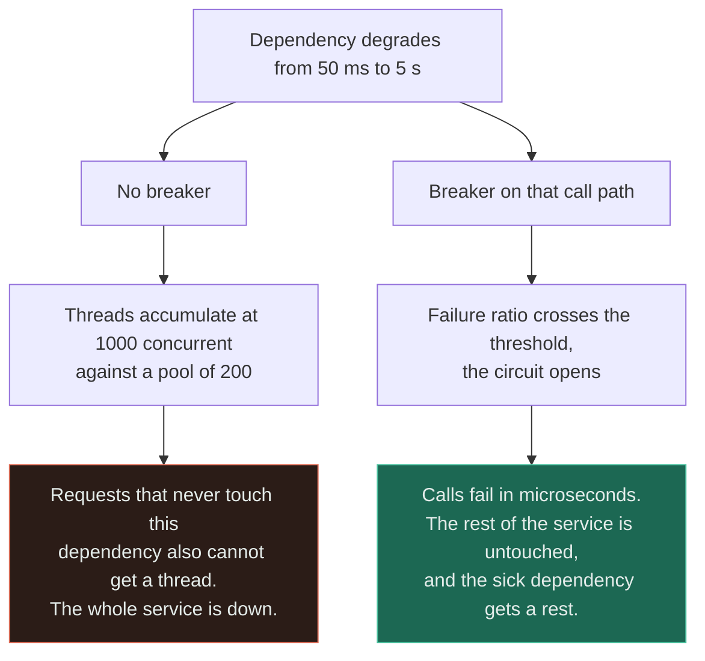
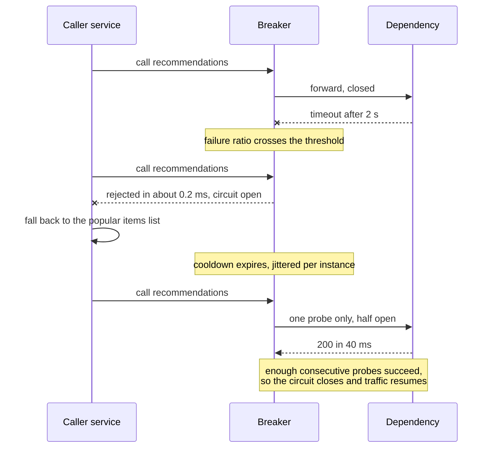
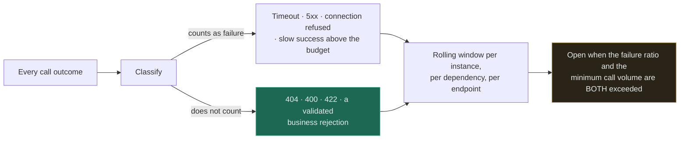

# Circuit Breaker + Service

`[INTERMEDIATE]` · A dependency that is *slow* consumes the caller's resources while producing nothing; the breaker converts slow back into fast failure, which is the only failure mode you can actually route around.

---

## 1. Why combine them

A service calling a dependency has to handle two failures, and they are not variations of each other.
**Down is easy — you get an error immediately and can decide what to do.** Slow is the dangerous one,
because a slow call is indistinguishable from a working one right up until it is not, and while you
wait you are holding a thread, a connection, a pool slot and some memory.

A timeout converts slow into an error, and every serious system has timeouts. But a timeout alone
means every request still *pays* the timeout before failing. The breaker adds the one thing a timeout
lacks: **memory.** Having watched the last hundred calls fail, it stops making the hundred-and-first,
and returns immediately.

## 2. What happens WITHOUT the combination

A dependency degrades from 50 ms to 5 s. Nothing is down. No error rate rises. And the caller dies.

Little's Law is the whole explanation — concurrency equals arrival rate times service time, `L = λW`:

| Dependency latency | Arrival rate | Concurrent calls in flight | Against a 200-thread pool |
|---|---|---|---|
| 50 ms | 200 per second | 10 | Comfortable |
| 500 ms | 200 per second | 100 | Half the pool, in one dependency |
| 5 s | 200 per second | **1,000** | Pool exhausted five times over |

**The arithmetic that matters is what happens to everything else.** Once the pool is full, requests
that never touch the sick dependency cannot get a thread either. A dependency serving one endpoint
takes down all of them: **a partial failure becomes a total one, and the component that failed is not
the component that is down.**

Now add retries without a breaker. The caller retries three times, so a dependency already unable to
keep up receives three times the load, guaranteeing it cannot recover. That is a retry storm, and it
is why retries and breakers are not two independent good ideas — **retries are only safe in the
presence of a breaker.**

## 3. What the combination solves

The breaker puts a bound on how much of the caller's capacity a sick dependency may consume. Below the
threshold, calls proceed normally. Above it, the circuit opens and calls return immediately without
touching the network.

Two consequences, and the second is the more valuable:

- **Resource commitment becomes bounded.** The 1,000-concurrent row above cannot happen, because the
  breaker stops issuing calls long before the pool fills.
- **Fast failure is routable.** You cannot do anything useful with a call that might return in five
  seconds. You *can* do something with one that failed in 0.2 ms: serve a cached value, hide the
  feature, return a partial response, or enqueue the work for later. **Degradation requires a decision
  point, and the decision point requires a fast answer.**

Read the right branch's last clause. Opening the circuit is not only self-protection — it removes load
from a dependency that is failing *because* it is overloaded, which is frequently the only thing that
lets it recover at all.

## 4. What NEW problem the combination creates

**A breaker is an automated availability decision made from a small, local sample — and it takes the
decision away from you at the worst possible moment.** A 2% error rate concentrated into a ten-second
window can trip a threshold and turn a partially working dependency into a completely unavailable one
for the whole cooldown. The breaker did what it was configured to do. The 98% of calls that would have
succeeded were rejected anyway.

**Half-open recovery is a synchronised herd.** All hundred instances of the caller observe the same
outage, open at roughly the same moment, and time out their cooldowns together. When the cooldown
expires they all probe simultaneously — and a dependency that has just come back receives its full
production load in a single step, fails, and every breaker opens again. This produces the
characteristic sawtooth where a service recovers and re-dies on a fixed period. It is fixed by
jittering the cooldown and admitting only a small number of concurrent probes per instance in
half-open.

**Per-instance state cuts both ways.** Each caller instance keeps its own counters, so a fault
affecting one availability zone opens only the breakers of the instances behind it — which is
correct and desirable. But on a low-volume call path, no single instance sees enough calls to trip
reliably, so the breaker never opens no matter how broken the dependency is. Volume-based thresholds
exist for exactly this and are routinely left at defaults that never apply.

**You now have to define "failure", and the definition is where the bugs are.** A `404` is a correct
answer. A `400` is your caller's bug. A `429` is a failure that retrying makes worse. A slow success is
a failure. Counting the wrong things opens the circuit during a client bug and leaves it shut during a
real outage — and the classification lives in configuration nobody reviews.

**A breaker without a fallback is a faster 500.** It protects the caller's threads, which is real and
worth having, but the user still gets an error. The fallback is what converts protection into
degradation — and the fallback path only ever executes during an incident, which makes it the least
tested code in the service, running on the worst day.

## 5. Request flow

The two lines that matter are the rejection and the line under it. Rejection costs 0.2 ms instead of
2 s — a factor of ten thousand in resource commitment — and the fallback immediately after it is the
only reason the user sees a page at all rather than an error.

## 6. Data flow

The breaker carries no business data. What flows through it is a **health signal**, and the signal is
constructed from three choices that are usually made by accepting defaults.

Read the amber box as a conjunction, because the missing half is the most common misconfiguration: a
ratio threshold with no minimum volume opens the circuit when two calls out of two fail on a quiet
endpoint, and a minimum volume set too high never trips on a path that only sees five calls a minute.

Scope matters as much as thresholds. **One breaker per dependency is too coarse** — a single failing
endpoint opens the circuit for healthy ones on the same host. One breaker per instance per
dependency-endpoint pair is the shape that behaves sensibly, and it is what the bulkhead idea amounts
to when applied to breakers.

## 7. Trade-offs

| Choose | Get | Pay |
|---|---|---|
| Breaker on a dependency call | Bounded resource commitment; fast failure you can route around | Calls that would have succeeded are rejected while open |
| Lower failure threshold | Trips early, protects aggressively | Opens on blips; converts partial degradation into total unavailability |
| Higher failure threshold | Tolerates transient noise | May not trip until the pool is already exhausted |
| Short cooldown | Recovers quickly when the dependency returns | Probes a still-sick dependency often, prolonging its overload |
| Long cooldown | Gives the dependency real breathing room | Stays down for minutes after it recovered |
| Breaker plus a fallback | The user sees degraded service instead of an error | A code path that only runs during incidents, therefore never tested |
| Breaker plus a queue | Work is parked rather than dropped; the outage becomes a delay | Only works for asynchronous work — see [queue + worker](../queue-and-workers/) |
| Timeouts only, no breaker | Nothing to tune, nothing to misconfigure | Every request pays the full timeout; the pool still exhausts under sustained slowness |

**The last row is a real option, and it is right more often than breaker enthusiasm suggests.** A
strict timeout plus a bounded connection pool per dependency already caps concurrency — that is the
bulkhead, and it delivers most of the containment with no state machine and no thresholds to get
wrong.

## 8. Failure modes

| What fails | Effect | Survivable? | Mitigation |
|---|---|---|---|
| Breaker opens on a transient blip | A working dependency is cut off for the whole cooldown | Yes | Minimum call volume alongside the ratio; a rolling rather than fixed window |
| Breaker never opens on a low-traffic path | The pool exhausts exactly as it would with no breaker | Yes, painfully | Set the volume threshold from real per-instance traffic, not from a default |
| Synchronised half-open probing | The recovering dependency is re-killed on a fixed period; a sawtooth | Yes | Jitter the cooldown per instance; cap concurrent probes |
| Misclassified failures | `404`s open the circuit, or `429`s do not | Yes | Classify explicitly; treat only timeouts, 5xx and transport errors as failures |
| Untested fallback | The fallback throws during the incident it exists for | **Often not** | Exercise it in normal operation — a scheduled forced-open, or fault injection |
| Fallback calls the same dependency | The degraded path fails for the identical reason | No | The fallback must not share the failure domain: static data, cache, or a different service |
| Breaker on a write path | The write is rejected; the caller assumes it did not happen; it may have | Yes | Only break idempotent calls, or pair with an outbox — [queue + database](../queue-and-database/) |
| One breaker for a whole host | A single sick endpoint disables healthy ones | Yes | Scope per dependency-endpoint pair |

Row six is the quiet one. **A fallback that reaches the same database, the same cache or the same
region as the primary path is not a fallback, it is a second attempt** — and it will fail in the same
incident, at which point the breaker has bought you nothing the user can see.

## 9. When this is appropriate

- The call crosses a process boundary you do not control — another team's service, a third party
- The dependency's failure should not be your failure: recommendations, personalisation, enrichment,
  analytics
- A meaningful fallback exists — cached data, a default, a reduced feature, or a queue
- Retries are in use anywhere on this path. Retries without a breaker are an amplifier
- The dependency has a history of getting slow rather than getting dead, which is most of them

## 10. When this is over-engineering

**An in-process function call.** A breaker around code that runs in your own address space guards
against nothing — there is no network, no pool, no queueing, and the failure is already fast. This
sounds obvious and is nonetheless common in codebases where a resilience library was adopted
wholesale.

**A call to your own primary database.** If the database is unavailable, opening the breaker does not
give you a way to serve the request — there is no fallback, so the breaker converts a database error
into a slightly cheaper database error. Connection-pool limits and a strict statement timeout do the
containment properly. The exception is a genuinely optional read with a cached or default answer.

**A single dependency called under 10 times a minute.** Per-instance counters over that volume are
statistically meaningless: the window is either so long that it reacts minutes late, or so short that
two unlucky calls trip it. A timeout and a small dedicated connection pool are the honest answer.

**Any path where there is no fallback and the call is mandatory.** Payment authorisation during
checkout has no degraded mode — you cannot ship the order without it. A breaker there converts a slow
failure into a fast failure and nothing more. Sometimes that is worth it purely to protect the thread
pool, but be clear that is the only benefit, and a bulkhead achieves it with less machinery.

The general test: **a breaker earns its complexity only when something useful happens on the open
path.** If the answer to "what do we do when it opens?" is "return the same error", you wanted a
timeout and a bounded pool.

## 11. Real-world example

**Netflix Hystrix**, documented on the Netflix TechBlog — the source cited in
[the matrix](../MATRIX.md).

Hystrix is the reference implementation of this pair and, usefully, also its retrospective. Two things
in its design are worth carrying regardless of the library you use. First, **it did not ship a breaker
on its own** — every dependency call was wrapped in a command with a timeout, a dedicated thread pool
or semaphore, a fallback and a breaker, on the explicit reasoning that the breaker alone does not
bound concurrency and the pool alone does not stop the calls. The isolation and the breaker solve
adjacent halves of §2.

Second, Netflix's operational writing is blunt about the fallback being the point. A breaker with no
degraded mode protects the caller and abandons the user; the Netflix home page under a
recommendations outage renders unpersonalised rather than failing, which is only possible because the
open path returns in microseconds and has somewhere to go.

Hystrix itself is now in maintenance mode, with the ecosystem moving to Resilience4j and to
service-mesh outlier detection that applies the same logic at the proxy. **The mechanism outlived the
library**, which is the usual fate of a good pattern.

## 12. Exercises

**1.** A downstream service slows from 40 ms to 6 s. It returns no errors — every request eventually
succeeds. Your service starts returning 503s on endpoints that do not call it at all. Explain.

Answer

Little's Law. Concurrency is arrival rate times service time, so at 150 requests per second a jump
from 40 ms to 6 s takes in-flight calls from 6 to 900. Every one of those holds a worker thread and a
connection. Once the shared pool is exhausted, **requests to unrelated endpoints cannot obtain a
thread**, so they queue and then time out — the failure spreads by resource contention, not by
dependency.

This is the precise reason "it is slow, not down" is the more dangerous incident: error-rate alerts do
not fire, the dependency's own dashboards look fine, and the symptom appears in a service that is not
broken. Containment needs two things together: a timeout well below the point of exhaustion, so a
single call cannot hold a thread for six seconds, and isolation — a dedicated pool or semaphore per
dependency — so that even at full saturation the damage is confined to callers of that dependency.

**2.** Your breaker is configured to open at a 50% failure rate over a 10-second rolling window. A
dependency is down every night from 02:00 to 02:05. The breaker never opens. What is missing?

Answer

Almost certainly the **minimum call volume**, interacting with per-instance state. At 02:00 traffic is
low: spread over 60 instances, a single instance might make three calls in a 10-second window. If the
configured minimum is 20 calls, the ratio is never evaluated and the breaker is inert exactly when the
dependency is broken.

The fix is not simply lowering the minimum, which makes daytime false trips likely — two unlucky
calls out of two would open the circuit at peak. Options: lengthen the window at low volume so enough
samples accumulate, share breaker state across instances through the service mesh or a small shared
store, or accept that below a certain per-instance rate a timeout plus a dedicated pool is the correct
mechanism and a breaker is not. **Per-instance breakers are a statistical device, and statistics need
samples.**

**3.** During an incident the breaker opens correctly and the fallback path throws a
`NullPointerException`, so users see a 500 anyway. What class of bug is this, and how would you have
found it?

Answer

The structural one from §4: **the fallback only executes during incidents, so it is the least-exercised
code in the service, and it runs on your worst day.** It rots quietly — a field is renamed, the cached
shape changes, a dependency is refactored — and nothing fails, because nothing calls it.

Finding it requires running it in normal operation. In order of increasing seriousness: unit tests
that assert the fallback's output shape; a forced-open switch exercised on a schedule in production
against a small traffic slice; and continuous fault injection that opens random breakers during
business hours, which is what game days and chaos tooling exist for.

There is a design lesson underneath the testing one. Prefer fallbacks that are hard to break: a static
list, a constant, or an already-populated cache is more robust than a fallback that computes something
— and a fallback must never touch the failing dependency's failure domain, or it fails for the same
reason at the same moment.

## 13. Related

- [Reliability](../../00-foundations/reliability/) — timeouts, retries, backoff and jitter
- [Availability](../../00-foundations/availability/) — why a dependency's availability multiplies into yours
- [Queue + worker](../queue-and-workers/) — parking work instead of dropping it when the breaker opens
- [Rate limiter + load balancer](../rate-limiter-and-load-balancer/) — the inbound half of the same idea
- [Cache + queue](../cache-and-queue/) — ⚠ the cascade a breaker is meant to interrupt
- [Observability](../../11-observability/) — breaker state is a signal, and it belongs on a dashboard
- [Combination matrix](../MATRIX.md) · [Section index](../README.md) · [Glossary: circuit breaker](../../GLOSSARY.md#circuit-breaker)
