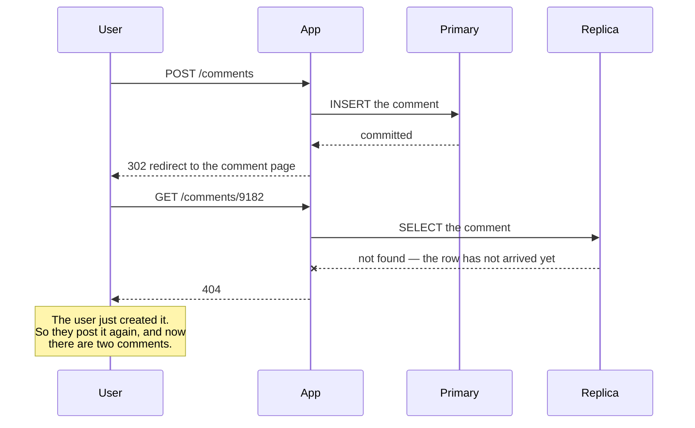
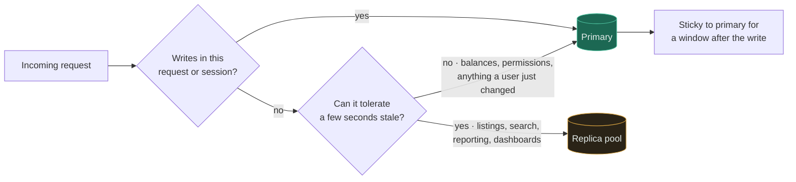
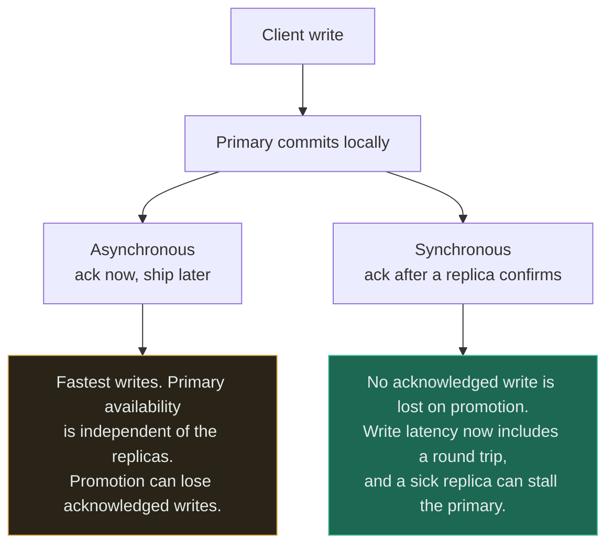

# Database + Read Replica

`[INTERMEDIATE]` · Reads get a second machine that speaks the same query language as the first — and a window, unbounded in the bad case, in which that machine disagrees with it about what happened.

---

## 1. Why combine them

A [database](../../05-databases/fundamentals/) primary has one budget and every read and write draws
on it. A [read replica](../../05-databases/replication/) is a second copy that continuously applies
the primary's change log, so reads can be served from somewhere the writes are not.

**What makes this pair so tempting is that a replica requires no design.** Unlike a cache it needs no
key scheme, no invalidation, no serialisation format and no decision about what to store — it answers
arbitrary SQL over the whole dataset. You point a connection string at it and read capacity appears.
That absence of design work is exactly why the cost arrives later, in application code that was
written before anybody thought about lag.

## 2. What happens WITHOUT the combination

Every query lands on the primary, which means **read load and write load compete for the same
resources and there is only one lever: a bigger machine.**

The concrete symptom is not usually raw throughput. It is interference: the nightly reporting query
scans a large table, evicts the buffer pool, holds a long transaction that blocks vacuum, and
checkout latency triples for reasons that have nothing to do with checkout. One workload's worst
behaviour is every workload's problem, and the only isolation available is scheduling.

What you keep in exchange is worth stating, because the rest of this page is about losing it: **there
is exactly one copy, so a read cannot be behind.** Every consistency question has the same answer.

## 3. What the combination solves

Read throughput scales roughly with the number of replicas, and — usually more valuable — **workloads
can be isolated from each other.** Reporting on its own replica cannot evict the primary's buffer pool
or hold a transaction that blocks maintenance. Search indexers, exports and data-science queries get
somewhere to live that is not the machine taking orders.

Two more, often the real motivation:

- **A failover candidate exists.** A replica that is already streaming can be promoted in seconds,
  where restoring a backup takes hours. Availability improves more than read capacity does.
- **Geographic read locality.** A replica in another region turns a 150 ms cross-ocean read into a
  local one. Writes still cross the ocean, but reads dominate.

**A replica adds read *capacity*, not read *speed*.** The same query takes the same time on a replica
as on an unloaded primary. This sentence resolves most arguments about whether to add one.

## 4. What NEW problem the combination creates

**Replication lag is not a fault condition. It is the design.** Asynchronous replication acknowledges
a write once the primary has it durably, and only then ships it. The window is normally single-digit
milliseconds and is **unbounded in principle** — a long transaction, a bulk update, a schema change,
an index build, a network hiccup or a saturated replica pushes it to seconds or minutes. Worse, on
engines where apply is less parallel than the primary's write path, a replica can fall behind at a
rate it can never make up: lag then grows monotonically until the write rate drops.

The bug this produces is the most common consistency bug in the industry:

Read the last note rather than the 404. **The duplicate is the real damage**: the user's rational
response to seeing their own write vanish is to repeat it, so a staleness bug becomes a data-integrity
bug through entirely reasonable human behaviour.

The same lag produces a second, subtler defect. Two consecutive reads routed to two replicas with
different lag show the user data moving **backwards** — a comment count of 12, then 11, then 12. Each
read is correct with respect to some point in time; there is simply no promise that successive reads
move forwards. Monotonic reads have to be bought, usually by pinning a session to one replica.

**Routing leaks into every query path.** Each statement now needs an answer to "primary or replica?",
and the default is wrong for whichever case nobody considered. ORMs make this worse by hiding the
decision inside a session abstraction, so a lazily-loaded relation follows a different route from the
query that triggered it. The rule that actually survives contact with a codebase is coarse and
deliberately conservative: **anything in a request that has performed a write reads from the primary
for the rest of that request, and for a short sticky window afterwards.**

Finally, two things replicas are widely and wrongly believed to be:

- **A replica is not a backup.** `DROP TABLE` replicates faithfully, in milliseconds. Backups protect
  against the operator; replicas protect against the machine.
- **Promotion is not free of data loss.** With asynchronous replication, the writes the old primary
  acknowledged but had not yet shipped are gone when a lagging replica is promoted. That is not a bug
  in the failover, it is the async guarantee being cashed in.

## 5. Request flow

The two questions are the whole routing policy, and they must be asked per query rather than per
service. Note the sticky window at the bottom: without it the redirect after a write goes to a replica
and you are back in §4, and its length is a guess about lag that must be validated against the real
lag distribution rather than assumed.

## 6. Data flow

Changes flow one way — primary to replica — and the only real question is **where the write
acknowledgement sits relative to that flow.**

Postgres exposes this as a spectrum rather than a switch — `synchronous_commit` ranges from `off`
through `remote_write` to `remote_apply`, and each step trades write latency for a stronger statement
about what survives a failover. **The green box is not simply the better option**: a synchronous
replica that becomes unreachable can block writes on the primary entirely unless a quorum of two or
more candidates is configured, which is how a durability improvement turns into an availability
incident.

## 7. Trade-offs

| Choose | Get | Pay |
|---|---|---|
| Add a read replica | Read capacity; workload isolation; a fast failover candidate | Lag, and every consistency bug that follows from it |
| Asynchronous replication | Fast writes; primary unaffected by replica health | Acknowledged writes can be lost on promotion |
| Synchronous replication | No acknowledged write lost on failover | Write latency includes a round trip; a sick replica can stall the primary |
| Route all reads to replicas | Maximum offload | Read-your-writes breaks by default, everywhere |
| Route reads to the primary after a write | The common bug disappears | Offload drops; you must define and tune the sticky window |
| Session pinned to one replica | Monotonic reads | Uneven load; that replica's lag becomes that user's experience |
| Replica in another region | Local read latency for distant users | Lag grows with distance; a partition can strand it badly behind |
| A cache instead | Per-key latency improves, not just capacity | Key design and invalidation — see [cache + database](../cache-and-database/) |

## 8. Failure modes

| What fails | Effect | Survivable? | Mitigation |
|---|---|---|---|
| Read-your-own-writes | Users see 404s and duplicates on data they just created | Yes, but it corrupts data via retries | Route to primary after a write, for a window longer than p99 lag |
| Non-monotonic reads | Values move backwards between two page loads | Yes | Pin a session to one replica, or read from primary for that flow |
| Lag grows without bound | Replicas serve minutes-old data; the failover candidate is worthless | **No** | Alert on lag in *seconds*, not on replica uptime; shed read load; throttle bulk writes |
| Replica promoted while lagging | Acknowledged writes are silently lost | No | Synchronous or quorum commit for data where that is unacceptable |
| Replica treated as a backup | An erroneous `DELETE` replicates perfectly | No | Real backups with point-in-time recovery, tested by restoring |
| Long read on the replica cancelled | `canceling statement due to conflict with recovery` — the primary vacuumed rows the query still needed | Yes | `hot_standby_feedback`, or a raised `max_standby_streaming_delay` and the lag it causes |
| Replica falls out and nobody notices | Read capacity quietly halves; the survivors saturate | Yes | Health-check on lag as well as liveness; eject on lag, not only on failure |
| Connection pool sized per node | Total connections multiply by the number of replicas | Yes | Pool per target; a proxy such as PgBouncer |

**Row six is replica-specific and surprises people.** A read on a standby can be killed by activity on
the primary, because recovery must apply changes that remove rows an in-flight query still needs. The
two available fixes each cost something: telling the primary to hold rows back for the replica creates
bloat, and letting the replica delay recovery creates lag.

## 9. When this is appropriate

- The primary is genuinely read-saturated — check CPU and IO before believing it
- Read:write ratio is high, so moving reads actually moves the load
- A distinct workload wants isolating: reporting, exports, search indexing, analytics
- You need a fast failover target more than you need read capacity, which is often the honest reason
- Distant users read far more than they write

## 10. When this is over-engineering

**The primary is at 15% CPU.** Then a replica adds no speed — the same query takes the same time on
another machine — and it adds a routing decision to every query path, a lag metric to monitor and
alert on, a class of bug that reproduces only under load, and a failover procedure to rehearse.

Specific cases where the answer is something else:

- **The problem is one slow report.** A nightly logical dump, a scheduled export into a warehouse, or
  simply running it off-peak isolates that workload without introducing lag into the online path.
- **The problem is per-key read latency.** A replica does not make an individual query faster. If the
  goal is turning a 30 ms lookup into a 1 ms one, that is [cache + database](../cache-and-database/).
- **The problem is a missing index.** A replica lets you serve the same bad query on two machines. It
  is the most expensive way to avoid an `EXPLAIN`.
- **You want a backup.** Take a backup. Then test restoring it.

A workable trigger: consider a replica when the primary is sustained above roughly 60% CPU or IO with
reads dominating, **or** when a specific workload's interference is measurable in the online path,
**or** when the recovery-time objective cannot be met from backups. Below all three, the replica is
paying for the read-your-writes bug in advance.

## 11. Real-world example

**Standard Postgres and MySQL deployments** — documented in the PostgreSQL streaming replication
documentation, the source cited in [the matrix](../MATRIX.md).

Postgres is the clearest reference here because it exposes the trade-off as configuration rather than
hiding it. `synchronous_commit` is not a boolean: `off`, `local`, `remote_write`, `on` and
`remote_apply` are five distinct answers to "what must be true before the client is told the write
succeeded", each one a different point on the durability-versus-latency line, and `remote_apply` is
notably the only one that guarantees a subsequent read on that standby will see the write.

The documentation is equally explicit about the conflict in §8: recovery on a hot standby must apply
changes that can invalidate rows an in-progress query is reading, so either the query is cancelled,
or recovery is delayed — `max_standby_streaming_delay` — or the standby asks the primary to hold rows
back with `hot_standby_feedback`, at the cost of bloat on the primary. **There is no configuration
that avoids all three**, and choosing between them consciously is the difference between running
replicas and having them.

## 12. Exercises

**1.** A user updates their profile and is redirected to the profile page, which shows the old name.
Refreshing once shows the new one. An engineer proposes adding a 500 ms delay before the redirect. Is
that a fix?

Answer

No. It is a bet that lag will never exceed 500 ms, and lag is unbounded in exactly the circumstances
that matter — a bulk update, a long transaction, a saturated replica during a traffic peak. The
failure rate becomes low enough to close the ticket and high enough to keep reappearing, which is the
worst possible outcome because the next engineer will not connect the symptoms.

The fix is routing, not timing: **after a write, that session reads from the primary** for a window
comfortably longer than observed p99 lag. Better still, do not re-read at all — the write already
knows the new state, so render from it. If offload matters and the pattern is common, the stronger
options are a replica configured for `remote_apply` on that path, or carrying a log-sequence-number
token with the session and routing to a replica only once it has applied at least that position.

**2.** Replication lag on one replica has been climbing steadily for six hours and is now at 40
minutes. Write volume is normal and the replica's CPU is at 30%. What is likely happening, and why is
the failover story now worse than it was yesterday?

Answer

Steady growth with the replica not obviously busy points at apply being unable to keep pace with the
primary's write stream — historically single-threaded or partially parallel apply, a long-running
query on the standby blocking recovery, or a large index build replaying serially. Low CPU is
consistent with this: the bottleneck is serialisation, not throughput, so the machine looks idle while
falling further behind every minute.

The failover consequence is the important half. A replica 40 minutes behind is not a failover
candidate — promoting it discards 40 minutes of acknowledged writes. **The availability benefit that
justified the replica has silently evaporated**, and nothing alerted, because uptime checks pass
perfectly on a replica that is up and useless. Lag in seconds is the health check; liveness is not.

**3.** Your read:write ratio is 50:1 and the primary is saturated. Someone suggests adding four
replicas; someone else suggests a cache. What decides it?

Answer

Two properties of the read workload, not the ratio.

**Skew.** If a small key set absorbs most reads, a cache converts them into memory lookups and removes
them from the database entirely — far more leverage per pound than four more copies of the whole
dataset. If reads are spread over the keyspace or are arbitrary analytical queries, cache hit rate
will be poor and replicas are the right instrument.

**Query shape.** A cache serves the exact keys you designed for; a replica serves any query. Ad-hoc
reporting, joins and filters that vary per request fit a replica and cannot be cached without building
a query cache, which is a much larger project than it first appears.

They are also not exclusive, and the combination has its own cost worth pricing in: a cache in front of
a replica stacks two staleness windows, so a user can observe data older than either the TTL or the
lag alone would explain. Whichever you pick, add it for a measured reason — and note that a cache
makes an individual read *faster* while a replica only makes read capacity *larger*.

## 13. Related

- [Replication](../../05-databases/replication/) — mechanics, topologies and failover in depth
- [Database](../../05-databases/fundamentals/) — transactions, indexes and the single-node view
- [Read replica + shard](../shard-and-replica/) — the same lag question, once per shard
- [Database + shard](../database-and-shard/) — the other axis of scale, for writes rather than reads
- [Cache + database](../cache-and-database/) — read speed rather than read capacity
- [Consistency](../../00-foundations/consistency/) — what "eventually" actually promises
- [Combination matrix](../MATRIX.md) · [Section index](../README.md) · [Glossary: read replica](../../GLOSSARY.md#read-replica)
