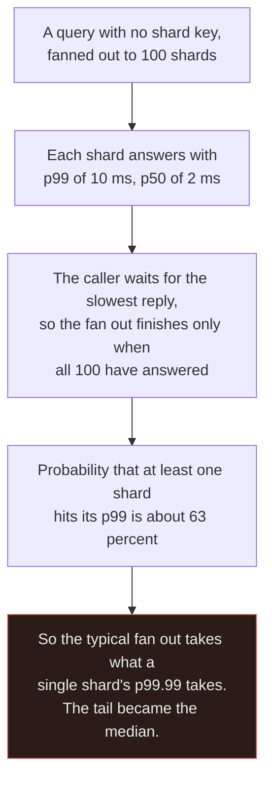
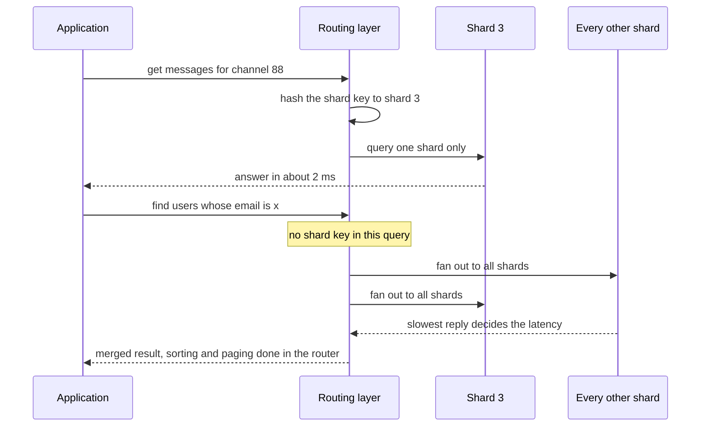
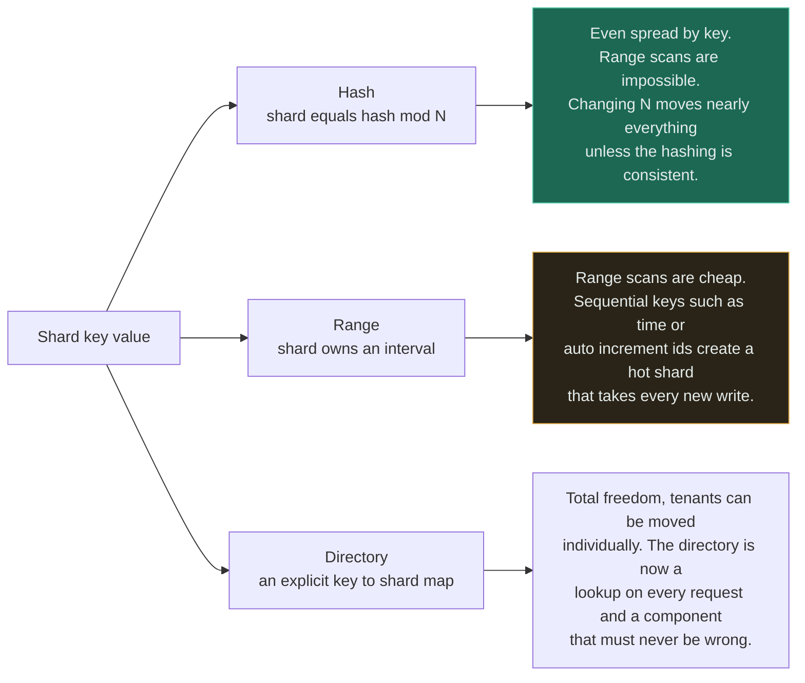

# Database + Shard

`[ADVANCED]` · Write capacity and storage stop being bounded by one machine, and in exchange the database stops being one thing — joins, transactions and uniqueness all now end at a boundary chosen by a key you picked before you understood the workload.

---

## 1. Why combine them

Replicas solve reads. Caches solve repeated reads. **Neither does anything for writes**, because every
write still lands on the one primary, and neither does anything for a dataset that no longer fits on
one machine at an acceptable cost.

[Sharding](../../05-databases/sharding/) partitions rows across independent
[databases](../../05-databases/fundamentals/) by a shard key. Each shard is a complete, ordinary
database that happens to hold a subset. That last sentence is the source of both the scalability and
every problem below: **the shards do not know about each other, and nothing above them is a database.**

## 2. What happens WITHOUT the combination

One primary takes every write. There are three ceilings and they arrive in a fairly predictable order:

- **Write throughput.** A single primary serialises commits through one write-ahead log on one set of
  disks. Batching, index pruning and faster hardware move this ceiling substantially, and then stop.
- **Storage and maintenance.** The problem long before "the disk is full" is that maintenance stops
  fitting in the day: a backup that takes eleven hours, an index rebuild that cannot complete in a
  window, a restore whose duration exceeds the recovery objective by an order of magnitude.
- **Blast radius.** One primary means one failure takes everything, and one bad query takes everyone.

The compensation is enormous and is what makes §4 hurt: **a single database is a single transaction
domain.** Joins work. Foreign keys work. `UNIQUE` works. `SELECT ... FOR UPDATE` works. Every one of
those is a guarantee provided by the fact that all the data is in one place.

## 3. What the combination solves

Write throughput and storage both become functions of shard count rather than of machine size, and
they scale close to linearly for the workloads sharding suits. Maintenance becomes tractable again
because each unit is small: eight one-terabyte backups running in parallel finish in an eighth of the
time, and an index rebuild affects an eighth of the users.

Blast radius shrinks in the same proportion. **One shard down is a fraction of users affected rather
than all of them** — provided the application can serve a partial system, which is a property that has
to be built and is routinely not.

## 4. What NEW problem the combination creates

**The shard key is close to permanent, and you choose it at the moment you know least.** It determines
which queries are cheap, which are ruinous, how evenly load spreads, and whether a future feature is
implementable at all. Changing it means rewriting every row in the dataset while serving traffic.
Teams have spent a year on this. The key is not a schema decision that can be revisited in a
migration; it is closer to a public API.

**Any query that does not carry the shard key becomes a scatter-gather, and its latency becomes the
worst of N.** This is the point people underestimate most, and the arithmetic is unforgiving:

Read the last box literally. `1 - 0.99^100` is roughly 0.63, so nearly two out of three fan-outs
include at least one slow shard — the rare case at the level of one shard is the *common* case at the
level of the query. This is the central result of Dean and Barroso's *The Tail at Scale*, and it is why
[shard + search index](../MATRIX.md) is classified as an anti-pattern rather than a technique.

**Transactions, joins and uniqueness stop at the shard boundary.** Two rows on different shards cannot
be updated atomically without two-phase commit or a saga. A `UNIQUE` constraint on email addresses is
unenforceable across shards — the database will happily accept the same address on shard 3 and shard
7, and the only real answers are to route that constraint through a separate single-owner service or
to make the constrained column part of the shard key. Foreign keys across shards simply do not exist.

**Even key distribution is not even load distribution.** Hashing spreads keys uniformly and says
nothing about traffic. One tenant with a hundred thousand times the activity of the median lands on
one shard, and that shard saturates while the cluster reports comfortable average utilisation. Hot
shards are the normal outcome of real workloads, not an edge case.

**Everything operational is now multiplied and can disagree.** A schema migration is N migrations that
can be in N different states. A backup is N backups that were not taken at the same instant, so
"restore the cluster to 14:05" is not a thing you can do without extra machinery. Monitoring is per
shard, because an average across shards hides the one that is on fire.

## 5. Request flow

The two halves are the same system behaving completely differently. **The first path is why you
sharded; the second is what you have to design out of existence**, either by carrying the shard key on
every hot query, by maintaining a secondary lookup that maps the alternate key to a shard, or by
keeping a dedicated index outside the sharded store.

## 6. Data flow

Which shard owns a row is decided by one function, and the three available families differ in what
they make cheap and what they make impossible.

The amber box is the classic mistake: range-sharding on a monotonically increasing key gives every new
write to the highest shard, so the cluster has N machines and one of them is doing all the work.
Hash-sharding avoids it and gives up ordered scans in return — which is exactly why real systems
frequently use a **composite key**, hashing a high-cardinality identifier and ordering within it. That
is the Discord shape in §11.

Whichever family you choose, the arrangement must include an answer for rebalancing, because shard
count will change. Consistent hashing bounds movement to roughly `1/N` of keys rather than nearly all
of them, and virtual nodes make the movement finer-grained; a directory makes movement explicit at the
cost of a lookup. **Deciding this after the first resharding is deciding it during an outage.**

## 7. Trade-offs

| Choose | Get | Pay |
|---|---|---|
| Shard the database | Write and storage scale with shard count; blast radius divided | No cross-shard joins, transactions or uniqueness; a permanent key decision |
| Hash sharding | Even key distribution; no sequential hot spot | Range scans gone; `N` changes are expensive without consistent hashing |
| Range sharding | Cheap ordered scans and time-window queries | Sequential keys concentrate all new writes on one shard |
| Directory sharding | Individual tenants can be relocated; total flexibility | A lookup on the critical path that must be correct and always available |
| More shards | More headroom; smaller units of maintenance | Wider fan-out on every keyless query; more nodes to operate |
| Fewer, larger shards | Simpler operations; narrower fan-out | Coarser rebalancing; a hot tenant is harder to isolate |
| Partition inside one database instead | Maintenance and storage relief, joins and transactions intact | Write throughput is still one machine's |
| Do not shard; archive cold data | Often removes the pressure entirely, for weeks of work rather than a year | Only works if the data has a cold tail, and it usually does |

## 8. Failure modes

| What fails | Effect | Survivable? | Mitigation |
|---|---|---|---|
| Wrong shard key chosen | Hot queries need fan-out; hot tenants concentrate; fixing it means moving every row | **Barely** | Model the top ten queries against candidate keys *before* committing |
| Hot shard | One shard saturates while cluster average looks healthy | Yes | Per-shard dashboards; composite keys with a bucket; split or relocate that key range |
| Keyless query in a hot path | Latency becomes the slowest shard's, on every request | Yes | Secondary lookup table, denormalised copy, or a dedicated index outside the shards |
| Cross-shard write needed | No atomicity; partial updates leave inconsistent state | Yes, with work | Saga with compensations, or design so the transaction lives inside one shard |
| Resharding while serving | Two nodes move the same range; reads go to the old owner | No, if uncoordinated | A single authoritative topology map; mutual exclusion during moves; dual-write then cut over |
| One shard down | That fraction of users is affected — or everything is, if the app cannot serve partially | Yes, if designed for | Per-shard degradation; do not let one shard's timeout block the whole response |
| Migration applied to some shards | The schema differs between shards; the application meets both | Yes | Orchestrated migrations with per-shard state tracking; backwards-compatible steps only |
| Backups taken at different times | No cluster-wide point-in-time restore | Yes | Per-shard PITR plus an application-level consistency story; accept it explicitly |

**Row one has no good mitigation, which is why it heads the list.** Every other row is an
operational problem with a known remedy. The shard key is the one decision that is cheap to make and
extraordinarily expensive to unmake, and it is usually made in a design review by people who have not
yet seen the query patterns the product will develop.

## 9. When this is appropriate

- Write throughput exceeds one primary after batching, index review and hardware have been exhausted
- The dataset has outgrown what one machine can back up, restore and maintain within your objectives
- The access pattern has a natural partition key that appears in nearly every query — a tenant, a
  user, a channel, a device
- Blast-radius reduction is worth real money, and the application can serve a partially available
  system
- Regulatory data residency forces physical partitioning regardless of scale

## 10. When this is over-engineering

**Forty million rows and a primary at 25% CPU.** A single well-indexed Postgres or MySQL node handles
hundreds of millions of rows and tens of thousands of writes per second on ordinary hardware. Sharding
at this point buys nothing and costs the entire §4 list, permanently.

Exhaust these first, in this order — each is weeks of work rather than a year, and each is reversible:

1. **Indexes and query review.** The single most common "we need to shard" turns out to be one
   sequential scan on a hot path.
2. **Archive the cold tail.** Most datasets are dominated by rows nobody reads. Moving records older
   than a year into object storage or a cold table routinely removes 80% of the volume, and the
   maintenance pressure with it.
3. **Declarative partitioning inside one database.** This is the step most often skipped and it is the
   highest-value one. Postgres partitioning gives you small, independently maintainable units —
   per-partition indexes, cheap bulk drops of old data, faster vacuum — while **joins, foreign keys
   and transactions all keep working**, because it is still one database. Partitioning is not sharding
   and solves the maintenance half of the problem with none of §4.
4. **Read replicas** if reads are the pressure, and **a cache** if repeated reads are.
5. **Vertical scale.** Unfashionable, immediate, reversible, and cheaper than an engineer-year.

Sharding earns its cost when the bottleneck is genuinely *write* throughput or genuinely *single-node*
storage, and when a natural key exists that appears in nearly every query. **If you cannot name that
key in one sentence, you are not ready to shard** — and if the honest reason is anticipated growth
rather than measured pressure, wait, because the shard key chosen from real query logs will be a better
key than the one chosen from a roadmap.

## 11. Real-world example

**Discord's message storage**, documented in *How Discord Stores Trillions of Messages*, and **Vitess at
YouTube** — the systems cited in [the matrix](../MATRIX.md).

Discord is the most instructive published account because the shard key is the whole story. Messages
are partitioned by a composite key of **channel id plus a static time bucket**, and clustered by
message id inside the partition. That single choice makes the dominant query — "give me the recent
messages in this channel" — a read of one contiguous partition on one node, which is the fast path in
§5. It also bounds partition size, because without the bucket a busy channel would grow a partition
without limit.

Two further details are worth carrying. Their large partitions still became hot, and the mitigation
was not a database change but a **request-coalescing data service in front of the cluster**: when
thousands of users request the same channel simultaneously, one query runs and the rest wait on it —
precisely the single-flight idea from [cache + database](../cache-and-database/), applied to shards.
And when Cassandra's tail latencies and compaction behaviour became the limit, they migrated the
entire dataset to ScyllaDB rather than change the partitioning, which is a fair demonstration of the
§4 claim: **the storage engine was easier to replace than the shard key.**

## 12. Exercises

**1.** A team shards a users table by `hash(user_id)`. Login is by email address. What did they just
do to the login path, and what are the two fixes?

Answer

They made login a scatter-gather. `SELECT ... WHERE email = ?` carries no shard key, so the router must
ask every shard, and login latency becomes the slowest shard's latency on every attempt — the §4
arithmetic applied to the single most latency-sensitive endpoint in the product. Worse, the `UNIQUE`
constraint on email is now unenforceable: two shards can each accept the same address.

Two fixes, and they are the general answers to this whole class of problem. **A lookup table** mapping
email to user id, itself sharded by `hash(email)`, turns login into two single-shard reads — the
standard solution, and the reason many systems tolerate an extra hop on login. Or **shard by email
instead**, if email is the identifier that appears in most queries; this trades the problem rather than
removing it, and it breaks the moment users are allowed to change their email address.

Note the third option that looks attractive and is not: a global secondary index maintained across
shards. It reintroduces a cross-shard write on every user creation, which is the atomicity problem
from §4 wearing a different hat.

**2.** You are asked to shard by `hash(order_id)` for an e-commerce system. What is the question you
should ask before agreeing?

Answer

"What are the ten highest-volume queries, and do they carry `order_id`?"

They almost certainly do not. `orders for this customer`, `orders in this date range`, `orders for
this seller`, `unfulfilled orders in this warehouse` — every one of those becomes a fan-out under
`hash(order_id)`, and together they are the majority of the traffic. Sharding by the primary key is
the intuitive choice and it is usually the wrong one, because primary keys are what the system uses
internally while shard keys need to match what the *workload* asks for.

`hash(customer_id)` is the likelier answer: it keeps a customer's whole order history on one shard,
which makes the dominant read single-shard and lets a customer's orders be updated in one transaction.
It brings its own costs — a very large customer becomes a hot shard, and seller-oriented queries are
still fan-outs — and naming those costs before committing is exactly the exercise. **The shard key
follows the query distribution, not the entity diagram.**

**3.** Your cluster of 16 shards shows average CPU at 30%, and users report the product is slow. What
do you look at, and why did the average lie?

Answer

Per-shard metrics, sorted, not averaged. The likeliest picture is fifteen shards at 12% and one at
100% — a hot shard, caused by a tenant, channel or key range with orders of magnitude more activity
than the median. **An average across shards is designed to hide exactly this**, because the whole
point of sharding is that the units are independent, and averaging independent units discards the
information you sharded to obtain.

Two shapes of cause worth distinguishing. If the hot shard is hot for *writes* and the key is
sequential, this is the range-sharding hot spot from §6, and the fix is the key. If it is hot for one
tenant's reads, the fix may be isolation rather than repartitioning: move that tenant to a dedicated
shard, put a cache or a coalescing layer in front of its hot keys, or add a bucket component to the
key so the tenant's data spans several partitions.

The operational lesson generalises: after sharding, **every dashboard must show the distribution, and
alerts must fire on the maximum rather than the mean.** Averages were adequate when there was one
database and became misleading the moment there were sixteen.

## 13. Related

- [Sharding](../../05-databases/sharding/) — key selection, rebalancing and resharding mechanics
- [Database](../../05-databases/fundamentals/) — the guarantees that end at the shard boundary
- [Read replica + shard](../shard-and-replica/) — the standard large-database shape, built on this one
- [Database + read replica](../database-and-replica/) — the read-scale axis, which is usually tried first
- [Queue + database](../queue-and-database/) — where a sharded outbox stops being one transaction
- [Observability](../../11-observability/) — why the mean across shards is the wrong statistic
- [Combination matrix](../MATRIX.md) · [Section index](../README.md) · [Glossary: sharding](../../GLOSSARY.md#sharding)
