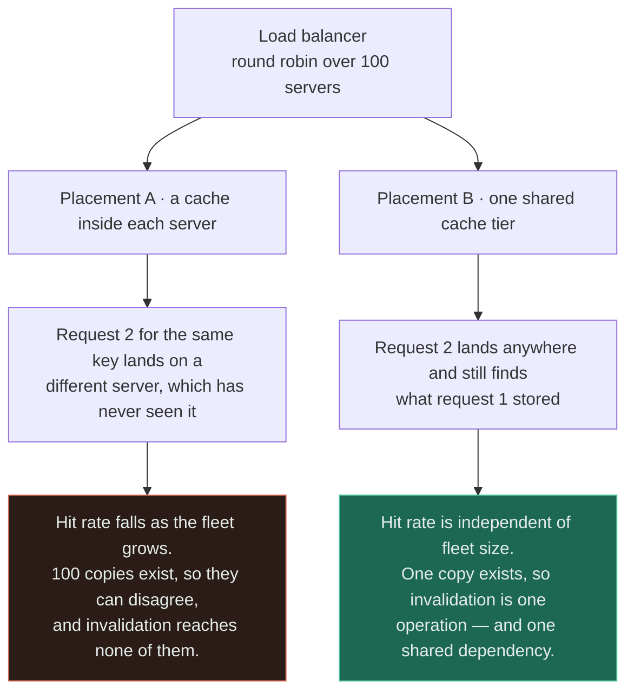
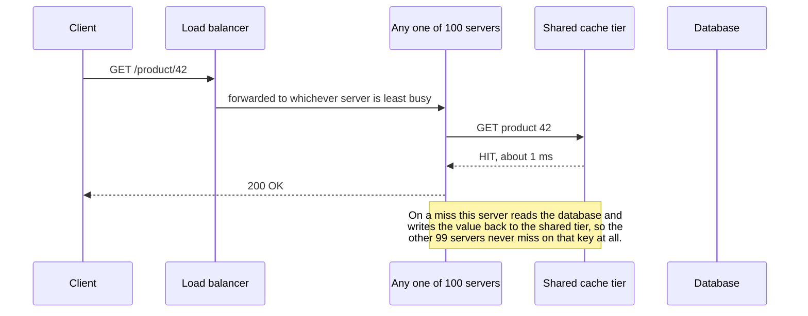
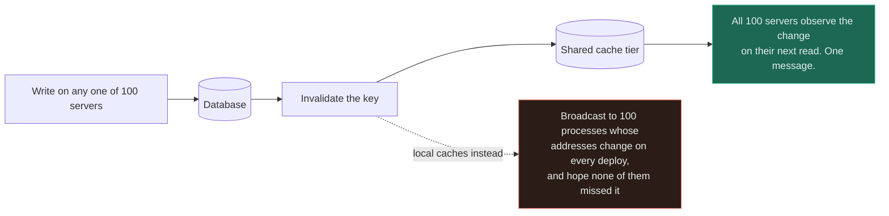

# Load Balancer + Cache

`[INTERMEDIATE]` · A cache assumes the second request for a key will find what the first one stored; a load balancer's entire job is to send the second request somewhere else — so **where the cache sits** is the only thing about this pair that matters.

---

## 1. Why combine them

Nobody chooses this pairing. You arrive at it. A [load balancer](../../03-load-balancing/fundamentals/)
gets added because one server cannot take the traffic, and a [cache](../../04-caching/fundamentals/)
gets added because the database cannot take the reads. Both decisions are correct on their own, and
neither one mentions the other.

**The interaction is a single question with no default answer: is there one cache, or one cache per
server?** That question is almost never written down. It is answered implicitly, by whichever caching
library the first service happened to import back when there was only one server — and by then the
answer is load-bearing.

## 2. What happens WITHOUT the combination

Two "withouts", failing in opposite directions:

- **Load balancer, no cache.** Origin load tracks traffic exactly. Worse, scaling the stateless tier
  *increases* pressure on the one tier that is not stateless — more servers means more concurrent
  connections against the same primary. You scaled the cheap thing and loaded the expensive one.
- **Cache, no load balancer.** Hit rate is whatever the workload allows and invalidation is trivial,
  because there is exactly one copy in exactly one process. You also have a capacity ceiling and no
  redundancy.

The case that actually occurs is neither. It is the **third** one: an in-process cache is added while
there is one server, a second server is added a year later, and the single map silently becomes two
maps. No code changed, no configuration changed, and the hit rate halved. This is the only failure in
this document that produces no error, no alert and no log line.

## 3. What the combination solves

A shared cache tier takes fleet size out of the hit-rate equation entirely. One miss per key per TTL
for the whole fleet, whether the fleet is three machines or three thousand. Invalidation becomes one
operation against one copy, rather than a broadcast to N processes whose addresses change on every
deploy.

The arithmetic belongs on a whiteboard before this decision is made, not after. Take a 200-key hot
set and a 60-second TTL:

| Fleet size | Local caches — origin fills per minute | Shared tier — origin fills per minute |
|---|---|---|
| 3 servers | 600 | 200 |
| 20 servers | 4,000 | 200 |
| 100 servers | 20,000 | 200 |
| 500 servers | 100,000 | 200 |

**The left column scales with fleet size, not with traffic.** You can double the number of machines at
a constant request rate and exactly double the load on the database — which is the reverse of what
adding machines is supposed to do.

Read the two bottom boxes as two separate costs arriving together. On the left, the many misses are
the performance problem and the many copies are the correctness problem — they are usually discussed
in different meetings. On the right, note that the win is stated with its price attached.

## 4. What NEW problem the combination creates

Three, and the first is the one nobody costs in.

**The shared cache is now on the synchronous path of every request from every server, which gives it a
larger blast radius than the database it was installed to protect.** A component labelled "safe to
lose" on the architecture diagram now needs *higher* availability than the tier behind it. If the
cache tier runs at 99.9% and the primary at 99.95%, adding the cache made the read path measurably
less available while making it faster — and the availability change is the one nobody put in the
design document.

Second, **fan-out becomes a network problem of its own**. N servers times M cache nodes is a
connection mesh, and one request that needs 100 keys produces 100 responses converging on a single
NIC within the same few microseconds. That is TCP incast, and it shows up as inexplicable p99 spikes
under load with every individual component reporting itself healthy. Facebook's memcache paper spends
serious engineering on precisely this: batched multigets, UDP for reads, and a sliding window that
caps outstanding requests per client.

Third, **hit rate is now a function of the load-balancing policy, and the two are owned by different
people**. Switching from round-robin to least-connections, enabling session affinity, or routing 5% of
traffic to a canary with a cold cache all move the hit rate — and none of them are cache changes, so
none of them get reviewed as one.

## 5. Request flow

The load balancer picks a server for reasons that have nothing to do with the data. That is fine here
only because the cache lookup does not depend on which server was picked — swap the shared tier for a
per-server map and the second line of this diagram becomes the reason the fifth one fails.

## 6. Data flow

Reads flow one way and invalidations flow the other, and it is the invalidation direction that decides
whether the placement is viable.

The dashed edge is the honest version of "we will just publish invalidations to the fleet". It is a
reliable multicast to a membership list that autoscaling changes underneath you, with no
acknowledgement and no way to tell which process is holding stale data. **Invalidation is not harder
with local caches; it is a different and much worse problem.**

## 7. Trade-offs

| Choose | Get | Pay |
|---|---|---|
| Shared cache tier | Hit rate independent of fleet size; invalidation is one operation | A network hop on every request; a new dependency with fleet-wide blast radius |
| Local in-process cache | Sub-microsecond reads; no extra dependency, no extra hop | Hit rate degrades as you scale out; invalidation is effectively impossible |
| Both — local in front of shared | Absorbs hot keys before they reach one cache node | Two TTLs to reason about; the local layer reintroduces bounded staleness |
| Consistent hashing at the load balancer | Locality restored, so local caches work again | Hot keys concentrate on one server; every scaling event reshuffles the keyspace |
| Session affinity | Per-user data caches locally and stays there | Uneven load, and a server loss discards that user's whole cache |

The third row is what large fleets actually run, and it is worth naming: **the cure for a shared cache
node melting under a hot key is a small local cache, which is the thing you removed in §3.** The
resolution is that they hold different data — the local tier holds the handful of keys hot enough to
be worth duplicating, and everything else stays shared.

## 8. Failure modes

| What fails | Effect | Survivable? | Mitigation |
|---|---|---|---|
| Shared cache tier down | Every server falls through at once — a step change of `1 / (1 - hit rate)` on the database | **Often not** — at 95% hit rate the primary sees 20× in one instant | Decide fail-open or fail-closed *in advance*; breaker to the origin; spare capacity pool |
| One cache node of many down | That shard of the keyspace misses; a fraction of traffic falls through | Yes | Consistent hashing so only 1/N reshuffles; a standby "gutter" pool for evicted keys |
| Fleet scales out during a spike | New servers arrive with cold local caches and add origin load exactly when it is least wanted | Yes, briefly | Shared tier removes it entirely; otherwise warm on start and stagger the rollout |
| Load-balancing policy changed | Hit rate moves with no cache change; nobody correlates the two | Yes | Alert on hit rate as an SLI, not just on latency |
| Hot key lands on one cache node | One node saturates while the tier reports 8% average CPU | Yes | Replicate the hot key across nodes, or a small local tier in front |
| Incast under multiget fan-out | p99 spikes with every component individually healthy | Yes | Batch keys per node, cap outstanding requests, prefer UDP or a windowed protocol for reads |

**Row one is the pairing's defining risk and it is created by success.** The better the shared cache
works, the less capacity anyone provisions on the database, and the more catastrophic its absence
becomes. A 99% hit rate is a 100× step change waiting for a bad deploy.

## 9. When this is appropriate

- The fleet is large enough that `N × misses per TTL` is a number you would notice on the database
- The hot key set is shared across users, so one server's fill genuinely helps the other ninety-nine
- You need invalidation that is faster or more certain than "wait for the TTL"
- Servers are autoscaled or replaced often, so per-process cache state is destroyed constantly anyway
- The extra ~1 ms hop is cheap relative to the origin query it avoids — normally true when the origin
  costs 10 ms or more

## 10. When this is over-engineering

Three servers, a 200-key working set and a 60-second TTL puts **ten fills per second** on the
database. Standing up a managed Redis or memcached tier to remove ten queries per second buys you a
number invisible on any graph, and sells you a network hop on every request, an extra term in the
availability calculation, an on-call rota and a monthly bill.

Concretely, stay with local caches when **all** of these hold:

- Fewer than roughly five application servers, and no plan to pass ten
- The cached data is small, read-mostly reference data every server needs anyway — feature flags,
  currency tables, routing configuration, plan limits
- A staleness window equal to the TTL is genuinely acceptable, because a TTL is the only invalidation
  you are going to get

The threshold is not a server count, it is a crossing point: the moment `N × misses` becomes load you
can see, **or** the moment you need invalidation faster than a TTL, whichever comes first. The second
one arrives without warning and is usually triggered by a product requirement, not by traffic.

## 11. Real-world example

**Facebook**, documented in *Scaling Memcache at Facebook* (NSDI '13) — the source cited for this pair
in [the matrix](../MATRIX.md).

The paper is useful here precisely because it is not about memcached. It is about everything the
placement decision drags in once the fleet is large: a shared look-aside tier rather than per-server
caches, **leases** issued on a miss so that a thundering herd collapses into one fill and a slow
reader cannot overwrite newer data, batched multigets with an explicit outstanding-request window to
control incast, regional pools so that a rarely-read key is not replicated into every cluster, and a
"gutter" pool that absorbs the traffic of a failed cache node instead of letting it land on the
database.

Every one of those exists because of an interaction between the fleet and the cache, not because of
anything a cache does on its own.

## 12. Exercises

**1.** A service runs on 8 servers with an in-process cache, 5-minute TTL, and reports a 92% hit rate.
The team plans to autoscale to 80 servers for a launch. What happens to the hit rate, and what happens
to the database?

Answer

Hit rate falls and origin load rises roughly ten-fold at unchanged traffic, because each of the 80
servers must independently miss on a key before it holds it. The misses-per-TTL term scales with
**fleet size**, so the launch adds database load before a single extra user arrives.

The nastier detail is the timing: the scale-out happens *because* traffic is expected, so the cold-fill
spike lands at the same moment as the real spike. Options are a shared tier, warming new instances
before they take traffic, or staggering the rollout so 72 cold caches do not fill simultaneously. The
first is the only one that also fixes the 5-minute unbounded staleness the local caches have.

**2.** Someone proposes fixing the falling hit rate by enabling consistent hashing on the load
balancer, so each key always routes to the same server. Local caches then work again. What did they
just buy, and what did they just sell?

Answer

Bought: locality. Each key has one owner, so its local cache is as effective as a shared one, with no
extra hop and no extra dependency. This is a real technique.

Sold: three things. **Hot keys now concentrate load on one server** rather than spreading over the
fleet, so a celebrity account can saturate a single machine while the tier averages 8% CPU. **Every
scaling event or server loss reshuffles part of the keyspace**, invalidating locality exactly when the
system is already under stress — consistent hashing bounds this to roughly 1/N of keys, which is the
whole reason to use it rather than modulo. And **the routing layer now has to understand your data**,
which couples the load balancer's configuration to the application's key structure.

**3.** The shared cache tier is at 99% hit rate. During a routine upgrade it is unavailable for 90
seconds. Every graph looked healthy beforehand. What is the failure, and why did no monitoring predict
it?

Answer

The database receives a **100× step change** — not a ramp — the instant the tier goes away. Connection
pools exhaust, queueing begins, latency climbs past client timeouts, clients retry, and the retries
double the load again. The cache outage becomes a full outage.

Nothing predicted it because every dashboard measured the *steady state*, in which the database looked
comfortable at 1% of read traffic. The number that mattered — the multiplier the origin would face if
the cache vanished — is not on any default dashboard, and the cache was still labelled "safe to lose"
on the architecture diagram long after it stopped being optional. Track origin-load reduction
alongside hit rate: they are the same measurement read as a benefit and as a liability.

## 13. Related

- [Cache](../../04-caching/fundamentals/) — what the component does on its own, including placement
- [Load balancer](../../03-load-balancing/fundamentals/) — routing policies, health checking, affinity
- [Cache + database](../cache-and-database/) — the layer behind this one, and its own canonical bug
- [CDN + load balancer](../cdn-and-load-balancer/) — the same placement question, one tier further out
- [Rate limiter + load balancer](../rate-limiter-and-load-balancer/) — shared state at the edge, again
- [Observability](../../11-observability/) — hit rate as an SLI, and why the step change is invisible
- [Combination matrix](../MATRIX.md) · [Section index](../README.md) · [Glossary: hot key](../../GLOSSARY.md#hot-key)
