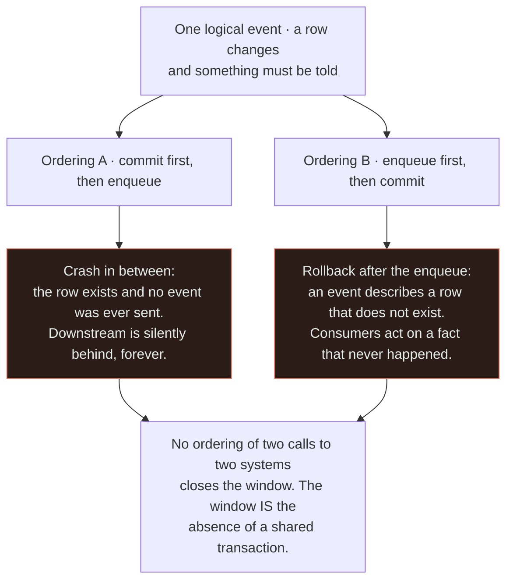
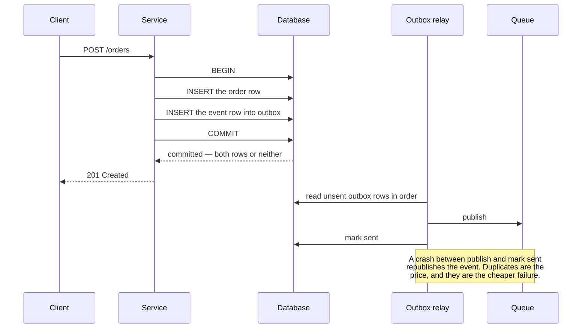
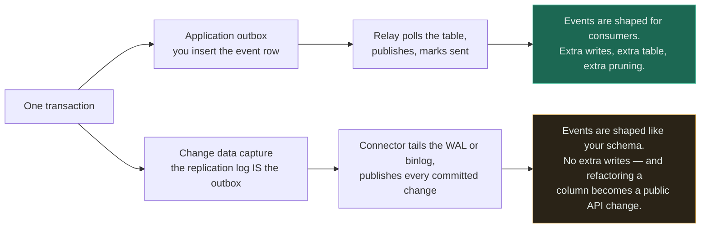

# Queue + Database

`[ADVANCED]` · A state change and the announcement of that state change are two writes to two systems that cannot share a transaction — so one of them will happen without the other, and no ordering of the two calls prevents it.

---

## 1. Why combine them

A [database](../../05-databases/fundamentals/) records that something is true. A
[queue](../../06-messaging/queues/) tells other systems that it became true. Almost every non-trivial
write wants both: the order row must exist *and* the warehouse, the email service and the analytics
pipeline must find out.

**The pair is not "a queue that stores data" and it is not "a database with notifications". It is one
logical event forced through two independent commit protocols**, and that is the entire subject of this
page.

## 2. What happens WITHOUT the combination

Every consumer of a state change has to discover it by asking. That produces one of two shapes, and
both are worse than they sound:

- **Polling.** Every interested system runs `SELECT ... WHERE updated_at > ?` against the primary on a
  timer. Load scales with the number of consumers times the polling frequency, and it does not fall
  when nothing is happening. Latency is bounded below by the poll interval, so making reactions faster
  means hammering the primary harder.
- **Synchronous fan-out.** The write path calls the warehouse service, then the mail service, then the
  analytics endpoint, inside the request. Now the checkout endpoint's availability is the *product* of
  four services' availability, and its latency is their sum. A slow analytics endpoint makes it
  impossible to place an order.

The virtue you give up when you leave this world is worth naming: with no queue, there is exactly one
commit. Either the change happened or it did not, and no consumer can hold a belief the database
disagrees with.

## 3. What the combination solves

The write path commits and returns. Consumers learn about the change without asking, without being in
the request, and without the writer knowing they exist — add a fifth consumer and no code in the
checkout path changes.

That is real decoupling and it is why everyone does it. It converts an availability product into an
availability sum: **the order succeeds even when the warehouse service is down, because the message
waits.** Reactions become bounded by broker latency rather than by a polling interval, and the primary
stops serving change-detection queries entirely.

## 4. What NEW problem the combination creates

The commit and the enqueue are two operations against two systems with no shared transaction. There
are two possible orderings and **both of them are wrong**.

Read the bottom box as the reason this is a design problem and not a coding problem. Retrying the
enqueue narrows ordering A; catching the exception narrows ordering B; neither eliminates anything,
because the process can stop between any two instructions and a network call can succeed while its
response is lost. **The failure rate is low enough to survive testing and high enough to matter at
scale**, which is the worst combination a defect can have.

Ordering A's failure is the more dangerous of the two, because it is invisible. A missing event
produces no error anywhere — the writer succeeded, the broker was never asked, and the consumer is
simply never told. It surfaces weeks later as a reconciliation discrepancy that nobody can explain.

### The answer is the transactional outbox

Stop writing to two systems. Write to one, twice.

The event is inserted into an `outbox` table **inside the same transaction** as the business row. One
commit, one atomicity guarantee, no window. A separate relay then reads the outbox and publishes to
the broker. The relay can crash, retry and duplicate as much as it likes, because it is now moving
data that is already durable.

### And the outbox has its own bill

This is the part that gets skipped. **The outbox converts a lost-event problem into a
duplicate-event problem**, which is a genuine improvement, and it is not free:

- **Duplicates are now guaranteed, not merely possible.** The relay publishes, crashes before marking
  the row sent, and publishes again. Consumers must be idempotent — the same requirement
  [queue + worker](../queue-and-workers/) imposes, arriving from a second direction.
- **A new moving part.** The relay is a process that must be running, monitored and highly available.
  If it stops, no error appears in the write path; events simply stop, and the outbox table grows.
- **Write amplification on the primary.** Every business write is now two inserts, and the outbox is a
  hot, high-churn table that needs pruning or partitioning. On Postgres an unpruned outbox is a
  first-class source of table bloat.
- **Ordering is preserved only if you keep it.** The outbox is written in commit order, but a relay
  with multiple threads, or a topic with multiple partitions, will publish out of order. Ordering
  survives only per partition key.

## 5. Request flow

The load-bearing line is `COMMIT`. Everything before it is one atomic unit, so the event cannot exist
without the order and the order cannot exist without the event. Everything after it is plumbing that
is allowed to fail, because it only ever moves data that is already safe.

## 6. Data flow

Two ways to get events out of the database, and the difference is whether you write the outbox
yourself.

Both remove the dual write completely, which is the point. They differ on **who owns the event
schema**. The application outbox lets you publish a deliberate, stable event — `OrderPlaced`, with the
fields consumers agreed to. CDC gives you row diffs for free but couples every downstream consumer to
your table layout, so renaming a column becomes a breaking change to systems you do not own. The
common resolution is CDC *on the outbox table*: no polling, and a schema you designed.

## 7. Trade-offs

| Choose | Get | Pay |
|---|---|---|
| Enqueue and commit separately | Nothing to build; looks correct in review | A silent lost-event window that testing will not find |
| Transactional outbox | Atomicity restored; no lost events | Duplicates guaranteed; a relay to run; write amplification; a table to prune |
| CDC from the replication log | No extra writes, no relay of your own to build | Event schema equals table schema; a connector cluster to operate |
| CDC on an outbox table | Deliberate event schema, no polling | Both sets of moving parts, minus the polling load |
| Two-phase commit across DB and broker | Genuine atomicity | Blocking on coordinator failure; most brokers do not support it; effectively nobody ships it |
| Skip the queue, poll the database | One commit, trivially correct | Load scales with consumers times poll rate; latency bounded by the interval |

**The last row deserves respect rather than reflex.** Polling is correct by construction and, below
a certain scale, cheaper in every dimension that matters. It is discarded too early and reinvented too
late.

## 8. Failure modes

| What fails | Effect | Survivable? | Mitigation |
|---|---|---|---|
| Crash between commit and enqueue | Event permanently lost; downstream silently diverges | **No** — it is undetectable without reconciliation | The outbox. Nothing else closes it. |
| Broker rejects after the transaction committed | Same as above, with a log line nobody reads | No | The outbox |
| Relay stops running | Events stop; the write path reports complete success; the outbox grows | Yes, if watched | Alert on oldest unsent outbox row age, not on relay uptime |
| Relay crashes after publish, before mark-sent | The event is published twice | Yes | Idempotent consumers keyed on the event id |
| Outbox table never pruned | Bloat, slower inserts, degraded autovacuum on the primary | Yes | Delete or partition on a schedule; treat it as a queue, not a log |
| Consumer reads the row and finds nothing | The message beat the commit, or a read replica lags | Yes | Read from the primary, or carry the state in the event instead of a bare id |
| Multiple relay instances | Duplicate publishes, and out-of-order publishes | Yes | Leader election, or partition the outbox by key |

Row three is the one that catches teams who did the hard part correctly. **The outbox makes lost
events impossible and stuck events easy**, and a stuck relay looks exactly like a healthy system from
every dashboard the write path owns.

## 9. When this is appropriate

- A state change must reliably reach systems outside the transaction's reach
- Consumers are owned by other teams, deployed separately, and may be down when the write happens
- Losing an event is a business problem — payments, orders, provisioning, audit
- You have more than one consumer, or expect to
- The reaction does not need to be inside the request, and the caller should not wait for it

## 10. When this is over-engineering

The consumer is a function in the same codebase, deployed in the same artefact, reading the same
database.

At that point a **jobs table plus `SELECT ... FOR UPDATE SKIP LOCKED`** is the outbox and the queue at
the same time, and there is no dual write at all — the enqueue *is* the transaction. Postgres handles
this comfortably into the low thousands of jobs per second, with atomicity, retries and visibility
timeouts expressible in ordinary SQL, and with the entire job state inspectable by the same tools you
already use to debug everything else.

Standing up Kafka plus Debezium plus a connector cluster to deliver twenty events per minute to one
consumer you deploy yourself adds three operational surfaces, a schema registry conversation, and a
new class of 2 a.m. page — to solve a dual-write problem you did not have, because you were never
writing to two systems.

Concrete thresholds where the simple answer is still the right one:

- **One database, and every consumer can reach it.** The dual write only exists across a boundary.
- **Under roughly 1,000 jobs per second**, where a jobs table is not the bottleneck
- **No independent consumers.** If the "event" has exactly one handler that ships in the same deploy,
  it is a function call with a retry, not an event
- **Ordering matters and volume is low.** A single-consumer jobs table gives you strict order for
  free; a partitioned topic makes you work for it

Graduate when a consumer moves to another team, another datastore, or another deployment cadence —
that is the moment the boundary appears, and the boundary is what creates the problem.

## 11. Real-world example

**Debezium and CDC-based pipelines**, with the pattern set out in Kleppmann, *Designing Data-Intensive
Applications*, chapter 11 — the source cited in [the matrix](../MATRIX.md).

Kleppmann's framing is the one worth carrying: the database's replication log is *already* an ordered,
durable, replayable record of every committed change, built and hardened for replication. Publishing
events from it does not add a write path that can disagree with the data — it derives the events from
the same commit that produced the data, so **there is no second write to get wrong**. Debezium is the
production instance of that idea, tailing the Postgres WAL or the MySQL binlog and emitting each
committed change as a message.

Note what the ecosystem then does with it: the widely used arrangement is CDC pointed at an
application-written outbox table rather than at business tables directly, exactly to recover the
deliberate event schema that raw row diffs give away.

## 12. Exercises

**1.** An engineer proposes: "publish to Kafka first, and if the database commit fails, publish a
compensating event." What is wrong with it?

Answer

It only handles the case where the process is alive to notice. If the service crashes, or the pod is
evicted, or the network partitions between the publish and the commit, no compensating event is ever
produced — and consumers have already acted on an order that does not exist.

There is a deeper problem: consumers must now handle a `Created` event that may later be retracted,
which means every consumer needs compensation logic for every event type. Charging a card and
un-charging it is not a rollback, it is two facts. This is the saga pattern, which is a legitimate tool
for genuinely distributed transactions — but here it is being used to paper over a dual write that the
outbox removes entirely, for one insert into one table.

**2.** Your outbox relay has been dead for six hours. No alert fired and every write succeeded. What
alert should have existed, and why is relay uptime the wrong thing to watch?

Answer

Alert on **the age of the oldest unsent outbox row**, with a threshold in the low minutes. That single
metric covers the relay being dead, the relay being alive but stuck on a poison row, the broker
rejecting publishes, and the relay running but failing to mark rows sent — all of which are the same
incident from the business's point of view.

Uptime is the wrong signal because it measures the wrong noun. A relay process can be up, healthy,
passing its liveness probe and doing nothing at all: crash-looping after a leader-election failure,
blocked on a full connection pool, or filtering out every row because of a bad configuration change.
The queue is empty, the dashboard is green, and events are not flowing. **Measure the work, not the
worker.**

**3.** You have adopted the outbox. A consumer now receives `OrderPlaced` twice for the same order. Is
this a bug?

Answer

No — it is the pattern working as designed. The relay publishes, then marks the row sent; a crash
between those two steps republishes. Making that window disappear would require the publish and the
mark to be atomic across the broker and the database, which is the dual write again, one level down.
**The outbox does not remove the two-systems problem; it moves it to a place where the failure mode is
duplication rather than loss**, and duplication is the one you can fix in the consumer.

So the consumer must be idempotent: record the event id in the same transaction as its effect, and
ignore ids already seen. Note that this is the identical requirement
[queue + worker](../queue-and-workers/) imposes for a different reason — at-least-once redelivery. Two
independent paths to the same conclusion is a good sign that idempotency is not a mitigation but a
property of the architecture.

## 13. Related

- [Queues](../../06-messaging/queues/) — delivery semantics and what a broker does and does not promise
- [Database](../../05-databases/fundamentals/) — transactions, and why atomicity stops at its edge
- [Queue + worker](../queue-and-workers/) — the consumer side, and the same idempotency requirement
- [Database + shard](../database-and-shard/) — where the outbox stops being one transaction
- [Idempotency](../../07-api-design/idempotency/) — the property both halves of this page demand
- [Workers](../../06-messaging/workers/) — who consumes what the relay publishes
- [Combination matrix](../MATRIX.md) · [Section index](../README.md) · [Glossary: idempotency](../../GLOSSARY.md#idempotency)
