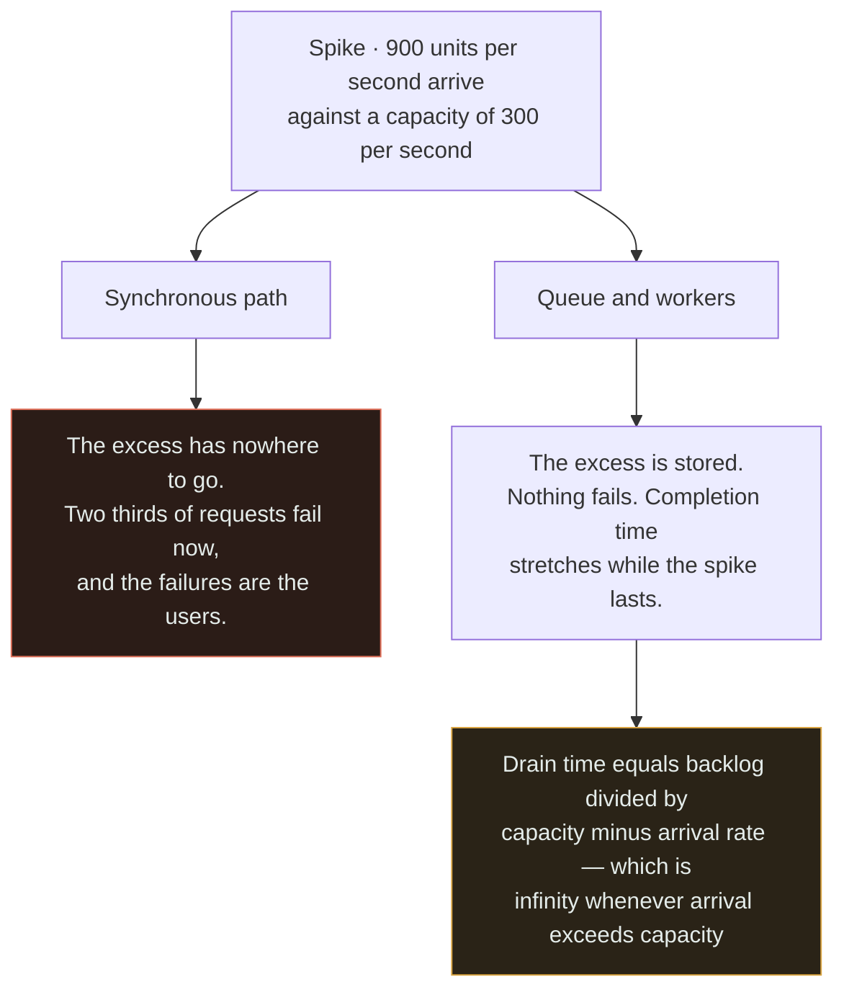
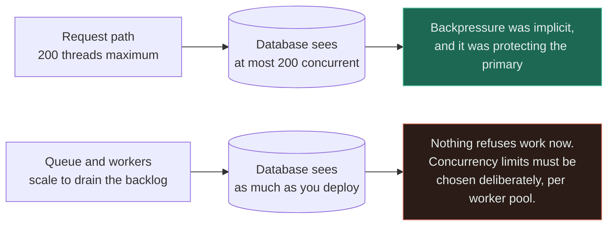
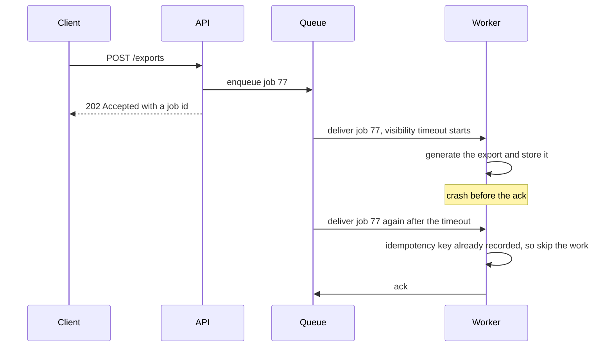

# Queue + Worker

`[INTERMEDIATE]` · Arrival rate and processing rate stop having to be equal — which turns a spike into a backlog instead of an outage, and turns every duplicate delivery into your application's problem.

---

## 1. Why combine them

A [queue](../../06-messaging/queues/) with nothing consuming it is a data structure. A
[worker](../../06-messaging/workers/) with nothing feeding it is a service. **The pair is the smallest
unit that actually decouples two rates**, and rate decoupling is the only reason anyone builds it.

In the synchronous world, arrival rate and service rate must match or something breaks: too slow and
requests time out, too many and threads exhaust. The queue makes the mismatch legal by storing it.
Everything on this page follows from where that stored mismatch goes.

## 2. What happens WITHOUT the combination

Work happens on the request thread. That has one enormous virtue that gets forgotten the moment it is
removed: **the request path is self-limiting.** A thread pool of 200 can hold 200 units of work in
progress and no more. When it fills, new requests are refused immediately. That is crude, ugly flow
control — and it is real flow control, protecting every downstream dependency for free.

The costs are the familiar ones. A 30-second PDF generation is a 30-second HTTP request. A downstream
outage becomes a user-visible error rather than a delay. A traffic spike of 3× either exhausts the
pool or saturates the database, and there is nowhere to put the excess except into an error message.

## 3. What the combination solves

The spike stops being an availability event. Work arriving faster than it can be processed accumulates
somewhere durable, and the system degrades in **latency** rather than in **success rate** — which for
most work is the trade every product owner would make if asked.

Read the amber box as the terms of the deal. A 10,000-message backlog with 100 arriving per second and
120 processed per second drains in 500 seconds. The same backlog with capacity at exactly 100 per
second **never drains** — the queue did not absorb the spike, it hid a permanent capacity shortfall
behind a number that only goes up. That is the difference between a buffer and a leak, and it is one
subtraction.

## 4. What NEW problem the combination creates

**At-least-once delivery is not a caveat in the documentation, it is a requirement placed on every
consumer you will ever write.** Nothing observable distinguishes a crashed worker from a slow one —
both are silence — so any broker that guarantees delivery must redeliver on silence, which means
duplicates. Exactly-once *delivery* across a network does not exist. Exactly-once *effect* does, and
it is achieved in your code, by making the handler idempotent. The queue has converted a
messaging-infrastructure problem into an application-correctness problem, permanently, in every
handler.

**Backpressure is gone, and it was load-bearing.** The thread pool that used to refuse work at 200
concurrent units has been replaced by a queue whose entire purpose is to accept work regardless of
whether anything downstream can cope. Scale workers to drain a backlog quickly and they will write to
the primary at three times the rate the request path was ever allowed to — the queue removed the only
rate limit that existed, and [queue + database](../queue-and-database/) is where that bill arrives.

The left branch never appeared in a design document because nobody designed it — it was a side effect
of how servers work. The right branch has to be designed, and the usual reason it is not is that
nobody noticed the left branch existed.

Two more, both cheap to state and expensive to discover:

- **Latency becomes invisible.** The API returns `202 Accepted` in 8 ms, every request-latency
  dashboard looks superb, and the user's export finishes forty minutes later. The real SLIs are
  **queue depth** and **age of the oldest message**, and neither is in the request-latency graph.
- **Ordering is lost the moment there is more than one worker.** Two workers on one queue complete
  messages out of order regardless of how strictly the broker preserves order on the way in. If order
  matters, it has to come from partitioning by key, not from the queue's FIFO label.

## 5. Request flow

The last three lines are the whole point. **Redelivery is normal operation, not an incident** — it
happens on every deploy, every autoscaling event and every GC pause longer than the visibility
timeout. A handler that is not idempotent does not fail here loudly; it quietly sends the customer a
second invoice.

## 6. Data flow

Messages should carry a reference, not a payload. The queue is a coordination channel and it is bad at
being a data store — a 5 MB message multiplies broker memory, network cost and redelivery cost by the
number of attempts, and most brokers cap message size well below what real payloads reach.

| What travels | Where the data lives | Consequence |
|---|---|---|
| Full payload in the message | The broker | Simple until the size cap, then a rewrite under pressure |
| A row id | The database | The row must exist before the enqueue — see [queue + database](../queue-and-database/) |
| An object-storage key | Object storage | The claim-check pattern; the queue stays fast at any payload size |

The middle row hides the pair's most common bug: the worker receives the id, reads the database, and
gets nothing — because the message was published before the transaction committed, or because a
read replica had not caught up yet.

## 7. Trade-offs

| Choose | Get | Pay |
|---|---|---|
| Queue plus workers | Spikes degrade latency instead of availability | Idempotency in every handler; a broker to run; a DLQ to watch |
| More workers | Faster drain, shorter backlog | Higher concurrent load on every shared downstream dependency |
| Longer visibility timeout | Fewer duplicate deliveries from slow work | A crashed worker's job is stuck for that long before retry |
| Shorter visibility timeout | Faster recovery from a dead worker | A second worker starts the same job while the first is still running |
| One queue for all job types | Simple to operate | One slow job type starves every other; head-of-line blocking |
| A queue per job type or priority | Isolation; slow work cannot block fast work | More queues to size, monitor and alert on |
| Dead-letter queue | Poison messages stop blocking the main queue | A DLQ nobody reads is a silent data-loss channel |

**The last row is the most commonly mishandled.** A dead-letter queue converts a loud failure into a
quiet one, and that is only an improvement if something is actually watching it.

## 8. Failure modes

| What fails | Effect | Survivable? | Mitigation |
|---|---|---|---|
| Arrival rate exceeds worker capacity, permanently | Backlog grows without bound; work is technically not lost and practically useless | **No** — this is an outage with a delay attached | Alert on *oldest message age*, not depth; autoscale on it; shed load at the producer |
| Worker crashes mid-job | Message redelivered after the visibility timeout; side effects may repeat | Yes, if handlers are idempotent | Idempotency keys recorded in the same transaction as the effect |
| Poison message | The same message fails, redelivers and fails forever, consuming capacity | Yes | Delivery-count cap plus a dead-letter queue that is monitored |
| Visibility timeout shorter than the work | Two workers run the same job concurrently, every time | Yes, but expensive | Timeout above p99 job duration; heartbeat extension for long jobs |
| Workers scaled up to drain a backlog | The database saturates from a source that has no rate limit | Often not | Explicit concurrency cap per pool; a breaker on the downstream dependency |
| Broker unavailable | Producers cannot enqueue; the request path fails at the point it thought it was safe | Yes | Treat enqueue failures as first-class; buffer locally or fail the request honestly |
| DLQ fills unnoticed | Silent, permanent data loss with a green dashboard | Yes | Alert on DLQ depth greater than zero, with an owner |

## 9. When this is appropriate

- The work is slower than the response time you are willing to give the caller
- The work can fail independently of the request and is worth retrying — sending mail, calling a
  third party, generating a file
- Arrival is spiky relative to capacity, and delay is a better failure than rejection
- The work must survive the caller disconnecting, or the server being replaced mid-flight
- Multiple consumers need to react to the same event and you want them decoupled

## 10. When this is over-engineering

An email that takes 40 ms to hand to your provider, sent five times a minute, behind a queue.

Count what that costs: a broker to run, patch and pay for; a dead-letter queue that needs an owner and
an alert; an idempotency requirement on the handler forever; a second deployable with its own
pipeline, dashboards and on-call surface; and a new incident class — "the job is stuck" — that did not
exist when it was a function call. All of it to remove 40 ms from a request that was already
comfortable.

The test is a short disjunction. **Put work behind a queue when at least one of these is true:**

- The work takes longer than the response time budget
- The work can fail on its own and should be retried without the user present
- Arrival is spiky enough that rejection would otherwise be the outcome
- The work must outlive the request, the connection, or the process

If none is true, call the function. Two more specific anti-uses:

- **Request/response over a queue with a reply channel.** That is RPC with extra hops, no timeout
  semantics you did not build yourself, and a distributed trace with a hole in it. Use HTTP or gRPC.
- **A queue between two components that always fail together anyway.** If the consumer is in the same
  process and the same deploy as the producer, the queue is buying decoupling that does not exist.

## 11. Real-world example

**Celery and Sidekiq shops, and AWS SQS with Lambda** — the systems cited for this pair in
[the matrix](../MATRIX.md), documented in the AWS SQS documentation.

SQS is a useful reference because it refuses to pretend. The documentation states plainly that standard
queues are **at-least-once** and that duplicates are expected, rather than offering an
exactly-once mode that quietly is not one. The visibility timeout is exposed as a tuneable with the
trade-off written down — too short and you get concurrent duplicate processing, too long and a crashed
worker's job is stranded. The redrive policy makes the poison-message path explicit: after N
deliveries a message goes to a dead-letter queue rather than consuming capacity forever. And FIFO
queues exist with a documented throughput ceiling, which is the honest statement of the §4 point that
ordering and concurrency are in direct tension.

## 12. Exercises

**1.** A backlog of 400,000 messages has built up during a four-hour outage. Arrival is 60 per second
and each worker handles 3 per second. How many workers do you deploy?

Answer

The arithmetic first: you need 20 workers just to keep pace with the 60 per second arriving. Every
worker beyond that contributes 3 per second of drain. To clear 400,000 in an hour you need about 111
per second of surplus, so roughly 37 extra workers — 57 in total.

The right answer is not a number, though. It is **"what else does a worker touch?"** Fifty-seven
workers at 3 jobs per second is 171 database writes per second from a source with no rate limit, into
a primary sized for the request path. The drain plan has to include a concurrency cap and a check that
the downstream can take it — otherwise you clear the backlog by causing a second outage. Draining
slower on purpose is a legitimate and frequently correct choice.

**2.** A payment worker charges a card, then crashes before acknowledging. What happens, and what
exactly makes the second attempt safe?

Answer

The visibility timeout expires, the message is redelivered, and the handler charges the card again.
This is the broker working correctly — silence from a worker is indistinguishable from a crash, so
redelivery is the only safe behaviour available to it.

What makes the retry safe is an **idempotency key written in the same transaction as the effect**.
Deriving a key from the message id, recording it, and refusing to act if it is already present is only
correct if the record and the effect commit atomically. Recording the key after the charge leaves the
identical window one line later; recording it before means a crash mid-charge permanently suppresses a
payment that never happened. When the effect is at a third party, the key must be passed to *them* —
this is why payment APIs accept an idempotency key, and it is the only mechanism that closes the
window across a boundary you do not control.

**3.** Queue depth is flat at about 500 and has been for a week. p99 API latency is 40 ms. Everything
looks fine. What have you not measured?

Answer

**Age of the oldest message.** Depth is a stock, not a flow, and a flat depth is equally consistent
with "500 messages that are each 200 ms old" and "500 messages, the oldest of which arrived on
Tuesday". The second is a starvation bug — often a single slow job type blocking the head of a shared
queue, or a consumer group with a partition nobody is reading.

The 40 ms p99 measures the enqueue, which is exactly the part that is fine. Once work goes async the
request-latency graph stops measuring anything a user cares about, and the SLI has to move with it:
oldest-message age against an agreed budget, plus success rate at the consumer, plus DLQ depth
alerting above zero.

## 13. Related

- [Queues](../../06-messaging/queues/) — delivery semantics, visibility timeouts, dead-letter queues
- [Workers](../../06-messaging/workers/) — consumer design, concurrency and idempotent handlers
- [Queue + database](../queue-and-database/) — the dual write, and where the removed backpressure lands
- [Cache + queue](../cache-and-queue/) — ⚠ when a backlog and a miss storm feed each other
- [Circuit breaker + service](../circuit-breaker-and-service/) — what to do when the dependency a worker needs is sick
- [Idempotency](../../07-api-design/idempotency/) — the requirement §4 imposes on every handler
- [Observability](../../11-observability/) — why the latency dashboard stopped meaning anything
- [Combination matrix](../MATRIX.md) · [Section index](../README.md) · [Glossary: backpressure](../../GLOSSARY.md#backpressure)
