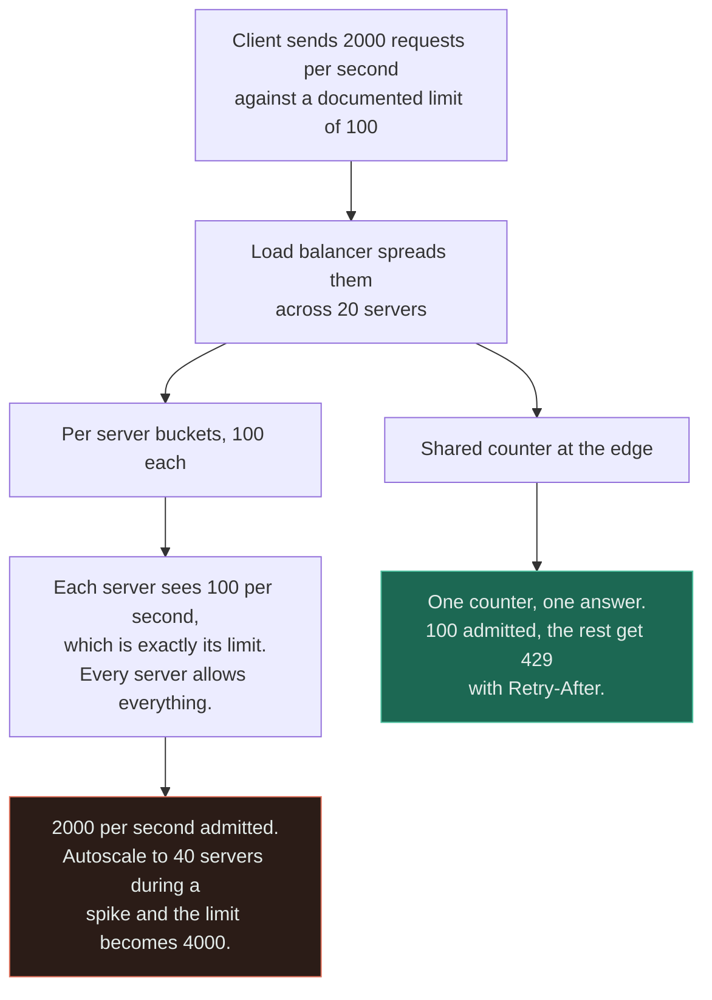
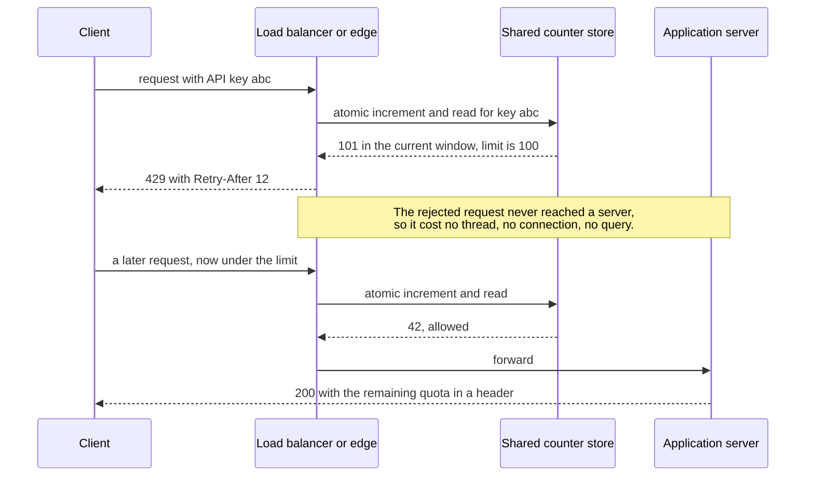
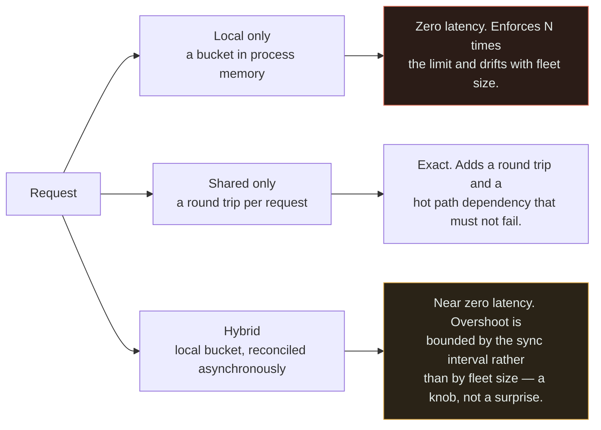

# Load Balancer + Rate Limiter

`[INTERMEDIATE]` · A limit is a statement about the whole system, but it is enforced inside one process — so behind a load balancer the promised limit quietly becomes N times the promised limit, and N changes when you autoscale.

---

## 1. Why combine them

A rate limiter expresses a global fact: *this client may make 1,000 requests per minute*. A
[load balancer](../../03-load-balancing/fundamentals/) exists to make sure consecutive requests from
that client land on different processes with different memory.

**The limiter's contract is global; its enforcement is local.** That mismatch is the entire subject of
this page, and it is not a bug in either component — each is behaving exactly as designed.

## 2. What happens WITHOUT the combination

**One server with a limiter** is the case where everything works. One counter, one process, no
coordination, and the number in the documentation is the number that is enforced. Every complication
below is created by the second server.

**A fleet with no limiter** has no defence against a single client consuming the whole thing, and the
client causing it is usually yours: a mobile app retrying without backoff turns a five-second blip
into a self-inflicted denial of service, and it is indistinguishable at the edge from an attack. There
is also no fairness — one heavy integration degrades everyone, and the only available response is to
scale out for a caller who should have been told no.

## 3. What the combination solves

Enforcing a global contract across a horizontally scaled fleet, which means answering a single
question: **where does the counter live?**

| Placement | Global limit enforced | Cost per request | Behaves under autoscale |
|---|---|---|---|
| Local, per server | `N ×` the intended limit | Nothing | The limit moves whenever `N` moves |
| Local, limit divided by `N` | Approximately right in aggregate | Nothing | Requires knowing `N`, and punishes unlucky routing |
| Shared store at each server | Correct | One round trip, on every request | Stable |
| Shared store at the edge | Correct, and rejected requests never reach a server | One round trip, plus a hop | Stable |

The bottom row is the one large APIs converge on, for a reason that is easy to miss: **a request
rejected at the edge never consumes an application thread, a connection or a database query.** A
limiter that runs after the load balancer has already committed a worker to the request has protected
the database and not the fleet.

## 4. What NEW problem the combination creates

**Per-server limiting means every server allows the full limit, independently.** Twenty servers with a
local bucket configured at 100 requests per second enforce 2,000 requests per second. The
documentation says 100. Nothing in either component reports the discrepancy, because neither is
wrong — the limiter counted correctly, and the load balancer distributed correctly.

Read the second line of the red box. **A per-server limit is a global limit that moves when you
deploy** — and it moves in the wrong direction, because scaling out happens during a spike, so the
limiter loosens precisely when it should be tightening.

**Dividing the limit by the fleet size does not rescue it.** Setting each server to `L/N` assumes the
load balancer spreads *one client's* requests evenly, and it does not: least-connections routing,
HTTP keep-alive pinning a client to one connection for minutes, and connection-level hashing all
concentrate a single caller. So a well-behaved client sending 900 requests against a 1,000 limit gets
`429`s because 60 of them happened to land on the same server. **Per-server limits are wrong in both
directions at once** — too permissive globally, too strict for individual clients — and the second
error generates support tickets that make the first one look benign by comparison.

**Shared state puts a new dependency on every request.** The counter store now has to be faster and
more available than the service it protects, and it fails in a way that has no comfortable answer:

- **Fail open** — allow everything when the store is unreachable. The limiter stops protecting you at
  the exact moment something is already going wrong, and a store overloaded *by* a traffic surge is
  the common cause.
- **Fail closed** — reject everything. The limiter becomes the outage, and a Redis blip becomes a
  total API failure.

Both are defensible. **The default is usually neither, because nobody chose** — and the behaviour you
get is whatever the client library does on a timeout.

**The check and the decrement must be one operation.** Read the counter, compare it, write it back is
three steps, and between the first and the third every concurrent request on every server sees the
same under-limit value and is admitted. The fix is atomic — `INCR` with an expiry, or a Lua script —
and this is exactly the detail that a working single-node prototype does not force you to confront.

**And you have to know who the client is.** Behind a CDN or a proxy the connection's source address is
the edge's, so per-IP limiting silently degrades into per-POP limiting. Reading `X-Forwarded-For`
without restricting which hops may set it is worse than not limiting at all, because a spoofed header
lets any client claim any identity — see [CDN + load balancer](../cdn-and-load-balancer/). Prefer an
authenticated identity, such as an API key, over any network-derived one.

## 5. Request flow

Two lines carry the value. The note is the argument for enforcing at the edge rather than in the
application. And `Retry-After` is not decoration: **a limiter that says no without saying when
guarantees an immediate retry**, which converts one rejected request into a tight loop.

## 6. Data flow

Only the counter moves, and only three arrangements exist for it.

The hybrid is what most large deployments actually run, and its virtue is not that it is exact — it is
not — but that **the error is bounded by something you control.** Each server holds a small local
allowance and reports usage to the shared store every few hundred milliseconds; overshoot is then a
function of the sync interval and the number of servers, and it degrades gracefully when the store is
slow rather than choosing between fail-open and fail-closed for every request.

Two supporting details belong in the data flow rather than in the algorithm. **Keys must expire**: one
client with a million distinct identifiers is otherwise a memory-exhaustion attack against your
limiter. And **the response must carry state back** — `429`, `Retry-After`, and remaining-quota
headers — because a client that cannot see its own budget can only discover it by exceeding it.

## 7. Trade-offs

| Choose | Get | Pay |
|---|---|---|
| Local per-server limiter | No dependency, no latency | `N ×` the intended limit; drifts with fleet size |
| Local at `L/N` | Roughly right in aggregate, still no dependency | Unlucky routing rejects well-behaved clients; breaks on every scaling event |
| Shared store per server | Correct global enforcement | A round trip per request; a new global dependency |
| Shared store at the edge | Correct, and rejections cost nothing downstream | An extra hop; the edge must know the client's identity |
| Hybrid with async reconciliation | Near-zero latency, overshoot bounded by a knob | Not exact; two mechanisms to reason about |
| Token bucket | Bursts tolerated, which is a feature for real clients | Not a hard ceiling over short intervals |
| Sliding window log | Exact | Memory grows with request count — gigabytes where a bucket uses megabytes, per the [implementation](../../18-implementations/rate-limiter/) |
| Fail open on store failure | Availability preserved during a limiter outage | No protection when you are most likely to need it |
| Fail closed on store failure | Protection preserved | The limiter can take the API down by itself |

## 8. Failure modes

| What fails | Effect | Survivable? | Mitigation |
|---|---|---|---|
| Per-server limits behind a fleet | `N ×` the published limit is admitted; nobody notices until a downstream quota blows | Yes, until it is not | Shared or hybrid state; alert when admitted rate exceeds the documented limit |
| Fleet autoscales | The effective global limit changes with no configuration change | Yes | Shared state; or derive the per-server share from live fleet size, with the routing caveat |
| Counter store unavailable | Everything is allowed, or nothing is | Depends on the choice | Choose deliberately; hybrid buckets degrade rather than flip; short timeouts |
| Non-atomic check-and-set | Concurrent requests all read under-limit and all pass | Yes | `INCR` with expiry, or a Lua script — one operation |
| Client identity spoofed via a header | Limits and allow-lists bypassed entirely | **No** — silent security failure | Strip and repopulate at ingress; trust only known proxy ranges; prefer authenticated keys |
| Clock skew between nodes | Window boundaries disagree; clients see limits reset at different times | Yes | Timestamps from the shared store, not from each node |
| Unbounded key space | Limiter memory exhausted by distinct identifiers | Yes | TTL or LRU on idle keys |
| `429` without `Retry-After` | Clients retry immediately; the limiter becomes an amplifier | Yes | Always send `Retry-After`; document backoff; publish quota headers |
| Limiting after the load balancer commits a worker | The application is protected, the fleet is not | Yes | Enforce at the edge for cheap rejections |

**Row one is the failure with the longest fuse.** Nothing breaks while there is headroom, so the
misconfiguration survives for years and surfaces the day a third-party quota, a database connection
limit or a partner's contract turns the excess into an incident — by which time clients have built
against the real behaviour, not the documented one.

## 9. When this is appropriate

- The limit is a published contract, billed against, or promised to partners
- The limit is a security control — failed logins, password resets, one-time codes, sign-ups
- The protected resource has a hard external ceiling: a third-party quota, a licence, a connection cap
- The fleet autoscales, so any per-server arithmetic is guaranteed to go stale
- Abuse or accidental self-inflicted load is a live concern and fairness between clients matters

## 10. When this is over-engineering

**Two application servers, a limit of 1,000 requests per minute, and the limit exists to stop one
integration hammering the database.** Local buckets of 500 each enforce something between 500 and
1,000 depending on routing — an error of at most 2×, in a number that was chosen by judgement in the
first place. Introducing a Redis round trip on every request to remove a bounded 2× error adds a
dependency on the hot path that can fail open or fail closed, and neither option is better than the
imprecision it replaced.

Local, per-server limiting is the right answer when **all** of these hold:

- The fleet is small and stable — roughly two to five servers, not autoscaled
- The limit is capacity protection, not a contract anyone reads or is billed against
- A 2–3× overshoot is survivable, because the protected resource has headroom
- No security decision depends on the count

It stops being the right answer the moment any of those breaks, and two of the breaks are abrupt
rather than gradual. **A security limit fails differently**: per-server limiting of failed login
attempts hands an attacker `N ×` the attempts, and `N` grows when you scale out, so the control
weakens exactly under the load an attack generates. And **a published contract cannot be
approximate** — if the documentation says 100 per second, admitting 2,000 is not a tuning issue, it is
a promise you are not keeping.

Two related over-builds worth naming. A **sliding window log** for exactness when a token bucket is
fine: the [implementation notes](../../18-implementations/rate-limiter/) put that at roughly 8 GB
versus 16 MB for a million tracked keys, for a precision nobody asked for. And **a distributed limiter
in front of an endpoint that is not scarce** — limiting a static health check protects nothing and
adds a round trip to your liveness probe.

## 11. Real-world example

**Stripe's API rate limits**, documented in the Stripe engineering blog post *Scaling your API with
rate limiters* — the source cited in [the matrix](../MATRIX.md).

The most useful idea in that post is that Stripe does not run *a* rate limiter. They describe four
distinct mechanisms, and the split matters because two of them are not rate limiting at all:

- A **request rate limiter** per API token, implemented as a token bucket in Redis — the shared-state
  arrangement from §3, chosen so that bursts from a previously quiet client are tolerated.
- A **concurrent request limiter**, capping how many expensive requests one caller may have in flight.
  Rate says nothing about concurrency, and a handful of simultaneous heavy queries can hurt more than
  a high rate of cheap ones.
- A **fleet usage load shedder**, which reserves a fraction of total capacity for critical traffic and
  sheds non-critical requests when the fleet is busy.
- A **worker utilisation load shedder**, which sheds by request importance as worker utilisation
  climbs.

**Rate limiters protect you from callers; load shedders protect you from yourself.** The first two are
about fairness and contracts; the last two are about surviving your own overload regardless of whose
fault it is, and no per-caller limit substitutes for them. Stripe is also explicit that the limiters
run against shared Redis state rather than per-process counters, and that letting a small burst
through is deliberate — the goal is protection, not arithmetic purity.

## 12. Exercises

**1.** Your API documents 100 requests per second per key. A customer measures 1,800 and complains
that your limiter does not work. You have 20 servers. What happened, and what does the customer's
integration now depend on?

Answer

Local per-server buckets. Each of the twenty servers admits up to 100 per second for that key, so the
fleet admits up to 2,000 and the customer measured 1,800 — the load balancer's distribution accounting
for the shortfall.

The second half is the awkward part. The customer has now built against 1,800 per second, because
that is the behaviour the system exhibits, and correcting the limiter to the documented 100 is a
breaking change to a working integration. **The undocumented behaviour became the contract**, which is
why this misconfiguration is expensive to fix long after it is cheap to prevent. Note also that the
effective limit is unstable: an autoscale to 40 servers doubles it, and a scale-in halves it, so the
customer's integration will break eventually with no change on either side.

**2.** You move to a shared Redis counter. Redis becomes unreachable for 30 seconds. What should
happen, and why is there no correct answer?

Answer

There are exactly two behaviours and both have a failure story. **Fail open** keeps the API serving
and removes all protection during the window — dangerous specifically because a Redis outage is often
caused by the same traffic surge the limiter exists to contain, so the protection disappears at the
moment of maximum need. **Fail closed** preserves protection and converts a limiter outage into a
total API outage, which means a component added for resilience has become a single point of failure.

There is no correct answer because the right choice depends on what the limit is for. A limit
protecting a fragile downstream or enforcing a security control should fail closed. A limit that is
fairness policy on an otherwise healthy API should fail open. **What is not defensible is not
choosing**, because then the behaviour is whatever your Redis client does on timeout — usually an
exception that becomes a 500, which is fail-closed with none of the intent.

The better engineering answer sidesteps the binary: a hybrid limiter with small local allowances
degrades instead of flipping. When the shared store is unreachable, each server keeps enforcing its
local bucket, so you get bounded overshoot rather than either extreme.

**3.** Your limiter is keyed on IP address. You put a CDN in front of the load balancer. What breaks,
and what is the tempting fix that makes it worse?

Answer

Every request now arrives from a small set of edge addresses, so the limiter sees a handful of
extremely busy clients. Either you throttle entire POPs — blocking innocent users who share an
edge — or, more commonly, the thresholds are so far from being hit per-IP that limiting silently stops
doing anything.

The tempting fix is to read the client address from `X-Forwarded-For`. Done without restricting who
may set it, this is worse than the broken state: any client can send `X-Forwarded-For: 1.2.3.4` and be
limited, allow-listed, geo-routed and audited as somebody else. Taking the *first* value is the
classic error, since the first value is the attacker-supplied one.

The safe version strips the header at ingress, repopulates it only for connections from the CDN's
published ranges, and reads a fixed position counted back from the trusted hop. And the better version
avoids the question: **limit on an authenticated identity — an API key, a token, an account — rather
than on a network property.** IP is a last resort for unauthenticated endpoints, and those are exactly
the endpoints, such as login and sign-up, where the limit is a security control and must be right.

## 13. Related

- [Load balancer](../../03-load-balancing/fundamentals/) — routing, affinity and the fleet the limit spans
- [Rate limiter implementation](../../18-implementations/rate-limiter/) — token bucket, sliding window, measured costs
- [CDN + load balancer](../cdn-and-load-balancer/) — where client identity is lost, one tier out
- [Load balancer + cache](../load-balancer-and-cache/) — the same shared-state question for a different component
- [Circuit breaker + service](../circuit-breaker-and-service/) — the outbound half; this page is the inbound half
- [DDoS](../../12-security/ddos/) — when the traffic is not a client mistake
- [Combination matrix](../MATRIX.md) · [Section index](../README.md) · [Glossary: rate limiting](../../GLOSSARY.md#rate-limiting)
