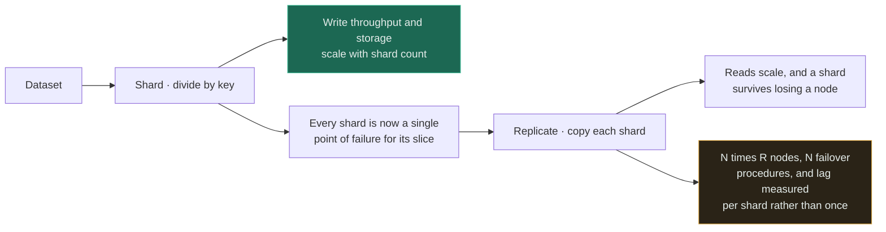
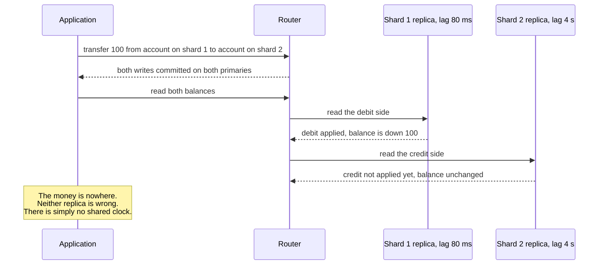
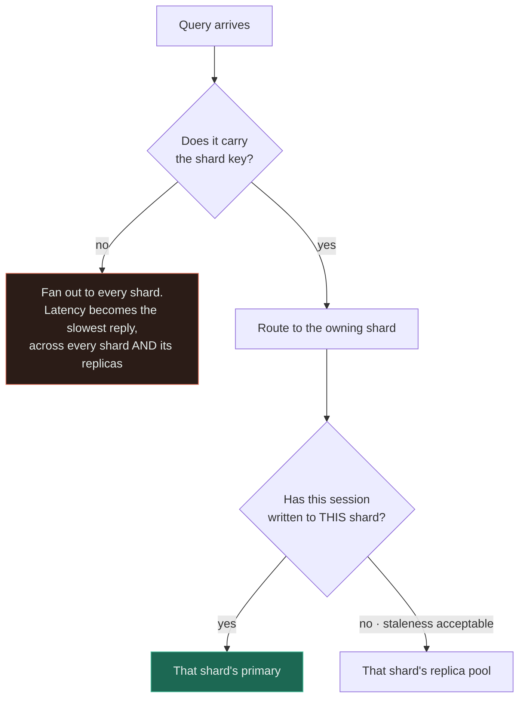

# Read Replica + Shard

`[ADVANCED]` · The standard shape of every large database: partitioned for writes, replicated for reads and survival — and now failover is not an event but a distribution of events, one per shard, each with its own timing.

---

## 1. Why combine them

The two axes are orthogonal and each leaves the other's problem untouched.
[Sharding](../../05-databases/sharding/) divides the data, so writes and storage scale — and does
nothing for read load on a hot shard, and nothing for a shard whose single node dies.
[Replication](../../05-databases/replication/) copies the data, so reads scale and a node can be
replaced — and does nothing for write throughput, because every copy still applies every write.

Compose them and you get a grid: **N shards wide, R replicas deep.** Almost every database large
enough to need a diagram is this shape, whether it is called a sharded cluster, a keyspace with a
replication factor, or a set of replica sets.

## 2. What happens WITHOUT the combination

**Shards without replicas** is the arrangement that looks efficient and is not survivable. Each shard
is a single point of failure for its slice, so with 20 shards you have 20 ways to lose a fifth of your
users, and the arithmetic runs the wrong way: the more you shard, the more likely it is that something
is broken right now. Recovery for any shard means restoring a backup, during which that slice is
simply gone.

**Replicas without shards** is [database + read replica](../database-and-replica/), and it ends at the
write ceiling of one primary. You can add read capacity indefinitely and never add a single write per
second.

## 3. What the combination solves

Reads scale on one axis, writes and storage on the other, and — the part usually left out of the
justification — **replication is what makes sharding survivable at all.**

The availability arithmetic is the clearest way to see it. Take a per-node monthly availability of
99.9%, which is a good single machine:

| Shape | Probability everything is healthy |
|---|---|
| 1 unreplicated node | 99.9% |
| 20 unreplicated shards | `0.999^20` ≈ **98.0%** |
| 100 unreplicated shards | `0.999^100` ≈ **90.5%** |
| 100 shards, each a replica set with automatic failover at 99.99% | `0.9999^100` ≈ **99.0%** |

**Sharding multiplies your failure opportunities, and replication is the instalment plan you pay them
off with.** Note also what the third row means operationally: with 100 unreplicated shards you are in
a degraded state roughly one day in ten, so partial failure is not an incident type, it is the normal
condition of the system.

Read it as a chain rather than as two features. Sharding created the problem in the second box, and
replication is the answer to it — which means the amber box is not an optional extra cost, it is the
price of the green one.

## 4. What NEW problem the combination creates

**Failover stops being an event and becomes a distribution.** Every shard runs its own election with
its own timing, its own quorum and its own split-brain risk. "The database failed over at 03:12"
becomes "shard 37 failed over at 03:12:04, shard 82 at 03:14:51, and shard 9 tried twice". Any
operation that spans that window sees two different worlds, and the incident timeline has N rows.

**There is no consistent snapshot across shards, and replication makes it visibly worse.** Each
shard's replicas have their own lag, so a fan-out read samples several shards at several different
points in time:

Every component here behaved correctly. **The impossible state is an artefact of reading two
independent timelines and treating the result as one snapshot** — a single database could never show
this, and no amount of care in the application prevents it. Fixing it requires machinery: a global
read timestamp, causally consistent sessions, or routing that read to primaries.

**Routing now has two dimensions and both can be wrong.** Which shard, and then primary or replica.
Getting the first wrong returns nothing; getting the second wrong returns something stale — so the
read-your-own-writes bug from [database + read replica](../database-and-replica/) now exists once per
shard, and a session that wrote to shard 3 must be sticky to *shard 3's primary* specifically, not to
"the primary".

**You divided the data and centralised the map.** The topology — which shard owns which range, which
node is currently its primary — lives in a config store, and that store is now the one component whose
failure is global. MongoDB's config servers, Vitess's topology service, a Kubernetes-hosted etcd:
sharding removed the single point of failure from the data plane and installed a new one in the
control plane, usually with less attention paid to it.

**Rebalancing happens while replicas are behind.** Moving a range to a new shard means the destination
must catch up before it can serve, the topology map must flip atomically for every router, and any
router with a stale map sends reads to a node that no longer owns the data. Resharding is the one
operation where all of this page's problems occur simultaneously.

## 5. Request flow

Two decisions, in this order, on every query. The lower diamond is the one that gets simplified into
"did this session write anything?" — and that simplification is wrong in the useful direction only:
it sends more traffic to primaries than necessary. Simplifying it the other way, to "reads go to
replicas", reintroduces the 404-on-your-own-write bug on a per-shard basis, where it is harder to
reproduce because it depends on which shard the user's data landed on.

## 6. Data flow

Writes go to one shard's primary and replicate within that shard only. Nothing crosses shards, which
is the source of both the scalability and the missing snapshot.

| Consistency question | Single database | This shape |
|---|---|---|
| Read my own write | Read the primary | Read *that shard's* primary — the session must remember which |
| Monotonic reads | Automatic | Per shard; pin the session per shard, or use a causal token |
| Consistent multi-row read | A snapshot transaction | Does not exist across shards without a global timestamp |
| Point-in-time restore | One operation | N restores that were not taken at the same instant |
| Lag | One number | A distribution — alert on the maximum, never the average |

The last row is the operational summary of this whole page. **Every metric that was a number is now a
distribution**, and every dashboard built for the single-database era reports the mean, which is
exactly the statistic that hides the one shard in trouble.

The mechanisms that restore some of what was lost are all forms of carrying a logical clock: a session
token recording the last position the client has observed, with the router refusing a replica that has
not applied at least that position — MongoDB's causally consistent sessions, Vitess's reserved
connections, or a hand-rolled log-sequence-number token. **They convert a correctness problem into a
latency problem**, which is the right direction, because a router that must wait for a lagging replica
can always fall back to the primary.

## 7. Trade-offs

| Choose | Get | Pay |
|---|---|---|
| Shards with replicas | Write scale, read scale, and survivable shards | N × R nodes; N failover stories; per-shard lag |
| More replicas per shard | Read capacity and better survival odds per shard | Linear cost; more lag surfaces; slower quorum writes if synchronous |
| One synchronous standby per shard, serving no reads | Failover safety with **no** staleness in the read path | Pay for a machine that answers nothing |
| Reads from replicas by default | Maximum offload | Read-your-writes and cross-shard snapshot bugs, per shard |
| Reads from primaries by default | Simple and correct | The replicas are only insurance; you sharded for writes and pay for read capacity twice |
| Causal tokens in sessions | Correctness restored without pinning to primaries | Every client and router must propagate the token; extra latency on lagging reads |
| A managed system — Vitess, MongoDB, Spanner, CockroachDB | The routing, topology and failover are solved and tested | Their opinions about keys, transactions and operations become yours |
| Build the router yourself | Exactly the semantics you want | An engineer-year, and correctness bugs discovered during failovers |

**Row three deserves more attention than it usually gets.** If you sharded because of writes, the
replicas may not need to serve reads at all — and a standby that serves nothing has no staleness
window in the read path, which deletes an entire class of §4 bug for the price of some idle hardware.

## 8. Failure modes

| What fails | Effect | Survivable? | Mitigation |
|---|---|---|---|
| One shard's primary fails | That slice is read-only or unavailable until election completes | Yes | Automatic election with a quorum; app degrades per shard rather than globally |
| Elections on several shards at once | Multiple slices unavailable in overlapping windows; the timeline is a mess | Yes | Spread replicas across failure domains so one domain loss is one replica per shard |
| Topology or config store down | No router can resolve anything — a global outage from a component holding no data | **No** | Replicate the config store; cache the topology in routers with a stale-but-usable fallback |
| Stale topology in one router | Reads and writes sent to a node that no longer owns the range | Yes | Version the topology; nodes reject requests for ranges they do not own |
| Cross-shard read at different lags | Internally impossible states observed by the application | Yes | Causal tokens, a global read timestamp, or route that read to primaries |
| Rebalancing during high lag | The destination cannot catch up; the move stalls half-applied | Yes | Throttle moves; require lag below a threshold before cut-over; make moves resumable |
| Split brain in one shard | Two primaries accept writes for the same range; divergence | No | Quorum-based election; fencing tokens; never allow writes without a quorum |
| Averaged monitoring | The one bad shard is invisible until users report it | Yes | Alert on max lag, max CPU and min replica count per shard |

**Row three is the structural irony of this shape.** You partitioned the data so that no single
failure could take everything, and then made every request depend on a small metadata service that
usually receives a fraction of the operational care the data nodes do.

## 9. When this is appropriate

- You have already sharded for a measured write or storage reason, and each shard now needs to
  survive losing a node
- Read load per shard is high enough that primaries cannot absorb it
- Recovery-time objectives rule out restoring a shard from backup
- Users are spread geographically and per-shard replicas can be placed near them
- You are adopting a system where this is the built-in shape and the alternative is fighting it

## 10. When this is over-engineering

**Four shards, three replicas each, and nobody has yet demonstrated a write bottleneck.** Twelve nodes,
four failover procedures and a topology service is a substantial operational commitment, and the
availability argument in §3 barely bites at four shards.

Three concrete ways this shape is over-built in practice:

- **Read replicas on every shard when you sharded for writes.** If the read:write ratio is under
  roughly 3:1, reads were never the pressure. Each shard needs a *standby* for failover, not a read
  fleet — and the standby-only arrangement removes the staleness bugs entirely. Adding read-serving
  replicas here buys capacity you do not need and pays for it in §4 bugs you cannot easily reproduce.
- **Building the router.** Shard routing plus primary/replica selection plus topology change plus
  failover plus rebalancing is a distributed system in its own right, and the bugs surface during
  failovers, which is when you can least afford them. Vitess, MongoDB's `mongos`, Aurora, Spanner and
  CockroachDB exist. Adopting their opinions is cheaper than discovering yours.
- **Reaching this shape before exhausting the previous rung.** Declarative partitioning inside one
  database plus archiving the cold tail plus a read replica handles far more than teams expect, keeps
  joins and transactions, and has no topology service at all. See
  [database + shard](../database-and-shard/) for that ladder.

A reasonable trigger: adopt this shape when the shard count is high enough that unreplicated failure
probability is unacceptable — around ten shards is where `0.999^N` starts to look uncomfortable — or
when a single shard's read load genuinely exceeds one primary. Below that, shards with a single
synchronous standby each, and reads on the primaries, is simpler and correct.

## 11. Real-world example

**MongoDB sharded clusters** and **Vitess** — the systems cited in [the matrix](../MATRIX.md), with
the MongoDB sharded cluster documentation as the public source.

MongoDB's topology is this page drawn as a product. Each shard **is** a replica set with its own
primary election; `mongos` routers are stateless and hold a cached copy of the map; and the map itself
lives on **config servers that are themselves a replica set** — an explicit acknowledgement of the §8
row three problem, solved by applying the pattern to the metadata as well.

Three details are worth taking away. The documentation is emphatic that queries should include the
shard key so they are *targeted* rather than *broadcast*, which is the §5 fast path stated as
guidance. `readPreference` — `primary`, `primaryPreferred`, `secondary`, `nearest` — exposes the second
routing dimension as a per-query decision rather than a deployment-wide setting, which is the only
granularity at which it can be correct. And **causally consistent sessions** with `afterClusterTime`
are the productised answer to per-shard read-your-writes: the client carries the logical time it has
observed and the server will not serve a read from a node behind it.

Vitess arrives at the same structure from MySQL: `vtgate` as the routing layer, `vttablet` beside each
MySQL instance, and a topology service holding the map — plus explicit resharding tooling, because as
§4 notes, resharding is when every problem on this page happens at once.

## 12. Exercises

**1.** You have 50 shards, each an unreplicated node with 99.9% availability. Your product SLO is
99.9%. Is the SLO achievable?

Answer

No, and not by a small margin. The probability that all 50 nodes are healthy is `0.999^50` ≈ 95.1%, so
roughly one and a half days a month have some shard down. Even if the application degrades gracefully
and only the affected slice fails, a user on that shard sees an outage — and averaged over users you
are offering about two nines, not three.

The general result is the one to remember: **serial dependencies multiply, and sharding creates
serial dependencies out of what used to be one machine.** Replication is the counter-move, because it
raises the per-shard figure before the exponent is applied — a three-node replica set with automatic
failover at 99.99% gives `0.9999^50` ≈ 99.5%, and five nines per shard gets you to the SLO. The other
lever is reducing the exponent: fewer, larger shards is a genuine availability improvement, which is
the opposite of the usual instinct.

**2.** A user updates their profile, which lives on shard 7, and the next page renders stale. Your
router already sends post-write reads to "the primary". Why did it still break?

Answer

Because "the primary" is not a single thing in this shape. There are N primaries, and stickiness has
to name a shard: the session wrote to **shard 7's** primary and must read from **shard 7's** primary
specifically. A router that tracks a boolean "this session has written" and applies it globally will
happily send the shard 7 read to a shard 7 replica if the write it remembered was to shard 3.

The reason this bug survives so long is that it is data-dependent. It reproduces only for users whose
records hash to a shard whose replicas happen to be lagging, so it looks intermittent and
unreproducible, and it will not appear at all in a test environment with one shard. The durable fix is
to stop tracking stickiness as a flag and start tracking a **position**: a causal token recording the
logical time the session has observed, which the router compares against a candidate replica before
using it, falling back to the primary when no replica qualifies.

**3.** Your dashboard shows average replication lag across the cluster at 120 ms and average shard CPU
at 35%. What is wrong with that dashboard?

Answer

It reports the mean of a distribution whose only interesting property is its maximum. One shard at 40
seconds of lag averaged with 99 shards at 80 ms reads as roughly 500 ms — comfortably inside most
alert thresholds — while a tenth of a percent of your users are reading data from last week and that
shard's failover candidate is worthless.

The rule after sharding is that **every metric becomes a distribution and the alert belongs on the
tail**: maximum lag per shard, maximum CPU, minimum healthy replica count, oldest un-applied position.
Keep the mean for capacity planning, where it is the correct statistic, and remove it from anything
that pages someone.

There is a second gap worth naming. Neither of those metrics covers the control plane, and §8 row
three says the config or topology store is the one component whose failure is global. Topology-store
health and router map staleness belong on the same dashboard as the shards, and are frequently on no
dashboard at all.

## 13. Related

- [Sharding](../../05-databases/sharding/) — key choice, rebalancing, resharding
- [Replication](../../05-databases/replication/) — lag, failover and quorum mechanics
- [Database + shard](../database-and-shard/) — the write axis, and the ladder to climb before this
- [Database + read replica](../database-and-replica/) — the read axis, and the lag bugs, once per shard
- [Load balancer](../../03-load-balancing/fundamentals/) — the routing tier this shape needs above it
- [Observability](../../11-observability/) — why the mean stopped being a useful statistic
- [Combination matrix](../MATRIX.md) · [Section index](../README.md) · [Glossary: replication](../../GLOSSARY.md#replication)
