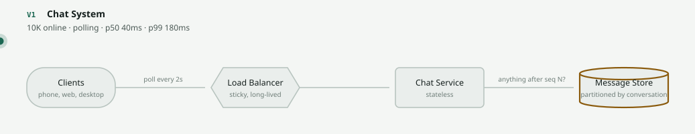
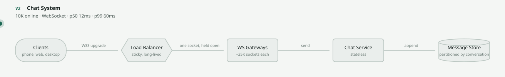
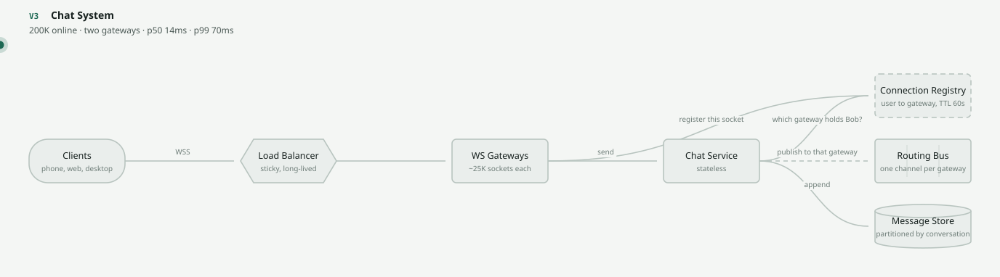
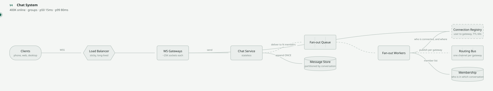
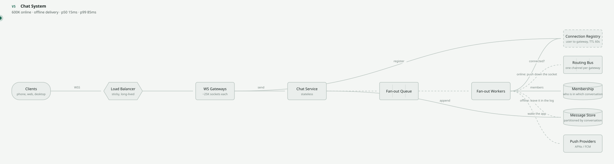
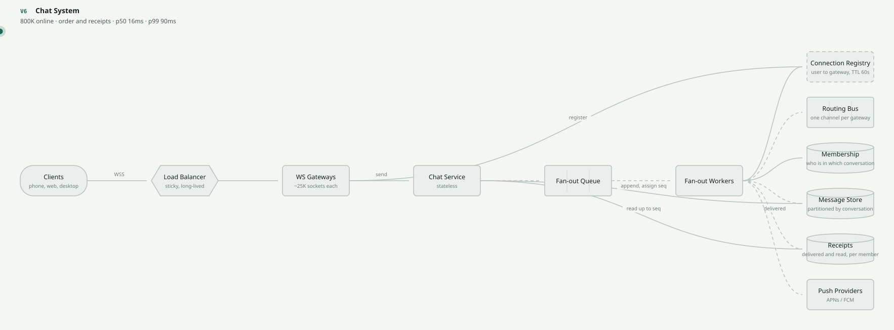
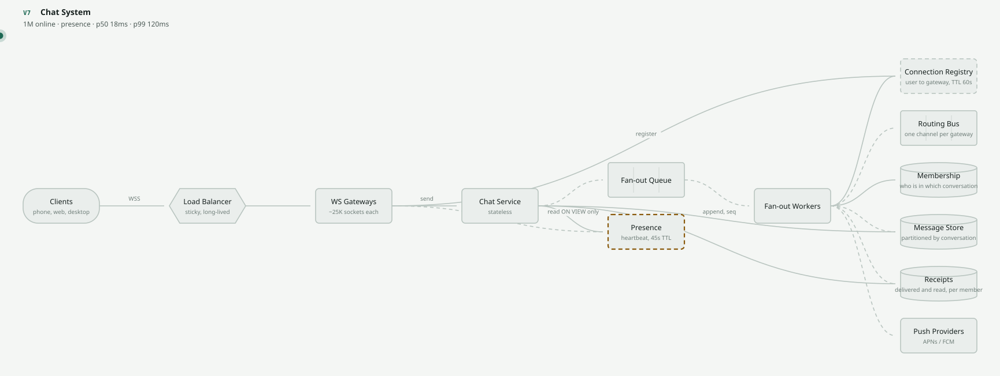
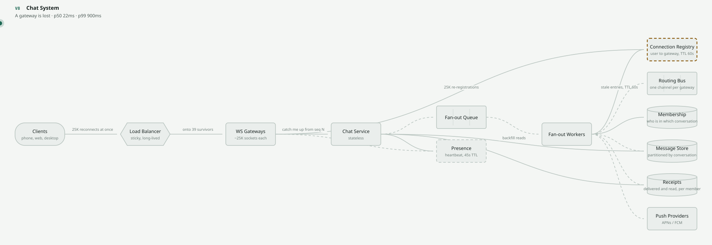

# Design a Chat System

`[INTERMEDIATE → ADVANCED]` · The one where the servers stop being stateless. One problem, taken from
10,000 people polling to a million held connections, with the reason for every change.

> **Scrub this design live** in the [visualizer](https://SAGARCHRY0777.github.io/system-design-lab/) —
> it is the `chat-system` scene, and the versions below are its V1–V8.

---

## What a chat system actually is

Alice sends "on my way" and Bob's phone shows it. If Bob's phone is off, it shows it later. If Bob is
in a group of 500, all 500 get it, in the same order, exactly once each.

That is the whole product, and it teaches well for one reason that no other problem in this
repository provides:

1. **The server holds per-user state.** A WebSocket is not a request, it is a resident. Machine 7
   knows something machines 1–6 do not, and that single fact invalidates the assumption underneath
   almost everything else here — stateless app servers, round-robin load balancing, rolling deploys,
   scale-to-zero. Every one of those has to be re-derived.
2. **The expensive feature is not messaging.** Sending messages is a few thousand writes a second.
   Presence — the green dot nobody asks for — is over a hundred times that, and the estimate below
   is what kills it before it is built.
3. **Idle is expensive.** A million connections doing *nothing* is a memory and file-descriptor
   problem. Throughput reasoning does not reach it, which is why most people size the fleet wrong.

---

## Step 1–5 · Understand

**Functional requirements.** Four, and no more:

- Send a message to a conversation (one-to-one or group)
- Deliver it to members who are connected, and to members who are not
- Show conversation history, in order
- Delivered and read receipts

Explicitly deferred: voice and video, message editing, threads, search, end-to-end encryption,
media. Each is a real product requirement and each would change the data model — see
[what this design does NOT cover](#what-this-design-does-not-cover).

**Non-functional requirements** — where the design is actually decided:

| | Target | Why |
|---|---|---|
| Delivery latency | p99 < 200 ms end to end | Below roughly 300 ms a conversation feels live; above it, people start talking over each other |
| Durability | **Must not lose an accepted message** | A message shown as sent and never delivered is the one bug that loses the user |
| Ordering | **Total order within a conversation** | Two messages out of order in a thread reads as a bug; two threads out of order is imperceptible |
| Delivery | Exactly once *as observed by the user* | At-least-once transport plus client-side dedup on a message id — nothing else is achievable |
| Availability | 99.95% | A chat app that is down is simply not a chat app |
| Connections | 1M concurrent, held for hours | The number that makes this problem different |

Note the split, because it is the same shape as the URL shortener's and it points the other way:
**ordering is strict inside a conversation and utterly relaxed across conversations.** People
routinely ask for global ordering. Nobody can perceive it.

---

## Step 6 · Estimate

Full method in the [estimation guide](../../ESTIMATION-GUIDE.md). Given 20M DAU, 20 messages sent
per user per day, 5% of users connected at peak:

```
concurrency   20M × 5%                          = 1M open connections
sends         20M × 20 = 400M/day  ÷ 100,000    ≈ 4,000 /s    peak ×3  ≈ 12,000 /s
deliveries    4,000 × 2.5 recipients            = 10,000 /s   peak ×3  ≈ 30,000 /s
socket memory 1M × ~40 KB buffers               ≈ 40 GB across the fleet
storage       400M × 400 B                      ≈ 160 GB/day → 58 TB/yr  ×3  ≈ 175 TB/yr
presence      20M × 40 flips × 200 contacts     = 160B/day    ≈ 1.6M events/s
```

**What those numbers ruled out — which is the actual output of estimating:**

| Number | Consequence |
|---|---|
| 1M open connections | **The tier is stateful.** Deploys, autoscaling and load balancing all change meaning. This is the defining fact of the design. |
| 1.6M presence events/s | **130× the entire message path.** Pushed presence is ruled out before a line of it is written. |
| 12,000 peak sends/s | Modest. **The message path is not the hard part** — do not spend your time there. |
| ~40 GB of socket buffers | Gateways are sized by memory and file descriptors, not CPU. A CPU-based capacity plan will be wrong by an order of magnitude. |
| 175 TB/year | Partition by conversation; tier anything older than 90 days to cold storage. |
| 30,000 peak deliveries/s | Fan-out must be asynchronous. It does **not** yet need sharding. |

That second row is the one that saves the most work. Presence looks like a small feature next to
messaging and is 130 times larger, and no amount of good engineering on the naive design rescues it —
the fix has to be architectural, and it arrives at V7.

**One more number, which decides the fleet shape.** A million connections could be four gateways of
250,000 each. It is deliberately forty gateways of 25,000 each, because losing one of four drops a
quarter of the world at once. You are buying blast radius, and it costs about 10× in instance count.

---

## Step 7 · The API

```
WS   /connect                Authorization: Bearer <token>    → server pushes frames

POST /conversations/{id}/messages   {"client_msg_id": "...", "body": "..."}  → 202 {"seq": 918224}
GET  /conversations/{id}/messages?after=918200&limit=100                     → 200 [...]
POST /conversations/{id}/read       {"up_to_seq": 918224}                    → 204
GET  /presence?ids=u1,u2,u3                                                  → 200 {...}
```

**Both a socket and an HTTP endpoint for sending.** Not redundancy — necessity. The socket saves a
round trip when it is up; the HTTP path is what a client uses in the two seconds after a gateway dies
and before it has reconnected. A design with only the socket loses every message sent during a
reconnect.

**`client_msg_id` is the whole exactly-once story.** The client generates it before the first
attempt, reuses it on every retry, and the server treats a repeat as the same message. Without it,
a flaky network turns one message into three — which is exactly the
[idempotency](../../07-api-design/idempotency/) argument, applied to a socket instead of a POST.

**Why 202 and a `seq` rather than 200 and "sent"?** Because "sent" is a claim about other people's
devices, and you do not yet have one. The sequence number is a claim about your own store, and you
do.

## Step 8 · Data model, and the ordering decision

```
messages
  conversation_id  UUID
  seq              BIGINT      -- monotonic PER CONVERSATION
  message_id       UUID        -- = client_msg_id, unique per conversation
  sender_id        UUID
  body             TEXT
  created_at       TIMESTAMP
  PRIMARY KEY (conversation_id, seq)
  UNIQUE (conversation_id, message_id)

members     (conversation_id, user_id, joined_seq, last_read_seq, last_delivered_seq)
connections (user_id, device_id, gateway_id, expires_at)   -- the registry; TTL-refreshed
```

One access pattern dominates: **read a range of `seq` within one `conversation_id`.** That is why the
primary key is shaped this way, and it is what makes conversation the obvious shard key later — see
[data modelling](../../05-databases/data-modelling/).

**How much ordering to buy** — the choice people get wrong in both directions:

| Guarantee | Cost | Verdict |
|---|---|---|
| **Global**, across every conversation | Total-order broadcast, or one sequencer for the whole world | No. It is the most expensive guarantee available and **no human can observe it** |
| **Per conversation** | One writer per conversation partition assigns `seq` | **Yes.** Matches exactly what a reader perceives |
| **Per sender** | Free | No. The receiver still has to merge two senders, so you have moved the problem to the client |
| **None**, sort by client timestamp | Free | No. Client clocks are wrong, sometimes by hours, and users notice immediately |

Client timestamps are the tempting one. They are free, they are approximately right, and then one
phone with a misconfigured clock puts a message in 2031 at the top of the thread forever.

---

## Steps 9–12 · The evolution

Each version fixes exactly one bottleneck and names what it cost. This is
[the chain](../../SYSTEM-DESIGN-THINKING.md#part-1--the-chain) applied to one problem.

### V1 — 10K online · polling



`Client → App → Message store`, every two seconds. p99 180 ms per poll, but up to 2,000 ms to see a
message.

Five thousand requests a second to deliver sixty. And the trap: **polling cost is set by how many
people are looking, not by how much is happening.** Halve the interval and latency halves while load
doubles. There is no interval that is both cheap and fast — see
[polling vs WebSocket](../../comparisons/polling-vs-websocket.md).

### V2 — 10K online · *99.6% of polls returned an empty array*



`+ WebSocket gateway.` The same product now costs 60 rps instead of 5,000, and delivers in 12 ms.

**Cost, and it is enormous:** the gateway is no longer stateless. It knows which sockets it holds and
no other machine does. Rolling deploys now drop connections. Round-robin balancing now matters.
Scale-in now has to drain. Everything downstream of this page assumed none of that —
see [WebSockets](../../01-networking/websockets/).

### V3 — 200K online · *a second gateway was added and half the messages vanished*



`+ Connection registry, + routing bus.` The sender's gateway had no idea which machine held the
recipient's socket, so it delivered to nobody — silently, which is the worst way for it to fail.

The registry turns "which machine holds this user?" from local knowledge into a lookup, and that is
what makes stateful servers operable at all. **It is drawn dashed on purpose:** every client
re-registers on reconnect, so it is rebuildable, and a rebuildable component is one you are allowed
to restart.

**Cost:** a lookup on every delivery, and a window after a gateway dies where the registry is lying.

### V4 — 400K online · *one message to a 500-member group made the sender wait for the slowest gateway*



`+ Fan-out queue, + workers, + membership.` Store once, deliver many.

Worth contrasting with the [social feed](../../19-diagrams/scenes/social-feed.json): a feed *copies*
the post into every follower's timeline, a chat message is written once. The difference is that a
conversation has a natural home and a follower graph does not.

**Cost:** delivery is now eventually consistent with acceptance. The sender is told "stored" before
anyone has received it — [queues and workers](../../14-component-combinations/queue-and-workers/).

### V5 — 600K online · *a message published to a bus with nobody listening is a message deleted*



`+ Push providers.` Most recipients are not connected, and until now their messages were being
dropped into a channel nobody was subscribed to.

**The inversion that makes offline delivery work:** the socket is a *fast path*, not the delivery
mechanism. The message store is the delivery mechanism. A client that reconnects asks for everything
after the last `seq` it saw; the socket only saves it from waiting. Build it the other way round and
every reconnect loses messages.

### V6 — 800K online · *two messages 30 ms apart arrived in opposite orders on two devices*



`+ Per-conversation sequence numbers, + receipts.` One writer per conversation assigns `seq`; clients
sort by it and refuse to render across a gap.

Receipts are a **high-water mark**, not an event per message: one row saying "read up to 918224",
not 400 rows. Treating a receipt as a per-message event multiplies your write volume by the size of
everyone's backlog, which is how a trivial feature becomes the largest table in the database.

### V7 — 1M connections · *presence*



`+ Presence store, heartbeat in, read on view.`

Pushing every transition to every contact is **1.6M events per second against a message path doing
6,000** — presence would be 99.6% of the system. So it is not pushed. Clients heartbeat every 30
seconds, the store expires them at 45, and a client reads presence only for the contacts currently on
screen.

**Cost, stated honestly:** a green dot may be up to 45 seconds stale, and a user who closes their
laptop shows as online for that long. Nobody has ever escalated this. The alternative was spending
the entire infrastructure budget on a dot.

### V8 — a gateway is lost



`25,000 sockets drop at once.` Each client reconnects: TLS handshake, registry write, backfill query
— arriving together.

Losing a stateless app server costs its in-flight requests. Losing a stateful one costs a
**thundering herd of reconnections**, and the only real fix is client-side: exponential backoff with
**full jitter**, so the herd spreads across a minute instead of a second. Backoff without jitter does
not help — it synchronises the herd and moves it four seconds later. See
[retries](../../08-reliability/retries/) for why jitter, not backoff, is the part doing the work.

For up to 60 seconds the registry still points at the dead gateway. Messages routed there arrive
anyway, and the *only* reason is that V5 made the message store the delivery mechanism.

---

## Steps 13–16 · Failure, consistency, security, observability

| Component dies | Effect | Survivable? |
|---|---|---|
| A WS gateway | 25,000 sockets drop and reconnect elsewhere. Nothing durable is lost; the damage is simultaneity | Yes |
| Connection registry | Nobody can be located. Messages are stored but live delivery stops — it degrades to V1, except nothing is polling | **No** |
| Routing bus | Cross-gateway delivery stops. Two people on the *same* gateway still work perfectly, which makes this the hardest outage to diagnose | **No** |
| Message store | Sends must be refused. Accepting a message you cannot store is choosing to lose it silently | **No** |
| Fan-out workers | Messages stored, not delivered live. The queue holds the work; reconnecting clients backfill and never notice | Yes |
| Push providers | Connected users unaffected. Offline users get everything at once when they next open the app | Yes |
| Presence store | Everyone shows offline. Messaging untouched — and the system gets measurably *faster*, which tells you exactly what presence costs | Yes |

**Consistency.** Strict within a conversation, deliberately loose everywhere else. Two conversations
may be seen in either order; a receipt may lag its message by seconds; presence may be 45 seconds
stale. The one thing that may never be loose is `seq` within a conversation.

**Security**, which most chat designs skip entirely:

- **Authorise per message, not per connection.** A socket authenticated an hour ago is still open.
  Check membership of *this* conversation on *every* send, or a user who left a group keeps receiving
  it.
- **Token expiry outlives the socket.** A connection authenticated with a 15-minute token can sit
  open for six hours. Re-validate periodically and close the socket when the token dies.
- **Cross-site WebSocket hijacking.** `Origin` is not enforced by browsers on WebSocket upgrades the
  way CORS is on fetch. Check it yourself — [API security](../../12-security/api-security/).
- **Rate limit per connection and per user.** A socket is a free, persistent, authenticated pipe into
  your infrastructure — [rate limiter](../../18-implementations/rate-limiter/).

**Observability** — how you would know it broke:
connections per gateway *and their spread* (an imbalance means the balancer is not draining),
reconnect rate (the earliest signal of anything), fan-out queue depth **and age** (depth alone hides
a slow drain), delivery lag p99 measured send-to-socket-write, registry hit rate, backfill query
rate. See [observability](../../11-observability/).

---

## Step 17–18 · Trade-offs, and 10× / ÷10

**The three trade-offs to state unprompted:**

1. **Stateful gateways for latency.** A message arrives in 30 ms instead of up to 2,000. The price is
   losing stateless deploys, trivial autoscaling and simple load balancing — three operational
   properties that were free until V2 and are now permanently gone.
2. **Per-conversation ordering, not global.** Matches human perception exactly, costs one writer per
   conversation. Global ordering would cost a total-order broadcast and be observed by nobody.
3. **Presence pulled on view, not pushed.** Up to 45 seconds of staleness on a green dot, in exchange
   for not spending 130× the message budget on it.

**At 10×** (10M connections): 400 gateways, and the registry becomes the hot component — partition it
by user. The genuinely new problem is geography: a group with members in Sydney and London means the
routing bus is now cross-region, and that is a different design, not a bigger one.

**At ÷10** (100K connections): delete the fan-out queue, delete the routing bus — a handful of
gateways can each subscribe to everything. Keep the registry. **A single process with an in-memory
map and one Postgres genuinely serves this**, and recognising that is worth more than knowing how to
shard a connection table.

---

## 31. Exercises

**1.** Your product manager says WebSockets are "real-time" and polling is not. Correct them
precisely.

<details><summary>Answer</summary>

Both deliver in bounded time; they differ in what the bound costs. Polling at interval `T` has median
latency `T/2` and worst case `T`, and its load is `connected_users / T` **regardless of how many
messages exist**. WebSockets have latency of roughly one network round trip and load proportional to
actual message volume.

The real difference is the shape of the cost curve, not the word "real-time". Polling ties cost to
*how many people are looking*; sockets tie it to *how much is happening*. At V1 that was 5,000 rps to
move 60 messages a second — a ratio of 83:1 in waste.

The honest caveat: long-polling gets you most of the latency win without stateful servers, and for a
notification-shaped product it is often the right answer. WebSockets earn their complexity when
traffic is bidirectional and frequent.
</details>

**2.** A user has three devices signed in. What breaks?

<details><summary>Answer</summary>

Almost everything that assumed one connection per user.

The registry becomes `(user_id, device_id) → gateway`, and fan-out must deliver to *N* sockets per
member rather than one. Read receipts become ambiguous — read on the laptop is not read on the
phone, and users expect the badge to clear everywhere, so `last_read_seq` must be per user with each
device catching up to it. Presence becomes a max over devices: online if *any* device is. And push
notifications must be revoked on the other devices when one of them reads the message, or the phone
buzzes for something already read on the laptop.

None of this is hard; all of it is invisible until you try. It is the most common thing missed in an
interview answer to this question.
</details>

**3.** The registry says Bob is on gateway 7. Gateway 7 died four seconds ago and Bob's client has
not reconnected yet. Trace what happens to a message sent to Bob.

<details><summary>Answer</summary>

It is stored, published to gateway 7's channel, and nobody consumes it. That copy is gone.

Bob still gets it. When his client reconnects it asks for everything after the last `seq` it saw and
the message store returns it. **The socket delivery was an optimisation that failed; the delivery
mechanism is the store.**

This is precisely why V5 is structured the way it is, and it is why a design that treats the socket
as the delivery mechanism is broken in a way that does not show up in testing — during a test the
gateway does not die.

The registry entry self-corrects when its TTL expires, which is the second reason it is a
TTL'd, rebuildable component rather than a durable record.
</details>

**4.** Why is a read receipt a high-water mark rather than one event per message?

<details><summary>Answer</summary>

Because it is monotonic and the volume is otherwise unbounded.

Reading is not per message — a user opens a conversation and reads 400 messages at once. Per-message
receipts turn that into 400 writes and 400 fan-out deliveries; a high-water mark turns it into one
write of `last_read_seq = 918224`, and every earlier message is implied.

The write amplification is the size of the backlog, so the worst case is exactly the user who has
been away longest — which is the wrong thing to make expensive.

The same argument applies to delivered receipts, and it is the reason both live on the membership
row rather than on the message.
</details>

**5.** Your PM wants a "typing…" indicator. What does it cost, and what do you build?

<details><summary>Answer</summary>

Ask for the volume first. Typing events fire several times per message per participant, so a rough
estimate is 3–5× the message rate for one-to-one and *far* worse in groups, where every member sees
every other member's keystroke state.

What makes it cheap is that it is the one piece of data in the system that is **worthless if
delayed and worthless if stored**. So: never persist it, never queue it, never retry it, never
deliver it to a disconnected member, and throttle it to one event every few seconds per sender per
conversation. Send it over the socket as a fire-and-forget frame and let it drop under load.

That is the general shape of the answer for presence-like data, and it is the opposite of the shape
for messages. Recognising that two features in the same product need opposite guarantees is the
point of the question.
</details>

---

## What this design does NOT cover

End-to-end encryption (which breaks server-side fan-out to new devices, group membership changes and
search all at once), voice and video (a different transport entirely — WebRTC and media servers),
media attachments, message editing and deletion across devices, search over history, spam and abuse
detection, and multi-region routing for a single conversation. Each would change the data model.

## Related

- [All real-world problems](../) — the other worked designs in this section
- [WebSockets](../../01-networking/websockets/) · [polling vs WebSocket](../../comparisons/polling-vs-websocket.md) —
  the V1→V2 decision in isolation
- [Queues](../../06-messaging/queues/) · [workers](../../06-messaging/workers/) — the V4 fan-out
- [Retries](../../08-reliability/retries/) — backoff and jitter, which is the entire V8 fix
- [Estimation guide](../../ESTIMATION-GUIDE.md) — where the presence number came from
- [URL shortener](../url-shortener/) — the stateless counterpart, and the contrast worth drawing
- [Observability](../../11-observability/) — how you would know any of this broke
- The [scene file](../../19-diagrams/scenes/chat-system.json) behind the diagrams
