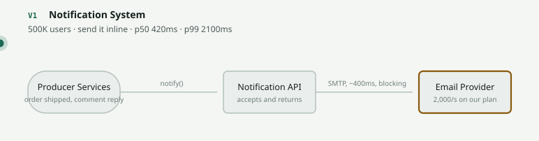
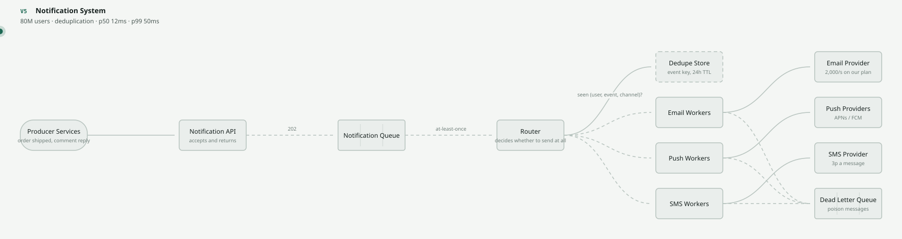
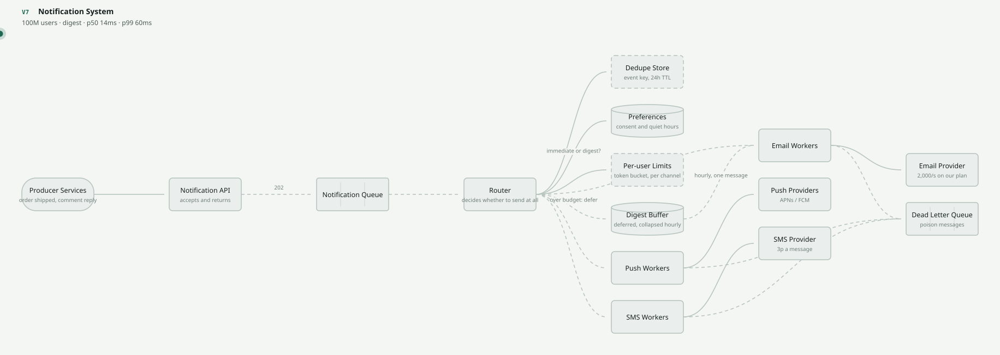

# Design a Notification System

`[INTERMEDIATE → ADVANCED]` · The one where the hard part belongs to somebody else. One problem,
taken from an inline SMTP call to 40,000 notifications a second across three providers you cannot
fix.

> **Scrub this design live** in the [visualizer](https://SAGARCHRY0777.github.io/system-design-lab/) —
> it is the `notification-system` scene, and the versions below are its V1–V8.

---

## What a notification system actually is

An event happens — an order ships, someone replies to a comment — and it becomes zero or more
messages, on channels operated by companies you have no control over, to a person who may not want
any of them.

Three things make it teach unusually well:

1. **The defining constraint is a third party.** Every other design in this repository can be fixed
   by building something better. Here the email provider's outage is your outage, its rate limit is
   your ceiling, and its retry semantics are your correctness model. Architecture becomes the art of
   containing somebody else's failures.
2. **Fan-out is the easy half.** A queue and some workers is twenty minutes of work. *Suppression* —
   deciding not to send — is where the design lives, and it is what separates a system people
   tolerate from one they mute.
3. **The failure mode is silent and permanent.** A duplicate notification at 03:00 does not page
   anyone, does not show up on a dashboard, and loses you the user for good. Almost nothing else here
   fails that quietly.

---

## Step 1–5 · Understand

**Functional requirements.** Four, and no more:

- Accept an event from any internal service and turn it into notifications
- Deliver across email, push and SMS
- Respect user preferences: channel, category, quiet hours
- Never send the same thing twice

Explicitly deferred: rich templating and localisation pipelines, in-app inbox, A/B testing of copy,
marketing campaign management, per-user send-time optimisation.

**Non-functional requirements** — where the design is decided:

| | Target | Why |
|---|---|---|
| Ingest latency | p99 < 50 ms | The producer is a checkout or a comment; it must not wait for anyone |
| Delivery latency | Transactional < 30 s · marketing: whenever | **The two have nothing in common** and must not share a queue |
| Duplicate rate | **~0 as observed by the user** | The one failure that loses a user permanently |
| Delivery guarantee | At-least-once transport, at-most-once *effect* | The queue will redeliver; suppression is what makes the effect exactly-once |
| Availability | Ingest 99.99% · delivery best-effort | Accepting an event must be more reliable than sending it |
| Provider control | **None** | The constraint everything else is derived from |

Note the split, because it is the shape of the whole design: **ingest must be far more available than
delivery.** Accepting an event is something you control; sending it is not. Conflating the two is
what produces V1.

---

## Step 6 · Estimate

Full method in the [estimation guide](../../ESTIMATION-GUIDE.md). Given 100M users and 8
notifications per user per day:

```
volume     100M × 8 = 800M/day  ÷ 100,000    ≈ 8,000 /s    peak ×5  ≈ 40,000 /s
mix        push 80% · email 15% · in-app 4.8% · SMS 0.2%
per chan   push 6,400 /s   email 1,200 /s   SMS 16 /s      (peak ×5 each)
email cap  provider accepts 2,000 /s on our plan   →  peak 6,000 /s exceeds it 3×
sms cost   1.6M/day × 3p = £48,000/day  ≈  £17.5M/year
dedupe     800M keys/day × 64 B, 24h TTL          ≈ 51 GB
campaign   20M enqueued in 60 s = 333,000 /s   against a drain of 40,000 /s  →  8 min
```

The peak factor is **×5, not ×3**. Notifications are schedule-driven — digests at 09:00, campaigns,
and product events that cluster around business hours — and the
[estimation guide](../../ESTIMATION-GUIDE.md) calls for 5–10× on anything with a schedule.

**What those numbers ruled out — which is the actual output of estimating:**

| Number | Consequence |
|---|---|
| Email peak 6,000/s vs a 2,000/s provider ceiling | **The queue is not an optimisation. It is the only thing that reconciles the two**, and without it you are simply dropping two-thirds of your email at peak |
| £17.5M/year for 0.2% of volume | Cost, not throughput, caps SMS. A **per-channel budget that can refuse to send** is an architectural requirement, not a finance concern — see [cost](../../09-scalability/cost/) |
| 40,000/s at peak | Per-channel worker pools, scaled independently. One pool means the slowest channel sets throughput for all three |
| 51 GB of dedupe keys | Too large for one node. A distributed cache with TTL eviction, *plus* a unique constraint in the database as the durable backstop |
| 8 minutes to drain one campaign | Campaigns need their own lower-priority queue, or a marketing send delays every password reset behind it |
| SMS at 16/s | Trivial volume. **Do not design SMS for scale** — design it for cost and for regulation |

That first row is the one people skip. The instinct is to treat the queue as a latency trick; it is
actually a rate mismatch absorber, and the mismatch is permanent rather than occasional.

---

## Step 7 · The API

```
POST /notifications
  {"user_id": "u_88", "event_key": "order_shipped:o_4412", "template": "shipped",
   "payload": {...}, "channels": ["push","email"], "ttl_s": 3600}
                                            → 202 {"notification_id": "n_9931"}

GET  /users/{id}/preferences                → 200 {...}
PUT  /users/{id}/preferences                → 204
POST /webhooks/{provider}                   (provider → us, signed)  → 200
```

**`event_key` is supplied by the caller and it is the most important field in the API.** It must
identify *the thing that happened* — `order_shipped:o_4412` — not the attempt to notify about it. A
UUID generated per call is unique every time and therefore suppresses nothing, which is the single
most common way deduplication is built and does not work.

**`ttl_s` is the field nobody adds until after the incident.** When a provider recovers after six
hours, "your driver is arriving" is worse than silence. Expired notifications must be dropped, and
that decision has to be recorded at enqueue time because nothing later knows what "too late" means
for this message.

**202, always.** The API's job is to accept durably and answer immediately. Any endpoint that returns
"delivered" is lying, because delivery has not been attempted yet — and once you have three channels
there is no single delivery outcome to report anyway.

## Step 8 · Data model

```
notifications
  id             UUID PRIMARY KEY
  user_id        UUID
  event_key      TEXT
  channel        TEXT
  state          TEXT      -- pending | suppressed | sent | failed | expired
  suppressed_by  TEXT      -- dedupe | preference | quiet_hours | rate_limit | ttl
  attempts       INT
  ttl_at         TIMESTAMP
  UNIQUE (user_id, event_key, channel)      -- deduplication, enforced by the schema

preferences        (user_id, channel, category, allowed, quiet_start, quiet_end, timezone)
delivery_attempts  (notification_id, attempt, provider, status, provider_msg_id, at)
```

**The unique constraint is the real deduplication.** The dedupe cache in front of it is a fast path
that saves a database round trip; the constraint is what makes the guarantee true when the cache is
cold, evicted or down. A dedupe design that lives only in a cache is a dedupe design that fails on
its first eviction.

**`suppressed_by` earns its column.** Once three separate checks can silently prevent a send, "why
didn't my user get this?" is unanswerable without recording which one stopped it — and that question
gets asked several times a week forever.

---

## Steps 9–12 · The evolution

Each version fixes exactly one bottleneck and names what it cost. This is
[the chain](../../SYSTEM-DESIGN-THINKING.md#part-1--the-chain) applied to one problem.

### V1 — 500K users · send it inline



`Producer → API → Email provider`, synchronously. p99 2,100 ms.

The provider's latency is your latency and the provider's outage is your outage. You have coupled a
business transaction to a third party whose status page you refresh like everybody else. **This is
the defining constraint, present from line one**, and the entire design is the process of containing
it.

### V2 — 3M users · *a nine-minute provider wobble took checkout down with it*

`+ Queue, + email workers.` Ingest p99 falls from 2,100 ms to 35 ms.

The queue is a rate-mismatch absorber, not a latency trick: it reconciles a 6,000/s peak against a
2,000/s ceiling and a provider that is sometimes at zero.

**Cost:** the producer now learns nothing. There is no return value that means "delivered", and
every part of the product that wanted one has to be redesigned around not having it —
[queues](../../06-messaging/queues/).

### V3 — 20M users · *push and SMS arrived*

`+ Router, + per-channel workers and providers.`

They are not variations of email. Latency differs by 20×, cost by four orders of magnitude, the
retry that is free for push is expensive for SMS, and every provider rate-limits you separately.

**One worker pool per channel** — because a single pool means the slowest channel sets the throughput
of all three, and a dead SMS provider stops your password resets *and* your order confirmations.

### V4 — 50M users · *the SMS provider returned 500s and the workers turned it into our outage*

`+ Backoff with jitter, + a circuit breaker per provider, + a dead letter queue.`

All three are needed and each fixes a different thing. Backoff with **full jitter** stops
[retries](../../08-reliability/retries/) synchronising —
[retry storm](../../anti-patterns/retry-storm/). A
[circuit breaker](../../08-reliability/circuit-breaker/) stops calling a provider that is plainly
down instead of hammering it. A DLQ stops one malformed payload blocking its partition forever.

**And the rule that makes retries safe at all:** a retry against a provider without an idempotency
key on the provider's side is not a retry, it is a second message —
[no idempotency](../../anti-patterns/no-idempotency/).

### V5 — 80M users · *a deploy replayed six hours of the event log*



`+ Dedupe store, keyed on (user, event, channel).`

Every user received every notification a second time, at 03:00, and 40,000 of them turned
notifications off permanently. **This is the version that keeps users, and it is the one most designs
never reach.**

Every queue here is at-least-once, so duplicates are the *contract* rather than an anomaly. The only
question is where you collapse them, and the answer is: at the last possible moment, on a key derived
from the event.

**Cost:** a lookup on every send, and a new failure mode — a dedupe store that fails closed sends
nothing at all.

### V6 — 100M users · *one thread sent a single user 140 pushes in an hour*

`+ Preferences, + per-user rate limits.`

The system was nowhere near its own limits. **The limit that matters is per user, not per system** —
which is why [rate limiting](../../08-reliability/rate-limiting/) here is keyed on the user and not
on the endpoint. There is a [working implementation](../../18-implementations/rate-limiter/) of the
token bucket it uses.

**Three suppression checks that look identical and are not:**

| Check | Fails | Because |
|---|---|---|
| Dedupe | **Open** — send it | A duplicate is an annoyance |
| Preferences | **Closed** — send nothing | Sending to somebody who unsubscribed is a regulatory incident |
| Rate limit | **Open**, and alert loudly | Most users are unaffected; the one in a loop is the incident |

Choosing the failure direction of each is the actual design work in this version, and getting the
middle row wrong is the one that ends up in a legal review.

### V7 — 100M users · *rate limiting was silently dropping notifications people wanted*



`+ Digest buffer.` Refusing to send is the wrong answer to sending too much; the right one is to
defer and collapse. "You have 23 new comments" is one notification instead of 23, and a better
product as well as a cheaper one.

**Cost:** a second delivery path with its own scheduler, its own idea of a time zone, and its own way
of failing — a digest job that misses its window sends a summary of yesterday at breakfast.

### V8 — the push provider dies mid-campaign

`20M notifications enqueued in a minute; the push provider stops answering.`

**The ingest numbers do not move**, and that is the entire return on V2. Two dangers remain:

- **Head-of-line blocking.** If push and email share one queue, a dead push provider stops email too.
  Separate queues, or at minimum separate concurrency budgets per channel —
  [backpressure](../../08-reliability/backpressure/) and
  [queue without backpressure](../../anti-patterns/queue-without-backpressure/).
- **Staleness.** When the provider returns, six hours of stale notifications are worse than none.
  This is what `ttl_s` is for, and the drop must be counted, not silent.

---

## Steps 13–16 · Failure, consistency, security, observability

| Component dies | Effect | Survivable? |
|---|---|---|
| Email provider | Emails queue and send on recovery. At V1 this took checkout down; from V2 nobody outside the team notices | Yes |
| Push provider | Push stops; email and SMS unaffected **only because they have their own workers** | Yes |
| SMS provider | SMS carries one-time codes, so this is a **login outage** for anyone on SMS 2FA. A second provider matters far more here than elsewhere | **No** |
| Queue | Nothing delivered and nothing retained. The API must fail the enqueue loudly rather than return 202 | **No** |
| Router | Nothing dispatched; the queue holds everything and drains on return. The most survivable outage here | Yes |
| Dedupe store | Fail **open**: duplicates get through, and the unique constraint catches most of them more slowly | Yes |
| Preferences | Fail **closed**: stop sending. "The preference service was down" is not a defence anybody accepts | **No** |
| Digest buffer | Deferred notifications are not sent; immediate ones are fine. Invisible for about a week | Yes |

**Consistency.** Everything here is eventually consistent and that is correct — except suppression,
which must be *decided* consistently. A preference read that returns a stale "allowed" after the user
opted out is the one stale read with a legal consequence, which is why that check fails closed rather
than serving from cache.

**Security:**

- **Verify provider webhooks.** Delivery-receipt endpoints are public URLs; without signature
  verification anyone can mark your notifications delivered — [API security](../../12-security/api-security/).
- **Push payloads render on lock screens.** Do not put the message body in them. Send an identifier
  and let the app fetch the content behind authentication.
- **Unsubscribe must work without login**, via a signed, expiring token in the link — and it must
  never be a GET that a mail scanner can trigger by prefetching it.
- **The notification API is a spam cannon.** Any internal service that can call it unauthenticated
  can mail your entire user base. Authenticate producers and rate-limit them by producer.

**Observability** — how you would know it broke:
enqueue rate vs drain rate **per channel** (the divergence is the alert, not the depth), queue **age**
rather than depth, provider error rate and latency per provider, circuit-breaker state, DLQ depth,
delivery rate per channel, and — the one people miss — **suppression rate broken down by
`suppressed_by`**. A sudden change in *which* check is suppressing is the earliest signal of a bug
anywhere upstream. See [observability](../../11-observability/).

---

## Step 17–18 · Trade-offs, and 10× / ÷10

**The three trade-offs to state unprompted:**

1. **Asynchronous everything.** The producer never learns whether the message arrived. In exchange,
   no provider outage can take a product feature down — and the product must be designed to never
   need that answer.
2. **Dedupe fails open, preferences fail closed.** Two suppression checks that look identical, given
   opposite defaults, because a duplicate is an annoyance and an unwanted send is a regulatory
   incident. Stating this pairing unprompted is the strongest signal you have built one of these.
3. **Digest over drop.** Deferring beats discarding, at the cost of a second delivery path with its
   own scheduler, its own time-zone handling and its own failure mode.

**At 10×** (400,000/s peak): per-channel queues become per-channel clusters, and the dedupe store — at
half a terabyte of hot keys — becomes the component that decides your latency. The genuinely new
problem is provider routing: multiple vendors per channel with weighted failover, chosen on cost and
current error rate rather than statically.

**At ÷10** (800/s): delete the router, delete the digest, delete the per-channel pools. **One queue,
one worker pool, and the unique constraint in the notifications table does your deduplication** — and
recognising that the entire suppression pipeline collapses into one database index at this scale is
worth more than knowing how to shard it.

---

## 31. Exercises

**1.** Why is deduplication done at the router rather than at the API, where it would be cheaper?

<details><summary>Answer</summary>

Because the duplicate does not usually arrive at the API. It is created *after* it, by the queue.

Every queue in this design is at-least-once: a worker that crashes after sending but before
acknowledging causes redelivery, and that redelivery never passes through the API. Dedup at ingest
catches the case where a producer calls twice and misses the far more common case entirely.

The router is the last point before an irreversible side effect, and that is where the check belongs.
The general rule: **deduplicate immediately before the thing you cannot undo**, not at the system
boundary.

The API-level check is still worth having as a cheap first filter. It is just not the guarantee.
</details>

**2.** The email provider starts returning 429. What do you do, and what must you not do?

<details><summary>Answer</summary>

Do: honour `Retry-After` if it is present, back off exponentially with **full jitter** if it is not,
reduce concurrency for that provider rather than just delaying individual messages, and open a
circuit breaker if the rate persists.

Do not: retry immediately, retry with a fixed delay (which synchronises the fleet and produces a
thundering herd one second later), or fail the notification. A 429 means "not now", not "never" —
treating it as a permanent failure sends everything to the DLQ and loses a day of email.

The subtle one: 429 is a signal about your *aggregate* rate, so per-message backoff does not fix it.
Ten thousand workers each politely backing off individually still exceed the limit. The correct
response is fleet-level: shed concurrency for that provider.
</details>

**3.** Your PM wants "Delivered ✓" shown in the product UI. What do you say?

<details><summary>Answer</summary>

Ask what "delivered" means on each channel, because the three answers are wildly different and only
one of them is honest.

Push: the provider accepted it. Not that the device received it, and certainly not that the person
saw it. Email: the SMTP server accepted it — which tells you nothing about spam folders, and open
tracking is blocked by default on most modern mail clients. SMS: carriers return a delivery receipt
that is genuinely meaningful, minutes later, and costs extra.

So the honest UI is "sent", with a per-channel delivery receipt where the provider actually offers
one. Promising "delivered" on push or email means displaying a claim you cannot support, and support
tickets will eventually prove you wrong in public.

This is the same distinction as V2's cost: the moment you went asynchronous you gave up the answer,
and no amount of UI recovers it.
</details>

**4.** A 20M campaign and a password reset are enqueued in the same second, into the same queue.
Trace what happens, and change one thing.

<details><summary>Answer</summary>

The password reset sits behind up to 20 million messages. At a 40,000/s drain that is eight minutes;
if the provider is degraded it is hours. The user requests another reset, which also queues behind
the campaign, and support gets a ticket that reads "password reset never arrives".

The change: **separate queues by priority class, not by channel alone.** Transactional and marketing
have different latency requirements — under 30 seconds versus whenever — and requirements that
different must not share a buffer.

Weighted consumers across one queue are the tempting cheaper fix, and they do not work: the ordering
problem is inside the queue, and a consumer cannot reach past 20 million messages to find the
urgent one.

Note that this is the same head-of-line blocking as V8, arriving from a completely different
direction — which is the sign it is a structural property of shared queues rather than a bug.
</details>

**5.** Quiet hours are 22:00–08:00. The user is in Tokyo, your servers are in Virginia, and the
notification is generated at 02:00 UTC. Where does the time zone live?

<details><summary>Answer</summary>

On the user record, and it is checked at **send** time by the router, not at generation time by the
producer.

02:00 UTC is 11:00 in Tokyo, so this one sends. The producer has no idea and must not be asked to
care — putting time-zone logic in every producer means every producer gets it wrong differently.

Three details that catch people. Store the IANA zone name (`Asia/Tokyo`), never a UTC offset, or
daylight saving silently breaks it twice a year. Quiet hours make deferral the natural behaviour, so
a notification generated during quiet hours must be *held until morning* rather than dropped — which
is the same machinery V7 built for digests, reused. And a quiet-hours check on a message that has
been sitting in a backlog must be re-evaluated against *now*, not against when it was created,
or a drained backlog delivers a night's worth of held notifications at 22:01.
</details>

---

## What this design does NOT cover

Templating, localisation and rich content pipelines; an in-app notification inbox with read state;
send-time optimisation per user; campaign management and audience segmentation; deliverability
engineering (SPF, DKIM, DMARC, sender reputation, IP warming) which is a full-time job of its own;
and a per-channel cost allocation model. Each is real, and each would change the data model.

## Related

- [All real-world problems](../) — the other worked designs in this section
- [Queues](../../06-messaging/queues/) · [workers](../../06-messaging/workers/) — V2 and V3
- [Reliability patterns](../../08-reliability/) — [retries](../../08-reliability/retries/),
  [circuit breaker](../../08-reliability/circuit-breaker/),
  [rate limiting](../../08-reliability/rate-limiting/) and
  [backpressure](../../08-reliability/backpressure/) are V4, V6 and V8 in isolation
- [Rate limiter](../../18-implementations/rate-limiter/) · [circuit breaker](../../18-implementations/circuit-breaker/) —
  working, measured implementations of both
- [Retry storm](../../anti-patterns/retry-storm/) · [no idempotency](../../anti-patterns/no-idempotency/) ·
  [queue without backpressure](../../anti-patterns/queue-without-backpressure/) — the three ways this design fails
- [Cost as a constraint](../../09-scalability/cost/) — why SMS is capped by money rather than throughput
- [Payment system](../payment-system/) — the other design built around a provider you do not control
- The [scene file](../../19-diagrams/scenes/notification-system.json) behind the diagrams
