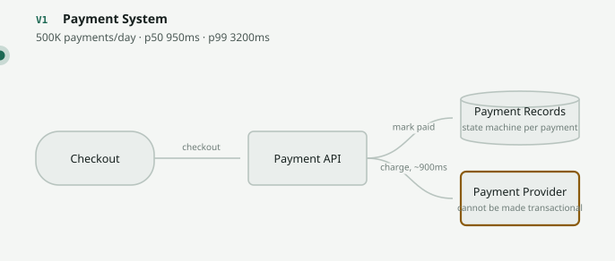
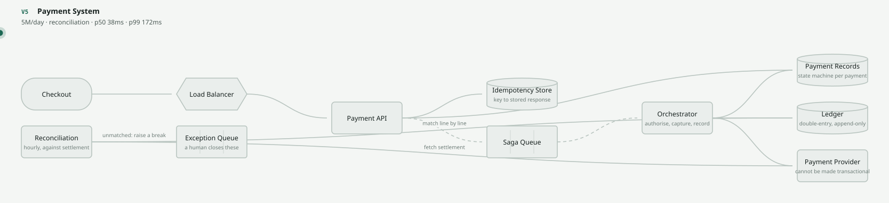
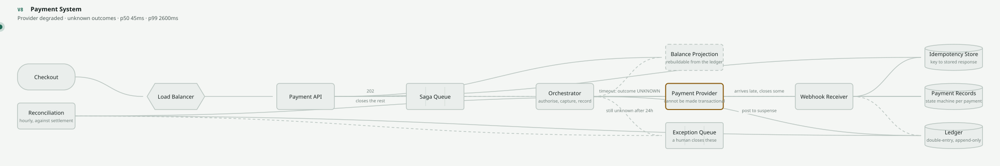

# Design a Payment System

`[ADVANCED]` · The one where you may not be eventually consistent about money. One problem, taken
from an inline card charge to a reconcilable ledger, with the reason for every change.

> **Scrub this design live** in the [visualizer](https://SAGARCHRY0777.github.io/system-design-lab/) —
> it is the `payment-system` scene, and the versions below are its V1–V8.

---

## What a payment system actually is

Take £49.99 from a customer, give some of it to a seller, keep a fee, and be able to prove a year
later exactly what happened and why the numbers add up.

It is the most useful problem in this repository for one reason, and it is worth stating before
anything else:

1. **The throughput is trivial and the design is still hard.** Five hundred payments a second is
   nothing. Every instinct trained on the [URL shortener](../url-shortener/) — cache it, shard it,
   replicate it — is not merely unnecessary here, it is actively wrong. The difficulty is entirely
   correctness, and that inversion is the lesson.
2. **You cannot make the external provider transactional.** Your database and their database will
   diverge. Not *might*: will, several thousand times a day at this volume. Everything after V4
   exists because of that sentence.
3. **A timeout is not a failure.** It is an absence of information, and conflating the two is how
   money is actually lost. Most designs never name the difference.

---

## Step 1–5 · Understand

**Functional requirements.** Five, and no more:

- Take a payment for an order
- Capture all or part of an authorised amount
- Refund all or part of a captured amount
- Produce an accounting record that balances
- Reconcile that record against the provider

Explicitly deferred: payouts to sellers, multi-currency and FX, fraud scoring, subscriptions and
dunning, chargeback handling, tax.

**Non-functional requirements** — where the design is decided:

| | Target | Why |
|---|---|---|
| Double charges | **Zero, ever** | The only truly non-negotiable line in this repository |
| Lost payments | **Zero, ever** | Taking money you cannot account for is worse than refusing it |
| Consistency | **Strong on the outcome**, eventual on *when you learn it* | The distinction the whole design turns on |
| Auditability | Every movement reconstructible for 7 years | A legal requirement, not an engineering preference |
| Throughput | 500 payments/s at peak | **Small. Do not design for it** |
| Latency | Accept in < 100 ms; settle whenever | The customer needs an answer, not an outcome |

Read the consistency row twice. You are **not** allowed to be eventually consistent about whether the
customer was charged. You *are* allowed — and forced — to be eventually consistent about when you
find out. Those are different properties and conflating them produces either a system that lies or a
system that hangs.

---

## Step 6 · Estimate

Full method in the [estimation guide](../../ESTIMATION-GUIDE.md). Given 5M payments/day on a mid-size
marketplace:

```
payments    5M/day ÷ 100,000            ≈ 50 /s     peak ×10  ≈ 500 /s
movements   ~4 per payment              (authorise, capture, fee, payout)
ledger      4 × 2 entries = 8/payment   = 40M/day ÷ 100,000 ≈ 400 /s  peak ≈ 4,000 /s
storage     40M × 300 B ≈ 12 GB/day     → 4.4 TB/yr ×3 = 13 TB/yr → 7 years ≈ 92 TB
webhooks    ~3 events per payment       = 15M/day ≈ 150 /s   peak ≈ 1,500 /s
unknowns    0.1% of 5M                  = 5,000 outcomes/day you do not know
breaks      99.9% auto-resolved         ≈ 5 /day reaching a human
recon       5M lines at 50,000/s        ≈ 100 s to reconcile a full day
```

The peak factor is **×10**. Payments are the most schedule-driven traffic there is — Black Friday,
payday, end-of-month subscription runs — and the [estimation guide](../../ESTIMATION-GUIDE.md) calls
for 5–10× on anything with a schedule.

**What those numbers ruled out — which is the actual output of estimating:**

| Number | Consequence |
|---|---|
| 500 payments/s at peak | **Tiny.** Do not shard, do not cache the ledger, do not reach for a streaming platform. Every scaling instinct is wrong here |
| 4,000 ledger entries/s | Append-only inserts against one primary handle this comfortably. **A single Postgres is genuinely enough** |
| 92 TB over seven years | Financial records are never deleted. Partition by month, archive cold, **never purge** |
| 5,000 unknown outcomes/day | Reconciliation and an exception queue are load-bearing components, not hygiene |
| ~5 breaks/day reaching a human | **An operations person is part of the architecture.** Budget for their tooling like a service |
| A full day reconciled in 100 s | Cheap enough to run hourly. There is no engineering excuse for monthly reconciliation |

The first row is the inversion worth internalising. On the URL shortener the numbers told you what to
build; here they tell you to build almost nothing and spend all of the effort on correctness. An
answer that shards a payment database has misread the problem.

The fourth and fifth rows are the ones nobody computes, and they are the two that decide whether the
design is real. Five thousand unknowns a day is not an edge case — it is a daily workload with an
owner, a queue and a runbook.

---

## Step 7 · The API

```
POST /payments            Idempotency-Key: 9f2c-…   (client-generated)
  {"amount_minor": 4999, "currency": "GBP", "method_token": "tok_…", "order_id": "o_4412"}
                                              → 202 {"payment_id": "p_881", "status": "pending"}

GET  /payments/{id}                           → 200 {"status": "captured", "captured_minor": 2999, …}
POST /payments/{id}/capture   Idempotency-Key: …   {"amount_minor": 2999}   → 202
POST /payments/{id}/refunds   Idempotency-Key: …   {"amount_minor": 999}    → 202
POST /webhooks/psp            (provider → us, signed)                       → 200
```

**Why 202 and `pending` rather than 200 and `paid`?**

| | 200 "paid" | **202 "pending"** |
|---|---|---|
| When you can answer | After the provider does — 900 ms, or never | Immediately |
| What you are claiming | That money moved | That you have durably recorded the intent |
| When the provider times out | You must guess, and you will guess wrong ~90% of the time | Nothing changes; you say pending and find out |
| Client complexity | Lower | Higher — it must poll or listen |

The second column is more work for everyone and it is the only honest option. **Returning a result
you do not have is the most expensive lie this system can tell**, because the customer acts on it,
the order ships, and the charge later turns out to have failed.

**The idempotency key has three rules and all three matter** — see
[idempotency](../../07-api-design/idempotency/):

1. **The client generates it**, before the first attempt, and reuses it on every retry. A
   server-generated key is a new payment each time and is not idempotency at all.
2. **Store the response, not a flag.** A retry must be answerable without touching the provider.
3. **The same key with a different body is a 422, not a replay.** That is a bug in the caller, and
   silently replaying the first response hides it.

## Step 8 · Data model

```
payments
  id                UUID PRIMARY KEY
  order_id          UUID
  currency          CHAR(3)
  authorised_minor  BIGINT
  captured_minor    BIGINT      -- may be less than authorised
  refunded_minor    BIGINT      -- may be less than captured
  state             TEXT        -- pending|authorised|captured|refunded|failed|UNKNOWN
  psp_ref           TEXT

idempotency_keys
  key           TEXT PRIMARY KEY
  request_hash  TEXT          -- same key + different body = 422
  response_body JSONB         -- the stored response, replayed verbatim
  expires_at    TIMESTAMP

ledger_entries                 -- APPEND ONLY. no UPDATE, no DELETE, ever
  id          BIGSERIAL
  movement_id UUID            -- entries sharing this must sum to zero
  account     TEXT            -- customer | merchant | fees | psp_receivable | SUSPENSE
  direction   CHAR(1)         -- D or C
  amount_minor BIGINT
  created_at  TIMESTAMP

reconciliation_breaks (id, payment_id, psp_ref, kind, our_minor, their_minor, opened_at, resolved_at)
```

**Amounts are integers in minor units.** 4999, not 49.99. A float cannot represent 0.1, so a
thousand additions of 10p do not equal £100 — and the discrepancy shows up in reconciliation, months
later, as a break nobody can explain.

**`ledger_entries` has no `UPDATE` path by design.** A mistake is corrected by a reversing entry, so
the error *and* its correction are both visible forever. That is not caution, it is the property that
makes an audit possible: a table you can edit is a table whose history is an assertion rather than a
record.

**Note the `SUSPENSE` account.** It exists so the books can balance while you do not yet know what
happened — and V8 is the version that explains why it is not optional.

---

## Steps 9–12 · The evolution

Each version fixes exactly one bottleneck and names what it cost. This is
[the chain](../../SYSTEM-DESIGN-THINKING.md#part-1--the-chain) applied to one problem.

### V1 — 500K payments/day



`Checkout → API → Provider`, then write `paid` on the order. p99 3,200 ms.

Correct for the scale, and it already contains the failure that shapes everything after it: **the
provider times out.** You do not know whether the card was charged. Not "it failed" — *unknown*. Hold
that word; the last five versions exist to make it recoverable.

### V2 — 1M/day · *a phone lost signal mid-checkout and the app retried*

The customer was charged twice and the refund took nine days.

`+ Idempotency keys.` The three rules above, and the detail that decides whether it works: **the
store is a cylinder, not a dashed box.** Losing it costs money rather than latency, so it is durable
storage that happens to be fast — not a cache. Getting that one wrong turns an eviction into a double
charge.

### V3 — 2M/day · *authorise, capture and record are three steps across two systems*

`+ Saga queue, + orchestrator.` The checkout request had been holding a socket open for all three.

A saga has **no rollback, only compensation**: the compensating action for an authorisation is a
void, for a capture it is a refund, and both are new operations against the provider that can
themselves fail. There is no undo — only apologies you can afford.

**Cost:** the API now returns 202 and `pending`, and every caller has to handle a state that did not
previously exist.

### V4 — 3M/day · *finance asked what the balance was and three services gave three answers*

`+ Double-entry ledger.` A boolean `paid` column on an order is not an accounting record.

Every movement is at least two entries summing to zero; nothing is ever updated. The ledger becomes
the source of truth and the payment record becomes a *projection* of it. **When those two disagree,
the ledger is right by definition** — and having that rule written down in advance is what makes the
disagreement resolvable rather than a debate between two teams.

### V5 — 5M/day · *the monthly statement was £4,000 away from our ledger*



`+ Reconciliation, + an exception queue.` Neither side was wrong. Sixty-one payments had succeeded at
the provider and had never been recorded here.

**This is the key insight of the whole design.** You cannot make the external provider transactional,
so the ledger cannot be *correct by construction* — it has to be **reconcilable**. Three outcomes,
each with a defined resolution:

| Case | Meaning | Resolution |
|---|---|---|
| In ours, not theirs | We recorded a movement that never happened | Reverse it; investigate why the write happened |
| In theirs, not ours | **They took money we have no record of** | Post it; this is the dangerous one and the one V8 explains |
| In both, amounts differ | Usually a fee, an FX difference or a partial capture | Post the difference, or raise a break |

Reconciliation is not a cleanup job bolted on afterwards. It is **the correctness mechanism**, and a
design that omits it has quietly assumed a distributed transaction it does not have.

### V6 — 5M/day · *`captured` arrived before `authorised`, and one capture applied twice*

`+ Webhook receiver.` Four rules, all mandatory:

1. **Verify the signature before parsing anything.** This endpoint is public.
2. **Dedupe on the provider's event id.** Delivery is at-least-once.
3. **Ignore transitions the state machine has already passed.** Delivery is unordered.
4. **Treat the body as a hint, not as truth.** The safe handler fetches the payment from the provider
   by id and acts on *that*.

Rule 4 is the one that gets skipped, and it is the one that turns a spoofed or replayed webhook from
an incident into a no-op.

### V7 — 5M/day · *a customer returned one item from a three-item order*

`+ Balance projection.` The system could refund all of it or none of it, because it had recorded one
amount and one state.

A payment stops being a *state* and becomes a *set of movements*: authorised 49.99, captured 29.99,
refunded 9.99, and 20.00 of the authorisation expiring unclaimed. Only a ledger can express that.

Summing an append-only ledger on every page load is expensive, so the balance is materialised — and
because it can be rebuilt by replaying the ledger, **it is the one dashed box on the page**. That is
the [notation contract](../../19-diagrams/README.md) doing real work: dashed means safe to lose, and
here it is the only thing that is.

### V8 — the provider times out on 8% of captures



And most of those captures **succeeded**.

- **A timeout is not a failure.** Never mark the payment failed; roughly 90% of these went through.
  This is the sharp edge of [timeouts](../../08-reliability/timeouts/): the value you choose decides
  how often you land in this state, and there is no value that avoids it.
- **Never retry a capture blindly.** Re-query the provider by idempotency key and act on the answer.
- **The ledger needs an account that means "unknown".** A suspense account, so the books balance
  while you find out. Pretending you know is how money is lost.

Four chances to learn the truth, in increasing order of cost: the re-query, the late webhook,
reconciliation, and finally a human. That last handful is not a defect in the design — **it is the
design admitting what it cannot know**, which is the most valuable sentence on this page.

---

## Steps 13–16 · Failure, consistency, security, observability

| Component dies | Effect | Survivable? |
|---|---|---|
| Payment provider | No money moves. From V3 the saga holds intents and retries, so customers see *pending* rather than *declined* — a delayed sale rather than a lost one. A second provider is the only real answer | **No** |
| Idempotency store | Every retry becomes a fresh charge. Must fail **closed**: refuse the payment | **No** |
| Ledger | No movement can be recorded, so no payment may proceed. A charge you cannot record is one you cannot reconcile, refund or account for | **No** |
| Saga queue | Intents accepted and never executed; customers sit at pending. Survivable only if the API refuses to acknowledge what it could not enqueue | **No** |
| Orchestrator | Sagas stop mid-flight — some authorised and not captured. The queue holds the work; recovery is safe **only if every step is idempotent**, and this outage is what proves whether it is | Yes |
| Reconciliation | Nothing breaks today. Divergence accumulates silently and surfaces at month end — the dashboard stays green, which is what makes it dangerous | Yes |
| Webhook receiver | Events missed, payments linger in pending. Providers retry for hours and reconciliation catches the rest — the second reason it is load-bearing | Yes |
| Balance projection | Customers cannot see a balance; no money is affected. Rebuilt by replaying the ledger. **This is what "safe to lose" means** | Yes |

**Consistency.** Strong on the outcome, eventual on knowledge of it. The ledger is strongly
consistent internally — a movement's entries commit in one transaction or not at all — and everything
crossing the provider boundary is eventually reconciled. There is no third option; a distributed
transaction across an API you do not operate does not exist, and designs that assume one have simply
not looked. See [strong vs eventual consistency](../../comparisons/strong-vs-eventual-consistency.md).

**Security:**

- **Never store card numbers.** Take a provider token. The cheapest way to stay out of PCI scope is
  for the data never to touch your infrastructure.
- **Never trust a client-supplied amount.** Price is looked up server-side from the order; a request
  body is an assertion by an attacker.
- **Scope idempotency keys per caller.** A global key namespace lets one customer replay another's
  response.
- **The refund endpoint is the attack surface, not the charge endpoint.** Charging moves money
  *toward* you; refunding moves it away. It needs stronger authorisation, an approval threshold, and
  its own alerting — and it is routinely given less than the charge path.
- **Verify webhook signatures in constant time**, with a replay window on the timestamp.

**Observability** — how you would know it broke:
authorisation success rate segmented by issuer (a drop is almost always the provider, not you),
provider p99 latency, **count and age of payments in `UNKNOWN`** — the single most important SLI
here — open breaks by kind and by age, webhook lag, DLQ depth, and a continuous assertion that
**every `movement_id` sums to zero**. That last one is a correctness invariant you can alert on
directly, which is rare and worth having. See [observability](../../11-observability/).

---

## Step 17–18 · Trade-offs, and 10× / ÷10

**The three trade-offs to state unprompted:**

1. **Pending by default.** The API returns 202 and the client polls or waits for a webhook. More work
   for every caller, in exchange for never claiming an outcome you do not have.
2. **Reconcilable rather than correct-by-construction.** You accept that your record and the
   provider's will diverge, and you build the machinery to find and close the gap — instead of
   pretending a distributed transaction exists. **This is the sentence that defines the design.**
3. **An append-only ledger over a mutable balance.** Every question about history is answerable and
   nothing can be quietly edited, at the cost of a projection that must be rebuilt and a table that
   only ever grows.

**At 10×** (5,000 payments/s): still small. Partition the ledger by month and by account, and make
reconciliation incremental rather than a full daily pass. The genuinely new problems are not
throughput at all — they are multi-provider routing (each with its own settlement format and its own
divergence) and multi-currency, where FX becomes movements of its own and the books must balance in
each currency separately.

**At ÷10** (500K payments/day): delete the queue and the orchestrator — a synchronous charge with an
idempotency key and a ledger write in one transaction is entirely adequate. Keep the idempotency
store. Keep the ledger. **Keep reconciliation: it is the last thing you delete, not the first.** A
small system diverges from its provider at the same *rate* as a large one; it simply has fewer people
to notice.

---

## 31. Exercises

**1.** The provider times out on a capture. Walk through exactly what you do.

<details><summary>Answer</summary>

Nothing that assumes an outcome.

Record the payment as `UNKNOWN` — not failed. Post the movement to a **suspense account** so the
ledger still balances. Then re-query the provider by the idempotency key you sent: providers expose a
lookup for exactly this, and the answer is authoritative in a way the timeout never was.

If the re-query also times out, wait. The provider's webhook usually closes it within minutes;
reconciliation closes most of the rest within the hour; a handful reach the exception queue and a
human.

What you must not do: retry the capture blindly (it may double-charge, and only the idempotency key
stands between you and that), mark it failed (about 90% of these succeeded), or tell the customer
anything definite.

The general principle, and the reason this is the first exercise: **a timeout is an absence of
information, not a negative result.** Systems that conflate the two lose money in whichever direction
they happen to guess.
</details>

**2.** Why not simply wrap the provider call and the ledger write in one database transaction?

<details><summary>Answer</summary>

Because the provider is not in your database, and no transaction can span it.

The tempting shapes and why each fails. Call the provider inside an open transaction: you hold a
database lock for 900 ms of network time, and a rollback after a successful charge undoes your record
while their charge stands. Two-phase commit: the provider does not implement a prepare phase, and no
public payment API does. An outbox pattern: genuinely useful — it makes *your* write and your intent
to call atomic — but it still cannot make the provider's side atomic with yours.

So the answer is a saga with compensations plus reconciliation, which is V3 and V5. You give up
atomicity and buy back correctness with detection: you will diverge, and you will find every
divergence within an hour.

Naming the thing you gave up — atomicity — and what you bought instead — detectability — is the
whole answer. See [strong vs eventual consistency](../../comparisons/strong-vs-eventual-consistency.md).
</details>

**3.** Your ledger says £1,000,000 for yesterday and the provider's settlement file says £999,400.
Walk through it.

<details><summary>Answer</summary>

Do not look for a bug first. Match line by line and classify every unmatched line into one of three
buckets — the aggregate difference is a symptom and tells you almost nothing.

*In ours, not theirs.* We recorded a movement that did not happen — usually a capture we believed
succeeded and did not. Reverse it, and investigate why the write happened without confirmation.

*In theirs, not ours.* **They took money we have no record of.** This is the serious one: a customer
has been charged and our system does not know. Post it, then find the payment and close it out —
this is the exact case V5 was built for, and the reason the answer to "is 61 payments a big deal?" is
yes.

*In both, amounts differ.* Almost always a fee deducted at settlement, an FX difference, or a partial
capture recorded at the full amount. Fees should be their own ledger movement, not a silent
subtraction — if you are seeing them as breaks, your ledger model is incomplete rather than wrong.

£600 across a £1M day is a 0.06% divergence, which is *normal* at this volume and precisely why the
job runs hourly rather than monthly. Discovering it at month end means walking 30 days of data
instead of one hour's.
</details>

**4.** A webhook arrives for a payment id you have never seen. What does it mean and what do you do?

<details><summary>Answer</summary>

Two possibilities, and the signature check separates them.

If the signature is invalid, it is forged or misdirected. Drop it, return 200 so it stops retrying if
the source is legitimate, and alert — someone is probing the endpoint.

If the signature is valid, this is the "in theirs, not ours" case arriving early. Most likely a
payment was created at the provider by a request whose response you never received, so the charge is
real and your side has no record. Do not ignore it. Fetch the payment from the provider by id, create
the record, post the movement, and open a break for a human to confirm which customer and order it
belongs to.

The instinct to return 404 is exactly wrong: it tells the provider to keep retrying, and it discards
the only evidence you have that a customer was charged.

This is the strongest argument for treating webhook bodies as hints and fetching the truth: the
handler that acts on the body alone has no way to distinguish these two cases.
</details>

**5.** A colleague proposes dropping the ledger and keeping a mutable `balance` column updated with
`balance = balance - amount`. Make the case against.

<details><summary>Answer</summary>

Four losses, in increasing order of seriousness.

*History.* A balance tells you what it is, never how it got there. The first question anyone asks
about a wrong balance is "what happened?", and that column cannot answer it.

*Auditability.* Financial records must be reconstructible for seven years. An updatable column has no
history to reconstruct, and a mutable record is an assertion rather than evidence.

*Correctness under concurrency.* Read-modify-write races produce lost updates; append-only inserts
have no such race, which makes the ledger the *simpler* concurrency story rather than the more
complex one.

*Reconciliation.* Comparing a single number against a settlement file tells you only that you
disagree, never where. Line-by-line matching is the whole mechanism of V5, and it needs lines.

And note the balance projection at V7 is not a contradiction: it is a **derived** copy that can be
rebuilt from the ledger at any time, which is precisely why it may be dashed and the ledger may not.
Cache the answer, never the truth.
</details>

---

## What this design does NOT cover

Payouts and seller balances, multi-currency and FX (which makes every movement currency-scoped and
adds FX gain/loss accounts), fraud scoring, 3-D Secure and strong customer authentication flows,
subscriptions and dunning, chargebacks and disputes (a whole second saga running on the provider's
timetable), tax, and PCI compliance beyond "do not store the card". Each is real, and each would
change the data model.

## Related

- [All real-world problems](../) — the other worked designs in this section
- [Idempotency](../../07-api-design/idempotency/) · [no idempotency](../../anti-patterns/no-idempotency/) —
  V2, in isolation and as an anti-pattern
- [Strong vs eventual consistency](../../comparisons/strong-vs-eventual-consistency.md) — the
  distinction this design turns on
- [Timeouts](../../08-reliability/timeouts/) · [retries](../../08-reliability/retries/) — why V8's
  unknown state exists at all, and why retrying it blindly is the one unsafe move
- [Ticket booking](../../19-diagrams/scenes/ticket-booking.json) — the other design that cannot be
  eventually consistent, for a different reason
- [Notification system](../notification-system/) — the other design built around a provider you do not control
- [Observability](../../11-observability/) — how you would know any of this broke
- The [scene file](../../19-diagrams/scenes/payment-system.json) behind the diagrams
