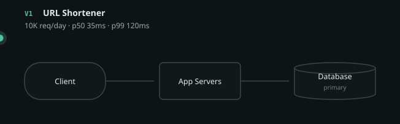
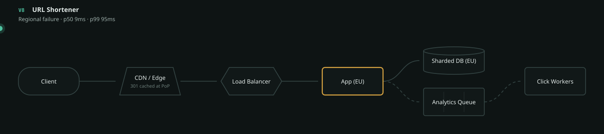

# Design a URL Shortener

`[BEGINNER → ADVANCED]` · The worked example. One problem, taken from 10K requests a day to a billion across two regions, with the reason for every change.

> **Scrub this design live** in the [visualizer](https://SAGARCHRY0777.github.io/system-design-lab/) —
> it is the `url-shortener` scene, and the versions below are its V1–V8.

---

## What a URL shortener actually is

Paste `https://example.com/a/very/long/path?with=params` and get back `sho.rt/aB3xK9`. Anyone who
visits the short link is redirected to the original.

That is the whole product. It is the canonical first system design problem for three reasons, and
they are worth naming because they are what make it teach well:

1. **The functional requirements fit in one line**, so all the difficulty is in the non-functional
   ones — which is where real system design lives.
2. **It is read-dominated by roughly 100:1.** One person creates a link; a hundred click it. That
   single ratio decides almost every choice below, and it is one division.
3. **Every scaling technique shows up in order** — cache, replicas, CDN, sharding, async, multi-region
   — each forced by a specific failure rather than chosen.

---

## Step 1–5 · Understand

**Functional requirements.** Three, and no more:

- Create a short code for a long URL
- Redirect a short code to its long URL
- *(optional)* Expire a link after a date

Explicitly deferred: custom aliases, user accounts, editing, click dashboards. Naming what you are
**not** building is part of the answer, not a hedge.

**Non-functional requirements** — this is where the design is decided:

| | Target | Why |
|---|---|---|
| Redirect latency | p99 < 100 ms | A redirect is invisible work; users notice any delay |
| Availability | 99.99% | A dead short link looks like a dead website |
| Consistency | Eventual is fine for reads | A link created 200 ms ago 404ing is survivable |
| Durability | **Must not lose a mapping** | A lost mapping breaks a link that may be printed on a poster |
| Read:write | **~100:1** | The number that decides everything |

Note the split: **eventual consistency on reads, strict durability on writes.** Those are different
properties and people routinely conflate them. Losing a mapping is unacceptable; showing a mapping
200 ms late is fine.

---

## Step 6 · Estimate

Full method in the [estimation guide](../../ESTIMATION-GUIDE.md). Given 100M new URLs/month:

```
writes   100M / 2.5M s          ≈ 40 /s        peak ×3  ≈ 120 /s
reads    40 × 100               = 4,000 /s     peak ×3  ≈ 12,000 /s
storage  60 months × 100M × 1KB = 6 TB   ×3 replication ≈ 18 TB
egress   12,000 /s × 500 B      ≈ 6 MB/s
```

**What those numbers ruled out — which is the actual output of estimating:**

| Number | Consequence |
|---|---|
| 12,000 peak reads/s | One database will not serve this. Cache or replicas required. |
| 100:1 | Caching pays enormously. **The single most important number here.** |
| 18 TB | Beyond one comfortable node eventually — sharding is on the horizon |
| 120 peak writes/s | Trivial. **Do not design for write scale.** |
| 6 MB/s | Bandwidth is a non-issue. Stop thinking about it. |

That fourth row saves more design time than the other four combined. A great many URL shortener
designs are ruined by treating writes as a scaling problem; at 120/s they are not one until V6.

---

## Step 7 · The API

```
POST /urls          {"url": "https://..."}   → 201 {"code": "aB3xK9"}
GET  /{code}                                 → 301 Location: https://...
```

**301 or 302?** A real decision with a real trade-off:

| | 301 permanent | 302 temporary |
|---|---|---|
| Browser caches it | Yes — subsequent clicks never reach you | No |
| Your load | Much lower | Every click hits you |
| Click analytics | **You lose most of them** | You see every click |
| Changing the target later | Effectively impossible | Fine |

Pick 301 if you want the traffic reduction, 302 if analytics is the product. Most commercial
shorteners choose **302**, because click data is what they sell.

## Step 8 · Data model and the code

```
urls
  code        VARCHAR(7)  PRIMARY KEY
  long_url    TEXT        NOT NULL
  created_at  TIMESTAMP
  expires_at  TIMESTAMP   NULL
```

One table, one access pattern: **lookup by code**. That is what makes it shardable later.

**Why 7 characters?** Base62 (`a-zA-Z0-9`) gives `62^7 ≈ 3.5 trillion` codes. At 100M/month you
would exhaust it in roughly 2,900 years. Six characters gives 56 billion — about 47 years — which is
also fine and one byte shorter. Anything beyond 8 is wasted.

**How to generate it** — the choice people get wrong:

| Approach | Why not | When it wins |
|---|---|---|
| **Hash the URL** (MD5, truncate) | Collisions need a retry loop; the same URL always maps to the same code, which leaks that someone else shortened it | You *want* deduplication |
| **Random + check** | An extra read per write; collision odds rise as the space fills | Low volume, unguessable codes needed |
| **Counter → base62** | **Sequential codes are enumerable — anyone can walk your whole database** | Single writer, and privacy does not matter |
| **Counter + encryption** | Slight complexity | Recommended: non-enumerable *and* collision-free |

The counter approach is the one most tutorials give and it has a real flaw: `aB3xK9` being followed
by `aB3xKA` means a scraper can enumerate every link anyone ever created. Encrypting the counter
(or using a Feistel permutation over the ID space) keeps the collision-free guarantee and destroys
the ordering.

---

## Steps 9–12 · The evolution

Each version fixes exactly one bottleneck and names what it cost. This is
[the chain](../../SYSTEM-DESIGN-THINKING.md#part-1--the-chain) applied to one problem.

### V1 — 10K/day



`Client → App → Database`. p99 120 ms.

Correct for the scale. Adding anything here is
[premature architecture](../../GAPS.md), not foresight.

### V2 — 10M/day · *one app server saturated, and deploys meant downtime*

`+ Load balancer.` The second reason is usually the one that actually forces the change — see
[load balancer §8](../../03-load-balancing/fundamentals/).

**Cost:** the load balancer is now a single point of failure unless it is itself redundant.

### V3 — 50M/day · *reads swamped the primary; writes were fine*

`+ Read replicas.` The 100:1 ratio makes this obvious.

**Cost:** the first real consistency problem. A code created and immediately clicked can 404 if the
read hits a lagging replica — [read-your-writes](../../05-databases/replication/#10-the-bug-you-will-hit).

### V4 — 200M/day · *p99 hit 800 ms; 92% of reads were for the top 0.1% of codes*


`+ Cache.` p99 drops 800 ms → 55 ms.

**That skew statistic is the whole justification.** A cache over uniformly random reads would have
bought nothing — see [cache §13](../../04-caching/fundamentals/).

**Cost:** staleness bounded by TTL, invalidation logic, and a thundering herd when a hot key expires.
Also, quietly, the database can no longer survive the traffic alone.

### V5 — 500M/day · *the median user was 120 ms away before any work began*

`+ CDN / edge.` The only fix for distance is to be closer; no amount of hardware addresses the speed
of light.

### V6 — 1B/day · *write throughput and dataset size both exceeded one primary*

`+ Sharding, + analytics queue.` Two changes for two different reasons: sharding for write capacity,
and moving the click counter onto a queue so the user no longer waits for a counter increment.

**Cost:** no cross-shard joins, and the shard key is now effectively permanent —
[sharding §11](../../05-databases/sharding/).

### V7 — multi-region · *EU traffic still crossed the Atlantic on every cache miss*

`+ A second region`, async replication, ~200 ms lag.

**Cost, stated honestly:** a freshly created code may 404 in the EU for ~200 ms. Acceptable here,
unacceptable for a payment. **The tolerance is a property of the use case, never of the technology.**

### V8 — regional failure



All traffic fails over to EU. It works **only** if EU was provisioned for 100% of traffic rather than
its usual half — which means paying for roughly 2× the capacity you use. That is the cost nobody
budgets for, and untested failover is not failover.

---

## Steps 13–16 · Failure, consistency, security, observability

| Component dies | Effect | Survivable? |
|---|---|---|
| Cache | Every read falls through at once — a thundering herd; the DB sees ~20× load in one step | Yes, barely |
| Replica | Reads shift to the primary, which is also serving writes | Yes |
| Primary | Cached codes keep redirecting until TTL; creation stops entirely | **No** |
| Load balancer | Total outage unless redundant | **No** |
| Analytics queue | Redirects completely unaffected; counters stop | Yes — *this is why it was moved off the request path* |

**Security**, which most designs skip entirely:

- **Open redirect** — you are, by construction, a redirect service. Scan targets against a blocklist
  or you become a phishing tool.
- **Enumeration** — sequential codes let anyone walk the database (see above).
- **Rate limiting** on creation, or you become a spam link farm —
  [rate limiter](../../18-implementations/rate-limiter/).

**Observability** — how you would know it broke:
cache hit rate (a decline is the earliest signal), p99 per region, replication lag,
4xx rate on redirects (a spike means codes are missing), DLQ depth.
See [observability](../../11-observability/).

---

## Step 17–18 · Trade-offs, and 10× / ÷10

**The three trade-offs to state unprompted:**

1. Eventual consistency on reads — a 200 ms window where a new code may 404, in exchange for local
   reads in every region. Unacceptable for a payment, invisible here.
2. 302 over 301 — more load on us, in exchange for click analytics.
3. Cache before replicas — bigger latency win for the skewed access pattern, but it makes the
   database unable to serve the traffic unaided.

**At 10×** (10B/day): the CDN carries almost everything; the interesting problem becomes cache
warming and shard rebalancing rather than throughput.

**At ÷10** (100M/day): delete the sharding, delete the second region, probably delete the queue. **A
single Postgres with a cache serves this comfortably** — and recognising that is worth more than
knowing how to shard.

---

## 31. Exercises

**1.** You are told the read:write ratio is 1:1 rather than 100:1. Which decisions change?

<details><summary>Answer</summary>

Nearly all of them. The cache stops paying — you would be invalidating as fast as you read. Read
replicas stop helping. Sharding arrives far earlier because writes, not reads, are the constraint.
V4 and V5 would likely never happen; V6 would happen first.

The ratio is the most decision-forcing number in the whole design, which is why it is computed
before any component is chosen.
</details>

**2.** A marketing campaign puts one short link on television. That single code takes 80% of all
traffic for ten minutes. What breaks, and what saves you?

<details><summary>Answer</summary>

Nothing breaks, and the cache is why — one code is the ideal case for it. The hit rate approaches
100% and the database barely notices.

What *would* break is the same traffic against a **sharded database with no cache**: hashing spreads
keys evenly, not load, so one shard takes 80% of the traffic while the others idle. That is a
[hot shard](../../05-databases/sharding/#19-failure-scenarios), and it is why sharding is step 5 and
caching is step 3.
</details>

**3.** Your PM asks for the click count on the dashboard to be exact and real-time. What do you say?

<details><summary>Answer</summary>

That it costs the redirect path a synchronous write, and ask what "exact" is worth.

Counters were moved onto a queue at V6 precisely so a redirect does not wait for one. Making them
synchronous puts a database write back on the hot path of the most-trafficked endpoint, and it means
a counter failure becomes a redirect failure.

The usual answer is a few seconds of lag — nobody watching a dashboard can tell, and it is the
difference between the counter being able to take the system down and not.
</details>

**4.** Why is `hash(long_url)` a tempting but flawed way to generate the code?

<details><summary>Answer</summary>

Two problems. Collisions are possible, so you need a check-and-retry loop, which adds a read to
every write. And it is deterministic: the same URL always produces the same code, so anyone can test
whether a given URL has been shortened before — an information leak that matters more than it
sounds.

It is the right choice only when you *want* deduplication.
</details>

**5.** At V7, a user in Frankfurt creates a link and immediately texts it to a colleague beside them,
who gets a 404. Is this a bug?

<details><summary>Answer</summary>

It is a **known and accepted trade** — the ~200 ms cross-region replication lag chosen at V7 — not a
bug, provided it was decided rather than discovered.

If it is unacceptable, the fixes in increasing cost: route reads to the creating region for a few
seconds after a write; make creation synchronously replicate; or accept a slower create. Note that
all three make *creates* worse to make *this one read* better, which is the right shape given the
100:1 ratio.

The general rule: an eventual-consistency window is only a bug if nobody stated it.
</details>

---

## What this design does NOT cover

Custom aliases (a uniqueness problem across shards), link editing, per-user quotas, abuse
detection at scale, and analytics beyond a counter. Each is a real product requirement that would
change the data model.

## Related

- [Estimation guide](../../ESTIMATION-GUIDE.md) — where the numbers came from
- [Cache](../../04-caching/fundamentals/) · [Sharding](../../05-databases/sharding/) ·
  [Replication](../../05-databases/replication/)
- [System design thinking](../../SYSTEM-DESIGN-THINKING.md) — the 18-step method used here
- [Observability](../../11-observability/) — how you would know any of this broke
- The [scene file](../../19-diagrams/scenes/url-shortener.json) behind the diagrams

<!-- PATH:BEGIN -->

---

<sub>**The reading path** · step 21 of 23 · *URL shortener, V1 to V8*</sub>

◀ **Previous** [Combinations](../../14-component-combinations/README.md) &nbsp;·&nbsp; **Next** [Case studies](../../17-case-studies/README.md) ▶

<!-- PATH:END -->
