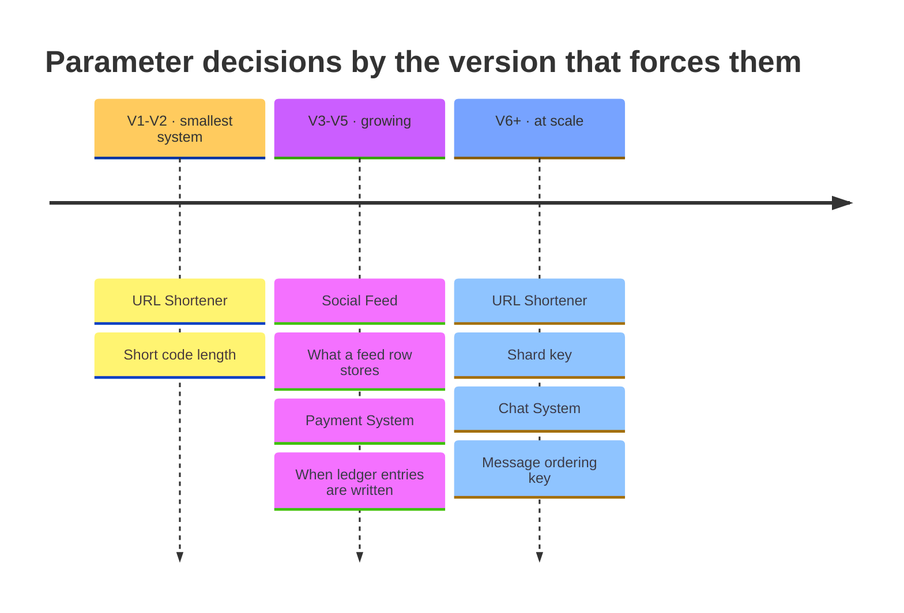

# Design exercises — the parameters

Choosing a component is the visible half of design, because it is the half a whiteboard diagram shows. Choosing what to **set it to** is the other half, and it is the one that ends up in the incident review. Nobody writes *"we should not have used a cache."* They write *"the TTL was wrong"* and *"we sharded on the wrong column."*

These are **24 parameter decisions** taken across the six systems in this repository, each at the point in that system's evolution where it actually came up.

## The thing worth learning here is not the values

It is which decisions you are allowed to get wrong. Every decision below is labelled:

| Label | Meaning | How to treat it |
|---|---|---|
| **Reversible** | A config change. | Decide fast, ship it, correct it with production data. Arguing for a week costs more than being wrong. |
| **Costly to reverse** | Code and data already depend on it. | Worth a design review. Write down the assumption you are making so the next person can find it. |
| **One-way door** | A migration measured in months, or impossible. | This is where the argument belongs. Get more people in the room. |

Across these six systems: **5 one-way doors**, 8 costly, 11 reversible.

The uncomfortable pattern is that **one-way doors cluster at the beginning.** The URL shortener's code length is fixed at V1, serving 10,000 requests a day, when it feels like the least consequential thing on the board — and every code ever issued is a public URL that someone has printed on a poster. The chat system's ordering key is chosen before anyone has hit a clock-skew bug. You make your most permanent decisions when you know the least, which is an argument for recognising them, not for pretending you can avoid them.

## The systems

| System | Decisions | One-way | Costly | Reversible |
|---|---|---|---|---|
| [URL Shortener](url-shortener.md) | 4 | 2 | 1 | 1 |
| [Social Feed](social-feed.md) | 4 | 1 | 1 | 2 |
| [Ticket Booking](ticket-booking.md) | 4 | 0 | 2 | 2 |
| [Chat System](chat-system.md) | 4 | 1 | 1 | 2 |
| [Notification System](notification-system.md) | 4 | 0 | 1 | 3 |
| [Payment System](payment-system.md) | 4 | 1 | 2 | 1 |

## Where the one-way doors are

Plotted against the version they are taken at. The pattern is the uncomfortable part — the decisions you cannot undo are the ones you make first.

They land at V1, V3, V4, V6, V6 — 3 of 5 by V4, roughly the midpoint of a system's life here and long before there is enough traffic to prove which choice was right. An ID scheme, a feed row's contents and an ordering key all have to be settled while the evidence that would settle them does not exist yet. **That is the argument for recognising a one-way door, not for expecting to avoid one.**

## Do these interactively instead

The [design studio](https://sagarchry0777.github.io/system-design-lab/) asks these in sequence, after first making you choose the components — so the parameter question arrives where it does in real life: once you have already committed to the design. It also remembers which ones you got wrong.

## Related

- [Trade-off framework](../TRADEOFF-FRAMEWORK.md) — the axes these sit on
- [System design thinking](../SYSTEM-DESIGN-THINKING.md) — the chain these come from
- [Real-world problems](../15-real-world-problems/) — the systems being configured
- [Anti-patterns](../anti-patterns/) — what the wrong answers turn into
