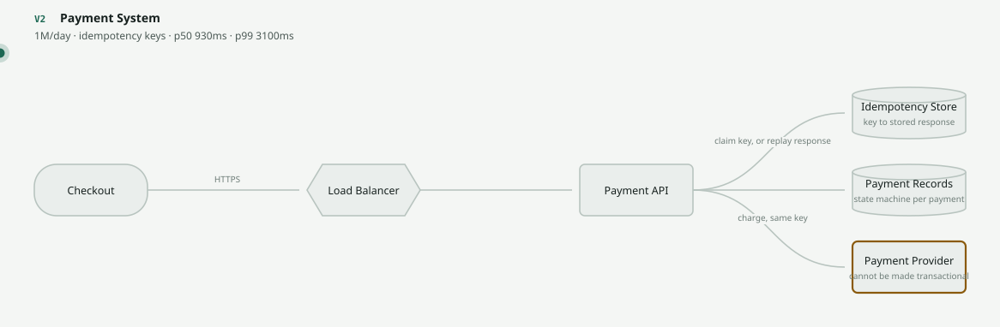
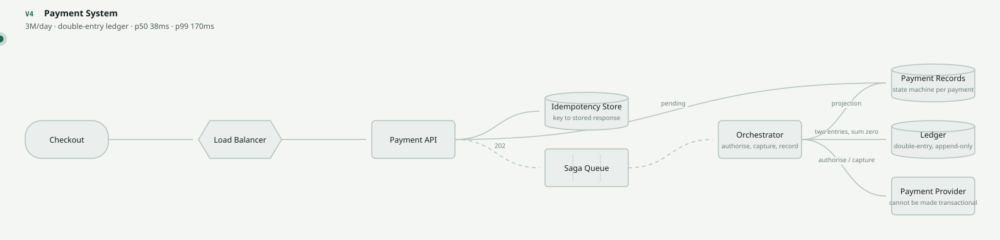
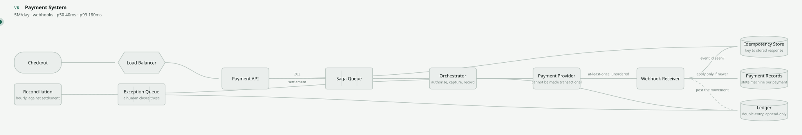

# Payment System — parameter decisions

4 decisions taken while building [Payment System](../15-real-world-problems/payment-system/). Not *which component* — that is the other exercise. These are the values you set once the component is there, which is the half that ends up in the postmortem.

**Commit to an answer before opening the box.** A parameter question you read the answer to teaches nothing; the correction only lands if there was a prediction for it to contradict.

Of these 4: **1 is a one-way door**, 2 are costly to reverse, 1 is config. Sort your design argument accordingly.

---

## 1. Idempotency key lifetime

> **Costly to reverse** — Reversing this means changing code that already depends on it, or repairing data written under the old assumption.

**At V2** (1M/day · idempotency keys): A customer's phone lost signal mid-checkout and the app retried. They were charged twice and the refund took nine days.

**A phone lost signal mid-checkout and the app retried. How long is the key remembered?**

- 60 seconds
- 24 hours
- Forever

Commit to one, then open this

**60 seconds** — **No.** The retry you are defending against comes from a phone that lost signal. It may reconnect in a minute, or when the user gets off the train. The window must cover how long a client might plausibly wait before retrying, and that is a human timescale, not a network one.

**24 hours** — **Correct.** Longer than any realistic client retry, including a user who reopens the app the next morning, and short enough that the store stays bounded. Anything arriving later is a new intent to pay rather than a retry of an old one.

**Forever** — **Defensible.** Safe, and payments are exactly where you would consider paying for safety. But keys are usually client-generated, and a buggy client that reuses one will have a legitimate payment silently swallowed months later — a bug that is nearly impossible to diagnose because the system correctly did nothing.

**If you need to change your mind:** Extending the window is easy. Discovering it was too short is not: the evidence is a double charge that already happened, and the repair is a refund plus an apology to someone who no longer trusts you.

---

## 2. When ledger entries are written

> **One-way door** — You do not get to change your mind. Reversing it is a migration measured in months, or it is simply not possible.

**At V4** (3M/day · double-entry ledger): Finance asked what the outstanding balance was and three services gave three different answers. A boolean paid column on an order is not an accounting record.

**A payment is captured. When do the double-entry rows get written?**

- In the same transaction as the payment state change
- Asynchronously, from a queue, just after the capture
- Nightly, by batch, from the payments table

Commit to one, then open this

**In the same transaction as the payment state change** — **Correct.** The state change and its accounting record commit together or not at all, so there is no instant in which the system believes it captured money it has not recorded. For anything that must reconcile to the penny, the atomicity is the design.

**Asynchronously, from a queue, just after the capture** — **No.** The window between the two writes is small and non-zero, and a crash inside it produces a captured payment with no ledger entry. Unlike a missed notification this never self-corrects, because nothing else in the system knows the entry was supposed to exist. Async is right for work that can be retried; it is wrong for the record of what happened.

**Nightly, by batch, from the payments table** — **No.** The ledger is now up to 24 hours behind, so nobody can answer 'what is our outstanding balance' — which is the V4 trigger. It also makes the payments table the source of truth and the ledger a report, which inverts the entire point of double-entry.

**If you need to change your mind:** A ledger that has drifted cannot be recomputed if the events that would have produced it were lost. You are reconstructing money movements from provider statements and logs, by hand, under audit.

---

## 3. Webhook application

> **Costly to reverse** — Reversing this means changing code that already depends on it, or repairing data written under the old assumption.

**At V6** (5M/day · webhooks): The provider's captured event arrived before its authorised event, and a retried webhook applied the same capture twice.

**The captured event arrived before authorised, and one webhook was redelivered. How do you apply them?**

- Apply each webhook in the order it arrives
- Order by the provider's event sequence, and make each application idempotent
- Ignore webhooks and poll the provider for payment status

Commit to one, then open this

**Apply each webhook in the order it arrives** — **No.** This is the V6 bug. The network does not preserve order and the provider retries, so arrival order is not event order. Applying 'captured' before 'authorised' advances the payment through a transition that should be impossible.

**Order by the provider's event sequence, and make each application idempotent** — **Correct.** Two independent problems need two independent fixes. Ordering handles out-of-order arrival; idempotency handles redelivery. Solving only one leaves the other bug live, which is why this pair shows up together in every integration with an external provider.

**Ignore webhooks and poll the provider for payment status** — **Defensible.** Polling gives you current state rather than a stream of transitions, which sidesteps ordering entirely — and it is a genuine fallback when a provider's webhooks are unreliable. The cost is latency and load proportional to payment volume, and you lose events that are transient by nature.

**If you need to change your mind:** Fixing this after the fact means replaying the provider's event history against a corrected state machine and repairing whatever the out-of-order applications already did.

---

## 4. Capture timeout and what a timeout means

> **Reversible** — A config change. Get it wrong, notice, fix it the same day.

**At V8** (Provider degraded · unknown outcomes): Design review: the provider times out on 8% of captures, and most of those captures actually succeeded.

**The provider times out on 8% of captures, and most of those actually succeeded. What do you do?**

- No timeout — wait for a definitive answer
- Time out, mark the payment failed, let the customer retry
- Time out, mark the outcome UNKNOWN, and resolve it by reconciliation

Commit to one, then open this

**No timeout — wait for a definitive answer** — **No.** There may never be one. Threads accumulate on a degraded provider until the API stops serving anyone, and you have converted a partner's partial outage into your own total one.

**Time out, mark the payment failed, let the customer retry** — **No.** The premise says most of those captures succeeded. Marking them failed and inviting a retry charges the customer twice, which is the exact bug V2 was built to fix — reintroduced through the error path instead of the happy path.

**Time out, mark the outcome UNKNOWN, and resolve it by reconciliation** — **Correct.** A timeout tells you nothing about what the other system did — it is the absence of information, not evidence of failure. Modelling UNKNOWN as a real state is what lets the reconciler resolve it against the provider's record later. At 5M payments a day, 8% timing out is around 5,000 unknowns daily, which is why an operations queue is part of the architecture rather than a temporary measure.

**If you need to change your mind:** The timeout is a client setting. How you interpret it is a line of code. Both are cheap to change and expensive to get wrong.

---

## Related

- [Payment System — the full design](../15-real-world-problems/payment-system/)
- [All parameter decisions](README.md)
- [Trade-off framework](../TRADEOFF-FRAMEWORK.md)
