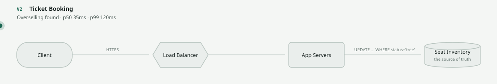
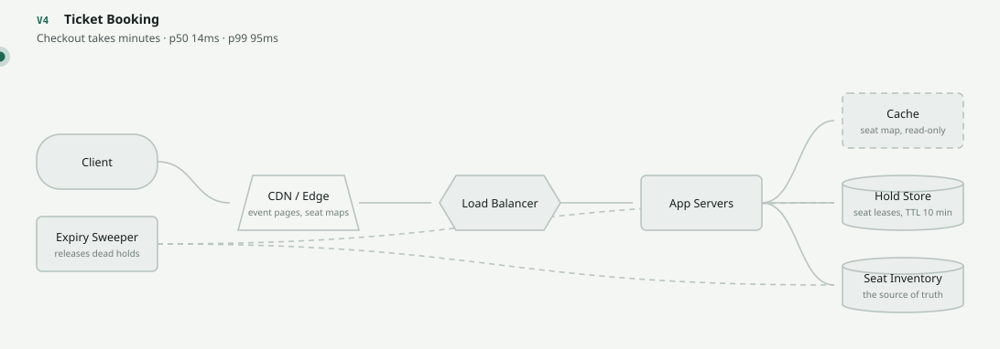
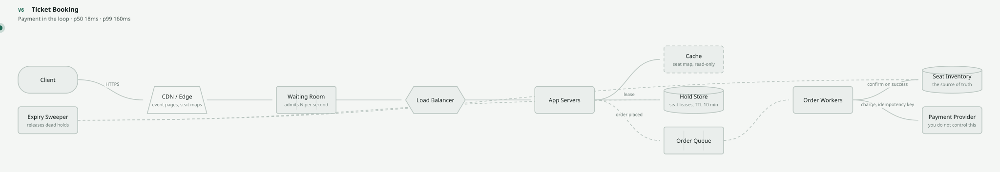

# Ticket Booking — parameter decisions

4 decisions taken while building **Ticket Booking**. Not *which component* — that is the other exercise. These are the values you set once the component is there, which is the half that ends up in the postmortem.

> This system is animated, quizzed and gradeable in the [lab](https://sagarchry0777.github.io/system-design-lab/), but its V1→V8 prose page is not written yet — see [gaps](../GAPS.md).

**Commit to an answer before opening the box.** A parameter question you read the answer to teaches nothing; the correction only lands if there was a prediction for it to contradict.

Of these 4: **0 are one-way doors**, 2 are costly to reverse, 2 are config. Sort your design argument accordingly.

---

## 1. Concurrency control on a seat

> **Costly to reverse** — Reversing this means changing code that already depends on it, or repairing data written under the old assumption.

**At V2** (Overselling found): Two customers bought seat 14A four milliseconds apart. Both reads saw it free; both writes succeeded.

**Two buyers hit seat 14A four milliseconds apart. What stops the oversell?**

- Read the seat, check it is free, then update it
- SELECT ... FOR UPDATE — take a row lock, then write
- Optimistic: a version column, retry on conflict
- Lock the seats table for the duration

Commit to one, then open this

**Read the seat, check it is free, then update it** — **No.** This is the bug, not the fix. Both transactions read 'free' before either writes, so both writes succeed and you have sold one seat twice. Nothing about a database prevents this by default — correctness here is something you ask for explicitly.

**SELECT ... FOR UPDATE — take a row lock, then write** — **Correct.** The second transaction blocks until the first commits, then reads the true state and correctly refuses. Contention is per-seat, so the lock is held for microseconds and only ever fought over by people wanting the same specific seat.

**Optimistic: a version column, retry on conflict** — **Defensible.** Correct, and better under low contention because nothing blocks. But V5 is a stadium on-sale where 100K people contend for 10K seats: at that conflict rate the retry loop becomes its own load problem. Optimistic locking is a bet that conflicts are rare, and this system's worst day is defined by conflicts being common.

**Lock the seats table for the duration** — **No.** Correct and useless: every buyer for every event in every venue now queues behind one lock. You have converted a concurrency bug into a throughput ceiling of roughly one sale at a time.

**If you need to change your mind:** Changing the concurrency strategy touches every write path that touches inventory, plus the retry behaviour of everything calling it.

---

## 2. How a hold actually expires

> **Costly to reverse** — Reversing this means changing code that already depends on it, or repairing data written under the old assumption.

**At V4** (Checkout takes minutes): Customers picked a seat, then spent four minutes entering card details — and lost it to someone else at the last step.

**The hold duration passes. What mechanism returns the seat to the map?**

- A TTL on the hold key — it expires by itself
- A sweeper that finds expired holds and releases the seats
- Release lazily — check for expiry when someone next views the seat

Commit to one, then open this

**A TTL on the hold key — it expires by itself** — **No.** The subtle one. The hold record vanishes, but the seat row in the seat map is still marked held, and nothing wrote to it. Key expiry is not a compensating action: it deletes state, it does not restore the state something else derived from it. The seat is now unsellable and no error was raised anywhere.

**A sweeper that finds expired holds and releases the seats** — **Correct.** Expiry becomes an explicit action with a write to the seat map, which means it can be logged, retried, monitored and alerted on if the backlog grows. Anything that must undo state needs a process that actually runs, not the absence of one.

**Release lazily — check for expiry when someone next views the seat** — **Defensible.** Avoids a background job and is self-healing for popular seats. But an unpopular seat nobody looks at stays invisible indefinitely, and your inventory count is wrong until someone browses it. Workable only alongside a sweeper, not instead of one.

**If you need to change your mind:** Retrofitting a sweeper means auditing every seat whose hold expired under the old scheme and working out which are genuinely free — a reconciliation over live inventory.

---

## 3. Seat hold duration

> **Reversible** — A config change. Get it wrong, notice, fix it the same day.

**At V4** (Checkout takes minutes): Customers picked a seat, then spent four minutes entering card details — and lost it to someone else at the last step.

**A seat is held while the buyer enters card details. How long?**

- 60 seconds
- 10 minutes
- 1 hour

Commit to one, then open this

**60 seconds** — **No.** Shorter than a real person takes to find their wallet, type a 16-digit number and complete a 3-D Secure challenge. You will release seats out from under buyers who are actively paying, and the checkout failure will look like a payment problem.

**10 minutes** — **Correct.** Comfortably above the p99 of a genuine checkout including a bank challenge step, and short enough that an abandoned basket returns inventory while the on-sale is still running.

**1 hour** — **No.** During a 10K-seat on-sale that lasts minutes, an hour-long hold means abandoned baskets freeze inventory until long after the event has sold out. It also hands scalpers a free tool: park seats, release nothing, resell elsewhere.

**If you need to change your mind:** A config value. You can and should tune it from real checkout completion times per event type.

---

## 4. Payment call timeout

> **Reversible** — A config change. Get it wrong, notice, fix it the same day.

**At V6** (Payment in the loop): Charging the card is a call to someone else's system that can be slow, fail, or succeed without telling you.

**Holds last 10 minutes. What timeout do you set on the payment provider?**

- No timeout — wait for the provider
- Comfortably shorter than the hold — around 30 seconds
- 15 minutes, so slow payments still succeed

Commit to one, then open this

**No timeout — wait for the provider** — **No.** V8 is exactly this: the provider slows to eight seconds and every request thread is occupied waiting. The system stops accepting new buyers because it is busy being patient.

**Comfortably shorter than the hold — around 30 seconds** — **Correct.** The constraint that matters is the relationship between two numbers, not either number alone. If the payment call can outlive the hold, you will charge a customer for a seat you have already given away — and that is a refund, an apology and a person who does not come back.

**15 minutes, so slow payments still succeed** — **No.** Longer than the hold. The sweeper releases the seat at minute ten, someone else buys it at minute eleven, and the original payment succeeds at minute twelve against inventory that is gone.

**If you need to change your mind:** A client setting. The reason to get it right up front is that the failure it causes is a charge dispute, not an error rate.

---

## Related

- [Real-world problems](../15-real-world-problems/) — the systems that *do* have a written V1→V8 design (Ticket Booking does not yet)
- [All parameter decisions](README.md)
- [Trade-off framework](../TRADEOFF-FRAMEWORK.md)
