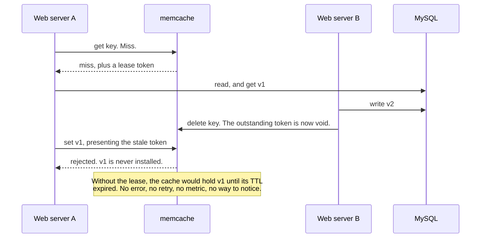
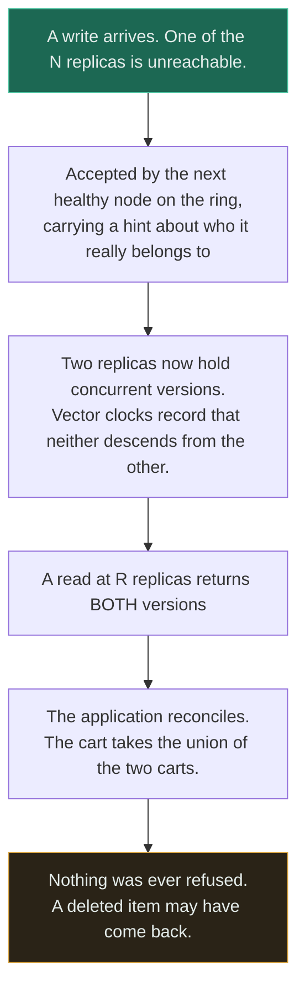
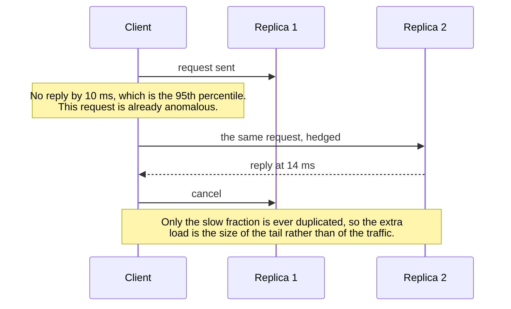
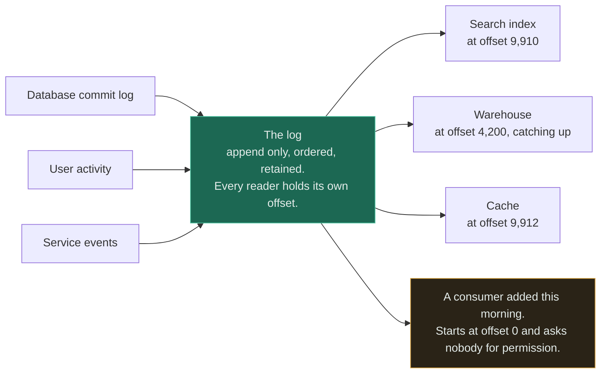
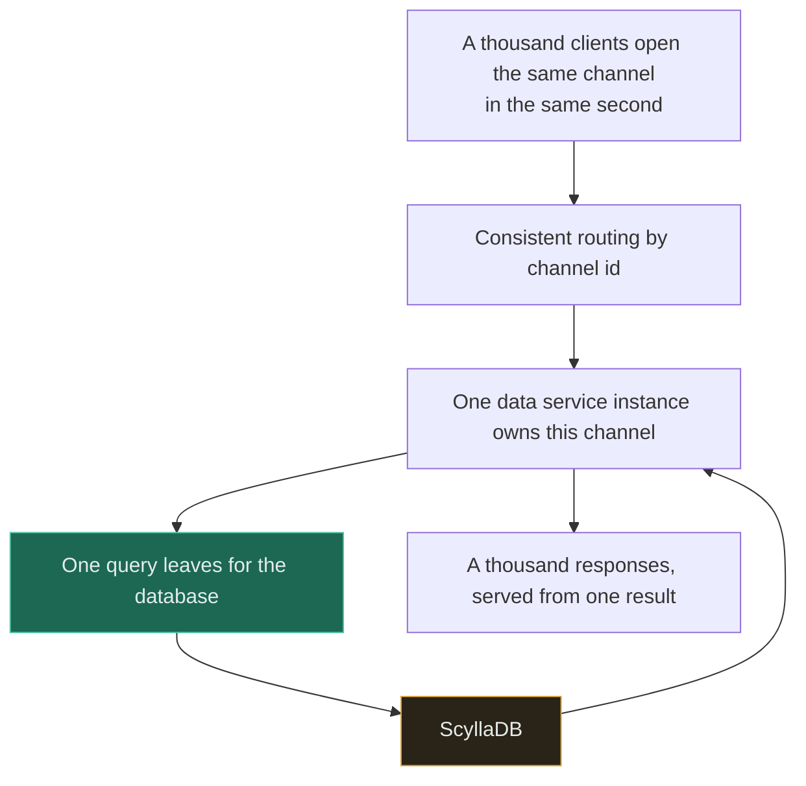
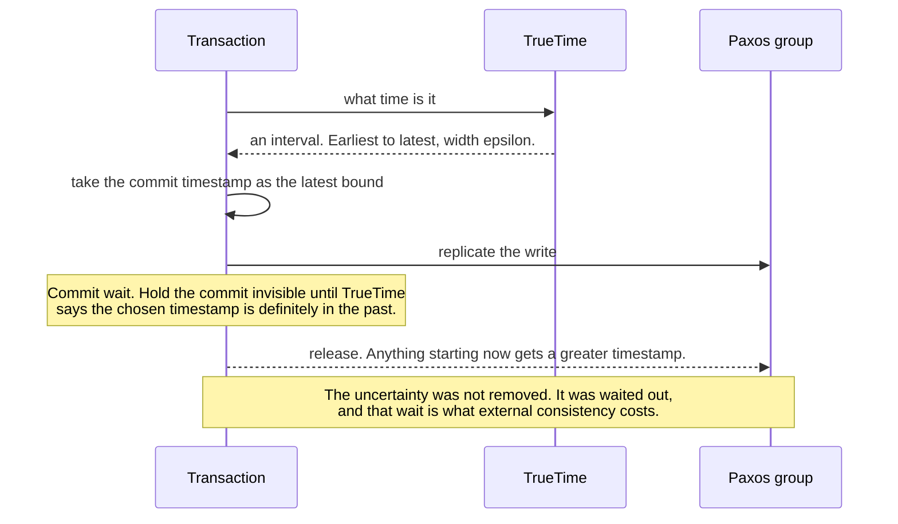
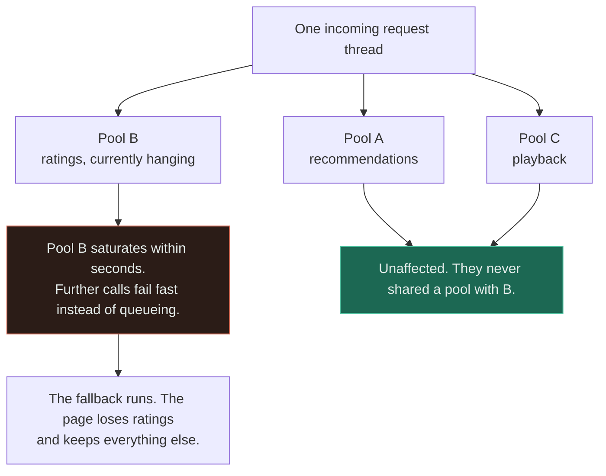
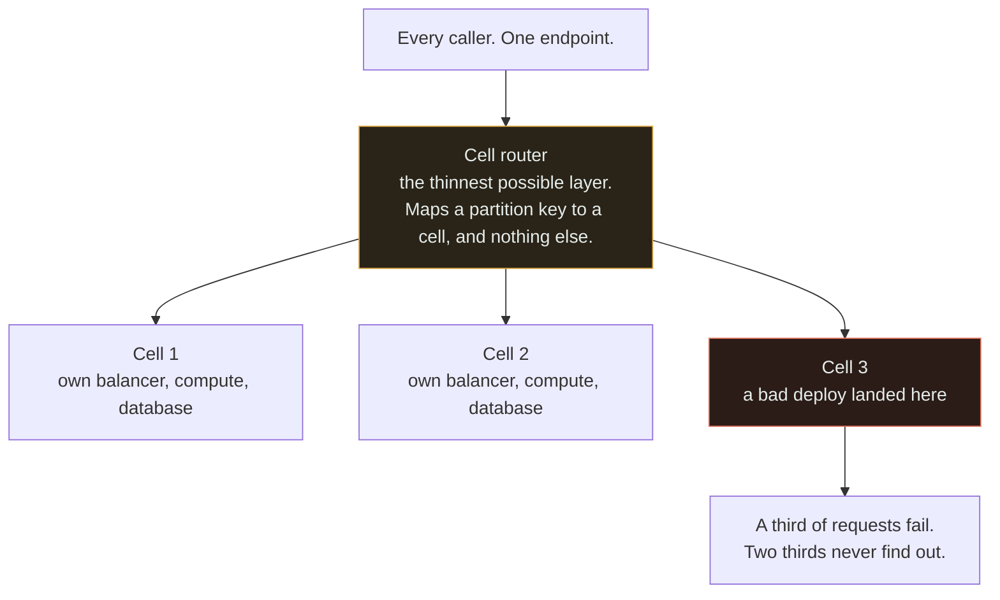
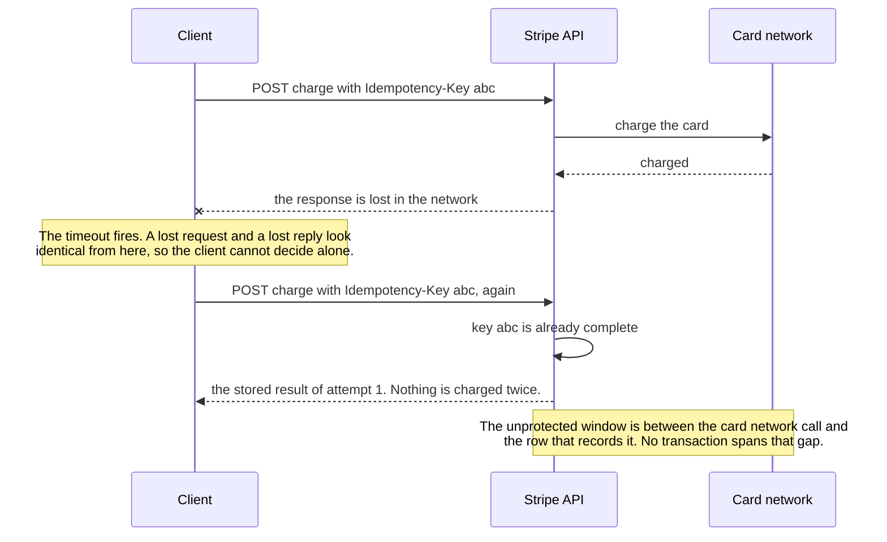
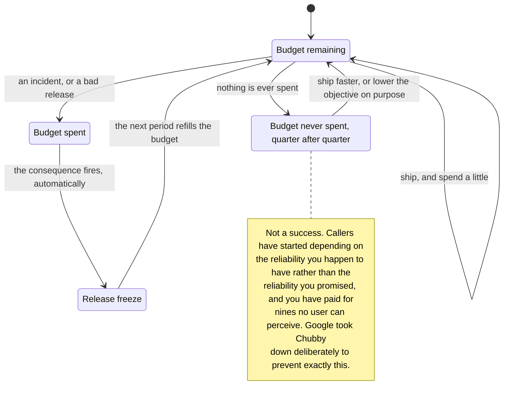

<!-- GENERATED by scripts/gen_case_studies.py -- do not edit by hand. -->
---
topic: Case Studies
category: Case studies
difficulty: Intermediate → Advanced
---

# Case Studies

`[INTERMEDIATE → ADVANCED]` · **10 systems**, 2007–2023, every one with a public primary source — **40 decisions** with the cost of each one stated, and for every case an honest paragraph on when copying it would be a mistake.

---

## How to read a case study

These are the systems everyone cites and almost nobody reads. That gap is where the damage happens: an architecture arrives in a design review with a famous company's name attached and no constraints attached, and the constraints were the entire reason it looked like that.

**The `When copying it would be wrong` section matters more than the architecture.** It is last on the page and it is first in importance. Every system here was built by a team operating three or four orders of magnitude above you, against a constraint you do not have — a 99.9th-percentile revenue SLA, a fan-out of a thousand servers, atomic clocks in the rack. Dynamo's design in a system with one datacentre and forty requests a second is not a bold choice, it is a straightforward and expensive mistake, and the same is true of most of the others. Read that section first if you are in a hurry. It is the only section that can save you a quarter.

**Read the constraints before the solution.** A design is only interesting relative to what it could not change. Facebook could not stop product teams widening the fan-out; Google could change the hardware in the rack, which almost nobody can; Discord could not take the product offline. Strip the constraints away and every one of these becomes an arbitrary preference you are free to copy — which is exactly how they get copied.

**Every decision here has a cost, because a decision without one was not a decision.** If you can only remember one thing from a case, make it the cost rather than the choice. The choice is the part you will be tempted to repeat; the cost is the part that tells you whether you can afford to.

**The surprise is why each case is here at all.** Not the architecture — the thing that reverses when you look closely. Facebook's leases fix a bug most engineers have never heard of. Dynamo's elaborate conflict machinery fires roughly once in ten thousand reads. Google's answer to tail latency is to do the work twice and it costs 2%. Exceeding your reliability target is a failure, and Google's response was to cause an outage on purpose. If a case here ever stops surprising you, it has stopped earning its place.

Every figure on this page comes from the named primary source and was checked against it. Where a number could not be verified it is described qualitatively instead, deliberately — a case study that invents a number is worse than no case study, because it launders a guess through somebody else's reputation.

## The cases

| | System | What it is about | Year | The surprise, in one line |
|:-:|---|---|:-:|---|
| 1 | [Facebook](#facebook-memcache) | Scaling Memcache | 2013 | Leases are taught as a thundering-herd fix, and that is the half everybody knows. |
| 2 | [Amazon](#amazon-dynamo) | Dynamo | 2007 | The elaborate conflict machinery almost never fires. |
| 3 | [Google](#google-tail-at-scale) | The Tail at Scale | 2013 | Doing the work twice makes the system cheaper. |
| 4 | [LinkedIn](#linkedin-the-log) | The Log as a Unifying Abstraction | 2013 | The log is not a messaging feature that happened to scale. |
| 5 | [Discord](#discord-messages) | Trillions of Messages | 2023 | The database swap is the headline and it is the less interesting half. |
| 6 | [Google](#google-spanner) | Spanner and TrueTime | 2012 | Spanner does not remove the clock uncertainty. |
| 7 | [Netflix](#netflix-hystrix) | Bulkheads and Circuit Breakers | 2012 | The fallback is the dangerous part, not the failure. |
| 8 | [AWS](#aws-cell-based) | Cell-Based Architecture | 2023 | Cells do not remove the single point of failure. |
| 9 | [Stripe](#stripe-idempotency) | Idempotency Keys | 2017 | Storing the key is the part everyone implements, and it is the part that does almost nothing. |
| 10 | [Google](#google-error-budgets) | Error Budgets | 2016 | Exceeding your objective is a failure, and Google's response to it was to cause an outage on purpose. |

Each case is self-contained. There is no reading order, but if you want one, read the [tail at scale](#google-tail-at-scale) first — it is the shortest route to understanding why every other system on this page is shaped the way it is.

---

## 1. Facebook · Scaling Memcache

`2013` · billions of requests per second against trillions of stored items, across thousands of memcached servers in several regions

**Source** — [Scaling Memcache at Facebook, Nishtala et al., NSDI 2013](https://www.usenix.org/system/files/conference/nsdi13/nsdi13-final170_update.pdf)

### The problem

Rendering one Facebook page is a graph traversal: it fetches hundreds of small, unrelated objects, and the fan-out is wide rather than deep. A relational database can produce any one of those objects quickly and cannot produce hundreds of thousands of them a second. Facebook needed a cache tier that absorbed that read volume across several regions while staying close enough to MySQL that users did not routinely see data they had just changed themselves.

### What they could not change

- The access pattern was not negotiable. Product teams kept shipping features that widened the fan-out, so the cache had to absorb whatever shape of read arrived.
- MySQL stayed the source of truth. The cache could never become the authority on any value, which rules out every design that treats the cache as storage.
- memcached itself was an existing, deliberately simple, single-machine program. Almost all of the work had to happen around it rather than inside it.
- Writes land in the region nearest the user while reads are served from replicas of a single primary region, so cross-region invalidation was part of the problem statement rather than a later refinement.

### What they built

memcache is a demand-filled look-aside cache: the application checks it, misses, reads MySQL, and populates it. Around that simple core sits everything that makes it survive the scale. Get requests go over UDP, because connection setup and per-connection state on the highest volume operation is not affordable, and a dropped or reordered packet is simply treated as a miss; sets and deletes go over TCP through a local proxy. Within a single request, dependencies are arranged as a graph so independent fetches are batched and issued concurrently, and a sliding window bounds how many are outstanding, because thousands of web servers fetching from thousands of cache servers all at once is an incast congestion problem before it is a cache problem. Leases gate the fill path, a Gutter pool of roughly one per cent of the cluster absorbs a failed server instead of rehashing its keys onto the survivors, and invalidations are derived from MySQL's commit log by a daemon rather than issued by hand from application code.

### Key decisions

**1 · Keep memcache a demand-filled look-aside cache, with the application responsible for reading through to MySQL and populating the result.**

- *Why* — It keeps memcached generic. The cache never learns the shape of any query, so any service can put anything in it without a change to the cache tier.
- *Cost* — Invalidation now lives outside the cache, in application code paths that can forget one. Every miss costs a full round trip plus a second write, and the fill path is racy by construction — which is precisely the hole leases had to be invented to plug.

**2 · Send get requests over UDP and treat a dropped or out-of-order packet as a cache miss.**

- *Why* — It removes connection setup and per-connection state from the single highest-volume operation in the system, and a miss is always a safe answer.
- *Cost* — Every dropped packet becomes load on the database rather than a visible error, so packet loss surfaces as origin pressure rather than as a network alarm. Sets and deletes could not use it and needed a separate TCP path, so there are now two transports to reason about.

**3 · Introduce leases: on a miss, memcached returns a token that the client must present in order to set the value, and it issues at most one token per key per ten seconds.**

- *Why* — One token gates the entire herd waiting on a hot key, and any intervening delete invalidates the token — so a client that read a value before a write cannot install it afterwards.
- *Cost* — Clients arriving inside the lease window are told to wait and retry, so a cache miss becomes a small deliberate latency penalty for everyone but the first caller. The cache is also now stateful in a way a plain key-value store is not, and that state has to be maintained.

**4 · Absorb a failed memcached server with a small dedicated Gutter pool, about one per cent of the cluster, rather than rehashing its keys across the survivors.**

- *Why* — Rehashing on failure moves a fraction of every key at once, cold-starting a slice of the whole cache and pushing that load onto a cluster that is already one server short.
- *Cost* — Gutter entries expire quickly and are not invalidated with the care the main tier gets, so a failure buys a bounded window of staler data. The pool also sits idle almost all the time and is paid for continuously.

### The surprise

> Leases are taught as a thundering-herd fix, and that is the half everybody knows. The other half is the reason to read the paper: a look-aside cache can install a value that is permanently wrong. Client A misses, reads v1 from the database, and stalls. Client B writes v2 and deletes the cache key. Client A wakes up and sets v1. No error is raised, nothing retries, no metric moves, and the cache now serves a value the database disagrees with until the TTL expires or somebody happens to write again. Facebook called it a stale set, and the same token that rate-limits the herd is what revokes A's right to write. One mechanism, two bugs — and most engineers have only ever heard of one of them.

### When it applies to you

When a shared cache tier fronts a database on a read path that fetches many keys per request, and the read rate is high enough that one hot key expiring is visibly a database event. The lease idea in particular scales all the way down: inside one process it is single-flight, and it is worth having at a few thousand requests a second rather than at billions. If two of your code paths can write the same cache key from reads taken at different times, you have the stale-set bug today.

### When copying it would be wrong

Almost everything around the lease is not for you. The sliding window for incast congestion, the regional pools, the cold-cluster warm-up and the Gutter tier all exist because thousands of web servers talk to thousands of cache servers all-to-all. With a fleet of tens of machines, none of those failure modes has appeared, and building for them costs you components you cannot debug and did not need. UDP gets are the clearest example: at ordinary scale you would be trading measurable extra database load for a latency saving no user can perceive. Take the leases and the commit-log invalidation. Leave the rest on the page.

<b>What would you have done?</b>

**Your cache-aside code is correct, reviewed, and has a single write path that invalidates on every update. Can it still serve a value that never existed in the database at that time?**

Yes, and no amount of care in the write path prevents it. The bug is in the **read** path: the fill is a read-then-set with an arbitrary gap in the middle, and any write that lands in that gap is overwritten by a value that was already stale when it was fetched. Invalidating correctly on write does not help, because the invalidation happens *before* the late set arrives.

The fixes are all versions of the same idea — make the set conditional on nothing having changed since the read. A lease token is the explicit form. A compare-and-set against a version read at fetch time is the form most caches already give you. Single-flight narrows the window without closing it, and a short TTL bounds the damage rather than preventing it.

[04-caching/fundamentals/](../04-caching/fundamentals/) · [14-component-combinations/cache-and-database/](../14-component-combinations/cache-and-database/) · [05-databases/replication/](../05-databases/replication/)

---

## 2. Amazon · Dynamo

`2007` · Amazon's checkout-path services across multiple datacentres, held to a service level agreement written at the 99.9th percentile rather than the mean

**Source** — [Dynamo: Amazon's Highly Available Key-value Store, DeCandia et al., SOSP 2007](https://www.allthingsdistributed.com/files/amazon-dynamo-sosp2007.pdf)

### The problem

Amazon's outage postmortems kept converging on the same sentence: a service could not take a write because the store underneath it was unavailable, partitioned, or in the middle of a failover. For the shopping cart specifically, refusing an add-to-cart is lost revenue, and the customer's fault-tolerance strategy is to leave. Amazon needed a store whose write path survived node failure, network partition and the loss of an entire datacentre, with the guarantee stated at the 99.9th percentile because that is where the money is.

### What they could not change

- The service level agreement was written at the 99.9th percentile. An architecture that was fast on average and occasionally terrible was disqualified before it was designed.
- Writes could not be rejected. Availability of the write path was the product requirement, not a performance target to be traded against others.
- It had to run on commodity hardware in an environment where node failure is continuous and routine rather than exceptional.
- The data model was allowed to be tiny — a primary key and an opaque value — because the services that needed this did not join.

### What they built

Dynamo is a zero-hop distributed hash table. Consistent hashing with virtual nodes places keys on a ring, each key is replicated to the N nodes that follow it, and reads and writes contact R and W of them, with N, R and W tunable per instance — three, two and two being the configuration most Dynamo deployments used. Writes are never refused: if a replica is unreachable, the write is accepted by the next healthy node on the ring along with a hint about where it really belongs, and handed back when that node returns. Divergence is expected rather than prevented, so every version carries a vector clock, a read may return several concurrent versions, and reconciling them is the application's job — the shopping cart merges conflicting carts by taking their union. Membership is gossiped, and background anti-entropy uses Merkle trees so two replicas can find their differences without shipping the whole range.

### Key decisions

**1 · Choose availability over consistency on the write path, permanently, and move conflict resolution to the read.**

- *Why* — An unavailable write is lost revenue and lost trust. A conflicting read can be reconciled later, usually by the application and occasionally by the customer.
- *Cost* — Every reader of a Dynamo store must be written to handle receiving more than one version of a key. That is not a library you add afterwards — it changes the interface, so the cost lands on every consuming service and on every future one.

**2 · Hand conflict resolution to the application rather than resolving it in the datastore.**

- *Why* — The datastore only knows bytes. The shopping cart knows that merging two carts by union is right and that losing an item is not.
- *Cost* — Union merge means a deleted item can come back. Amazon accepted a resurrected item as strictly better than a lost one, but it is a real, user-visible wrong answer — chosen deliberately, which is the only respectable way to have one.

**3 · Use sloppy quorums with hinted handoff rather than strict quorums.**

- *Why* — A strict quorum fails the write when the designated replicas are unreachable, which is exactly the situation the system exists to survive.
- *Cost* — R plus W greater than N stops being a guarantee during a partition, because the R nodes you read may not be the N nodes that were written. The arithmetic still looks reassuring on a whiteboard and no longer means what the textbook says it means.

**4 · Make N, R and W per-instance tunables instead of fixing them.**

- *Why* — Different Amazon services wanted different points on the durability, availability and latency curve out of one codebase.
- *Cost* — You have handed every service team three numbers with non-obvious interactions. A team that sets them wrong gets a store with quietly weaker guarantees than it believes it has, and there is no error message for a badly chosen quorum.

### The surprise

> The elaborate conflict machinery almost never fires. Amazon profiled the shopping cart over 24 hours and 99.94% of reads returned exactly one version; the remainder, spread over two, three and four versions, is a fraction of a per cent, and the paper notes the divergence came mostly from automated clients rather than from people. So vector clocks, sibling versions and application-level merge — the parts everybody remembers Dynamo for — sit on the rare path. The frequency is the lesson rather than a footnote. They built machinery that fires roughly once in ten thousand reads because the alternative was saying no on the checkout page, and the machinery is not there to do routine work. It is there to buy the right to never refuse.

### When it applies to you

When a refused write costs more than a write that has to be reconciled later, and the value is genuinely mergeable: a cart, a set of tags, a session, an inbox, a counter. The shape to look for is key-value access with no joins, a value your application knows how to merge, and a business cost for unavailability that you can state in currency. If you cannot name that cost, you have not yet established that you need this.

### When copying it would be wrong

In one datacentre at forty requests a second against one Postgres, this is a straightforward and expensive mistake. You would pay for sibling handling in every reader, hinted handoff, anti-entropy and a quorum you have to reason about — in order to survive partitions between machines that share a rack — while giving up transactions, secondary indexes and joins you are actually using. Note too that this paper is not DynamoDB. The managed product that inherited the name offers strongly consistent reads and does not hand you vector clocks, so reading the paper tells you nothing reliable about how the product behaves.

<b>What would you have done?</b>

**Dynamo's measurements say the conflict path fires roughly once in ten thousand reads. A colleague proposes skipping sibling handling for now and adding it when conflicts appear in the logs. What is wrong with that plan?**

Two things, and the second is the expensive one.

**Conflicts will not appear in the logs.** If the client does not handle siblings, the most likely behaviour is that it takes the first version returned and discards the rest silently. There is no error, no exception and no metric — you have built a system that loses one write in ten thousand and reports perfect health. The rarity that makes deferring the work attractive is the same rarity that makes the resulting bug undetectable.

**Sibling handling is interface, not implementation.** Every current and future reader has to cope with a multi-valued read. Retrofitting it means changing every consumer at once, which is the migration you were trying to defer.

The right question is the one before it: does this data need an always-available write at all? If not, take a store that refuses writes during a partition and keep single-valued reads.

[00-foundations/cap-theorem/](../00-foundations/cap-theorem/) · [00-foundations/consistency/](../00-foundations/consistency/) · [05-databases/replication/](../05-databases/replication/) · [18-implementations/consistent-hashing/](../18-implementations/consistent-hashing/)

---

## 3. Google · The Tail at Scale

`2013` · interactive services whose single user request fans out to hundreds or thousands of servers and waits for all of them

**Source** — [The Tail at Scale, Dean and Barroso, Communications of the ACM, February 2013](https://research.google/pubs/the-tail-at-scale/)

### The problem

A Google search answers one user request by asking hundreds or thousands of machines and waiting for the answers. At that fan-out the request inherits the slowest response rather than the average one, so a fleet in which every individual server is excellent still produces pages that are routinely slow. The variability causing it is not a defect anyone can remove: it comes from shared queues, background daemons, garbage collection, energy management and maintenance work, all of which are permanent features of operating a fleet economically.

### What they could not change

- The sources of latency variability are structural. Shared resources, background activity and power management are how a fleet is run affordably, not bugs waiting to be fixed.
- The fan-out itself could not be reduced. The quality of a search result depends on consulting every shard, so there is no version of the design that asks fewer machines.
- Removing variability from every one of thousands of servers is not affordable, so the response had to be tolerance rather than prevention.

### What they built

Dean and Barroso's argument is to treat latency variability exactly as the industry already treats hardware failure: stop trying to eliminate it and build a tail-tolerant layer above it. Within a single request, the two headline techniques are hedged requests — send the same work to a second replica once the first has failed to answer within roughly the 95th percentile of expected latency, take whichever reply arrives first, cancel the other — and tied requests, where the work is enqueued on two servers at once, each told the identity of the other, so whichever dequeues it first cancels its twin before any work is duplicated. Around those sit slower-moving mechanisms: micro-partitioning so load can be rebalanced in small units, selective replication of hot partitions, latency-induced probation that temporarily removes a server that has become slow, and returning a good-enough answer rather than waiting for a late shard.

### Key decisions

**1 · Hedge after the 95th percentile rather than immediately.**

- *Why* — Waiting until a request is already anomalous means the duplicate is only sent for the small fraction actually in trouble, so the extra load is bounded by the size of the tail.
- *Cost* — You are deliberately doing the same work twice, and it only stays cheap while the dependency has headroom. In the paper's benchmark — reading 1,000 keys from a BigTable spread over 100 servers — a hedge after 10 ms cut the 99.9th percentile from 1,800 ms to 74 ms for 2% more requests. The 2% is the bill, and it is only 2% because the trigger sits in the tail.

**2 · Prefer tied requests wherever you control both queues.**

- *Why* — A hedge duplicates the work and throws one copy away. A tied request cancels its twin the moment either server starts executing, so the duplicate is usually never performed at all.
- *Cost* — It needs the servers to know about each other and to support cancellation, so it is available inside your own storage layer and not across an API you merely call. The paper's file-system read benchmark cut median latency by about 16% with a cross-server cancellation after 1 ms — but only because Google owned both ends.

**3 · Treat a persistently slow server as a failed one and put it on probation.**

- *Why* — A machine that is slow for structural reasons will not become fast because you investigated it. Taking it out of rotation and probing it is far cheaper than diagnosing it.
- *Cost* — You lose that capacity while it is out, and an over-eager threshold ejects healthy machines during a load spike — removing capacity at precisely the moment the spike needed it, which makes the spike worse and can oscillate.

**4 · Return a good-enough response when a shard is late rather than waiting for it.**

- *Why* — For search, the marginal quality contributed by the last shard is usually far smaller than the cost of making every user wait for it.
- *Cost* — Results become non-deterministic. The same query can return different answers depending on which shards were slow, which breaks result caching, breaks reproducibility, and makes a class of bug impossible to reproduce on demand.

### The surprise

> Doing the work twice makes the system cheaper. Every instinct says a duplicate request is a 100% increase in load; in the paper's benchmark it was 2%, because the hedge only fires for requests that have already gone wrong and those are by definition a small fraction of traffic. The deeper reversal is what a healthy dashboard entitles you to conclude. At a fan-out of 100, a service meeting a 99th-percentile target perfectly still leaves roughly two thirds of pages slow — so a hundred teams can each be correct that their service is fine while the product is not. There is no service on that list to fix. The problem lives in the composition, and the composition belongs to nobody's dashboard.

### When it applies to you

When one user-visible request fans out to tens or hundreds of backends and waits for all of them, and you have measured a p99 that is many multiples of your p50. Hedging is the cheapest item on the list and needs exactly two properties to be safe: the operation must be idempotent, and the dependency must have real headroom. The fan-out arithmetic is worth doing even at small scale, because it tells you how much tail you can afford per dependency before the page is slow.

### When copying it would be wrong

If your request touches one or two services, none of this applies and your tail is telling you something simpler — a slow query, a cold cache, a saturated connection pool — which hedging would hide under twice the load rather than fix. Hedging into a dependency that is already near saturation is actively dangerous: it adds load exactly where there is none spare, and converts a latency problem into an outage. Tied requests are usually not available to you at all, since they need cancellation support at both ends of a connection you do not own. And probation on a small fleet is a good way to eject a third of your capacity during a spike.

<b>What would you have done?</b>

**A service reports p50 of 8 ms and p99 of 900 ms. You propose hedging after p95. Your colleague objects that the service is at 85% CPU. Who is right?**

Your colleague, and the objection is the important half of the technique.

Hedging spends capacity to buy tail latency. At 85% utilisation there is no capacity to spend, and queue wait already scales as `1 / (1 - utilisation)` — adding even 2% more work to a system that close to saturation lengthens the very queues that are producing the tail. That is a positive feedback loop: a longer tail fires more hedges, which add more load, which lengthens the tail.

There is also a diagnosis missing. A p99 that is 100x p50 with four out of five time contributors identical between the two is a **queueing** signature, not a work signature, and queueing is a capacity problem wearing a latency costume. Add capacity first. Hedge afterwards, if there is still a tail, and only if the operation is idempotent.

[00-foundations/latency/](../00-foundations/latency/) · [00-foundations/availability/](../00-foundations/availability/) · [11-observability/](../11-observability/) · [13-design-patterns/CATALOGUE.md](../13-design-patterns/CATALOGUE.md)

---

## 4. LinkedIn · The Log as a Unifying Abstraction

`2013` · dozens of source systems feeding dozens of destination systems, an integration cost growing as the product of the two

**Source** — [The Log: What every software engineer should know about real-time data's unifying abstraction, Jay Kreps, LinkedIn Engineering, December 2013](https://engineering.linkedin.com/distributed-systems/log-what-every-software-engineer-should-know-about-real-time-datas-unifying)

### The problem

LinkedIn had many systems producing data — primary databases, the service tier, user activity, operational metrics — and many consuming it: search indexes, recommendations, the data warehouse, caches, monitoring. Wiring each producer to each consumer directly makes the number of pipelines the product of the two, and each pipeline carries its own schema assumptions, its own failure modes and its own owner. Worse, the pipelines disagreed: two systems fed by two different jobs would report different answers to the same question and nobody could say which was right.

### What they could not change

- Neither the number of source systems nor the number of destinations was going to shrink. Both were growing, and the integration cost was growing as their product.
- The destinations are genuinely heterogeneous and cannot be consolidated. A search index, a warehouse and a key-value cache need different representations of the same fact.
- Reprocessing had to be possible. A bug in a derived system could not require going back to the source systems and asking them to send everything again.

### What they built

Kreps's argument is that the abstraction the industry needed already existed inside every database, as the write-ahead log: an append-only sequence of records, ordered, with each reader tracking its own position. Put that log in the middle as the shared public interface and the N-times-M integration problem collapses to N producers writing and M consumers reading, none of them aware of each other. Because the log is retained rather than consumed, every downstream system becomes a deterministic function of the same sequence — the state-machine replication argument — so a search index, a cache and a warehouse are materialised views of one thing rather than three independent claims about the truth. A consumer that was wrong on Tuesday is repaired by rewinding its offset to Monday and letting it recompute. Log compaction, which keeps only the latest record per key, bounds the storage so a full rebuild does not require retaining every event ever written.

### Key decisions

**1 · Retain the log and give every consumer its own offset, rather than deleting on consumption.**

- *Why* — Retention is what makes replay possible, and replay is what turns a bug in a derived system into a rewind instead of a data-recovery project.
- *Cost* — You are storing the data twice, once in the log and once in everything derived from it, and you must choose and then defend a retention window. Set it too short and the replay guarantee quietly stops existing on the day you finally need it.

**2 · Make the log the contract between systems, not a message bus hidden behind one of them.**

- *Why* — If the log is the interface, a new consumer can be added without asking the producer for anything. That is the entire mechanism by which N times M becomes N plus M.
- *Cost* — The log's schema is now a public API with as many readers as you have systems, so schema evolution stops being a private decision. Most organisations learn this by breaking a downstream consumer, and it is why a schema registry ends up mandatory rather than nice.

**3 · Order within a partition only, and shard by key.**

- *Why* — A globally ordered log has exactly one writer's throughput and one consumer's throughput. That is not a system, it is a bottleneck with good semantics.
- *Cost* — The total order everyone pictures does not exist. You get ordering per key, consumer parallelism is capped by partition count, and adding partitions later changes the key-to-partition mapping and breaks per-key ordering across the change.

**4 · Derive the log from the database's commit log rather than asking applications to publish events.**

- *Why* — An event a developer must remember to publish is an event a developer can forget to publish, and then two sources disagree with no way to determine which is right.
- *Cost* — You are now coupled to your database's replication format and its schema, so a migration in the source database becomes an event-format migration for every consumer downstream at once.

### The surprise

> The log is not a messaging feature that happened to scale. It is the same primitive the database has been using internally all along — the write-ahead log that already provides durability, replication and recovery — and the whole move is to stop treating it as an implementation detail and publish it. Once it is public, the thing that felt like the database's crown jewel becomes the cheapest component in the architecture: the database, the search index and the cache are all just readers at different offsets, and none of them is the source of truth any more. The log is. That inverts the usual mental model, in which the database holds the truth and everything else is a copy that might be stale. Here every store including the database is a copy, and the only difference between them is how far along each one has got.

### When it applies to you

When the number of independent consumers of the same data is growing and you can already name three systems that must agree about a fact and periodically do not. The reliable tells are a pipeline you cannot re-run, and a reconciliation job whose whole purpose is to make two derived stores agree. The replay property alone usually justifies choosing a log over a queue for anything event-shaped, well before the scale argument arrives.

### When copying it would be wrong

With three services and one database, adopting a log buys you a broker to operate, a schema registry to police, consumer lag as a new failure mode, and an at-least-once guarantee you now have to make idempotent — in exchange for solving an integration problem you do not have. The economics only turn when M is genuinely large. Two systems that need to talk should call each other, and a nightly job reading the database directly is a perfectly respectable pipeline until somebody can name the third and fourth consumer. Adopting the log because a large company did is how a five-service architecture acquires a distributed systems problem it had successfully avoided.

<b>What would you have done?</b>

**Your team already runs a message queue and it works. What would a log give you that the queue does not, and what is the one question that decides it?**

The question is: **might you want this data twice?**

A queue deletes on consumption; a log retains, and every consumer holds an independent offset. That single difference decides replay. A bug discovered on Tuesday is fixed by resetting the offset to Monday and recomputing; with a queue the messages are gone and the data is unrecoverable. It also decides how you add consumers — a second reader of a queue means either a fan-out topology or fighting the first reader for messages, whereas a second reader of a log is a new offset and nothing else.

It changes how you scale, too: you add workers to a queue and partitions to a log, and the second is not free because it remaps keys.

If the answer is a confident no — send this email, resize this image, and once it is done it is done — the queue is the right component and the log is a broker you did not need.

[06-messaging/queues/](../06-messaging/queues/) · [06-messaging/workers/](../06-messaging/workers/) · [14-component-combinations/queue-and-database/](../14-component-combinations/queue-and-database/) · [05-databases/replication/](../05-databases/replication/)

---

## 5. Discord · Trillions of Messages

`2023` · trillions of stored messages; 177 Cassandra nodes before the migration, 72 ScyllaDB nodes after

**Source** — [How Discord Stores Trillions of Messages, Bo Ingram, Discord engineering blog, March 2023](https://discord.com/blog/how-discord-stores-trillions-of-messages)

### The problem

Discord stores messages partitioned by channel and time bucket, which means a busy channel is a single hot partition that everybody reading it hits at the same moment. On Cassandra this produced latency spikes that woke people up, and the cause was frequently not the query but the runtime: JVM garbage collection pauses long enough that a node had to be restarted by hand. By early 2022 the cluster had reached 177 nodes, and the thing that had become unsustainable was the on-call toil rather than the throughput.

### What they could not change

- The access pattern is fixed by the product. Messages in a channel, newest first — and a hot channel is not a modelling mistake, it is a popular channel.
- Nothing could go offline. Any change had to happen underneath a live product that already held trillions of rows.
- The partitioning scheme had to survive. Whatever they moved to had to accept the same channel-and-bucket layout, because changing storage and data model together removes any clean rollback.

### What they built

Two changes, and only one of them was the database. First they put a tier of Rust data services between the API and storage, routing requests for a channel consistently to one instance so that concurrent readers of the same row collapse into a single query — request coalescing, done at the service tier rather than in the database. Second they replaced Cassandra with ScyllaDB, a C++ reimplementation with a shard-per-core design and no JVM, which removes garbage collection as a source of tail latency. The migration itself used a purpose-built Rust migrator after the off-the-shelf tool projected months: it read token ranges, checkpointed its progress, and moved data at up to 3.2 million messages a second, finishing in nine days. The cluster ended at 72 nodes where it had been 177.

### Key decisions

**1 · Put a coalescing layer in front of the database before changing the database.**

- *Why* — A hot partition is a load problem, and load problems are solved in front of the store rather than inside it. If a thousand people open the same channel at once, exactly one query needs to reach the database.
- *Cost* — A new tier on the request path, with its own routing, its own failure modes and its own deployment. Consistent routing by channel also means an instance disappearing moves a set of channels to a neighbour that has never seen them.

**2 · Replace the JVM rather than continue tuning it.**

- *Why* — The pauses were not a configuration mistake to be fixed once. They were a recurring on-call cost, and each recurrence needed a human awake at the time.
- *Cost* — A full migration of trillions of rows underneath a live product, plus the loss of the Cassandra ecosystem and every piece of operational knowledge built around it. This is measured in engineer-years, not in sprints.

**3 · Write a bespoke migration tool instead of using the supported one.**

- *Why* — The supported migrator projected months, and months of running two databases in parallel is itself a source of bugs, cost and divergence.
- *Cost* — You are hand-writing the most dangerous code in the project — the part that moves all the data — and you own every correctness bug in it. It paid off here only because the Rust data service library already existed for the migrator to extend.

**4 · Keep the partitioning scheme identical across the move.**

- *Why* — Changing the storage engine and the data model simultaneously means any problem afterwards has two candidate causes and no clean way back.
- *Cost* — The hot-partition shape survives the migration. ScyllaDB copes with it better, but a hot partition is still a hot partition — which is why the coalescing layer, not the new database, is what actually addressed it.

### The surprise

> The database swap is the headline and it is the less interesting half. The coalescing layer in front of the store — one query per row no matter how many people ask at the same instant — attacks the actual mechanism of the pain, and it would have helped just as much on Cassandra. What the migration bought was different and narrower: it removed a floor on tail latency that no amount of query tuning could reach, because those pauses came from the runtime rather than from the work. Those are two distinct problems that both present as *the database is slow*, and the fixes are not substitutes for each other. Most teams reading this have the first problem, which is a week of work, and go shopping for the second, which is a year.

### When it applies to you

When one partition genuinely takes a disproportionate share of reads because the product makes it popular, and the pattern is many simultaneous readers of the same row. Coalescing is the cheap half and it is available to anyone: single-flight per key, plus consistent routing so the same key lands on the same instance. Treat the runtime as a suspect only after you have measured pauses that correlate with your latency spikes — and if you have, that measurement is worth more than any benchmark you will read.

### When copying it would be wrong

You are not going to migrate a database because of this page, and you should be suspicious of any argument that opens with Discord's node count. The migration was affordable to them because their access pattern is a single query shape — messages in a channel, by time — which is what makes a like-for-like move thinkable at all; a system with fifty query shapes and secondary indexes does not get that option at any price. And if your tail latency is not correlated with garbage collection pauses you have actually measured, changing runtimes buys you nothing except a year of migration and a new set of operational unknowns.

<b>What would you have done?</b>

**Your busiest tenant produces a hot partition and your database vendor's answer is a bigger instance. Name a cheaper fix and say what it costs.**

**Coalesce in front of the store.** If the readers are asking for the *same* row at the same time, one query can serve all of them: route by key so a given key always lands on the same instance, and have that instance run one fetch while the rest of the callers wait on it. That is single-flight, and it is a few dozen lines rather than a migration.

It costs three things worth naming. Routing by key means an instance failing moves a set of keys to a cold neighbour. Every waiting caller is now coupled to one fetch, so a slow fetch is slow for all of them and needs its own timeout. And it only works when the concurrent readers want the *same* row — if they are hitting the same partition for different rows, coalescing does nothing and you are back to isolating the tenant or splitting the range.

The bigger instance is worth taking as well, incidentally. It is reversible, and reversible changes come first.

[05-databases/sharding/](../05-databases/sharding/) · [04-caching/fundamentals/](../04-caching/fundamentals/) · [14-component-combinations/cache-and-database/](../14-component-combinations/cache-and-database/) · [00-foundations/latency/](../00-foundations/latency/)

---

## 6. Google · Spanner and TrueTime

`2012` · a globally distributed relational database spanning datacentres on multiple continents, with externally consistent transactions

**Source** — [Spanner: Google's Globally-Distributed Database, Corbett et al., OSDI 2012](https://research.google/pubs/spanner-googles-globally-distributed-database/)

### The problem

Google wanted a database that shards and replicates across continents, survives the loss of a datacentre, supports SQL and general-purpose transactions, and orders those transactions the way the outside world observed them happening. That last property, external consistency, is the hard one: if transaction A commits before transaction B starts, every observer must see A before B, even when the two were committed on different continents by machines whose clocks disagree. Distributed systems normally abandon this, because you cannot compare two wall clocks and trust the answer.

### What they could not change

- Physical clock skew between machines is real and cannot be argued away. NTP gives you a time, not a bound on how wrong that time is.
- The system had to span continents, so the speed of light sets a floor on cross-region coordination that no clever design removes.
- Google was willing to change the hardware. GPS receivers and atomic clocks in every datacentre were on the table — which is a constraint most designs do not get to relax.

### What they built

Spanner's move is to stop pretending the clock is a point in time. The TrueTime API returns an interval, an earliest and a latest, and guarantees the true time lies inside it; the width of that interval, epsilon, is kept small by GPS receivers and atomic clocks in every datacentre, and in the paper's production measurements it sawtooths between roughly 1 and 7 milliseconds as each machine drifts between synchronisations. Having a bound rather than a guess is what makes the rest possible. When a read-write transaction commits, Spanner assigns it a timestamp and then waits out the uncertainty before making the commit visible, so by the time anyone can observe the transaction its timestamp is unambiguously in the past and every later transaction necessarily gets a greater one. External consistency then falls out of the arithmetic. Reads at a timestamp need no locks at all, which is where the latency the writes paid comes back.

### Key decisions

**1 · Expose clock uncertainty as an interval instead of hiding it behind a single timestamp.**

- *Why* — You cannot reason about an error you refuse to measure. An interval turns *the clock might be wrong* into a number the algorithm can work with.
- *Cost* — Every layer above has to handle an interval, and the entire guarantee rests on the bound actually holding. A clock whose error escapes epsilon does not degrade gracefully — it silently violates the one correctness property the system was built to provide.

**2 · Buy external consistency with a commit wait proportional to clock uncertainty.**

- *Why* — Waiting out the uncertainty converts an unanswerable question about ordering into a purchasable one, priced in milliseconds.
- *Cost* — Read-write transactions are slower by design, and the price is set by your hardware — better clocks are literally cheaper transactions. Much of the wait overlaps the Paxos round it would have paid anyway, but the mechanism is still a deliberate latency tax on writes.

**3 · Put GPS receivers and atomic clocks in every datacentre.**

- *Why* — Epsilon is the price of every write, so narrowing it is a direct performance investment, and two independent clock technologies fail in usefully different ways.
- *Cost* — A distributed systems guarantee now depends on a hardware supply chain and a physical installation at every site. It also makes the design non-portable: the algorithm is correct anywhere, but the latency is only tolerable where the clocks are.

**4 · Offer general transactions and SQL, knowing perfectly well they will be overused.**

- *Why* — Google's stated position is that it is better for application programmers to hit performance problems from overusing transactions than to spend their careers coding around the absence of them.
- *Cost* — You have handed every team a very expensive operation with very convenient syntax. Nothing in the API tells a developer that this particular transaction spans three continents.

### The surprise

> Spanner does not remove the clock uncertainty. It publishes it. Everyone else's answer to clock skew is to avoid depending on wall time at all — logical clocks, version vectors, a single leader who defines the order by fiat — and Spanner instead depends on wall time deliberately, then makes that safe by admitting how wrong the clock might be and waiting exactly that long. Once you hold a bound instead of a guess, an impossible-sounding property becomes a purchase: external consistency costs epsilon milliseconds per write, and epsilon is a number you reduce by buying better clocks. That turns a distributed systems impossibility argument into a hardware procurement decision, which is not a move most software designs are permitted to make — and it is why Spanner is admired far more often than it is copied.

### When it applies to you

When you genuinely need one logical database across regions with transaction ordering that matches what users observed, and you will pay a write-latency tax for it. In practice that means buying a managed system built on the idea rather than building one. The transferable lesson is smaller and applies everywhere: if you are using wall-clock timestamps to order anything — last-write-wins, cache expiry, event ordering, a *created_at* tiebreak — you are already depending on a clock skew bound. Spanner's contribution is that it knows what its bound is and you do not.

### When copying it would be wrong

You do not have atomic clocks. Without them the uncertainty interval is not seven milliseconds, it is hundreds, and a commit wait at that width is not a tax, it is the system. More to the point, a single-region deployment already gets ordering for free from having one leader, at lower latency and with none of the machinery — if your data fits comfortably in one Postgres you have stronger practical guarantees than Spanner offers, faster and for nothing. Spanner is the answer to a question you should be working hard to avoid asking, which is *my transactions have to span continents*.

<b>What would you have done?</b>

**Your system orders events by a `created_at` timestamp written by whichever server handled the request. Spanner spent a hardware budget to avoid this. What are you actually relying on?**

An unmeasured clock skew bound — you have Spanner's design without Spanner's honesty about it.

Last-write-wins over wall-clock timestamps is correct only while the interval between two genuinely ordered writes is larger than the skew between the two clocks that stamped them. Below that, the resolver is choosing at random and no error is raised: the write that really came second is discarded, no metric moves, and the anomaly is invisible in every log you keep. It shows up months later as a support ticket saying an edit did not save.

Three honest options. Measure your skew and state the window inside which ordering is meaningless — Spanner's move, without the atomic clocks. Use a logical clock, a sequence number or a version, so ordering does not depend on time at all. Or route all writes for a key through one leader and let arrival order be the order, which is what a single Postgres was already doing for you before anyone distributed it.

[00-foundations/consistency/](../00-foundations/consistency/) · [00-foundations/cap-theorem/](../00-foundations/cap-theorem/) · [05-databases/replication/](../05-databases/replication/) · [05-databases/fundamentals/](../05-databases/fundamentals/)

---

## 7. Netflix · Bulkheads and Circuit Breakers

`2012` · tens of billions of thread-isolated and hundreds of billions of semaphore-isolated dependency calls a day

**Source** — [Netflix Hystrix, How it Works, Netflix engineering, open-sourced 2012](https://github.com/Netflix/Hystrix/wiki/How-it-Works)

### The problem

One Netflix API request touches dozens of backing services, and the arithmetic of that is unforgiving: thirty dependencies at 99.99% each compose to roughly 99.7%, which is a couple of hours of degradation a month before any single dependency has an actually bad day. The shape of the failure is worse than the arithmetic. A dependency that becomes slow rather than dead holds every request thread that touches it, and within seconds the API cannot serve requests that do not depend on it at all.

### What they could not change

- The dependencies were owned by other teams and would keep failing. Making thirty services individually more reliable was not a plan the API team could execute.
- Some dependencies are optional to a given page and some are essential, and the API layer is the only place that knows which is which.
- Failure had to be handled without a human in the loop. At that call volume, anything requiring an operator has already taken too long.

### What they built

Hystrix wraps every call to a dependency in a command object and gives each dependency its own thread pool — a bulkhead, so saturating one dependency exhausts only that dependency's threads and never the shared request pool. Each command carries a timeout, converting a slow dependency into a fast failure, and a circuit breaker that trips when the error percentage over a rolling window exceeds a threshold at sufficient request volume, short-circuits subsequent calls, and lets a trial request through after a sleep window to test whether the dependency has recovered. Every command also defines a fallback, which runs for any failure regardless of which mechanism triggered it, so a page degrades rather than errors. Around the library sits the practice the company became better known for: Chaos Monkey terminates instances in production, deliberately, during working hours.

### Key decisions

**1 · Give every dependency its own thread pool rather than sharing one.**

- *Why* — Isolation is the only property that stops one slow dependency consuming the capacity of a service that does not even call it.
- *Cost* — A thread hop on every dependency call, which Netflix measured at nothing at the median, about 3 ms at the 90th percentile and about 9 ms at the 99th. You are also sizing dozens of pools by hand, and a pool sized wrong is an invisible throughput ceiling.

**2 · Convert slow into failed with an aggressive timeout, and never wait indefinitely.**

- *Why* — A dead dependency is easy — you route around it. A slow one is what takes the caller down, because it holds resources while producing nothing.
- *Cost* — You will time out requests that would have succeeded. Every timeout is a bet on the tail, and one set near the dependency's p99 means the top percentile of legitimate slow requests now fails on purpose.

**3 · Require a fallback for every command.**

- *Why* — The whole point is a degraded page rather than an error page, and that means deciding in advance what the page looks like without this piece of it.
- *Cost* — The fallback runs precisely when the system is unhealthy and least observed, and one that quietly returns a plausible default has converted a loud outage into a silent wrong answer. It is application code with no traffic in normal times, which makes it the least-tested code you own.

**4 · Break things in production, on purpose, during business hours.**

- *Why* — Instances are going to die regardless. The only variable you control is whether they die while the team is at their desks or at three in the morning on a public holiday.
- *Cost* — You are deliberately causing real customer impact, and it is only defensible if you can abort quickly and see what you did — which makes observability and a kill switch prerequisites rather than follow-up work.

### The surprise

> The fallback is the dangerous part, not the failure. Every instinct treats it as the safety net, but it is the one path in the system that runs only when things are already wrong, receives no traffic in testing, is written by whoever was in a hurry, and whose entire job is to make a broken system look fine. A fallback returning an empty list, a stale price or a default recommendation turns a page of errors into a page of confident wrong answers, and the second is far harder to detect and far more expensive to explain. There is a second reversal worth having: Hystrix itself is now in maintenance mode — Netflix stopped active development and points new projects at resilience4j — while every idea inside it became standard. The pattern outlived the library, which is the usual outcome and a good reason to copy the mechanism rather than the configuration. Those pool sizes and thresholds were static numbers a human had to guess and then keep guessing.

### When it applies to you

When one request depends on several services you do not control, and you can point at an incident where a slow dependency took down something unrelated to it. The three primitives — a timeout on every call, isolation so saturation is contained, and a breaker so a known-bad dependency is not retried into the ground — are worth having with three dependencies, not only with thirty. The arithmetic is the argument: every synchronous dependency you add has a price you can compute before you add it.

### When copying it would be wrong

With one dependency you need a timeout and a retry budget, and everything else here is ceremony that costs more in tuning than it returns. Chaos Monkey in particular tells you nothing you do not already know when the architecture is a service and a database: it dies, and you knew that. Chaos engineering earns its keep when the failure modes are emergent — when you genuinely cannot predict what happens if service seventeen slows down — and running experiments in production before you can observe the result or abort the experiment is not an experiment, it is an incident you scheduled. Copying Hystrix's thresholds is its own mistake, since the project that produced them stopped maintaining them.

<b>What would you have done?</b>

**Your fallback for a failed pricing service returns the last price you cached. Legal has not been consulted. What have you actually built?**

A mechanism for charging customers the wrong price, silently, during exactly the incidents nobody is watching closely.

The fallback is a **product decision wearing an engineering costume**. *Show a stale price* and *refuse to show a price* are different promises to the customer, and only one of them can be made by an engineer alone. The failure mode is characteristic: the page renders, the dashboards are green because the circuit breaker did its job and returned fast, and the damage surfaces days later in a refund queue.

The discipline is to classify fallbacks before writing them. A fallback that degrades — fewer recommendations, no ratings, a spinner where a badge was — is an engineering choice. A fallback that **asserts something possibly false** about money, permissions, inventory or identity is not, and for those the honest fallback is usually a visible error. Whichever you choose, emit a distinct metric when it fires: a fallback nobody counts is an outage you cannot see.

[00-foundations/availability/](../00-foundations/availability/) · [00-foundations/reliability/](../00-foundations/reliability/) · [18-implementations/circuit-breaker/](../18-implementations/circuit-breaker/) · [14-component-combinations/circuit-breaker-and-service/](../14-component-combinations/circuit-breaker-and-service/)

---

## 8. AWS · Cell-Based Architecture

`2023` · a pattern AWS service teams have used for more than a decade to bound the blast radius of regional services

**Source** — [Reducing the Scope of Impact with Cell-Based Architecture, AWS Well-Architected guidance, September 2023](https://docs.aws.amazon.com/wellarchitected/latest/reducing-scope-of-impact-with-cell-based-architecture/reducing-scope-of-impact-with-cell-based-architecture.html)

### The problem

A conventional multi-tenant service is one system serving everybody, which means every failure is a failure for everybody. The failures that hurt most are not hardware ones — they are a bad deployment, a configuration change, or a single request shaped so that it kills whatever processes it — and none of those respect availability-zone boundaries, because they arrive through the front door and reach every replica within seconds. Redundancy is no defence, since every redundant copy receives the same poison at the same moment.

### What they could not change

- The workload has to be partitionable by something the caller already presents — a customer id, a resource id — because the router must choose a cell before any application code runs.
- You cannot make deployments and configuration changes safe by testing harder. Some fraction will be bad, and the design has to assume it.
- Cross-cell dependencies undo the entire pattern, so anything that must be shared between cells has to be pushed off the request path or given up.

### What they built

Break the service into cells, where a cell is a complete independent instance of the workload — its own load balancer, its own compute, its own database — that handles a subset of the traffic and shares no state with any other cell. A routing layer maps the partition key to a cell and presents a single endpoint to callers; AWS describes it as the thinnest possible layer, responsible for routing and nothing else. A separate control plane provisions cells, decommissions them and migrates customers between them, deliberately kept off the request path. With ten cells serving a hundred requests, a failure in one leaves ninety per cent of requests unaffected — and, the part that matters more, a deployment now goes to one cell at a time.

### Key decisions

**1 · Make the cell router the thinnest thing you can build.**

- *Why* — The router is the one component every request passes through, so it is the one component whose failure is still global. The defence is to give it almost nothing to do and almost no reason to change.
- *Cost* — You have not removed the single point of failure, you have concentrated it. Every piece of logic somebody wants to add to the router — a feature flag, an auth check, a rate limit — is a global-blast-radius change wearing a small diff.

**2 · Give cells no shared state and no cross-cell calls.**

- *Why* — One shared database, cache or queue between cells reinstates exactly the correlated failure the cells were built to prevent, and does it invisibly.
- *Cost* — Anything global becomes hard or impossible: a query across all customers, a global uniqueness constraint, one monotonic sequence. Those are real product capabilities you may be giving up permanently, and getting them back later means a cross-cell dependency.

**3 · Deploy cell by cell, and wait between cells.**

- *Why* — The most common cause of a correlated outage is a change, and staged deployment across fault boundaries is the only mechanism that confines a bad change to a fraction of customers.
- *Cost* — Your deployment takes N times as long, and multiple versions of the software are always in production at once — so every change must be compatible with the version running beside it. Fast rollback stops being a single action.

**4 · Choose the partition key from the natural grain of the workload.**

- *Why* — The key has to be present in essentially every request, and it has to divide the workload with minimal interaction across the split.
- *Cost* — You are choosing this once. A tenant that outgrows its cell has to be migrated by the control plane, and a workload whose grain you misjudged needs cross-cell calls — which is the precise failure the design existed to avoid.

### The surprise

> Cells do not remove the single point of failure. They shrink it and then depend on it absolutely. Everything about the pattern is arranged around one thin router that still sees every request, so the discipline is not *eliminate the shared component* but *make the shared component so boring that it never changes*. The second reversal is about where the value actually comes from. Most people file cells under redundancy, next to replicas and multiple availability zones — but redundancy is useless against the failure that dominates real outage lists, because a bad change reaches every replica at once, which is what deployment is for. The cell boundary earns its keep mainly as a *deployment* boundary, which means the slow, staged, N-times-longer rollout that looks like the cost of cells is in fact the product.

### When it applies to you

When you are multi-tenant, a customer or resource id appears in every request, and you can name an outage where one bad change or one poison-pill request took down every customer at once. It scales down further than people expect: two or three cells already converts an all-customers outage into a some-customers outage. AWS also notes that cells need not multiply your infrastructure — the same thirty hosts can be grouped into cells behind a router, trading statistical multiplexing for isolation rather than buying new machines.

### When copying it would be wrong

If you are single-tenant, or your customers genuinely need to query one another's data, cells are either meaningless or unavailable. Below a certain scale the arithmetic runs against you too: N cells is N times the operational surface, N sets of capacity headroom, N deployments to watch and a router to build and keep highly available — in exchange for turning a twenty-minute total outage into a two-minute partial one. And the moment one shared database reappears for a feature that needs a global view, you are paying the entire cost of cells for none of the isolation, which is the ordinary way this pattern gets adopted and then quietly defeated.

<b>What would you have done?</b>

**You split into four cells. Six months later a feature needs a global leaderboard across all tenants, and the quickest implementation is one shared database that every cell writes to. What have you just done?**

Removed the isolation while keeping all four copies of the cost.

A shared write path between cells is a correlated failure by construction: that database being slow, full, locked or badly migrated is now an all-cell event, and it will not look like a cell problem in any dashboard because the cells themselves are healthy. You are still paying for four deployments, four sets of headroom and a router — and your blast radius is back to one hundred per cent.

The options that preserve the boundary all move the global thing **off the request path**. Have each cell publish to a stream and compute the leaderboard asynchronously in a separate system that no cell depends on to serve traffic. Accept a stale leaderboard, which is almost always fine for a leaderboard. Or scope the feature per cell and admit it.

The general rule: a cross-cell dependency on the **read** path costs you a degraded feature when it fails, and a cross-cell dependency on the **write** path costs you the architecture.

[00-foundations/availability/](../00-foundations/availability/) · [03-load-balancing/fundamentals/](../03-load-balancing/fundamentals/) · [05-databases/sharding/](../05-databases/sharding/) · [02-architecture/monolith-vs-microservices/](../02-architecture/monolith-vs-microservices/)

---

## 9. Stripe · Idempotency Keys

`2017` · a public payments API where every caller is somebody else's code, retrying over a network neither party controls

**Source** — [Designing robust and predictable APIs with idempotency, Brandur Leach, Stripe engineering blog, February 2017](https://stripe.com/blog/idempotency)

### The problem

A client calls Stripe to create a charge and the connection fails. From the client's side, a request that never arrived and a response that never came back are indistinguishable — both are silence. So the caller must choose between retrying, which risks charging a card twice, and not retrying, which risks silently failing to charge at all. Neither is acceptable on a payments API, and no amount of client-side cleverness fixes it, because the information the client needs is on the far side of the failure.

### What they could not change

- The network cannot be made reliable. The post starts from the position that failures are certain and the API's job is to make the response to them safe.
- The callers are other people's code, written by developers Stripe will never meet, and a meaningful fraction of them will implement retries badly.
- The operation is not naturally idempotent. Creating a charge twice creates two charges, unlike a PUT that sets a value where a repeat is harmless by construction.

### What they built

The client generates a unique key per logical operation and sends it as a header. The server records that key alongside the operation, and when a request arrives bearing a key it has already completed, it executes nothing — it replies with the stored result of the first attempt, so the retry receives the same status code and the same body the caller would have seen had the network behaved. That turns a non-idempotent operation into one that is safe to retry, which in turn makes the client's decision simple: retry on network errors and 5xx, do not retry a 4xx. Stripe pairs the mechanism with guidance on how to retry — exponential backoff plus random jitter — so that a fleet of well-behaved clients does not synchronise into a thundering herd aimed at a server that is trying to recover.

### Key decisions

**1 · Store the response, not just the key.**

- *Why* — A key alone records that the operation happened. It cannot answer the retry, and a retry that receives a bare conflict has learned nothing — the caller still does not know the charge id.
- *Cost* — You are persisting response bodies, which is storage, and a change to a response shape is now also a change to what old stored responses look like when replayed. You must also decide how long to keep them, and that retention is a correctness boundary rather than a cleanup policy.

**2 · Let the client generate the key, per logical operation.**

- *Why* — Only the client knows which attempts are the same intent. A server-generated key cannot connect two attempts, because the connection is precisely what failed.
- *Cost* — Correctness now depends on caller behaviour you do not control. A caller that generates a fresh key on every retry gets double charges and it will look like your bug — which is why the retry policy has to ship inside your client libraries rather than be documented and hoped for.

**3 · Publish a retry policy with jitter and treat client behaviour as part of the API's design.**

- *Why* — Textbook exponential backoff without randomisation makes every client that failed at the same moment retry at the same moment, which is a self-inflicted load spike aimed at a recovering server.
- *Cost* — Jitter makes latency non-deterministic and harder to reason about, and an API provider that takes this seriously is committing to maintain client libraries in every language its customers use — a support obligation that dwarfs the endpoint itself.

**4 · Put the idempotency boundary around the operation that mutates foreign state.**

- *Why* — The dangerous window is not the database write. It is between calling the card network and recording that you called it, and no local transaction can span that.
- *Cost* — You cannot get this with one transaction, so the implementation has to record progress in phases and resume from the last one. That is materially more machinery than a unique constraint — the author's companion write-up on implementing this in Postgres exists precisely because the naive version has a crash window inside it.

### The surprise

> Storing the key is the part everyone implements, and it is the part that does almost nothing. The value is in storing the *result*, because the client's problem was never *did this happen* — it was *what happened*, and it needs the charge id. The genuinely hard part sits where most implementations have never looked: between the moment you call the card network and the moment you write the row saying you called it, there is a window where the process can die, and no database transaction can cover it, because one side of the operation is somebody else's network and cannot be rolled back. A unique constraint does not help there, since either the key was written before the call or the effect happened before the key. The answer is to stop trying to make it atomic and record progress in phases instead, so that a retry resumes rather than restarts. If your idempotency implementation is a unique index plus a cached response, that window is still open and you have most likely never seen it fire.

### When it applies to you

Any endpoint whose repetition costs money, sends a message, or creates a resource somebody counts: payments, orders, invitations, refunds, provisioning, anything a queue can redeliver. It applies at every scale, because the mechanism is not about volume — a hundred requests a day still produces the timeout you cannot interpret, and the fix is a table and a header. If you have a queue with at-least-once delivery, you already need this on the consumer side whether or not you have called it idempotency.

### When copying it would be wrong

If the operation is a single database write, you need none of this: a unique constraint on a client-supplied key is the entire implementation, and phases and recovery points are ceremony that will outlive the problem. The recovery machinery earns its place only when one logical operation mutates state you do not own. And do not copy anyone's retention window — the number has to come from your longest retry path, and if a queue can redeliver after four days, or an operator can replay a dead-letter queue a week after an incident, a twenty-four-hour window silently re-executes precisely the case you built this for.

<b>What would you have done?</b>

**You implement idempotency keys as: SELECT the key, if absent INSERT it, then do the work. Name the two bugs.**

**The check is a race.** SELECT-then-INSERT is a read-modify-write, so two concurrent retries both find nothing, both insert, and both execute. It is the classic lost-update anomaly in different clothing, and it is permitted at the default isolation level of most databases. The fix is to insert first and let the unique constraint arbitrate — one caller wins, the other gets a constraint violation and takes the already-in-progress path.

**The key is written before the effect, with no atomic link between them.** If the process dies after inserting the key and before doing the work, the retry sees a key that exists, concludes the work was done, and returns success for something that never happened. Writing the key *after* the effect swaps this for the opposite bug and doubles the charge instead.

The mechanism is a single atomicity requirement: the effect and the completed record with its stored response commit in **one** transaction. Everything else is bookkeeping. When the effect is foreign — a card charge — that transaction is not available and you have to record phases and resume, which is the whole reason the pattern is harder than it looks.

[07-api-design/idempotency/](../07-api-design/idempotency/) · [06-messaging/queues/](../06-messaging/queues/) · [00-foundations/reliability/](../00-foundations/reliability/) · [13-design-patterns/CATALOGUE.md](../13-design-patterns/CATALOGUE.md)

---

## 10. Google · Error Budgets

`2016` · the mechanism Google SRE uses to arbitrate release velocity against reliability across production services

**Source** — [Site Reliability Engineering, chapter 3, Embracing Risk, O'Reilly 2016](https://sre.google/sre-book/embracing-risk/)

### The problem

Two groups in every organisation are measured on opposing things: product development is rewarded for shipping and reliability engineering is rewarded for stability, so every release is an argument. The argument has no natural end, because both sides are right and neither has a number — *is this change too risky* is a judgement, and a judgement is settled by whoever is more senior or more tired. Google needed to convert that into a data question, decided in advance, by a rule both sides had already agreed to.

### What they could not change

- You cannot resolve it by picking a side. A team that never ships loses the product; a team that never stops shipping loses the users.
- 100% is not a target. The SRE book's position is that it is both unachievable and more reliability than users want or can perceive, because their own device and network are far less reliable than the service.
- Whatever the mechanism was, both groups had to agree the number in advance — before any specific release made it inconvenient.

### What they built

Set a service level objective, then define the error budget as everything that objective permits you to lose: a 99.9% target over a quarter is 0.1% of requests you are allowed to fail. The budget is not an alarm threshold, it is a resource, and releases are what spend it. While budget remains, the development team ships as fast as it likes; when the budget is exhausted, releases stop until the next period refills it. The argument then becomes arithmetic — nobody debates whether a change is risky, they look at how much budget is left — and both incentives point the same way, because an outage now costs the development team its own velocity rather than costing SRE a weekend.

### Key decisions

**1 · Define the budget as one minus the objective, and make it a single shared number both groups signed.**

- *Why* — One number, agreed in advance, converts a recurring judgement call into a lookup and removes seniority from the decision.
- *Cost* — Everything now hinges on the objective being right, and choosing it is genuinely hard. Too tight and you freeze releases over noise; too loose and the budget never binds, in which case the mechanism does nothing at all while looking like governance.

**2 · Enforce the consequence — stop releasing when the budget is spent.**

- *Why* — A budget with no consequence is a dashboard. The automatic freeze is the entire mechanism, because it is what makes reliability the development team's problem too.
- *Cost* — You have committed in advance to a freeze at the worst possible moment, since budget runs out during bad quarters when the pressure to ship is highest. Leadership has to honour it the first time for it to be real, and every time after that for it to stay real.

**3 · Measure the budget from an indicator the user can actually feel.**

- *Why* — A budget spent against internal metrics measures your infrastructure's mood. The point is to spend it on experiences that were genuinely bad.
- *Cost* — Good user-side indicators are hard and sometimes expensive to collect, and the honest ones make the service look worse than the server-side metrics everybody was comfortable with. That conversation happens before the mechanism starts working.

**4 · Count all unavailability against the budget, planned work included.**

- *Why* — Users do not distinguish a maintenance window from an outage, so a budget that excludes planned downtime is measuring something other than the user's experience.
- *Cost* — Maintenance now competes with features for the same budget. That is the correct incentive and a reliably unpopular one, and it will be litigated every quarter.

### The surprise

> Exceeding your objective is a failure, and Google's response to it was to cause an outage on purpose. The story is in chapter 4 of the same book. The global Chubby lock service was so reliable that other teams had quietly stopped writing code to handle it being unavailable — its observed availability, rather than its promised availability, had become the real contract, and every dependent service was carrying a hidden assumption nobody had reviewed. So SRE took Chubby down deliberately in quarters when it had not already breached its objective, holding it *at* the number instead of above it. The general form is the part worth keeping: an unspent error budget is not a success, it is evidence that you shipped too slowly or over-engineered for reliability nobody asked for, and the budget is a quota you are meant to spend.

### When it applies to you

When two groups with genuinely different incentives argue about release risk and the argument is currently settled by opinion. The mechanism needs three things and fails without any of them: an objective both sides agreed in advance, an indicator measured from the user's side, and a consequence that fires automatically. The smaller idea travels everywhere — if a dependency of yours is far more reliable than its stated objective, you are probably depending on the observed number rather than the promised one, and that is a hidden assumption worth finding before it finds you.

### When copying it would be wrong

If the same five people write the code and carry the pager, the error budget arbitrates an argument you are not having, and the ceremony will cost more than the clarity is worth — pick one user-facing indicator, alert on it, and move on. It also fails quietly and completely in any organisation where leadership will not honour a freeze: an error budget nobody enforces is worse than none, because the team stops raising reliability concerns in the belief that the mechanism is handling them. And do not copy a nines target from anybody. The right number comes from what your users can perceive and what an outage actually costs you, and for most services it is lower than the one that sounds respectable in a meeting.

<b>What would you have done?</b>

**Your service has an SLO of 99.9% and has run at 99.99% for four straight quarters. The team is pleased. What should you actually conclude?**

That you have spent a year buying something nobody asked for, and quietly created a dependency risk.

An unspent error budget is not a win. It says one of three things, and all three are actionable. Either the **objective is wrong** and should be raised to match what you are genuinely providing and what users need — in which case say so, and let people depend on it properly. Or you are **shipping too slowly**, holding back changes the budget would comfortably have covered, and the reliability is being paid for in features. Or you have **over-engineered** for nines users cannot perceive, because their phone and their wifi are far less reliable than your extra nine.

The dependency risk is the one people miss, and it is Chubby's lesson. At 99.99% observed against 99.9% promised, your callers have started assuming the observed number. They have stopped writing the fallback path, and the day you fall back to your actual objective — which you are entitled to do — you will take out services that never agreed to depend on you that heavily.

[00-foundations/availability/](../00-foundations/availability/) · [00-foundations/reliability/](../00-foundations/reliability/) · [11-observability/](../11-observability/)

---

## Related

- [Case study index](README.md) — how this section is built, and what is deliberately not here
- [Pattern catalogue](../13-design-patterns/CATALOGUE.md) — the reusable form of most of the mechanisms above
- [Combination matrix](../14-component-combinations/MATRIX.md) — every component pair, with the real system that runs it
- [URL shortener](../15-real-world-problems/url-shortener/) — the same reasoning applied to one problem, V1 to V8
- [Trade-off framework](../TRADEOFF-FRAMEWORK.md) — how to make and state a decision with a cost attached
- [Interview questions](../20-system-design-interview/QUESTIONS.md) — several of these mechanisms, as questions
- [Glossary](../GLOSSARY.md) — every term above, defined once
