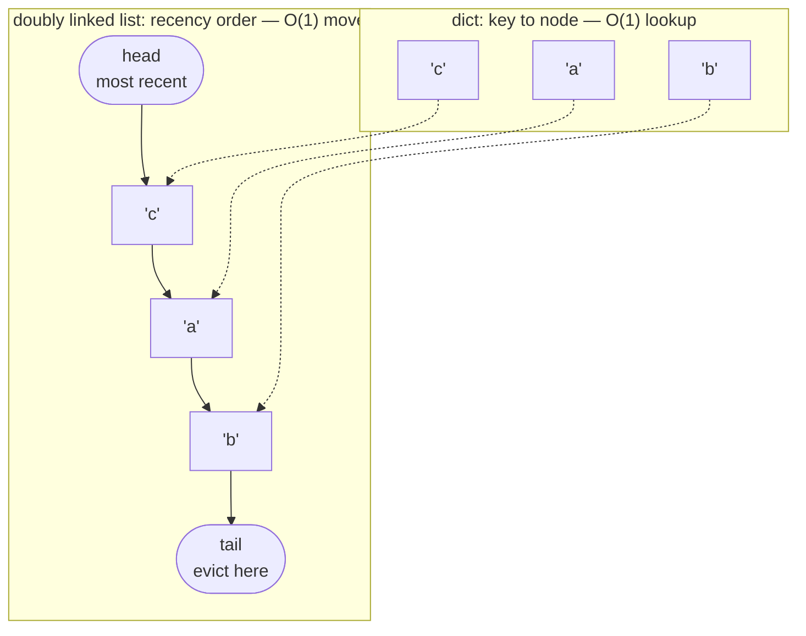

# LRU Cache with TTL — implementation

Two caches, in one file, because the interesting thing is not how LRU eviction works — it is **the
one workload that annihilates it**. Both are O(1). Both do TTL. They differ by one rule about when an
entry becomes protected, and that rule is the difference between a 100% hit rate and a 0% one after a
batch job runs.

```bash
pytest test_lru_cache.py -q     # 39 tests
python bench.py                 # real measurements, run them yourself
```

## What this demonstrates

An LRU cache is two data structures that point at each other, and that pairing
is the only reason every operation is O(1):



The dict finds the node without scanning. The list reorders without shifting.
Either one alone forces a linear operation somewhere: a dict cannot tell you
what was least recently used, and a list cannot find a key without walking it.

**Eviction is always the tail**, which is what makes the scan vulnerability
below so damaging — one pass over cold keys pushes the entire working set toward
it.

| | Hit rate after a scan | Structure | Cost per get |
|---|---|---|---|
| `LRUCache` | **0.0%** — the hot set is gone | dict + one doubly-linked list | 0.433 µs |
| `SegmentedLRUCache` | **100.0%** — the hot set is untouched | dict + two lists | 0.693 µs |
| `OrderedDictLRU` (in `bench.py`) | 0.0% — same flaw, C speed | `OrderedDict.move_to_end` | 0.123 µs |

### The scan vulnerability

This is the failure mode that matters, and it is asserted rather than described. Ten hot keys sit
comfortably in a cache of a hundred at a 100% hit rate. Then one batch job walks a thousand cold keys
— each touched exactly once, none ever wanted again:

```python
def test_a_single_scan_destroys_the_entire_hot_set():
    c = _warm(LRUCache(capacity=100))
    for k in COLD:                                        # the scan: one touch each
        c.put(k, k, now=0.0)
    assert all(c.peek(k, now=0.0) is None for k in HOT)   # every one, gone
    ...
    assert c.hit_rate == 0.0
```

LRU believes every one of those cold keys is "recently used", so it evicts all ten hot keys to store
data nobody will ever ask for a second time. The full read load lands on the database the cache
existed to protect — and the cache is now worse than useless, because you are still paying for it and
it has added a round trip to every miss.

This is not a corner case. It is a nightly analytics query, a backup, a crawler, a cache warmer, or a
colleague running `SELECT *`.

The next test is the identical scan against `SegmentedLRUCache`:

```python
def test_the_segmented_cache_survives_the_identical_scan():
    c = _warm(SegmentedLRUCache(capacity=100))
    for k in COLD:
        c.put(k, k, now=0.0)
    assert all(c.peek(k, now=0.0) is not None for k in HOT)   # every one, intact
    ...
    assert c.hit_rate == 1.0
```

One rule does that: **an entry is promoted to the protected segment only on its second read.** A
second read is the only evidence that caching something was ever worth anything, and a scan by
definition never provides one. The cold keys churn through probation against each other; the
protected segment is not touched.

### TTL, checked lazily

Nothing sweeps. There is no background thread, and the test says so in four lines:

```python
def test_ttl_is_checked_lazily_on_read_not_by_a_background_sweeper():
    c = LRUCache(capacity=10, ttl=5.0)
    c.put("k", 1, now=0.0)
    assert len(c) == 1                       # still resident, a thousand seconds past expiry
    assert c.get("k", now=1_000.0) is None   # the read is what kills it
    assert len(c) == 0                       # reclaimed only now
```

That memory overhang is the whole cost of the design, and it buys something worth having: a thread
per cache does not survive a few thousand caches, and a global sweeper has to walk everything. Note
also that `put` inspects exactly *one* node when evicting. Hunting down the list for an already-dead
entry to free instead of a live one is the obvious optimisation and it turns an O(1) put into an O(n)
put precisely when the cache is full — which is precisely when it is under load.

### O(1), proved rather than timed

```python
def test_get_and_put_cost_the_same_at_1k_and_100k_entries(cache_cls):
    small = _mapping_ops_for_a_get_and_an_overflowing_put(cache_cls, 1_000)
    large = _mapping_ops_for_a_get_and_an_overflowing_put(cache_cls, 100_000)
    assert small == large
    assert small < 10          # constant, and a small constant
```

A counting dict is swapped in for the cache's `_map`, and the operation count comes out *byte for
byte identical* at both sizes. Timing the cache at two sizes and comparing would be the obvious
approach; it measures the machine, the GC, and whatever else is running, then flakes in CI. Counting
operations measures the algorithm.

### Hit rate

`hit_rate` is a first-class counter because it is the only number that says whether the cache earned
its keep. A cache at 20% is not "helping a bit" — it is adding a lookup, a network hop, and a
consistency problem to 80% of your reads in exchange for skipping a fifth of them. Expiries count as
misses, because from the caller's side a dead entry and an absent one are identical: both cost a trip
to the origin, and predicting origin load is the only thing anyone uses a hit rate for.

## Measured

Run on the machine below by `bench.py`. **These are real; nothing here is estimated.** The hit-rate
collapse is a property of the algorithm and reproduces anywhere; the throughput belongs to this
hardware.

```
machine : Intel64 Family 6 Model 183 Stepping 1, GenuineIntel
python  : 3.14.6 (Windows 11)
ops     : 200,000 per throughput measurement

THROUGHPUT (single-threaded, uncontended lock, best of 3)
  -- get, all hits --
  LRUCache.get                       0.433 us/op      2,311,439 ops/s
  SegmentedLRUCache.get              0.693 us/op      1,442,124 ops/s
  OrderedDictLRU.get                 0.123 us/op      8,125,523 ops/s
  -- put, mostly evicting --
  LRUCache.put                       0.803 us/op      1,245,686 ops/s
  SegmentedLRUCache.put              0.830 us/op      1,205,104 ops/s
  OrderedDictLRU.put                 0.311 us/op      3,214,447 ops/s

O(1), MEASURED  (per-op cost as the cache grows 200x, best of 3)
     entries    get us/op    put us/op
       1,000        0.359        0.685
      10,000        0.365        0.701
      50,000        0.462        0.818
     200,000        0.429        0.899

WHAT ONE SCAN COSTS  (capacity 1,000; hot set 200; scan 50,000 keys)
  cache                    hit rate before      after   verdict
  LRUCache                         100.0%       0.0%   wiped
  SegmentedLRUCache                100.0%     100.0%   survived

MEMORY  (measured with tracemalloc, 100,000 small entries)
  LRUCache                  19.7 MB     197 bytes/entry
  SegmentedLRUCache         19.7 MB     197 bytes/entry
  OrderedDictLRU            17.0 MB     170 bytes/entry
```

**The scan table is the one to look at, and it is not close.** Same cache size, same scan, 0%
against 100%. Plain LRU sends all 5,000 of the next reads to the origin; the segmented cache sends
none. That is the difference between a quiet night and a database at 100% CPU, and neither
throughput nor memory has anything to say about it.

**The throughput table contains an uncomfortable result and it is the useful one.** The hand-rolled
doubly-linked list is **3.5× slower** than an eight-line `OrderedDict` wrapper, and uses 16% more
memory per entry. Same complexity, worse constants — because `move_to_end` is C and four Python-level
pointer writes are not. The linked list in `lru_cache.py` exists to make the mechanism visible; if
you are shipping an LRU cache in Python, ship the `OrderedDict`. The scan-resistance rule ports to it
unchanged, and it is the rule that matters.

The O(1) table drifts by about 20% across a 200-fold growth in the cache. That is cache locality and
dict resizing, not the algorithm — and it is what "constant time" looks like when measured honestly
rather than asserted from a complexity table.

### Three things this benchmark got wrong first

Worth recording, because each produced a plausible number that was simply false — and the
corrections are in the comments in `bench.py`:

1. **An f-string in the timed loop.** `c.get(f"k{i}")` measures a string allocation as well as a
   cache lookup, and on a warm heap those cost about the same. Roughly half the reported "cache
   throughput" was string formatting. Every key is now built before the stopwatch starts.
2. **Reusing one key list across rounds.** Round 2 re-put keys round 1 had just inserted, which
   takes the *update* path rather than insert-and-evict. Since best-of-N keeps the fastest round,
   the table claimed a 200,000-entry cache put **faster** than a 1,000-entry one. An impossible
   result is a gift; it is the only kind you are guaranteed to notice.
3. **Not restoring the hot set between rounds.** The previous round's puts had evicted it, so the
   get measurement was timing misses — which are cheaper, because a miss never promotes.

There is a fourth that could not be fixed, only avoided: with 0.3 GB of RAM free, a 1,000,000-entry
cache (~200 MB) measured page faults rather than the algorithm, swinging between 0.41 and 3.29 µs/op
for identical code. The table stops at 200,000 for that reason. The *exact* constant-time claim rests
on the operation-counting test instead, which cannot be perturbed by anything at all.

## What this deliberately does NOT implement

Everything that makes caching hard in production:

- **Distribution.** This is single-process. Ten app servers each with a local cache have ten
  independent copies of the truth, ten separate hit rates, and no way to invalidate each other. A
  shared cache means a network hop on every get and a
  [consistent hash ring](../consistent-hashing/) to find it.
- **Invalidation.** There is a TTL and nothing else. There is no way to say "this key is now wrong",
  which is the request every cache eventually receives. Write-through, write-behind, and explicit
  purge are all absent, and choosing between them is where most of the design effort actually goes.
- **Stampede protection.** When a hot key expires, every concurrent reader misses at once and they
  all hit the origin together — a [thundering herd](../../GLOSSARY.md#thundering-herd) caused by the
  cache. Production needs single-flight (one reader fetches, the rest wait) or probabilistic early
  expiry. Neither is here.
- **Eviction of the structure itself.** `capacity` counts *entries*, not bytes. One entry holding a
  50 MB blob counts the same as one holding an integer, so a cache configured for 100k entries can
  consume unbounded memory. Real caches weigh entries and evict against a byte budget.
- **Clock skew and monotonicity.** Expiry uses `time.monotonic`, which is per-process. Two nodes
  computing TTLs for a shared cache will disagree about when an entry dies, and a wall-clock jump
  during an NTP correction either resurrects dead entries or kills live ones.
- **Frequency, not just recency.** Segmented LRU resists scans; it still evicts a key read a
  thousand times last hour in favour of one read twice a minute ago. TinyLFU and its relatives keep a
  compact frequency sketch and admit on *estimated frequency*, which beats both caches here on
  realistic workloads.
- **Concurrency beyond one lock.** Every operation takes a single global lock. That is correct and it
  serialises every reader. Production caches shard the lock, or go lock-free on the read path.
- **Prompt reclamation.** A doubly-linked list is a reference cycle, so dropping the last reference
  to a cache does not free it — reference counting cannot, and the memory waits for the cyclic
  collector. Irrelevant for one long-lived cache; not irrelevant for a process that creates and
  discards them. `OrderedDict` has no such problem.
- **Negative caching.** A miss is not remembered, so a key that does not exist is fetched from the
  origin on every single request — which is a cheap denial-of-service vector.

## Choosing

```
Workload is skewed, nothing scans it          -> LRUCache           (simplest thing that works)
Anything ever scans the keyspace              -> SegmentedLRUCache  <- the usual answer
Shipping Python, want the above               -> OrderedDict + the second-read rule
Frequency matters more than recency           -> TinyLFU / W-TinyLFU (not implemented here)
No skew at all                                -> no cache; you are adding a hop for nothing
```

`SegmentedLRUCache` is the sane default for anything shared, because you do not get to decide whether
something scans your keyspace. A batch job you did not write, a monitoring probe, or a migration will
eventually walk every key, and plain LRU has no defence at all. The cost is one boolean per entry and
one extra pointer move per promotion.

And before either: check the hit rate on a *uniform* workload.
`test_hit_rate_collapses_on_a_uniform_workload` asserts 0.0% for a thousand distinct keys through a
cache of eight. Caches only work on skew. No skew, no cache.

## Related

- [Caching fundamentals](../../04-caching/fundamentals/) — the concept page: what a cache buys, what
  it sells, and why skew is the precondition for all of it
- [Consistent hashing](../consistent-hashing/) — how a distributed cache decides which node holds a
  key, and why rehashing wipes every cache at once
- [Circuit breaker](../circuit-breaker/) — what stands between a 0% hit rate and the database that
  suddenly has to serve every read
- [Trade-off framework](../../TRADEOFF-FRAMEWORK.md) — the axes this choice sits on
- [Glossary: cache](../../GLOSSARY.md#cache), [cache invalidation](../../GLOSSARY.md#cache-invalidation),
  [thundering herd](../../GLOSSARY.md#thundering-herd), [hot key](../../GLOSSARY.md#hot-key)
