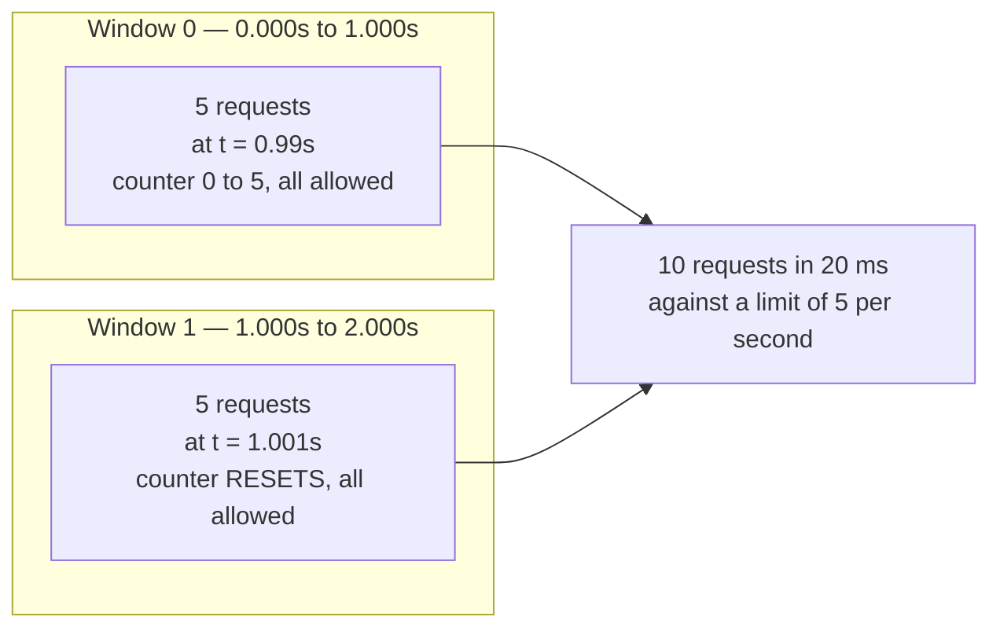

# Rate Limiter — implementation

Three limiters, in one file, because the interesting thing is not how any one of them works — it is
**where they disagree**. All three enforce the same average rate. They differ completely at the
boundary between two windows, and that difference is the entire basis for choosing.

```bash
pytest test_rate_limiter.py -q     # 16 tests
python bench.py                    # real measurements, run them yourself
```

## What this demonstrates

The fixed window's flaw is a picture of two adjacent windows:



Both windows are individually correct. The counter reset at the boundary is what
lets twice the limit through, and no amount of tuning the limit fixes it —
the burst simply scales with it. The two tests immediately after
`test_fixed_window_allows_double_the_limit_across_a_boundary` show the other two
limiters refusing exactly this traffic.

| Limiter | Burst behaviour | Memory per key |
|---|---|---|
| `TokenBucket` | Allows a burst up to `capacity`, then settles to `rate` | O(1) — two floats |
| `SlidingWindowLog` | Exact; no burst possible | **O(limit)** — one timestamp per hit |
| `FixedWindowCounter` | **Allows 2× the limit across a boundary** | O(1) — one int |

The fixed window's flaw is *asserted*, not described:

```python
def test_fixed_window_allows_double_the_limit_across_a_boundary():
    f = FixedWindowCounter(limit=5, window_s=1.0)
    late  = sum(f.allow(now=0.99)  for _ in range(5))   # end of window 0
    early = sum(f.allow(now=1.001) for _ in range(5))   # start of window 1
    assert late + early == 10   # 2x the configured limit, ~20ms apart
```

Ten requests succeed against a limit of five per second. The two tests immediately after it show the
other two limiters refusing exactly that traffic.

## Measured

Run on the machine below by `bench.py`. **These are real; nothing here is estimated.** Absolute
throughput is a property of the hardware — only the ratios are worth carrying away, and you should
re-run it rather than trusting this table.

```
machine : Intel64 Family 6 Model 183 Stepping 1
python  : 3.14.6 (Windows 11)
ops     : 200,000 per limiter

  TokenBucket            0.365 µs/op    2,741,841 ops/s    1.67x
  SlidingWindowLog       0.255 µs/op    3,924,185 ops/s    1.17x
  FixedWindowCounter     0.219 µs/op    4,576,230 ops/s    1.00x
```

**The surprising result is the useful one.** The sliding window log — the "expensive" algorithm —
is *faster per operation* than the token bucket here. Appending to a `deque` and evicting nothing
beats float arithmetic plus a `min()` on every call.

So CPU is not why nobody ships the sliding window log. **Memory is:**

```
1M tracked keys, limit 1000
  TokenBucket / FixedWindow    ~16 MB
  SlidingWindowLog             ~8 GB
```

That is the whole decision, and it is invisible in a throughput benchmark. It is a good reminder to
ask *which* resource a benchmark is measuring before drawing a conclusion from it.

## What this deliberately does NOT implement

Everything that makes rate limiting hard in production:

- **Distributed state.** These are single-process. Ten app servers each with a local bucket enforce
  10× the intended limit. Real systems keep counters in a shared store and pay a network round trip,
  or accept per-node approximation.
- **Atomic check-and-decrement across nodes.** The shared-store version needs the read, the compare
  and the write to be one operation — a Lua script in Redis, or `INCR` with expiry. Two round trips
  is a race.
- **Clock skew.** A distributed limiter depends on nodes agreeing what time it is. They do not.
- **Per-key eviction.** These grow forever. Production needs an LRU or a TTL on idle keys, or one
  client with a million distinct API keys becomes a memory exhaustion attack.
- **Cost-aware limiting.** `TokenBucket` accepts a `cost` argument, but real APIs price endpoints
  differently and that pricing is where most of the design effort goes.
- **What to return.** `retry_after()` exists because a limiter that says "no" without saying "when"
  guarantees an immediate retry. Production also needs `429` and `X-RateLimit-*` headers.

## Choosing

```
Need exactness, small key count          -> SlidingWindowLog
Need burst tolerance, huge key count     -> TokenBucket        <- the usual answer
Need cheapest possible, burst acceptable -> FixedWindowCounter
Need distributed                         -> shared store + atomic script; none of these as-is
```

`TokenBucket` is the default for user-facing APIs because burst tolerance is a *feature*: a client
that has been quiet for a minute should not be punished for its own politeness when it finally sends
five requests.

## Related

- [Rate limiting](../../08-reliability/rate-limiting/) — the concept page
- [Backpressure](../../08-reliability/backpressure/) — what to do when limiting is not enough
- [Trade-off framework](../../TRADEOFF-FRAMEWORK.md) — the axes this choice sits on
- [Glossary: rate limiting](../../GLOSSARY.md#rate-limiting)
