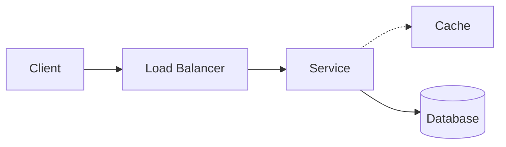

# Diagram Notation

Every diagram in this repository obeys the contract below. The point of a contract is that you stop
decoding the drawing and start reading the architecture — a dashed arrow means the same thing on
page 3 and page 300.

> **The rule that matters:** a diagram earns its place only if it shows something the prose cannot.
> A picture of three boxes labelled "Client, Server, Database" next to a sentence saying the client
> calls the server which calls the database is decoration. Delete it.

---

## 1. Node kinds

| Kind | Shape | Used for |
|---|---|---|
| `client` | rounded rectangle | Browser, mobile app, another service calling in |
| `edge` | trapezoid | CDN, edge cache — anything geographically distributed |
| `lb` | hexagon | Load balancer, reverse proxy, API gateway |
| `service` | rectangle | Stateless application server, worker |
| `cache` | rectangle, dashed border | Anything whose loss costs latency but not data |
| `store` | cylinder | Database, object store — anything whose loss costs **data** |
| `queue` | open-ended rectangle | Message queue, stream, topic |
| `external` | rectangle, grey | Third-party you do not operate and cannot fix |

The dashed-vs-solid distinction between `cache` and `store` is the single most useful convention
here. **Dashed means safe to lose.** If you can't decide whether a component is dashed, you have not
finished designing it.

## 2. Edge kinds

| Kind | Line | Meaning |
|---|---|---|
| `sync` | solid arrow `──▶` | Caller blocks until the callee answers. Latency adds up along this path. |
| `async` | dashed arrow `--▶` | Caller does not wait. Latency does **not** add to the user's request. |
| `replication` | double line `══▶` | Data copying, usually background, usually lagging |
| `failure` | red arrow | The path taken when something is down — drawn only in failure diagrams |

The sync/async split is what makes a diagram answer "how slow is this?". Sum the solid arrows on the
request path; ignore the dashed ones.

## 3. Direction

Left to right for request flow. Top to bottom for hierarchy or fan-out. Never both in one diagram.

## 4. Labels

- Nodes get a **role**, not a product: `Cache`, not `Redis`. Technology belongs in the prose, because
  the architecture does not change when you swap Memcached for Redis. See
  [§23 technology-agnostic first](../SYSTEM-DESIGN-THINKING.md).
- Edges get a **protocol or payload** when it matters (`HTTPS`, `gRPC`, `bulk 500 rows`) and nothing
  when it doesn't.
- Numbers on a diagram must be real or clearly hypothetical. Never invent a latency to make a point.

## 5. Which diagram answers which question

Choosing the wrong diagram type is the most common way a correct drawing fails to teach anything.

| Your question | Diagram | Why this one |
|---|---|---|
| What talks to what? | **Component** | Shows structure, hides time |
| What happens, in what order? | **Sequence** | Shows time, hides structure |
| What are the states and transitions? | **State** | The only one that shows *illegal* transitions |
| Where does the data physically live? | **Deployment** | Regions, zones, machines |
| How does data move and transform? | **Data flow** | Follows the payload, not the call |
| How do I choose? | **Decision tree** | Encodes judgment, not structure |

A sequence diagram cannot show you a single point of failure. A component diagram cannot show you a
race condition. Pick for the question.

## 6. Two rendering paths, one source

Diagrams here come from two places, and they are not interchangeable:

**Mermaid, inline in markdown** — for static structure. Hand-written, renders natively on GitHub,
easy to edit in a pull request.

````markdown

````

**Generated animated SVG** — for anything with *motion or evolution*: a request travelling a path, an
architecture morphing V1→V8, a failure cascading. These are never hand-drawn. They are rendered from
a scene file by [`scripts/render_diagrams.py`](../scripts/render_diagrams.py):

```
19-diagrams/scenes/<id>.json
        │
        ├──▶ scripts/render_diagrams.py  ──▶  19-diagrams/generated/<id>-v<N>.svg
        │         committed, embedded in concept READMEs, animates on GitHub
        │
        └──▶ visualizer/src/scenes/      ──▶  the interactive lab
```

The same JSON drives both, so the picture in the README and the picture in the app can never
disagree. `render_diagrams.py --check` fails CI when a committed SVG is stale.

Scene format: [`scenes/SCHEMA.md`](scenes/SCHEMA.md).

## 7. Colour

Colour carries meaning or it is not used:

| Colour | Meaning |
|---|---|
| neutral | normal operation |
| amber | degraded — working, but slower or with reduced guarantees |
| red | failed |
| green | the component under discussion on this page |

Never colour-code by component type — the shape already does that, and roughly 1 in 12 men cannot
reliably separate your red from your green. Every diagram must still read correctly in greyscale.

## 8. Related

- [Concept dependency graph](concept-dependency-graph.mmd) — what you must understand before what
- [Scene schema](scenes/SCHEMA.md)
- [System design thinking](../SYSTEM-DESIGN-THINKING.md)
