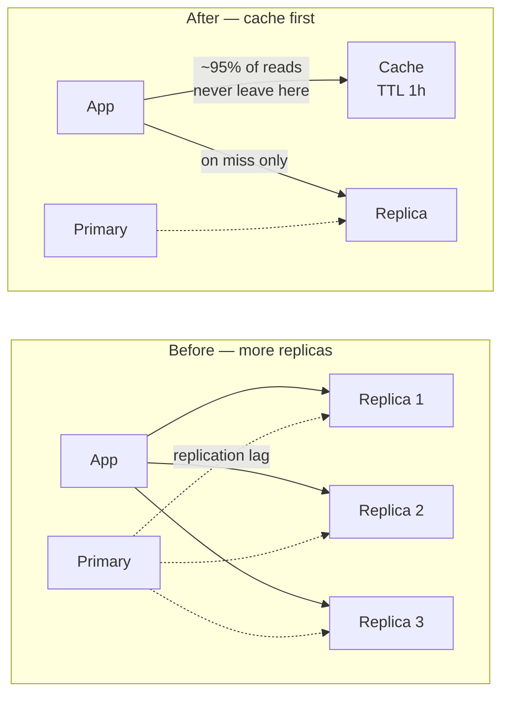

# ADR-0001: Add a cache before adding more read replicas

- **Status** — Accepted
- **Date** — 2025-02
- **Deciders** — Backend lead · SRE on call for the redirect tier · Product owner, who owns the staleness window

## Context

The [URL shortener](../15-real-world-problems/url-shortener/) is serving **200 million redirects a
day** — roughly 2,300 requests per second on average, and about 7,000 at peak using the ×3 convention
from the [estimation guide](../ESTIMATION-GUIDE.md). Read:write is **~100:1**; creation runs at
around 40 writes per second and has never been a constraint.

What already exists: a load balancer in front of the app tier (V2) and **two read replicas added at
V3**, when reads swamped the primary at 50M/day. Those replicas did what they were bought for. Load
on the primary is fine.

The number that forces this decision came out of a week of query logs: **92% of reads are for the top
0.1% of codes.** Access is not merely skewed, it is about as skewed as a real workload gets. Against
that, p99 on `GET /{code}` has reached **800 ms** against a stated target of 100 ms.

One property of this system matters more here than anything about caching: **a `code → long_url`
mapping is immutable.** The design has no link editing. A row, once written, never changes.

## Problem

The replicas fixed *load*. They did not fix *latency*, and the two problems have been conflated in
every discussion so far because the same component appeared to be the answer to both.

A read from a replica still executes a query, still crosses the network, still costs tens of
milliseconds. Adding a third and fourth replica divides the load further and leaves p99 exactly where
it is. We need an order-of-magnitude reduction in per-read latency on a path whose access
distribution is close to the textbook ideal for a cache — and before we take it, we need to say out
loud what it costs, because the cost is not the one people expect.

## Decision

Each replica is a full copy of the dataset carrying full write traffic, and it
still costs a network round trip on every read. The cache absorbs the same
traffic at a fraction of the memory and returns in single-digit milliseconds —
**but only because this workload is skewed.** Uniformly random reads over a
large keyspace would have made the replicas the right answer.

Put a **shared distributed cache** in front of the `urls` table:

- **Strategy** — cache-aside, populated on miss by the application.
- **Key** — the short code. **Value** — the long URL and the expiry timestamp.
- **TTL** — 24 hours. Mappings are immutable, so a long TTL costs nothing in correctness.
- **Placement** — one shared tier, not per-instance memory. A local cache's hit rate falls as the
  fleet grows, which is precisely when it is needed most.
- **Takedowns purge explicitly.** A blocklisted or legally removed URL is deleted from the cache in
  the same operation that removes it from the database. It does not wait for the TTL.
- **On cache-down we fail open** — reads fall through to the replicas — and we accept that this means
  a cache outage is a database incident. See the failure table.

The existing read replicas stay. **The cache is the answer to latency; the replicas remain the answer
to load, and they now also serve the miss path.** They are not two settings of one dial, and treating
them as alternatives is the mistake this record exists to prevent.

## Alternatives considered

| Option | Why not | When it would win |
|---|---|---|
| **More read replicas** | A replica read is still a query. Three more replicas divide load by 2.5 and change p99 by nothing. Each also adds replication lag and another node to run | Access is **uniform** — then a cache hits almost never and spreading query load is the only lever. Also when reads must be consistent, which a cache cannot give |
| **Local in-process cache** | Hit rate degrades with fleet size: 40 app servers means up to 40 independent misses per key per TTL, and 40 copies that no takedown can reach | A tiny fleet with tiny read-only reference data and sub-microsecond read requirements |
| **CDN or edge cache** | The right answer to *distance*, not to *query cost*. Traffic is single-region today, and a 302 with a short cache lifetime is awkward to push to the edge | V5, when the median user turned out to be 120 ms away before any work began. We did take it then — for the other problem |
| **Fix the query or add an index** | Already done. The lookup is a primary-key read returning one row. There is nothing left to index | The query is slow because it is *wrong*. Caching a wrong query hides it for years |
| **301 instead of 302** | Browsers would cache the redirect and most repeat clicks would never reach us at all — a bigger traffic reduction than any cache. But **click analytics is the product**, and 301 destroys it | Analytics is not the product, and link targets never change |
| **Materialised view** | The expensive part is a lookup, not a computation. There is nothing to precompute | The origin cost is CPU rather than I/O |
| **Do nothing — accept 800 ms** | A redirect is invisible work. 800 ms of invisible work is the most conspicuous latency a user can experience, and the availability target implies the latency target | If the p99 target were 1 s. It is 100 ms, so this row loses — but it is on the table, and it is the cheapest option by a wide margin |

## Trade-offs

| Get | Pay |
|---|---|
| p99 **800 ms → 55 ms** | Staleness bounded by TTL — near-free here, because mappings are immutable |
| ~95% of reads never touch a database | **The database can no longer serve peak traffic unaided.** This is permanent until capacity is re-provisioned |
| Read replicas freed to absorb the miss path and creation-path reads | A new component to deploy, monitor, secure, upgrade and understand at 3am |
| Cheap relative to scaling the database tier | A new failure mode with a 20× step change in it |
| Absorbs read spikes — a single televised link becomes the ideal case rather than the worst | Thundering herd at the TTL boundary on exactly the keys that matter most |
| Takedown propagation stays under our control, because we purge rather than wait | Every write path that removes or expires a code must remember to purge. The one that forgets is found in production |

## Consequences

**p99 drops to 55 ms and the latency target is met.** That is the headline and it is the least
interesting consequence.

**The database is now structurally dependent on the cache.** At a 95% hit rate the origin sees one
twentieth of the read traffic, which is also the multiplier it will face the instant the cache
disappears. The cache stopped being an optimisation the moment the database could no longer serve the
traffic without it, and it is still labelled "safe to lose" on the architecture diagram. We have
decided to fail open, which is a decision to accept that risk rather than a way of avoiding it.

**Invalidation is almost a non-problem, and that is a property of this system rather than of
caching.** Because mappings are immutable, the classic "a code path forgot to invalidate" bug has
almost nowhere to live. Two exceptions remain and both are deliberate: **expiry**, which the value
carries so the reader can enforce it without a database round trip, and **abuse takedowns**, which
purge explicitly. A takedown that took 24 hours to propagate would be a legal problem, not a
performance one.

**Hit rate becomes a first-class SLI**, and a gradual decline in it is now our earliest warning that
the access distribution — the single assumption this whole decision rests on — is changing.

**This makes the later decisions cheaper and one of them more dangerous.** The cache is what makes the
televised-link scenario survivable after [ADR-0003](0003-shard-by-user-id.md) introduces sharding,
because hashing spreads keys evenly and not load. Which means the cache is load-bearing for the shard
design too, and a cache outage after sharding is worse than a cache outage before it.

## Failure modes this introduces

| Failure | What it looks like | Mitigation, or "accepted" |
|---|---|---|
| **Cache tier down** | Every read falls through at once. The database sees a **20× step change** in one instant and most databases do not survive that | Fail open was chosen deliberately. Mitigated by request coalescing and headroom on the replicas, **not eliminated** — accepted, and the runbook says so |
| **Thundering herd** | A hot code crosses its TTL and thousands of concurrent readers miss simultaneously with a byte-identical query | Single-flight request coalescing, plus probabilistic early expiry. Load spikes at the TTL interval are invisible in request-rate graphs, so alert on origin QPS |
| **Cold start on scale-out** | New app instances warm the shared tier rather than their own, so this is much milder than it would be with local caches — but a cache-tier replacement is cold | Staggered rollout; warm the top 10,000 codes on start |
| **Takedown served from cache** | A blocklisted URL keeps redirecting after it was removed from the database | Explicit purge on delete, and an integration test that asserts it. This is the one invalidation bug that matters here |
| **Hot key on one cache node** | One code, one hash slot, one node taking the whole televised campaign | Accepted at current scale. Mitigation if it fires: replicate hot keys, or a small local tier in front of the shared one |
| **Stale expiry** | A link expires but the cached value says otherwise | The cached value carries `expires_at` and the reader enforces it. Never rely on TTL alignment for correctness |

## Revisit when

| Trigger | Measured how | Threshold |
|---|---|---|
| **The skew assumption breaks** | Cache hit rate, weekly average | Below **85%** for one week. Re-measure the access distribution. If it has flattened, replicas and indexes become the correct answer again and this record should be superseded |
| **The ratio changes** | Reads per write, monthly | Below **10:1**. At that point invalidation churn approaches read volume and the cache stops paying |
| **Mappings stop being immutable** | Any approved product change that allows editing a link target | Any. The "invalidation is almost a non-problem" clause above is the load-bearing assumption of this record, and link editing deletes it |
| **Takedown latency becomes regulated** | A legal or regulatory requirement stating a removal deadline | Sub-minute removal required. Explicit purge already covers this, but the requirement must be tested rather than assumed |
| **The database is re-provisioned to survive full read traffic** | Load test with the cache disabled | Passes at peak. The fail-open decision and its 20× clause stop being true, and the runbook is wrong until it is rewritten |
| **Cache cost approaches replica cost** | Monthly spend on the cache tier versus an equivalent replica set | Cache costs more. The latency argument still wins, but it should be re-argued rather than assumed |

**What does not reopen this:** a new caching product, a preference for read-through over cache-aside,
or an incident caused by the cache. The last one is the important non-trigger — the 20× step change
is a *known and accepted* consequence recorded above, so an outage caused by it is evidence that the
record was right, not that it was wrong. What would reopen it is discovering that the step change is
larger than 20×, which is a measurement, not an opinion.

---

## Related

- [Cache](../04-caching/fundamentals/) — hit rate, placement, thundering herd, and the fail-open decision
- [Replication](../05-databases/replication/) — what replicas actually buy, and read-your-writes
- [URL shortener](../15-real-world-problems/url-shortener/) — V3 and V4 of the worked design
- [Redis vs Memcached](../comparisons/redis-vs-memcached.md) — the product choice this record deliberately does not make
- [Anti-pattern: cache everything](../anti-patterns/cache-everything/) — this decision, made without the measurement
- [ADR-0003](0003-shard-by-user-id.md) — which depends on this cache more than it looks
- [ADR index](README.md) · [Glossary](../GLOSSARY.md)
