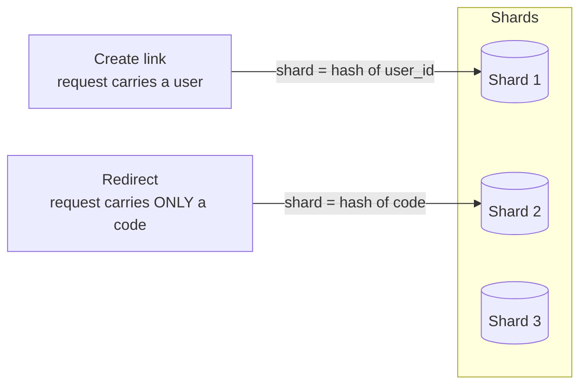

# ADR-0003: Shard by user ID — on the creation path only

- **Status** — Accepted
- **Date** — 2025-09
- **Deciders** — Backend lead · Data owner · Trust and safety lead, who owns abuse response · SRE on call

## Context

Two constraints arrived in the same quarter at **1 billion redirects a day**.

**Storage.** Sixty months of retention at 100M new URLs a month, roughly 1 KB per row, is about 6 TB
of data and **~18 TB with 3× replication**. That is past what one primary holds comfortably.

**Writes.** Creation has finally become a real workload rather than a rounding error. At V1 to V5 it
was 40 writes per second and the correct engineering answer was to ignore it. It is now the second
constraint on the primary rather than the tenth.

And a third thing, which is the one that makes this decision interesting rather than routine. The
security requirements the design already commits to — **rate limiting on creation**, so we do not
become a spam link farm, and **abuse review** for open redirects, so we do not become a phishing tool
— are both *per-creator* questions:

- how many links has this account or API key created in the last hour?
- show me everything this account has ever created, so it can be removed in one action

Neither can be answered by a store keyed only on the short code, and neither is optional.

The cache from [ADR-0001](0001-cache-before-replicas.md) is in place and absorbing ~95% of reads.
[ADR-0002](0002-queue-for-click-analytics.md) shipped one increment earlier, deliberately: it is
nearly reversible and this is not.

## Problem

We must choose a shard key, and **a shard key is the least reversible decision in the system**. Once
data is distributed by it, changing it is a full migration of every row with a dual-write period.

The trap is that the system does not have one access pattern. It has three, and they disagree:

| Path | Query | Rate |
|---|---|---|
| **Redirect** | `SELECT long_url WHERE code = ?` | ~35,000/s at peak, 95% absorbed by the cache |
| **Create** | `INSERT`, preceded by a quota check for the creator | ~350/s at peak |
| **Abuse review** | every link created by one account, last N days | tens per day, but must not scan every shard |

A single shard key cannot serve all three well. Sharding everything by `user_id` makes the redirect —
the most frequent query in the system — a scatter-gather across every shard, because
`GET /{code}` carries no user identity at all. Sharding everything by `code` makes every quota check
and every abuse review fan out to every shard, and that cost grows with each shard we add, which is
exactly backwards.

## Decision

Two paths, two different keys, and that asymmetry is the whole decision. The
creation path knows who is creating, so sharding it by user keeps everything one
account owns together. **The redirect path knows nothing but the code** — it
cannot compute a user shard, so hashing the code is the only key that sends it
to exactly one place instead of fanning out to all N.

Picking one key for both would have broken whichever path did not carry it.

Two stores, two shard keys, chosen from the read path in each case.

- **`urls` — the redirect table — is sharded by `hash(code)`.** It stays a single-key lookup: one
  key, one shard, one row, no fan-out. Nothing about the redirect path changes shape.
- **The creator-side store is sharded by `user_id`** — the API-key identifier for anonymous creators,
  which is what the rate limiter already keys on. It holds accounts, quota counters, the creation
  index, and the abuse review queue.
- **`urls` carries `created_by` as an attribute, not as an index.** It exists for provenance when you
  already have the row. It is never queried across shards. The authoritative "links by creator"
  index lives in the creator store and is written at creation time.
- **Creation writes to both stores.** This is a distributed write and is handled with an **outbox**
  in the creator-side transaction plus an idempotent apply, not with two-phase commit.
- **Consistent hashing**, not `hash(code) % N`, so adding a shard moves roughly `1/N` of the keys
  rather than nearly all of them. See the [implementation](../18-implementations/consistent-hashing/).

The asymmetry is the decision. The tempting simplification — one shard key for the whole system —
is what this record exists to reject, and the reason is a single sentence: **the shard key is
dictated by the read path, and when you have two read paths with nothing in common, you have two
stores.**

## Alternatives considered

| Option | Why not | When it would win |
|---|---|---|
| **Shard everything by `user_id`** | The redirect request carries no user identity, so every redirect becomes a scatter-gather across N shards. The hottest query in the system becomes the most expensive one, and it gets worse with every shard added | The dominant read is user-scoped — a dashboard product where redirects are a minority of traffic. That is a different product from this one |
| **Shard everything by `code`** | Quota checks and abuse review fan out to every shard. Trust and safety response time degrades as we scale, which is precisely when abuse volume grows | A purely anonymous shortener with no accounts, no quotas and no per-creator takedown obligation. That was V1 to V5 |
| **Shard by creation date or ID range** | Every write goes to the newest shard, so it is permanently hot — and it is also the shard being read most, since new links get the most clicks. Two hotspots in one key | Genuine time-series data where whole old shards get dropped. Links are not that: a five-year-old poster is still scanned |
| **Do not shard — one larger primary** | Vertical scaling ends, and it ends abruptly. At 18 TB and rising we are inside the last doubling | **Below roughly 5 TB and a few thousand writes per second** — which is where this system lived until now, and why sharding is step six rather than step one. Genuinely the right answer for most systems that copy this design |
| **Vertical split only — move analytics to its own database** | Helps, and we did it in [ADR-0002](0002-queue-for-click-analytics.md). It does nothing about 18 TB of link mappings | The problem is workload interference rather than size. Always try this first, because it is far cheaper |
| **`hash(code) % N`** | Adding shard N+1 rehashes nearly every key. The first resharding would be a full data movement with no way to do it incrementally | Never at this size. It is the default in tutorials and the reason resharding has a bad reputation |
| **A managed elastic store that shards itself** | We would be exchanging a shard key we control for one we do not, and the redirect latency budget leaves no room for surprises. Also a data-residency question we have not answered | Strongly worth revisiting — see the triggers below. If the operational burden of self-managed shards exceeds the value of controlling placement, this row wins |
| **Do nothing** | Storage runs out on a known date, and running out of disk is not a graceful failure | If growth had flattened. It has not, and the date is calculable, which is what turned this from a discussion into a decision |

## Trade-offs

| Get | Pay |
|---|---|
| Write capacity and storage that grow by adding nodes | The `urls` shard key is now effectively **permanent** |
| The redirect path keeps its shape: one key, one shard, one row | Two stores to operate, back up, migrate and reason about |
| Per-creator quota and abuse queries stay single-shard as we scale | **Creation is now a two-store write**, which needs an outbox and reconciliation. A create is no longer one transaction |
| Trust and safety response time is independent of shard count | No join between links and creators. Cross-store reporting becomes an offline job |
| Blast radius of a node failure is one shard, not everything | A shard loss is a **partial** outage — most codes work, some 404 — which is much harder to detect than a total one |
| Consistent hashing keeps resharding incremental | Resharding is still a project with a dual-write window, not an operation |

## Consequences

**The redirect path is unchanged in shape, and that was the goal.** Every design decision in this
record was subordinated to keeping `GET /{code}` a single-key lookup, because at 35,000 requests per
second nothing else can be allowed to get more expensive.

**Creation is now the complicated operation, and it is the right place to put the complexity** — 350
writes per second can afford an outbox and a reconciliation job; 35,000 reads per second cannot
afford anything. Read the two rates next to each other and the whole design follows from them.

**Custom aliases are now harder than they were, and this is why the design defers them.** A
user-chosen alias needs global uniqueness across shards, which a hash-sharded table cannot provide
without a separate allocator or a reserved-alias shard. That is not a tweak to this record; it is a
new one.

**The cache became load-bearing for the shard design.** Hashing spreads *keys* evenly, not *load*, so
a single televised link still sends all of its traffic to one shard. The cache from
[ADR-0001](0001-cache-before-replicas.md) is what makes that survivable. The uncomfortable
consequence is compositional: **a cache outage is now worse than it was before sharding**, because
the 20× step change no longer lands on one primary that was sized for it but on one shard sized for
a fair share of the traffic.

**Someone must now own shard balance as an ongoing job**, not as an incident response. Shards drift.

## Failure modes this introduces

| Failure | What it looks like | Mitigation, or "accepted" |
|---|---|---|
| **Hot shard** | One televised code sends 80% of traffic to one shard while the others idle. Hashing spread the keys, not the load | The cache absorbs it — as long as the cache is up. Accepted, with the explicit note that this couples two decisions that look independent on the diagram |
| **Split creation** | The `urls` row exists and the creator-side index row does not. The link works and abuse review cannot find it | Outbox in the creator-side transaction, idempotent apply, and a daily reconciliation job that reports orphans. Alert if orphans are non-zero |
| **Partial outage on shard loss** | 1/N of codes return 404 while everything else looks healthy. Dashboards stay green | **Per-shard** 4xx rate and availability, not just fleet-wide. This is the failure most likely to be discovered by a customer first |
| **Resharding** | An operational project with a dual-write window, a verification phase and a rollback plan | Consistent hashing keeps it incremental. Rehearse it once before it is needed — an untested reshard is not a capability |
| **Cross-shard uniqueness** | Two shards independently allocate the same custom alias | Not possible today because custom aliases are not offered. This is the constraint that keeps them deferred |
| **Skewed shard growth** | One shard fills faster because a large creator concentrates on it | Monitor per-shard size and p99 separately. Rebalance at 70%, not at 95% |
| **Reporting queries** | An analyst runs a cross-shard query and takes a production shard down | Reporting goes to the offline copy. Enforce it with credentials, not with documentation |

## Revisit when

| Trigger | Measured how | Threshold |
|---|---|---|
| **A shard approaches capacity** | Per-shard disk used, and per-shard p99 against the fleet median | **70%** of node capacity, or a p99 more than **2×** the fleet median. Rebalance before it is urgent — the point of the threshold is that it fires while there is still time to do it calmly |
| **Custom aliases are approved** | A product decision | Any. Global uniqueness across shards needs an allocator service or a reserved-alias shard. **New ADR, not an amendment** |
| **Per-creator reads become dominant** | Share of read volume that is user-scoped rather than code-scoped | Above **20%**. The ratio that justified `code` as the redirect key has moved, and the two-store split may need rebalancing toward the creator side |
| **Trust and safety needs cross-creator queries** | A requirement like "every link pointing at domain X" | Any. That is a **third** access pattern and the answer is a search index, not a third shard key. Adding shard keys to solve query problems is how you get four copies of the truth |
| **The elastic managed store becomes viable** | A compliance review clearing it for our data residency requirements, plus a latency benchmark at p99 | Cleared and within budget. This record could then be superseded by one that reads "let the database do it" — the best outcome available and worth actively checking for |
| **Growth flattens** | New URLs per month, twelve-month trend | Flat or declining for a year, and total data below one node. Consolidating back to fewer shards is legitimate, and nobody ever proposes it |

**What does not reopen this:** a desire for consistency between the two stores' shard keys. The
asymmetry is deliberate and is the entire content of this decision — a future engineer finding it
untidy and proposing to unify it should be shown the second table in the Problem section, where the
35,000-per-second row and the 350-per-second row are next to each other.

---

## Related

- [Sharding](../05-databases/sharding/) — shard keys, hot shards, and why resharding is a project
- [Consistent hashing](../18-implementations/consistent-hashing/) — the working implementation, with benchmarks
- [Data modelling](../05-databases/data-modelling/) — designing from the read path, which is what this record does
- [URL shortener](../15-real-world-problems/url-shortener/) — V6 of the worked design
- [ADR-0001](0001-cache-before-replicas.md) — the cache this decision quietly depends on
- [SQL vs NoSQL](../comparisons/sql-vs-nosql.md) — the store-type question that sits underneath the shard-key question
- [ADR index](README.md) · [Glossary](../GLOSSARY.md)
