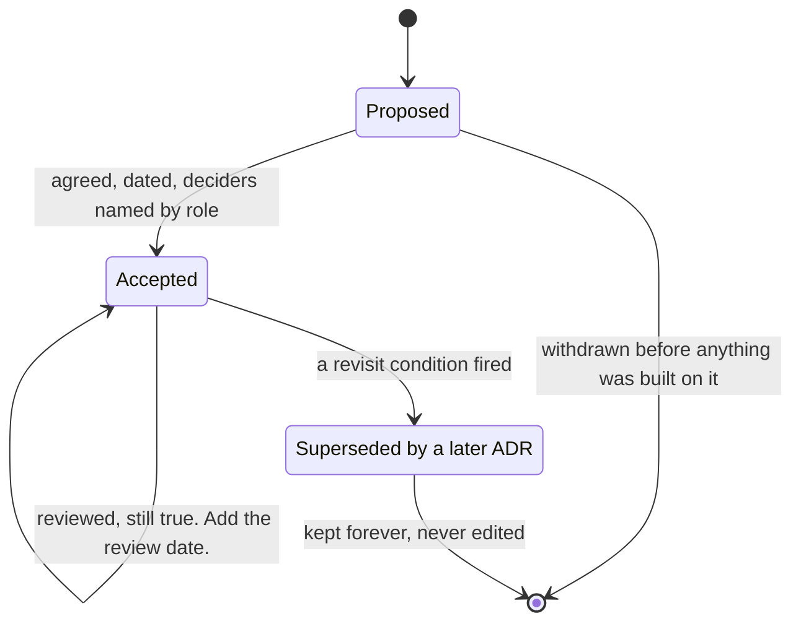

# Architecture Decision Records

`[INTERMEDIATE]` · A dated, immutable note recording one decision, the alternatives genuinely considered, and — the part everything else exists to support — **the condition that would reverse it**.

---

## Why this section exists

A design document tells you what a system *is*. It cannot tell you why it is not something else, and
that is the question every new engineer asks in their first month and every architecture review asks
in its first ten minutes.

An ADR answers it in one page. It is not a design document, not a runbook, and not a specification.
It is a record that on a particular date, a group of people with particular constraints chose one
option over named alternatives, and it says what would have to change for that choice to become
wrong.

> **The most valuable line in any ADR is the revisit condition.** Without it you have written down a
> preference. With it you have written down a *decision*, because a decision is only a decision if
> you can say what would unmake it.

This is the same discipline as [§5 of the trade-off framework](../TRADEOFF-FRAMEWORK.md#5-why-not--the-discipline):
for any choice, be able to say *under what condition would each alternative become correct?* An ADR
is that question, answered once, in writing, with a date on it.

---

## The four worked records

All four are decisions the [URL shortener design](../15-real-world-problems/url-shortener/) actually
implies. Read them alongside its V1 → V8 evolution — each ADR is one of those version steps, written
up as the people who made it would have written it at the time.

| ADR | Decision | Status | Revisit when — in one line |
|---|---|---|---|
| [0001](0001-cache-before-replicas.md) | Add a cache before adding more read replicas | Accepted | Hit rate falls below 85%, or mappings stop being immutable |
| [0002](0002-queue-for-click-analytics.md) | Move click counting off the redirect path onto a log | Accepted | Counters become billing-grade, or consumer lag breaks the 60 s SLO |
| [0003](0003-shard-by-user-id.md) | Shard the creator-side store by user ID, the redirect table by code | Accepted | Custom aliases ship, or per-creator reads become dominant |
| [0004](0004-no-microservices-yet.md) | **Do not** split into services | Accepted | Two teams measurably block each other on releases |

**ADR-0004 is the one to read first.** It is the record of a decision *not* to do something, which is
the kind that never gets written down and the kind that gets re-argued every six months precisely
because it was not. Its "Revisit when" section is the entire value of the document — it converts a
recurring argument into a metric with a threshold and an owner.

The [template](adr-template.md) is the starting point for a new one.

---

## Status, and the rule that makes the archive worth keeping

| Status | Meaning |
|---|---|
| **Proposed** | Written, circulated, not yet agreed. May be withdrawn. |
| **Accepted** | In force. This is what the system does and why. |
| **Superseded by ADR-000M** | No longer in force. **The text is left exactly as it was.** |

The self-loop on **Accepted** is the state a healthy record spends its life in, and it is the one
most teams never enter — a decision that is never reviewed is indistinguishable from a decision that
was never made. The arrow that must never exist is Accepted back to Proposed: **an accepted record is
never edited and never deleted.** If the decision changes, write a new record that supersedes it. The
old text is the evidence of what was known at the time, and rewriting it destroys the only thing an
archive is for — being able to tell the difference between *we were wrong* and *the world changed*.

---

## When to write one, and when not to

Write an ADR when a decision is **expensive to reverse**, **contested**, or **surprising to a
newcomer**. Those three cover almost everything worth recording:

| Write one | Do not write one |
|---|---|
| A shard key, a consistency model, a service boundary | Anything a linter or a style guide already settles |
| Choosing *not* to adopt something, when it will be proposed again | A decision nobody would question and nobody can undo cheaply either way |
| A decision that trades a visible cost for an invisible one | A library upgrade |
| Anything where the reasoning will be invisible in the code | Something the code makes obvious |

The failure mode at both ends is real. Too few records and the reasoning evaporates with the people;
too many and nobody reads any of them, which is the same outcome by a longer route. **A repository of
five ADRs that are all read beats fifty that are not.**

Spend the deliberation budget in proportion to reversibility, exactly as in
[§6 of the trade-off framework](../TRADEOFF-FRAMEWORK.md#6-two-rules): argue for a week about the
shard key, an hour about the cache. The cache decision still gets an ADR — it is just a shorter one.

## Conventions used here

- **Numbers are monotonic and never reused.** `0001` stays `0001` even after it is superseded.
- **Deciders are roles, not names.** People leave; the role that owned the trade-off does not. It also
  removes the temptation to read a record as a performance review.
- **Dates are `YYYY-MM`.** The month is what matters — it tells a reader what was true at the time.
- **Alternatives must include "do nothing".** If your options table has no row for doing nothing, you
  have not finished thinking.
- **The trade-off table has a Pay column and it is filled in first.** Any record whose Pay column is
  thin is a record that has not been challenged yet.

## Related

- [Trade-off framework](../TRADEOFF-FRAMEWORK.md) — the "why not?" discipline these records formalise
- [System design thinking](../SYSTEM-DESIGN-THINKING.md) — the method the decisions come out of
- [Design checklist](../DESIGN-CHECKLIST.md) — the short form for a 45-minute discussion
- [URL shortener](../15-real-world-problems/url-shortener/) — the worked design all four records describe
- [Anti-patterns](../anti-patterns/) — what these decisions look like when made by default
- [Comparisons](../comparisons/) — the deciding question behind each recurring choice
- [Glossary](../GLOSSARY.md)
