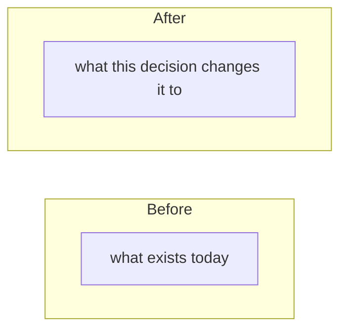

# ADR-000N: Short imperative title, naming the decision and not the topic

- **Status** — Accepted | Superseded by ADR-000M | Proposed
- **Date** — YYYY-MM
- **Deciders** — roles, not names

> Copy this file to `000N-kebab-case-title.md`, delete every instruction in italics, and add a row to
> the table in [the index](README.md). Keep it to one page. If it will not fit on one page, the
> decision has not been made yet.

## Context

*What is true right now, in numbers. Scale, team size, budget, deadlines, what already exists, what
is already broken. No opinions here — a reader six months from now must be able to tell whether the
world has changed, and they can only do that if you wrote down what the world was.*

*Two or three sentences of situation, then the numbers that force the decision.*

## Problem

*One paragraph. What specifically must be decided, and why now. "Why now" matters: a decision taken
early is a decision taken with less information, so if this could have waited, say why it could not.*

*State the constraint that makes this hard. If nothing makes it hard, you probably do not need an ADR.*

## Decision

*Replace the diagram above. An ADR without a before and after makes the reader
reconstruct the change from prose, and the whole point of the record is that
somebody in eighteen months can see it at a glance.*

*The chosen option, in the active voice and the present tense: "We shard the creator store by user
ID." Not "it was decided that" and not "we will consider". Include the parameters someone would need
to implement it — the TTL, the key, the threshold — because a decision without its numbers is a
direction.*

*If part of the decision is explicitly deferred, say so here rather than leaving it implied.*

## Alternatives considered

*Every option that was genuinely on the table, including the ones that lost quickly. The third column
is the one that makes this section worth writing: an alternative you cannot describe a winning
condition for was never really considered.*

| Option | Why not | When it would win |
|---|---|---|
| | | |
| | | |
| **Do nothing** | | |

***"Do nothing" is a mandatory row.*** *If it has no winning condition, say why in the middle column.*

## Trade-offs

*Fill the Pay column first. A thin Pay column means the option has not been challenged, not that it
is cheap.*

| Get | Pay |
|---|---|
| | |
| | |

## Consequences

*What is now true that was not true before — including the things nobody would call a benefit. New
components to run, new invariants someone must maintain, new work that is now forced later. Name the
consequences that make other decisions harder, because those are the ones a future reader needs.*

## Failure modes this introduces

*Every choice adds failure modes. List the ones this one adds, not the ones it inherits.*

| Failure | What it looks like | Mitigation, or "accepted" |
|---|---|---|
| | | |

*"Accepted" is a legitimate entry and an honest one. A risk you have decided to carry is different
from a risk you did not notice.*

## Revisit when

***The most important section. Everything above is history; this is the part that stays useful.***

*Conditions, not dates. A condition is measurable, has a threshold, and has someone who would notice
it firing. "Review in six months" is not a condition — it is a calendar entry nobody keeps.*

| Trigger | Measured how | Threshold |
|---|---|---|
| | | |

*Then, for a decision that will be re-argued, name the things that **do not** reopen it — the
arguments that will actually be made and that this record has already answered. That list saves more
time than the triggers do.*

---

## Related

- [ADR index](README.md) · [Trade-off framework](../TRADEOFF-FRAMEWORK.md) · [Glossary](../GLOSSARY.md)
