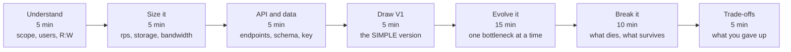

# Design Checklist

The short form of [SYSTEM-DESIGN-THINKING.md](SYSTEM-DESIGN-THINKING.md) — for use while actually
designing, or in an interview where you have 45 minutes and no time to read an essay.

Print it, or keep it open in a second tab.

---

## Before you draw anything · 5 min

The whole checklist, on one clock. The failure mode it exists to prevent is
spending thirty minutes drawing boxes and never reaching failure or trade-offs
— the two sections an interviewer is actually scoring.

**Steps F and G are the ones that get cut when you run out of time, and they
are the ones that separate candidates.** Budget them first.

- [ ] Restate the problem in one sentence and get agreement
- [ ] Who are the users, how many, and where?
- [ ] **Three** functional requirements. Explicitly defer the rest out loud.
- [ ] Non-functional: latency target, availability target, consistency need, durability need
- [ ] Constraints: budget, team size, existing stack, deadline
- [ ] Ask: *"What should I optimise for?"* — the answer changes the whole design

> If you are drawing boxes in the first five minutes, you are designing for a problem you have not
> defined yet.

## Size it · 5 min

- [ ] DAU × actions/day = daily volume
- [ ] ÷ 100,000 = average rps
- [ ] × 2–3 (or 5–10 if scheduled) = **peak** rps
- [ ] **Read:write ratio** ← the most decision-forcing number you will compute
- [ ] Storage = write rate × record size × retention × replication
- [ ] Say out loud what each number *rules out*

## APIs and data · 5 min

- [ ] 3–4 endpoints with arguments
- [ ] Core entities and their relationships
- [ ] **The access patterns** — design for the query, not the entity
- [ ] Which field would you shard on, if you ever had to?

## Draw the simple version · 5 min

- [ ] Client → server → database. Nothing else.
- [ ] State plainly: *"this is correct up to roughly N rps"*
- [ ] Identify what saturates first: CPU, connections, disk, bandwidth, one hot row

> Resist adding a cache here. You cannot justify it before you have shown the bottleneck, and
> showing it is what makes the rest of your design persuasive rather than recited.

## Scale it, one bottleneck at a time · 15 min

For **each** change: name the bottleneck → make one change → name what it cost.

- [ ] Reads slow → cache (only if access is skewed — check)
- [ ] Cache added → how is it invalidated? what is the TTL?
- [ ] One server saturated → load balancer (and is the LB itself redundant?)
- [ ] Slow work on the request path → queue + workers
- [ ] Queue added → ordering? duplicates? what if it backs up?
- [ ] Writes exceed one node → shard (on which key? what makes it hot?)
- [ ] Users far away → edge / CDN / multi-region

## Failure · 5 min

- [ ] Each component: what happens when it dies?
- [ ] Cache dies — does the database survive the sudden load?
- [ ] A dependency gets **slow** rather than down — do you time out?
- [ ] Worker crashes mid-job — lost, duplicated, or resumed?
- [ ] Retries present → is the operation idempotent?
- [ ] Retries present → is there backoff and a circuit breaker?
- [ ] What is the blast radius of the worst single failure?

## Finish · 5 min

- [ ] Where is consistency strong, where eventual, and why is that safe **here**?
- [ ] Authn / authz / secrets / transport
- [ ] How would you *know* this broke? Which metric, which alert?
- [ ] State the top three trade-offs unprompted
- [ ] What changes at 10×? At 1/10×?
- [ ] Which alternative did you reject, and what would make it win?

---

## Red flags in your own design

| Symptom | What it usually means |
|---|---|
| A component you cannot justify with a bottleneck | Premature architecture |
| No number anywhere | You are guessing, and it will show |
| "It's eventually consistent" with no bound | You have not thought about the window |
| Retries with no idempotency | Duplicate writes in production |
| No timeouts | One slow dependency will take everything down |
| A single load balancer in an HA design | You re-created the single point of failure |
| Every call synchronous | You are one slow service away from a total outage |
| Microservices with a shared database | Distributed monolith — worst of both |
| No answer to "how would you know it broke?" | Undebuggable at 3am |

---

## The four questions that expose depth

If you can answer these, you understand the design. If you can only recite the architecture, you
cannot.

1. **What did each component cost you?** (every one bought a new problem)
2. **What breaks first as traffic grows 10×?**
3. **Where would you accept data loss, and where never?**
4. **What is the simplest thing you could have built instead, and why isn't it enough?**

---

## Related

- [System design thinking](SYSTEM-DESIGN-THINKING.md) — the long form
- [Trade-off framework](TRADEOFF-FRAMEWORK.md) — decision trees
- [Estimation guide](ESTIMATION-GUIDE.md) — the arithmetic
- [Interview guide](20-system-design-interview/) — 46 questions with follow-up chains, and the 5/15/30/45-minute approaches
