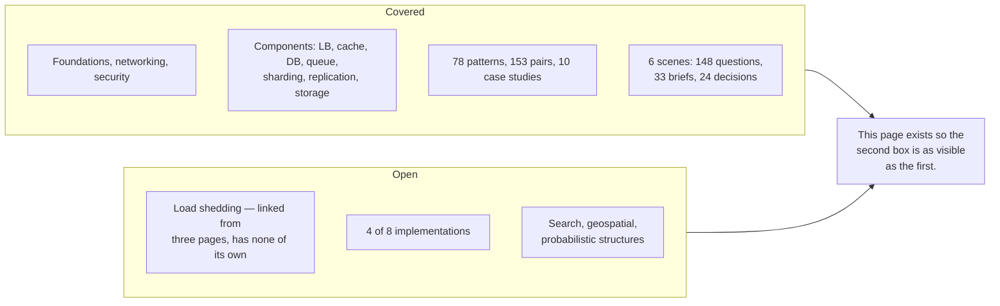

# Coverage Gaps

What this repository does **not** cover, and what the original plan left out entirely.
[ROADMAP.md](ROADMAP.md) tracks what is *planned and unbuilt*. This page tracks what was *never
planned* — the more dangerous category, because an unplanned gap looks exactly like coverage.

Status values: ✅ covered · ◐ partial · ❌ absent

---

## Scorecard — the standard system design syllabus

The list most interview guides and job descriptions use, scored honestly against this repository.

| Topic | Status | Where it is, or why not |
|---|---|---|
| **Databases — SQL and NoSQL** | ✅ | [database](05-databases/fundamentals/) — the type table and the choose-by-access-pattern rule |
| **Caching — strategies, eviction** | ✅ | [cache](04-caching/fundamentals/) |
| **Redis vs Memcached** | ✅ | [comparison](comparisons/redis-vs-memcached.md) — structures and persistence, or just a fast map |
| **CDN** | ❌ | Referenced in 13 files, has no page |
| **APIs — REST, gRPC, GraphQL, versioning** | ✅ | [07-api-design](07-api-design/) — plus pagination and idempotency |
| **Functional / non-functional requirements** | ◐ | Steps 3–4 of [the method](SYSTEM-DESIGN-THINKING.md); the NFRs each have a page; no page on eliciting or writing requirements |
| **DNS** | ✅ | [dns](01-networking/dns/) — TTL is your real failover time |
| **TCP / UDP** | ✅ | [tcp-udp](01-networking/tcp-udp/) — handshake cost, HOL blocking, why QUIC |
| **HTTP / HTTP2 / HTTP3** | ✅ | [http](01-networking/http/) — HTTP/2 fixed HTTP, not TCP |
| **WebSockets** | ✅ | [websockets](01-networking/websockets/) — polling/SSE/WS compared |
| **TLS / SSL** | ✅ | [tls](01-networking/tls/) — expiry is a total, predictable outage |
| **OAuth** | ✅ | [oauth](12-security/oauth/) — and why it is *authorization*, not authentication |
| **JWT** | ✅ | [jwt](12-security/jwt/) — revocation is the whole problem |
| **API security** | ✅ | [api-security](12-security/api-security/) — IDOR/BOLA leads it |
| **Rate limiting** | ✅ | [Implementation](18-implementations/rate-limiter/) with measured benchmarks |
| **DDoS protection** | ✅ | [ddos](12-security/ddos/) — L3/L4 vs L7, and what rate limiting cannot do |
| **Message queues** | ✅ | [queue](06-messaging/queues/) |
| **Kafka vs RabbitMQ** | ✅ | [comparison](comparisons/kafka-vs-rabbitmq.md) — will you ever want the data twice |
| **Microservices vs monolith** | ✅ | [monolith-vs-microservices](02-architecture/monolith-vs-microservices/) |
| **Fault tolerance / fallback** | ◐ | [reliability](00-foundations/reliability/); circuit breaker and bulkhead have no pages |
| **Redundancy** | ✅ | [availability](00-foundations/availability/) |
| **Load balancer types and algorithms** | ✅ | [load balancer](03-load-balancing/fundamentals/) — L4/L7 and six algorithms |
| **Observability — Prometheus, Grafana, ELK** | ✅ | [observability](11-observability/) — three pillars, cardinality trap, the stack by role |
| **Alerting — PagerDuty, on-call** | ✅ | [observability](11-observability/#12-alerting) — symptom-based, burn-rate, actionable-only |

**Was roughly a third covered. Now most of it is** — the ❌ rows that remain are real and listed below.

## Scorecard — HLD deliverable

What a high-level design document is expected to contain.

| Element | Status | Where it is, or why not |
|---|---|---|
| **System architecture overview** | ◐ | The [scene format](19-diagrams/scenes/SCHEMA.md) expresses one; no guide to writing one |
| **Data flow and component interaction** | ✅ | [Combination matrix](14-component-combinations/MATRIX.md), [notation contract](19-diagrams/README.md), animated scenes |
| **Technology stack and infrastructure** | ◐ | The [comparisons](comparisons/) now do this job — Redis vs Memcached, Kafka vs RabbitMQ, SQL vs NoSQL — plus the HLD template's technology-choices section. Still deliberately role-first |
| **Module responsibilities** | ◐ | Covered by the HLD template's component-responsibilities section and [monolith vs microservices](02-architecture/monolith-vs-microservices/); no standalone page |
| **Performance and trade-offs** | ✅ | [Trade-off framework](TRADEOFF-FRAMEWORK.md) plus a trade-off table on every page |
| **Scalability / security / cost as NFRs** | ◐ | Scalability yes; security no; cost is an axis with no section |
| **Architecture + component diagrams** | ✅ | [Notation contract](19-diagrams/README.md) and generated SVGs |
| **Deployment diagrams** | ◐ | Named as a diagram type; no example |
| **Data flow diagrams** | ✅ | Notation contract |
| **ER / schema diagrams** | ✅ | [data-modelling](05-databases/data-modelling/) — including a Mermaid erDiagram |
| **An HLD / LLD document template** | ✅ | [_templates/hld.md](_templates/hld.md) and [lld.md](_templates/lld.md) |

---

## Tier 1 — Missing from the plan, and load-bearing

Every item that was here has been built. The last of them,
~~SLI / SLO / error budgets~~, is now in
[observability](11-observability/#11-sli-slo-error-budget).

This section used to be a table, and it emptied itself one struck-through row at
a time until only the header was left — which renders on GitHub as a heading
promising a list, followed by nothing. **What is still open now lives in one
place:** [what is genuinely still missing](#what-is-genuinely-still-missing),
below. Two lists of open gaps is how one of them goes stale.

## Tier 2 — Missing from the plan, narrower

Search as a component · geospatial indexing (the plan has Uber as a problem and no way to answer it)
· probabilistic structures (Bloom, HyperLogLog, count-min) · storage engine internals (B-tree vs LSM —
now partly covered in [database](05-databases/fundamentals/)) · serialisation and schema evolution ·
load shedding · tail-latency techniques (hedged requests) · cell-based architecture · fan-out on write
vs read · compliance and data residency · chaos engineering · feature flags

## Tier 3 — Planned, not yet built

On [ROADMAP.md](ROADMAP.md). **Components:** done — CDN and API gateway both have
pages. **Patterns:** done — all 78 are in the [catalogue](13-design-patterns/CATALOGUE.md)
with a diagram and a case study each. **Combinations:** 11 of the `CORE` pairs
have their own page; the rest are classified in the
[matrix](14-component-combinations/MATRIX.md) only. **Problems:** 4 of 8 written.
**Implementations:** 4 of 8. **Judgment:** done — [ADRs](ADRs/),
[anti-patterns](anti-patterns/), [comparisons](comparisons/), interview guide.

---

## What is genuinely covered

**122 markdown pages · 382 diagrams · 482 hidden-answer blocks — every page carries at least one.**

- [Foundations](00-foundations/) — 7 concepts · [Networking](01-networking/) — 5 ·
  [Security](12-security/) — 5 · [API design](07-api-design/) — 4
- Components: [load balancer](03-load-balancing/fundamentals/) ·
  [cache](04-caching/fundamentals/) · [database](05-databases/fundamentals/) ·
  [queue](06-messaging/queues/) · [worker](06-messaging/workers/) ·
  [sharding](05-databases/sharding/) · [replication](05-databases/replication/) ·
  [schema migration](05-databases/schema-migration/) · [data modelling](05-databases/data-modelling/)
- [Scalability](09-scalability/) — batch vs stream, multi-tenancy, cost ·
  [Observability](11-observability/) · [Architecture](02-architecture/) ·
  [Storage](10-storage/) — CDN, object storage, and choosing between the four kinds
- [Pattern catalogue](13-design-patterns/CATALOGUE.md) — 78 patterns, **all with full entries,
  a diagram and a case study**
- [Combination matrix](14-component-combinations/MATRIX.md) — all 153 pairs, 11 with their own page
- [Case studies](17-case-studies/) — 10 systems, each with a primary source
- [Interview bank](20-system-design-interview/) — 46 questions, 98 follow-up chains
- [ADRs](ADRs/) · [Anti-patterns](anti-patterns/) — 7 · [Comparisons](comparisons/) — 6
- [Templates](_templates/) — concept, HLD, LLD
- The method: [thinking](SYSTEM-DESIGN-THINKING.md) · [trade-offs](TRADEOFF-FRAMEWORK.md) ·
  [estimation](ESTIMATION-GUIDE.md) · [checklist](DESIGN-CHECKLIST.md) · [diagnostic](DIAGNOSTIC.md)
- [Design exercises](16-design-exercises/) — 24 parameter decisions, each labelled by how
  expensive it is to reverse
- 4 implementations with measured benchmarks, 103 tests
- 6 scenes driving **148 verified prediction questions, 33 design briefs and 24 parameter
  decisions** — every answer key derived from the scene file, so none of them can drift from
  the diagrams

## What is genuinely still missing

Ranked by how much a reader would notice.

| Gap | Why it matters |
|---|---|
| **Load shedding** | Referenced from three [reliability](08-reliability/) pages as the pattern that covers "everyone is inside their limit and the system still saturates", and it has no page. In the catalogue only. **This is now the largest single hole.** |
| **2 scenes have no written problem** | [URL shortener](15-real-world-problems/url-shortener/), [chat](15-real-world-problems/chat-system/), [notifications](15-real-world-problems/notification-system/) and [payments](15-real-world-problems/payment-system/) are written. Social feed and ticket booking are animated, quizzed and gradeable in the app, but have no V1→V8 prose page. |
| **4 of 8 implementations** | Message queue, worker pool, load balancer algorithms, distributed lock. |
| **Parameters beyond the six scenes** | [16-design-exercises/](16-design-exercises/) covers 24 decisions across six systems. Isolation levels, consistency modes and capacity headroom are each decided somewhere in this repository and asked nowhere. |
| **Search · geospatial · probabilistic structures** | Named in Tier 2 below; each is a real omission for anyone designing Uber or a search feature. |

## How this page stays honest

1. When an item is built it moves to **What is genuinely covered** and the roadmap is ticked in the
   same commit.
2. New gaps are added when **noticed**, not when planned. A gap nobody has written down is
   indistinguishable from coverage.
