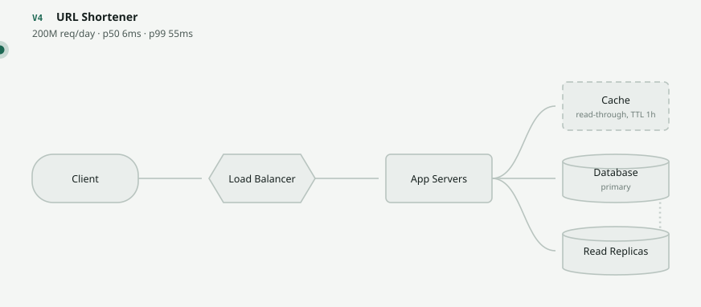
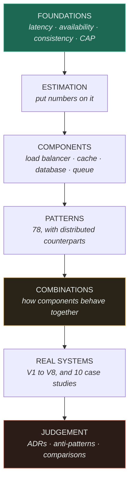

<div align="center">

# System Design Lab

**A system design learning laboratory** — 122 pages, 382 diagrams, 482 hidden-answer exercises,
4 measured implementations, and an interactive lab where you commit to an answer before you see one.

[Take the diagnostic](DIAGNOSTIC.md) · [Open the lab](https://SAGARCHRY0777.github.io/system-design-lab/) · [Patterns](13-design-patterns/CATALOGUE.md) · [Combinations](14-component-combinations/MATRIX.md) · [Case studies](17-case-studies/) · [Interview](20-system-design-interview/) · [Gaps](GAPS.md)

</div>

---

## What this is

Not notes. A **method** for reasoning about systems you have never seen, built around one idea:

> **Architecture is not designed. It is forced.** Every component in a mature system was added
> because something specific broke — and every one of them broke something else in turn.

So every topic answers the same four questions, and that block is the spine of the repository:

```
Without it   →  what problem appears?
With it      →  what problem disappears?
New problem  →  what complexity did we just buy?
Next         →  which component does that force?
```

Learn the chain and you can *derive* most architectures instead of memorising them.

**And it asks you things.** 482 questions here have their answers folded away, and the lab makes you
commit before it reveals. Reading an answer you did not attempt teaches nothing.

## The lab

<div align="center">
  
</div>

**[SAGARCHRY0777.github.io/system-design-lab](https://SAGARCHRY0777.github.io/system-design-lab/)** — seven tabs:

| Tab | What it does |
|---|---|
| **Architectures** | Scrub a system V1→V8 and see *why* each change happened. Animate a request in simulated time — it dwells inside each component for what that component costs, so a database visit visibly takes 30× a cache lookup. Switch a component off and the request **stops there**. |
| **Predict** | 148 questions derived from the scenes. The reveal is locked until you commit, then it corrects you using the scene's own text — and offers **Watch it happen**. |
| **Design studio** | 33 briefs and [24 parameter decisions](16-design-exercises/). You are handed the system, the traffic and the symptom, and you **produce** the architecture — then set its shard key, TTL and timeouts. Over-building is marked as harshly as under-building, and every decision is labelled by how expensive it is to undo. |
| **Patterns** | 78 patterns, searchable, each with a diagram. Every Gang of Four entry shows what it becomes **across a network**, and why that is harder. |
| **Case studies** | 10 real systems with primary sources. The field given most weight is *when this does **not** apply to you*. |
| **Bench** | A live queueing simulator. Drag the arrival rate and watch response time go vertical **at 85%, not 100%** — Poisson arrivals and exponential service, with the closed-form Erlang C prediction drawn on top. Also shows why splitting one queue into four costs you 2× the latency for identical capacity. |
| **Interview** | 46 questions, 98 follow-ups revealed **one at a time** — because anyone can recite a first answer. |

**Press <kbd>⌘K</kbd>** (or <kbd>/</kbd>) for a command palette over every system, version, request
flow, failure mode and parameter decision — 177 of them. Typing `thundering` finds the cache
failure that causes it; `oversell` lands on the version where it was found.

**Every view is a URL.**
[`#/architecture/url-shortener/8/v8-failover`](https://SAGARCHRY0777.github.io/system-design-lab/#/architecture/url-shortener/8/v8-failover)
opens the URL shortener mid-regional-failure with that request selected, so a specific thing is
something you can send someone.

Six themes, responsive, and the bench honours `prefers-reduced-motion` by running to a steady state
instead of animating. Every architecture is authored **once** as a
[scene file](19-diagrams/scenes/SCHEMA.md) that drives both the app and the diagrams committed here,
so the two cannot disagree.

## Where to start

**Not sure where you are?** [The diagnostic](DIAGNOSTIC.md) — 17 questions, easy to expert, routing
you by *what you get wrong*. A missed question is worth more than the score.

**New to this** — in order, it is a deliberate sequence:

1. [System Design Thinking](SYSTEM-DESIGN-THINKING.md) — the chain, and the 18-step method
2. [Estimation Guide](ESTIMATION-GUIDE.md) — putting numbers on a problem in your head
3. [Trade-off Framework](TRADEOFF-FRAMEWORK.md) — how to *choose*, with decision trees
4. [Foundations](00-foundations/) — latency, availability, consistency, CAP
5. [The URL shortener](15-real-world-problems/url-shortener/), V1→V8 — the whole method on one problem

**Already comfortable** — the [combination matrix](14-component-combinations/MATRIX.md), the
[case studies](17-case-studies/), and the [parameter decisions](16-design-exercises/), which ask
what you would *set* things to rather than which component to reach for.
**Interviewing** — [the checklist](DESIGN-CHECKLIST.md) and
[the question bank](20-system-design-interview/).

## Learning path



The amber box is the one to linger on. Knowing what a cache is and what a queue is does not tell you
what happens when a queue backs up *behind* a cache-miss storm — and that interaction is what real
systems are made of.

## Map

| Where | What |
|---|---|
| [00-foundations/](00-foundations/) | Latency, throughput, scalability, availability, reliability, consistency, CAP |
| [01-networking/](01-networking/) | DNS, TCP/UDP, HTTP/1-2-3, WebSockets, TLS |
| [02-architecture/](02-architecture/) | Monolith vs microservices — when to split, and when not to |
| [03-load-balancing/](03-load-balancing/fundamentals/) · [04-caching/](04-caching/fundamentals/) | ★ Flagship components |
| [05-databases/](05-databases/fundamentals/) | Database, [sharding](05-databases/sharding/), [replication](05-databases/replication/), [schema migration](05-databases/schema-migration/), [data modelling](05-databases/data-modelling/) |
| [06-messaging/](06-messaging/queues/) | Queues, workers, delivery semantics |
| [07-api-design/](07-api-design/) | REST/gRPC/GraphQL, versioning, pagination, idempotency |
| [08-reliability/](08-reliability/) | Timeouts, retries, circuit breaker, rate limiting, backpressure |
| [09-scalability/](09-scalability/) | Batch vs stream, multi-tenancy, cost as an architectural constraint |
| [10-storage/](10-storage/) | CDN, object storage, and choosing between block/file/object/database |
| [11-observability/](11-observability/) | Three pillars, cardinality trap, SLI/SLO/error budgets, alerting |
| [12-security/](12-security/) | Authn/authz, OAuth, JWT, API security, DDoS |
| [13-design-patterns/](13-design-patterns/) | **78 patterns** in the [catalogue](13-design-patterns/CATALOGUE.md), every one with a diagram and a case study |
| [14-component-combinations/](14-component-combinations/) | **All 153 pairs** classified; 11 with full pages |
| [15-real-world-problems/](15-real-world-problems/url-shortener/) | Full designs, V1→V8 |
| [16-design-exercises/](16-design-exercises/) | **24 parameter decisions** — shard keys, TTLs, timeouts — each labelled by how hard it is to undo |
| [17-case-studies/](17-case-studies/) | **10 real systems**, each with a primary source, its costs, and when *not* to copy it |
| [18-implementations/](18-implementations/) | Working Python, **measured** benchmarks, 103 tests |
| [19-diagrams/](19-diagrams/) | Notation contract, scenes, generated SVGs |
| [20-system-design-interview/](20-system-design-interview/) | 46 questions, 98 follow-ups |
| [ADRs/](ADRs/) · [anti-patterns/](anti-patterns/) · [comparisons/](comparisons/) | Judgement — decisions with revisit conditions, mistakes with their steelman, and the deciding question behind each recurring choice |
| [_templates/](_templates/) | Concept page, **HLD**, **LLD** |

## Conventions

Every concept page has the same shape, so you always know where to look: definition → *explain like
I'm new* → technical → engineering at scale → when to use → **when not to** → trade-offs → failure
modes → the four-line chain block → exercises with hidden answers.

Diagrams follow a [notation contract](19-diagrams/README.md). The rule worth knowing up front:
**dashed means safe to lose**, a cylinder means losing it costs data.

Technology comes last, deliberately. You learn *caching* — what it is for and what properties it
needs — before you learn that Redis is one way to do it. The architecture does not change when you
swap Memcached for Redis.

## Running it

```bash
cd visualizer && npm install && npm run dev     # the lab
python scripts/render_diagrams.py               # regenerate diagrams after editing a scene
```

The checks CI runs, because a claim nobody verifies decays:

```bash
python scripts/check_links.py        # links resolve, no orphans, exercise answers hidden
python scripts/check_scenes.py       # scenes valid; no flow crosses an inactive node
python scripts/check_mermaid.py      # every diagram parses
python scripts/render_diagrams.py --check
python scripts/gen_combination_matrix.py --check
python scripts/gen_pattern_catalogue.py --check
python scripts/gen_interview.py --check
python scripts/gen_case_studies.py --check
pytest 18-implementations -q         # 103 tests, none of which sleep
cd visualizer && npm run check       # lint, quiz answer keys, build
```

Benchmarks are **executed, never estimated** — anything not measured says so.

## Status

[ROADMAP.md](ROADMAP.md) tracks what is built. [GAPS.md](GAPS.md) tracks what is not — including
topics that were never in the original plan, which is the more dangerous category, because an
unplanned gap looks exactly like coverage.

The largest remaining holes are **load shedding**, which is referenced from three reliability pages
and has no page of its own, and the **real-world problems** — several of the eight are still
unwritten. Both are listed in [GAPS.md](GAPS.md) rather than left implicit.

## Companion repos

| Repo | What it covers |
|---|---|
| [dsa-handbook](https://github.com/SAGARCHRY0777/dsa-handbook) | Coding — patterns, ladders, worked solutions in Python and Java |
| [llm-handbook](https://github.com/SAGARCHRY0777/llm-handbook) | ML/LLM systems — RAG, evaluation, serving, agents |
| [system-design-handbook](https://github.com/SAGARCHRY0777/system-design-handbook) | The 45-minute round — framework, building blocks, 8 worked designs |

## License

MIT

---

**Sagar Chaudhary** — AI Engineer, industrial & manufacturing AI · Bengaluru  
[Portfolio](https://sagarchry0777.github.io) · [GitHub](https://github.com/SAGARCHRY0777) · [LinkedIn](https://www.linkedin.com/in/sagar-chaudhary777/)
