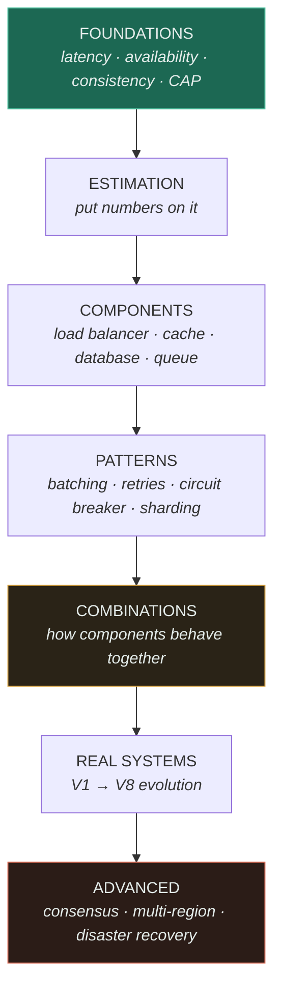

<div align="center">

# System Design Lab

**A practical system design and architecture learning laboratory** — fundamentals, distributed
systems, scalability patterns, real-world problems, working implementations, and an interactive
visualizer for watching architectures evolve.

[Start learning](#where-to-start) · [Open the visualizer](https://SAGARCHRY0777.github.io/system-design-lab/) · [Patterns](13-design-patterns/CATALOGUE.md) · [Combinations](14-component-combinations/MATRIX.md) · [Roadmap](ROADMAP.md) · [Gaps](GAPS.md)

</div>

---

## What this is

Not notes. A **method** for reasoning about systems you have never seen before.

Most system design material is a catalogue: here is a load balancer, here is Kafka, here is sharding.
A catalogue does not help when someone hands you a blank page. This repository is organised around a
different idea:

> **Architecture is not designed. It is forced.** Every component in a mature system was added
> because something specific broke — and every one of them broke something else in turn.

So every topic here answers the same four questions, and they are the point of the whole thing:

```
Without it   →  what problem appears?
With it      →  what problem disappears?
New problem  →  what complexity did we just buy?
Next         →  which component does that force?
```

Learn the chain and you can *derive* most architectures instead of memorising them.

## The visualizer

Reading that a cache reduces latency is not the same as watching a request stop short of the database.

<div align="center">
  
</div>

The [interactive lab](https://SAGARCHRY0777.github.io/system-design-lab/) lets you:

| Control | Question it answers |
|---|---|
| **▶ Animate a request** | How does a request actually flow? Watch a cache hit stop early and a miss go all the way. |
| **Scrub V1 → V8** | *Why* did the architecture change? Every step shows the failure that forced it. |
| **Switch a component off** | What breaks without it? Kill the cache and watch the thundering herd. |
| **Bottleneck highlight** | Where does it break first as load grows? |

Every architecture is authored **once**, as a [scene file](19-diagrams/scenes/SCHEMA.md), which drives
both the app and the diagrams committed here. They cannot drift apart.

## Where to start

**Not sure where you are?** Take the [diagnostic](DIAGNOSTIC.md) — twelve questions, ordered easy to
expert, that route you to the right starting point. A missed question tells you more than the score.

**New to system design** — read in this order, it is a deliberate sequence:

1. [System Design Thinking](SYSTEM-DESIGN-THINKING.md) — the chain, and the 18-step method
2. [Estimation Guide](ESTIMATION-GUIDE.md) — how to put numbers on a problem in your head
3. [Trade-off Framework](TRADEOFF-FRAMEWORK.md) — how to *choose*, with decision trees
4. [Foundations](00-foundations/) — latency, availability, consistency, CAP
5. Open the [visualizer](https://SAGARCHRY0777.github.io/system-design-lab/) and scrub the URL shortener from V1 to V8

**Already comfortable** — go straight to the [combination matrix](14-component-combinations/MATRIX.md),
which is the part most material skips, or the [pattern catalogue](13-design-patterns/CATALOGUE.md).
What is deliberately **not** covered is listed in [GAPS.md](GAPS.md).

**Preparing for an interview** — [Design Checklist](DESIGN-CHECKLIST.md) is the 45-minute short form.

## Learning path



The amber box is the one to linger on. Knowing what a cache is and what a queue is does not tell you
what happens when a queue backs up *behind* a cache miss storm — and that interaction is what real
systems are made of.

## Map

| Where | What |
|---|---|
| [00-foundations/](00-foundations/) | Latency, throughput, scalability, availability, reliability, consistency, CAP |
| [01-networking/](01-networking/) | DNS, TCP/UDP, HTTP/1-2-3, WebSockets, TLS |
| [02-architecture/](02-architecture/) | Monolith vs microservices — when to split, and when not to |
| [07-api-design/](07-api-design/) | REST/gRPC/GraphQL, versioning, pagination, idempotency |
| [03-load-balancing/](03-load-balancing/fundamentals/) · [04-caching/](04-caching/fundamentals/) | ★ Flagship components, full depth |
| [05-databases/](05-databases/fundamentals/) · [06-messaging/](06-messaging/queues/) | ★ Storage and asynchrony |
| [schema-migration/](05-databases/schema-migration/) · [data-modelling/](05-databases/data-modelling/) | Zero-downtime change, and designing for the query |
| 08-reliability/ | Retries, circuit breakers, rate limiting, backpressure |
| 09-scalability/ | Batching, async processing |
| [12-security/](12-security/) | Authn/authz, OAuth, JWT, API security, DDoS |
| [11-observability/](11-observability/) | Three pillars, cardinality trap, SLI/SLO/error budgets, alerting |
| [13-design-patterns/](13-design-patterns/) | **78 patterns**, incl. all 23 Gang of Four with distributed counterparts |
| [14-component-combinations/](14-component-combinations/) | **All 153 component pairs**, classified, with real systems |
| [15-real-world-problems/](15-real-world-problems/url-shortener/) | Full designs, V1→V8 — start with the URL shortener |
| [18-implementations/](18-implementations/) | Working Python code + measured benchmarks |
| [19-diagrams/](19-diagrams/) | Notation contract, scenes, generated diagrams |
| ADRs/ · anti-patterns/ · comparisons/ | Judgment |

## Conventions

Every concept page has the same shape, so you always know where to look:
definition → *explain like I'm new* → technical → engineering at scale → when to use → **when not
to** → trade-offs → failure modes → the four-line chain block.

Diagrams follow a [notation contract](19-diagrams/README.md). The one rule worth knowing up front:
**dashed means safe to lose**, a cylinder means losing it costs data.

Technology comes last, deliberately. You learn *caching* — what it is for and what properties it
needs — before you learn that Redis is one way to do it. The architecture does not change when you
swap Memcached for Redis.

## Running it locally

```bash
# the visualizer
cd visualizer && npm install && npm run dev

# regenerate diagrams after editing a scene
python scripts/render_diagrams.py

# the checks CI runs
python scripts/check_links.py        # every relative link resolves
python scripts/check_scenes.py       # every scene is valid
python scripts/render_diagrams.py --check
pytest 18-implementations -q
```

Benchmarks in [18-implementations/](18-implementations/) are **executed, never estimated**. Anything
not actually measured says so.

## Status

Built in phases; see [ROADMAP.md](ROADMAP.md) for what is done and what is next. Sections not yet
written are absent rather than stubbed, so the map above never promises coverage that is not there.

## License

MIT
