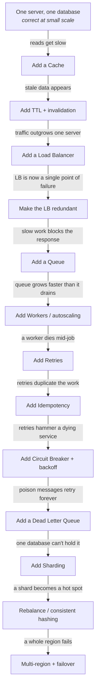
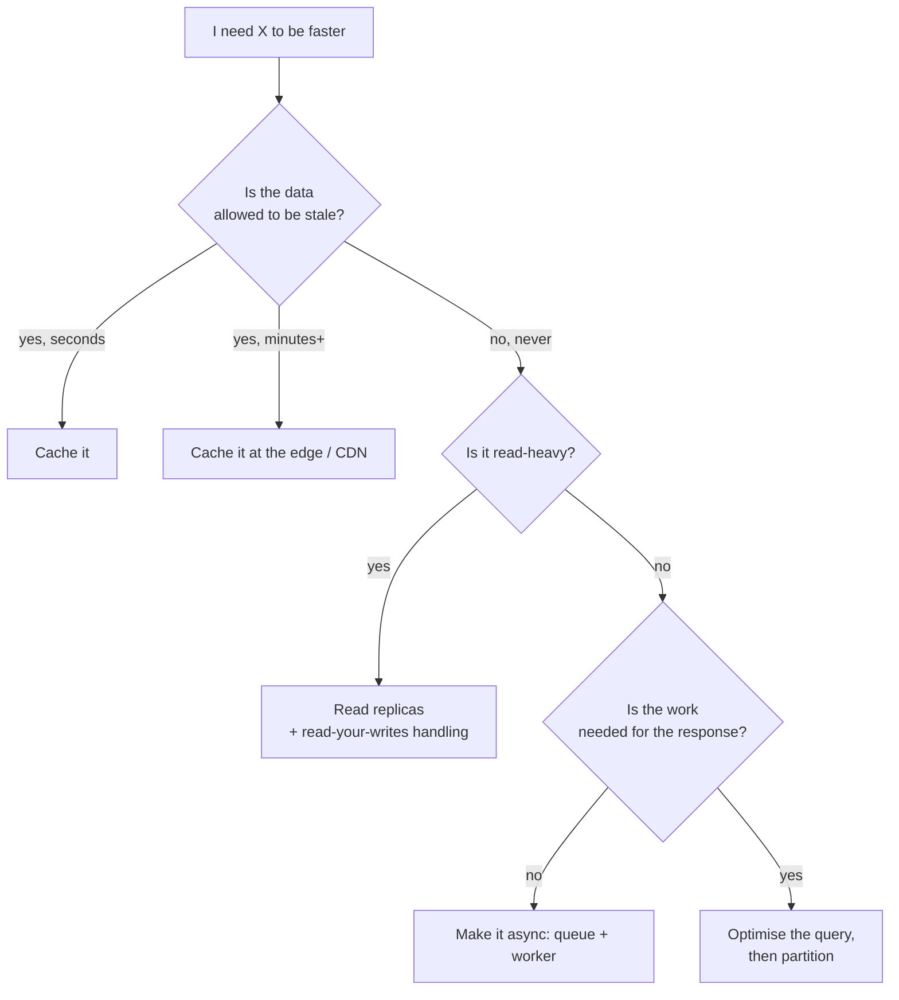

# System Design Thinking

Most system design material teaches a catalogue: here is a load balancer, here is Kafka, here is
sharding. A catalogue does not help when you are handed a problem you have never seen. What helps is
a **method** — a repeatable way to get from a vague sentence to a defended architecture.

This document is the method. Every other page in this repository is a detail you will need while
executing it.

---

## Part 1 · The chain

This is the single most useful idea here, so it comes first.

**Architecture is not designed. It is *forced*.** Every component in a mature system was added
because something broke, and every one of them broke something else in turn. Learn the chain and you
can derive most architectures from first principles instead of memorising them.



Read that top to bottom and you have just derived a production architecture. Nothing in it was a
preference; each step was the cheapest available answer to a specific failure.

**Two rules follow from the chain, and they matter more than anything else on this page:**

1. **Never add a component before its problem exists.** A queue added at step 1 is not foresight, it
   is premature architecture — you pay the complexity now and get the benefit
   never. The step is correct *only* at the point where the arrow above fires.
2. **Every component you add introduces the next problem.** If you cannot name the problem your new
   component creates, you do not understand it yet. A cache buys latency and sells you staleness. A
   queue buys resilience and sells you ordering. There is no free component.

Every concept page in this repository ends with the same four-line block, which is this chain viewed
from one component:

```
Without it   →  what problem appears?
With it      →  what problem disappears?
New problem  →  what complexity did we just buy?
Next         →  which component does that force?
```

---

## Part 2 · The method

Eighteen steps. In an interview you will compress them; in real work you will loop over them for
months. The order matters more than the completeness — most bad designs come from doing step 9
before step 3.

### Phase A — Understand (do not draw anything yet)

**1. Clarify the problem.** Restate it in one sentence and get agreement. "Design Twitter" is not a
problem statement. "Let users post short messages and see a feed of posts from people they follow"
is.

**2. Identify the users.** How many, where, doing what. A system for 100 internal analysts and a
system for 100M consumers share no architecture.

**3. Functional requirements.** What the system *does*. Write them as verbs. Cut ruthlessly — pick
the three that define the product and explicitly defer the rest.

**4. Non-functional requirements.** What the system *guarantees*: latency, availability, consistency,
durability, cost. **This is where most designs are won or lost**, because these are what force every
later decision. See [the foundations](00-foundations/) and
[the trade-off framework](TRADEOFF-FRAMEWORK.md).

**5. Constraints.** Budget, team size, existing stack, compliance, deadline. A design that ignores
these is a fantasy — three engineers cannot operate twelve microservices.

### Phase B — Size it

**6. Estimate scale.** QPS, storage, bandwidth, growth. Rough is fine; order of magnitude is what
matters. See the [estimation guide](ESTIMATION-GUIDE.md).

**Do the read:write ratio first.** It is one division and it determines more of the architecture than
any other number:

| Ratio | What it forces |
|---|---|
| Read-heavy (100:1) | Caching and replicas pay off enormously. This is most consumer systems. |
| Write-heavy (1:10) | Caching barely helps. Go straight to partitioning and batching. |
| Balanced | Hardest case. Expect to split read and write paths. |

**7. Identify the APIs.** Three or four endpoints, with their arguments. This forces you to be
concrete about what actually crosses the network.

**8. Sketch the data model.** Entities, relationships, access patterns. **Design for the query, not
the entity** — the access pattern decides the storage, never the other way round.

### Phase C — Design

**9. Draw the simplest thing that works.** Client → server → database. Resist every urge to add more.
You cannot justify a component before you have shown the bottleneck that demands it, and starting
simple is what lets you *demonstrate* rather than assert each later step.

**10. Find the bottleneck.** Put your estimated numbers against the simple design. What saturates
first — CPU, connections, disk, bandwidth, one hot row?

**11. Fix that one bottleneck.** One change. Name what it costs.

**12. Repeat 10–11.** Each loop is one step down the chain in Part 1. This loop *is* the design
process; everything else is preparation for it.

### Phase D — Make it survive contact with reality

**13. Handle failure.** For every component: what happens when it dies? See [failure engineering](#part-4--failure-thinking).

**14. Handle consistency.** Where is stale data acceptable, and where is it a bug? Be specific —
"eventually consistent" is not an answer, "a follower count may lag 30s, but a payment balance may
never" is.

**15. Handle security.** Authn, authz, secrets, transport, the blast radius of a compromise.

**16. Handle observability.** How would you *know* this broke? An architecture you cannot debug at
3am is not finished.

### Phase E — Defend it

**17. State the trade-offs.** Out loud, unprompted. "I chose eventual consistency for the feed
because a 2-second lag is invisible to users and it lets me serve reads from any region. I would not
make that choice for the payment ledger."

**18. Name what you would do differently at 10× and at 1/10×.** This is the single strongest signal
that you understand the design rather than having memorised it.

---

## Part 3 · How to choose anything

Never start from the technology. Start from the property you need, and let it select the technology.



Notice that four of the five leaves are *not* "add a faster database". The question that actually
splits the tree is **how stale may this be**, and that is a product decision, not a technical one.
Full version: [TRADEOFF-FRAMEWORK.md](TRADEOFF-FRAMEWORK.md).

---

## Part 4 · Failure thinking

The happy path is the easy half. Run this list against every design:

| Failure | The question that matters |
|---|---|
| Database dies | Do you lose data, or only availability? |
| Cache dies | Does the database survive the sudden 20× load? (usually not — thundering herd) |
| Load balancer dies | Is it redundant, or did you just re-create a single point of failure? |
| A worker crashes mid-job | Is the job lost, duplicated, or resumed? |
| A message is delivered twice | Is the operation idempotent? |
| Messages arrive out of order | Does order matter, and did you *say* so? |
| A dependency gets slow (not down) | Do you time out, or do you hang and take the caller with you? |
| Traffic spikes 10× | Do you degrade, or collapse? |
| A whole region goes dark | Has the failover ever actually been tested? |

**Slow is worse than down.** A dead dependency fails fast and you route around it. A dependency at
5-second latency holds every thread that touches it and takes down services that do not even depend
on it. This is why timeouts are not optional.

---

## Part 5 · What good looks like

A finished design can answer all of these without hedging:

- [ ] What are the functional and non-functional requirements?
- [ ] What is the rough scale — QPS, storage, read:write ratio?
- [ ] What is the simplest version, and what specifically broke it?
- [ ] Why each component is present, and what problem it created
- [ ] Where consistency is strong, where it is eventual, and why that is safe *here*
- [ ] What happens when each component fails
- [ ] How you would know it broke
- [ ] What you would change at 10× and at 1/10×
- [ ] Which alternative you rejected, and the condition under which it would win

Working checklist: [DESIGN-CHECKLIST.md](DESIGN-CHECKLIST.md).

---

## Related

- [Trade-off framework](TRADEOFF-FRAMEWORK.md) — the decision trees
- [Estimation guide](ESTIMATION-GUIDE.md) — putting numbers on step 6
- [Design checklist](DESIGN-CHECKLIST.md) — the interview-time short form
- [Diagram notation](19-diagrams/README.md) — how to draw any of this
- [Anti-patterns](anti-patterns/) — the chain applied too early, or not at all
- [ADRs](ADRs/) — one decision per record, with the condition that reopens it
- [Comparisons](comparisons/) — the deciding question behind each recurring choice

<!-- PATH:BEGIN -->

---

<sub>**The reading path** · step 1 of 27 · *System design thinking*</sub>

**Next** [Estimation](ESTIMATION-GUIDE.md) ▶

<!-- PATH:END -->
