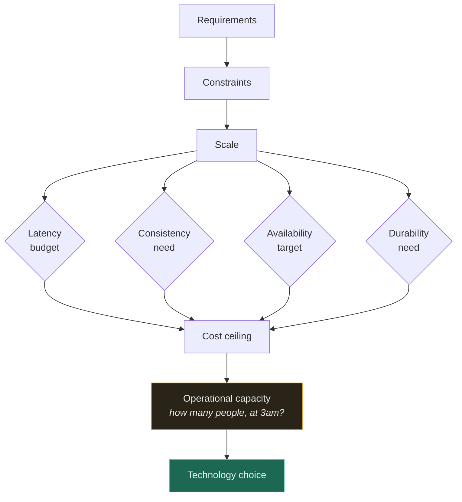
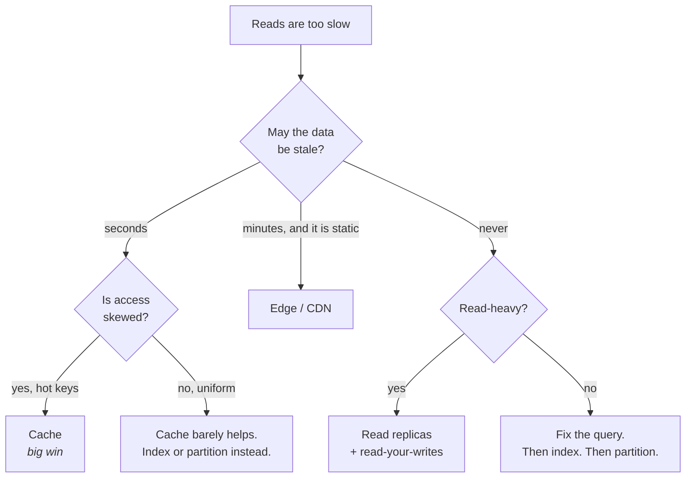
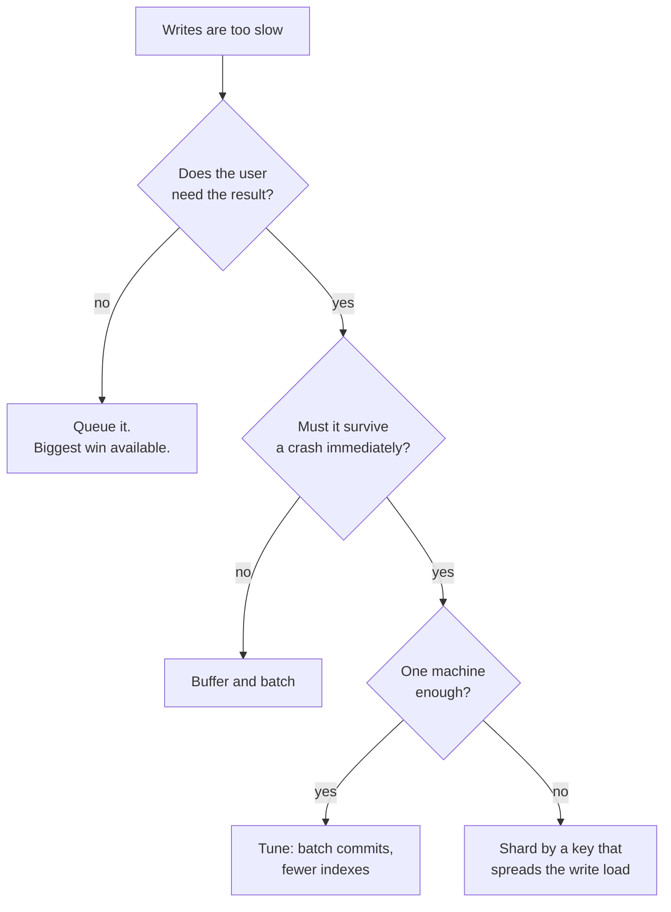
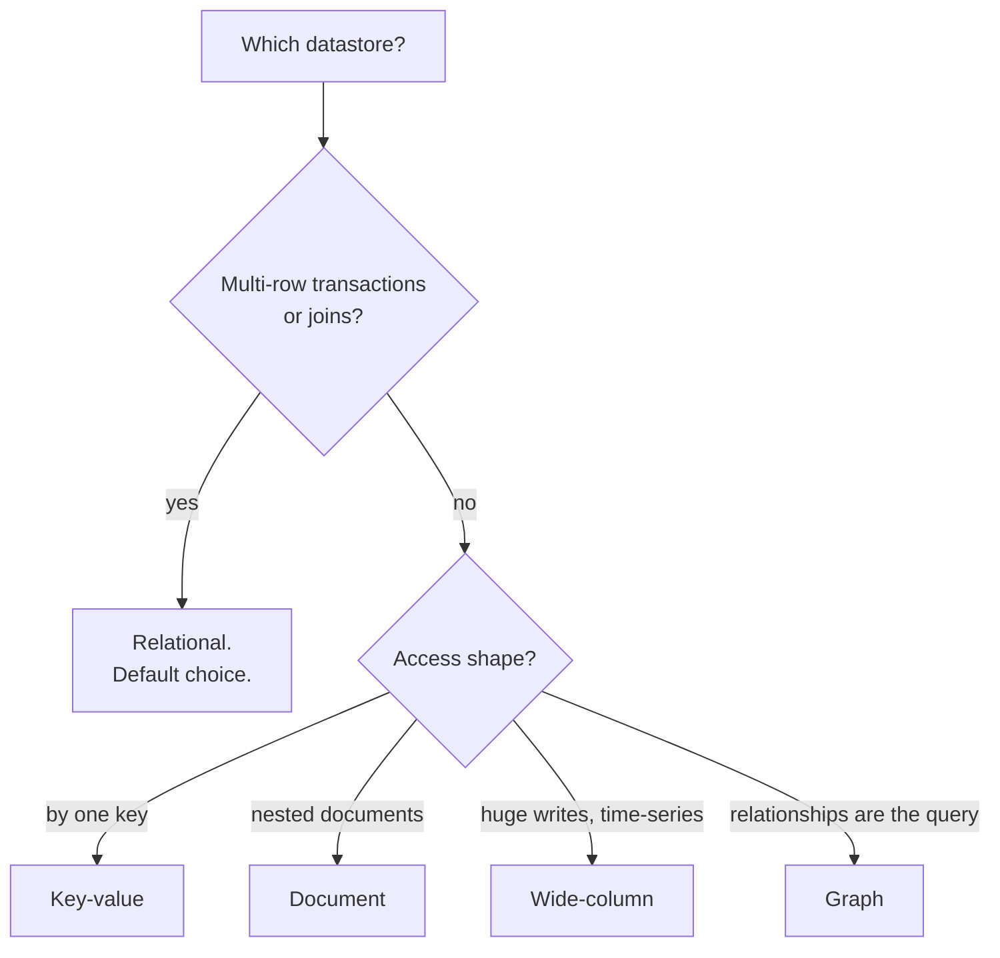

# Trade-off Framework

There are no good architectures, only architectures that are correct for a set of requirements. This
document is about **how to choose** — not which technologies exist.

The recurring failure it exists to prevent: choosing a technology first and then inventing
requirements that justify it.

---

## 1. The order of operations

Choices flow downhill. Making them in this order means each one is *forced* by what came before;
making them out of order means arguing about databases before you know the read:write ratio.

**Operational capacity is the step everyone skips**, and it invalidates more designs than any
technical constraint. A three-person team cannot run a multi-region Kafka cluster, regardless of how
well it fits on the whiteboard. Team size is an architectural constraint.

---

## 2. The seven axes

Every decision trades along at least two of these. Naming which two is most of the work.

| Axis | The real question | Cheap proxy |
|---|---|---|
| **Latency** | How long may one request take? | p99, not average |
| **Throughput** | How many at once? | peak rps, not daily total |
| **Consistency** | May a reader see stale data? | "for how long, and who notices?" |
| **Availability** | What does downtime cost? | minutes/year you can afford |
| **Durability** | May we ever lose committed data? | "would we notice? would we be sued?" |
| **Cost** | What is the budget? | $/month at projected scale |
| **Operability** | Who runs this at 3am? | headcount × expertise |

**Latency and throughput are not the same axis and frequently oppose each other.** Batching improves
throughput and *worsens* latency. If someone says "make it faster", find out which one they mean
before you do anything.

---

## 3. Decision trees

### Faster reads

The branch that decides everything is **is access skewed?** A cache in front of uniformly random
reads over a large keyspace buys you a hit rate near zero and a new failure mode. Caching is a bet on
skew, and most real traffic is heavily skewed — but check rather than assume.

### Faster writes

### SQL or not

**Relational is the default and needs no justification. Everything else does.** Postgres handles far
more load than most people assume, and "we might need to scale" is not a reason to give up
transactions before you have measured anything.

---

## 4. Trade-offs you will make constantly

| Choose | Get | Pay |
|---|---|---|
| Cache | latency, less DB load | staleness, invalidation bugs, thundering herd |
| Async / queue | responsiveness, absorbs spikes | eventual results, ordering, duplicates |
| Batching | throughput, fewer round trips | latency for the first item in the batch |
| Replication | read scale, HA | replication lag, read-your-writes problems |
| Sharding | write scale, unbounded storage | no cross-shard joins, hot shards, resharding pain |
| Microservices | independent deploys, team autonomy | network failures everywhere, distributed debugging |
| Strong consistency | simple reasoning | latency, reduced availability under partition |
| Retries | survives transient faults | duplicates, retry storms |
| More regions | latency, disaster tolerance | ~2× cost, cross-region consistency |

Read the right column before the left. Most bad architectures were built by people who only read the
middle one.

---

## 5. "Why not?" — the discipline

For any choice, be able to answer:

- Why this?
- Why not the simpler alternative? *(usually: no database at all, or a single Postgres)*
- Why not the more powerful alternative? *(usually: operational cost)*
- **Under what condition would each alternative become correct?**

That last question is what separates judgment from preference. Worked example, caching:

| Option | Why not | When it wins |
|---|---|---|
| Local in-process memory | Each server has its own copy; hit rate falls with fleet size, and invalidation is near impossible | Small fleet, tiny read-only reference data, sub-µs reads needed |
| Distributed cache | An extra system to run, and a new failure mode | Shared hot keys across many servers — the common case |
| CDN / edge | Only helps for cacheable, mostly-static responses | Geographically spread users, content identical for everyone |
| Read replica | Not a cache — it still pays a query; helps load, not per-key latency | You need consistency the cache cannot give |
| No cache, index instead | Slower than a cache hit | Uniform access; a cache would rarely hit anyway |

Notice that "no cache" is a legitimate row. If your options table has no row for *do nothing*, you
have not finished thinking.

---

## 6. Two rules

**Reversibility.** Prefer decisions you can undo. Adding a cache is nearly reversible. Choosing a
sharding key is nearly permanent. Spend your deliberation budget proportionally — argue for a week
about the shard key, an hour about the cache.

**Complexity is a cost paid forever.** Every component adds a thing to deploy, monitor, secure,
upgrade, and debug at 3am. The correct question is never "would this help?" — almost anything helps a
little. It is **"is this worth what it costs to run for the next three years?"**

---

## Related

- [System design thinking](SYSTEM-DESIGN-THINKING.md) — the method these choices sit inside
- [Estimation guide](ESTIMATION-GUIDE.md) — the numbers that drive the trees
- [Design checklist](DESIGN-CHECKLIST.md)
- Anti-patterns — what these trade-offs look like when ignored
- ADRs — recording a decision and the condition that would reverse it
