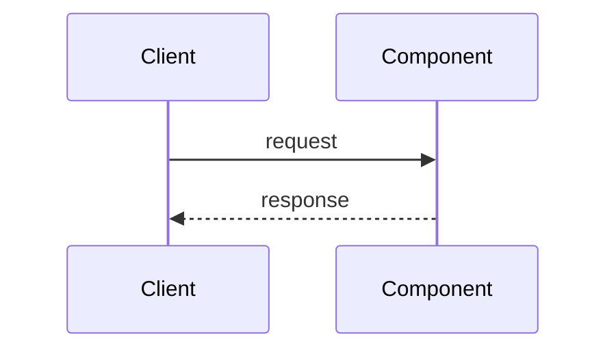

<!--
  THE CONCEPT TEMPLATE.

  Every concept page in this repository has this shape, so a reader always knows
  where to look. Two rules about using it:

  1. DELETE sections that have nothing real to say. An empty "Security
     Considerations" heading is worse than no heading -- it implies the question
     was considered. A short page that is entirely substance beats a complete
     page that is half filler.

  2. Section 25 is NOT optional, ever. It is the chain from
     SYSTEM-DESIGN-THINKING.md viewed from one component, and it is the reason
     this repository exists.

  Flagship topics (load balancer, cache, database, queue, sharding, CAP) use all
  of it. Smaller topics typically use 1-8, 12-16, 20, 25, 27, 28.

  Delete this comment block.
-->

# <Concept Name>

`[DIFFICULTY]` · one line on what this is, for someone scanning a search result.

---

## 1. One-line definition

The shortest true sentence. No analogies yet, no caveats.

## 2. Explain like I'm new

Plain language, no jargon at all. If a term has not been defined on this page or in
[the glossary](../../GLOSSARY.md), do not use it here.

## 3. Real-world analogy

One analogy, and then **immediately say where it breaks down**. An analogy carried too far is how
people acquire confident misconceptions — the restaurant-kitchen analogy for a queue is useful right
up until someone concludes messages can never be delivered twice.

## 4. Technical explanation

Now with the vocabulary. Precise enough for an engineer to act on.

## 5. Engineering at scale

What changes when this is real: at 10K rps, across regions, at 3am, with a team of four. This
section is where most of the actual value tends to be.

## 6. The problem it solves

Be specific. "Improves performance" is not a problem.

## 7. The problem it does NOT solve

The section that prevents misuse. A cache does not fix a slow query, it hides one — until the miss.

## 8. Why does this exist?

The history, briefly. What did people do before, and what specifically stopped working?

---

## 9. How it works

The mechanism. What actually happens, step by step.

## 10. Internal components

The parts, and what each is responsible for.

## 11. Request / data flow


Every diagram follows [the notation contract](../../19-diagrams/README.md). Delete any diagram that
does not show something the prose cannot.

## 12. Sequence



Use a sequence diagram only for questions about **order and time**. Structure questions want section 11.

---

## 13. When to use it

Concrete conditions, not vibes. "When reads exceed ~5K rps and access is skewed" beats "when you
need performance".

## 14. When NOT to use it

Equally concrete, and usually more useful. Include the case where the answer is *do nothing*.

## 15. Advantages

## 16. Disadvantages

## 17. Trade-offs

| Choose this | Get | Pay |
|---|---|---|

Fill the **Pay** column first. See [the trade-off framework](../../TRADEOFF-FRAMEWORK.md).

## 18. Alternatives — the "why not?" table

Required on flagship topics. Every row needs the third column; a rejected option with no winning
condition means it was never seriously considered.

| Alternative | Why not here | When it WOULD win |
|---|---|---|

---

## 19. Failure scenarios

| Failure | What happens | Survivable? | Mitigation |
|---|---|---|---|

Include the case of **slow rather than down**, which is usually worse and usually forgotten.

## 20. Scaling considerations

What breaks first as this grows, and what you do about it.

## 21. Performance

Latency, throughput, and the relationship between them. If you quote a number, say where it came
from; if it was not measured, say so.

## 22. Security

Only if there is something real to say. Delete otherwise.

## 23. Operational considerations

Deployment, upgrades, capacity, cost, and who is holding the pager.

## 24. Real-world usage

Which systems use this, and — more usefully — the constraint that made them.

---

## 25. Without it → With it → New problem → Next  ← **required**

```
Without it   →  <what problem appears>
With it      →  <what problem disappears>
New problem  →  <what complexity this just bought>
Next         →  <which component that problem forces>
```

Then a sentence or two on the last line. This is the link that joins this page to the rest of the
repository — see [the chain](../../SYSTEM-DESIGN-THINKING.md#part-1--the-chain).

## 26. Combination patterns

How this behaves next to other components — not what they are, but what emerges when they meet.
Link to [component combinations](../../14-component-combinations/) where one exists.

---

## 27. Implementation

Link to the working code in [18-implementations/](../../18-implementations/), and state plainly what
it does **not** implement.

## 28. Common mistakes

The ones you would actually see in a code review.

## 29. Monitoring

Which metric tells you this is unhealthy, and what the alert threshold means.

## 30. Testing

How to prove it works — including how to test the failure path, which is the part people skip.

## 31. Exercises

Three to five questions, each with its answer **hidden**:

```markdown
**1.** <a question that requires reasoning, not recall>

<details><summary>Answer</summary>

<the answer, 2-5 sentences>
</details>
```

Retrieval practice needs a gap between the question and the answer. A page that prints both on the
same line is prose wearing a question mark -- which is what the old "Interview questions" sections
were, and why they were replaced.

At least one question per page should be a judgement call whose correct answer is *no* or *not yet*.
Those are the ones that teach restraint, and restraint is most of system design.

`check_links.py` fails any page with an Exercises section and no `<details>`. Note that it SKIPS
`_templates/`, so this file is the one place the rule cannot protect -- keep it correct by hand.

## 32. Decision checklist

- [ ] …

## 33. Related

- [Glossary](../../GLOSSARY.md)
- Concepts you should read first
- Concepts this one enables
