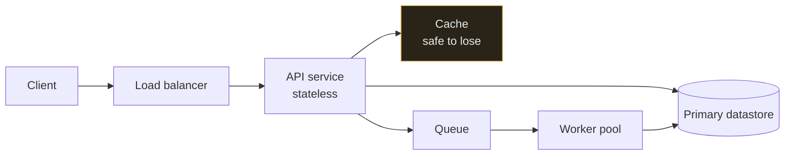
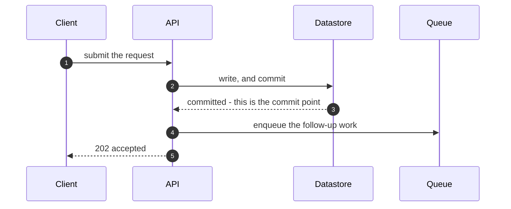

<!--
  THE HIGH-LEVEL DESIGN TEMPLATE.

  An HLD answers one question: WHAT are we building, and WHY is it shaped like
  that? It stops at the boundary where the answer becomes "and here is the class
  that does it" -- that is the LLD, in _templates/lld.md.

  Five rules about using this file:

  1. DELETE sections with nothing real to say. An empty "Security" heading is
     worse than no heading, because it implies somebody considered the question.

  2. EVERY non-functional requirement needs a NUMBER. "Scalable", "highly
     available" and "fast" are not requirements, they are adjectives, and a
     design cannot be checked against an adjective.

  3. Section 4 (non-goals) and section 12 (trade-offs) are the two sections
     reviewers actually read. A design with no stated non-goals has no boundary,
     and a design with no stated costs was not designed, it was chosen.

  4. Each section below carries a "Weak / Strong" prompt. Those are there
     because the weak version is what gets written under time pressure, and it
     passes review by being unfalsifiable. Delete the prompts as you fill in the
     section.

  5. The audience is a competent engineer who has never seen this system. If a
     term is not defined here or in the glossary, define it or link it.

  Delete this comment block.
-->

# HLD · \<System Name\>

**One paragraph, written last.** What this system does, for whom, and the single most important
constraint it is built around. If a reader stops here, this is what they take away.

> **Weak:** "This document describes the design of the notification platform."
> **Strong:** "A notification service that fans one event out to email, push and SMS for 40 million
> users, built around the constraint that a duplicate push is far worse than a late one — so the
> whole design trades latency for exactly-once delivery to the device."

| | |
|---|---|
| **Status** | Draft / In review / Approved |
| **Authors** | |
| **Reviewers** | |
| **Decision deadline** | The date after which not deciding *is* the decision |
| **Related documents** | The LLD, prior ADRs, the ticket that started this |

---

## 1. Context

Why does this document exist **now**? What changed? A design with no triggering event is usually a
solution looking for a problem.

State the current situation in facts, not in complaints: what exists today, what it costs, what it
cannot do, and what evidence you have. Link the incident, the graph, the customer request, or the
capacity projection.

> **Weak:** "The current system is old and hard to maintain."
> **Strong:** "The current job runs nightly and takes 6.5 hours. Volume has grown 40% year on year,
> so at the current rate it will exceed its 8-hour window by Q3. Two incidents in the last quarter
> were caused by the run overlapping itself."

## 2. Goals

Three to six, each one **observable** — a statement someone could later confirm or refute without
your help. Order them, because they will conflict and the order is how the conflict gets resolved.

| # | Goal | How we will know it was met |
|---|---|---|
| 1 | | |
| 2 | | |

> **Weak:** "Improve performance and reliability."
> **Strong:** "Cut p99 end-to-end latency from 4.2 s to under 800 ms, measured at the client, on the
> existing traffic mix."

## 3. Non-goals

**The section that makes review possible.** Everything a reasonable reader might assume is in scope
and is not — plus, for each, whether it is *deferred* or *rejected*, because those are different
promises.

| Not doing | Deferred or rejected | Why |
|---|---|---|
| | | |

> **Weak:** "Out of scope: everything not listed above."
> **Strong:** "Multi-region is deferred: the current SLA is 99.9% and a single region with tested
> restores meets it. We will revisit if the SLA moves to 99.99%, which is the condition, not the
> date."

## 4. Requirements

### 4.1 Functional

Numbered, testable, and phrased as capabilities rather than implementations. Mark each as `MUST`,
`SHOULD` or `MAY` — an unprioritised list is a list where everything gets built.

| # | Requirement | Priority |
|---|---|---|
| F1 | | MUST |

### 4.2 Non-functional — **with numbers**

This table is the design's contract with reality. **A row with no number is not a requirement**, and
every number needs a source: measured, projected from a measurement, or asserted by a named person.

| Property | Target | Measured where | Source of the number |
|---|---|---|---|
| Throughput, sustained | … rps | | |
| Throughput, peak and its duration | … rps for … minutes | | |
| Latency p50 / p99 / p999 | … / … / … ms | Client or server — say which | |
| Availability | …% over … | | |
| Durability / RPO | Max data loss on failure | | |
| Recovery time / RTO | | | |
| Consistency | Per dataset, not globally | | |
| Retention | | | |
| Cost ceiling | … per month at projected scale | | |
| Compliance / residency | | | |

> **Weak:** "The system must be highly available and scale to millions of users."
> **Strong:** "99.95% monthly, measured as the fraction of requests answered under 1 s. 12,000 rps
> sustained, 40,000 rps for up to 20 minutes during a campaign send. p99 under 200 ms at the load
> balancer. RPO 5 minutes, RTO 30 minutes."

Two questions to answer explicitly, because they decide more of the design than anything else in the
table: **what is the read-to-write ratio**, and **who notices staleness, after how long?** See
[consistency](../../00-foundations/consistency/) and [CAP](../../00-foundations/cap-theorem/).

### 4.3 Constraints and assumptions

What is fixed and not up for debate — existing systems, contracts, deadlines, team size, budget,
regulation. Then the assumptions the design rests on, each with what happens if it turns out to be
false. **An assumption nobody wrote down is a risk nobody owns.**

| Assumption | If it is wrong | How we would find out |
|---|---|---|

## 5. Estimation

The arithmetic, shown. Not for precision — for **order of magnitude**, which is what determines
whether this is one machine or forty. See the [estimation guide](../../ESTIMATION-GUIDE.md).

| Quantity | Working | Result |
|---|---|---|
| Requests per second, average | daily requests ÷ 86,400 | |
| Peak multiplier | measured, or 3–10× for consumer traffic | |
| Storage per year | rows/day × bytes/row × 365 × replication factor | |
| Bandwidth | rps × average response size | |
| Memory for the working set | hot fraction × dataset size | |
| Machines | peak rps ÷ measured per-node capacity, with headroom | |

Then, and this is the part that matters: **which of these numbers forced a decision?** An estimation
section that ends in numbers and no decisions was arithmetic homework.

> **Weak:** "We expect roughly 1 million users."
> **Strong:** "1M DAU × 20 requests = 20M/day = ~230 rps average, ~1,400 rps at a 6× peak. At 800 rps
> per node measured in the load test, that is 2 nodes plus 1 for failure — so this fits on three
> machines and does **not** need sharding, which removes the largest piece of the original proposal."

## 6. System architecture

One diagram that fits on a screen. Boxes are responsibilities, arrows are dependencies with a
direction, and every box must appear in section 7. Follow the
[notation contract](../../19-diagrams/README.md) — dashed means safe to lose, a cylinder means losing
it costs data.

Then **two or three sentences saying what to read off it** — the load-bearing edge, the component
whose failure is worst, the boundary where the guarantee changes. A diagram with no reading
instructions is decoration.

If the picture needs more than about twelve boxes, you are drawing an LLD. Split it.

## 7. Component responsibilities

One row per box. The **owns** column is the one that prevents arguments later: two components owning
the same data is the most common structural defect in an HLD.

| Component | Responsibility, in one sentence | Owns which data | Stateless? | Scales by | Failure impact |
|---|---|---|---|---|---|
| | | | | | |

> **Weak:** "The API service handles all business logic."
> **Strong:** "The API service validates the request, enforces per-tenant limits, writes the order,
> and enqueues fulfilment. It owns the `orders` table and nothing else reads it directly."

## 8. Data flow

Walk the **two or three flows that matter**, in order, naming what is durable at each step. The
useful ones are usually: the highest-volume read, the write that must not be lost, and the
asynchronous path where work goes missing.

For each flow, state the **commit point** — the moment after which the caller is entitled to believe
it happened — because that single fact determines your retry semantics, your idempotency needs and
your data-loss window.

## 9. Technology choices

Role first, product second — the architecture should not change when the product does. For each
choice, the third column is compulsory: **a rejected option with no winning condition was never
seriously considered.**

| Role | Chosen | Why this one | What we rejected, and the condition that would flip it |
|---|---|---|---|
| Datastore | | | |
| Cache | | | |
| Message transport | | | |
| Deployment target | | | |

> **Weak:** "We chose Kafka because it is the industry standard for event streaming."
> **Strong:** "Kafka, because we need replay for reprocessing and we already run a cluster with an
> on-call rota. We rejected SQS — cheaper and simpler — because it cannot replay; if the reprocessing
> requirement were dropped, SQS would be the better answer."

**Default to boring.** A relational database and a single deployable need no justification; every
deviation from that does. See the [trade-off framework](../../TRADEOFF-FRAMEWORK.md).

## 10. Alternatives considered

At least two, and one of them should be **do nothing** or **the obvious simple thing**. If your
alternatives table has no row for "extend what we already have", the review has nothing to push
against.

| Alternative | Sketch | Why not | When it WOULD win |
|---|---|---|---|
| Do nothing / extend the existing system | | | |
| | | | |

## 11. Trade-offs

Fill the **Pay** column first. It is the only column that is hard to write, and a table where every
row pays nothing is a sales document.

| Choose | Get | Pay |
|---|---|---|
| | | |

Then one line on **reversibility**: which of these decisions could be undone in a week, and which are
effectively permanent? Spend your deliberation budget proportionally.

## 12. Failure modes

Every dependency in section 6, plus the ones that are not components: a bad deploy, a configuration
change, a certificate expiry, a dependency's dependency.

| What fails | Blast radius | Detected by | Behaviour | Recovery |
|---|---|---|---|---|
| | | | | |

Three rows most designs are missing, so start with them:

- **Slow, not down.** A dependency at 30× its normal latency, still returning `200`. This is worse
  than an outage and it is the case timeouts and circuit breakers exist for.
- **The dependency that recovers.** A thundering herd of retries at the moment it comes back, which
  is what takes it down a second time.
- **Partial success.** The write landed and the event did not. Say what reconciles it.

State the **degraded mode** explicitly: what still works when each dependency is gone? "Nothing" is a
valid answer and a valuable one, because it tells the reader your availability is the product of
every dependency's — see [availability](../../00-foundations/availability/).

## 13. Security

Only what is real for this system; delete the rest rather than writing platitudes.

| Question | Answer |
|---|---|
| Who authenticates, and how | |
| **Authorised on the object, or only on the endpoint?** | |
| Trust boundaries crossed | |
| Data classification, and what is encrypted at rest and in transit | |
| Secrets: where they live and how they rotate | |
| Tenant isolation, if multi-tenant, and **at which layer it is enforced** | |
| Audit: what is logged, immutably, and for how long | |
| Abuse and rate limiting | |

> **Weak:** "All traffic uses TLS and passwords are hashed."
> **Strong:** "Every endpoint authorises on the **object**, not the route — a valid token for tenant A
> requesting tenant B's invoice gets a 404 identical to a nonexistent one. Enforced by row-level
> security in the database rather than by a predicate in application code, so a query written without
> the filter returns zero rows rather than everyone's."

## 14. Observability

What tells you this is unhealthy **before** a user does. See
[observability](../../11-observability/).

| | |
|---|---|
| SLIs | The two or three that define "working", measured at the client where possible |
| SLOs and error budget | The target, the window, and what happens when the budget is spent |
| Golden signals per component | Latency, traffic, errors, saturation |
| The one leading indicator | Usually a saturation metric — queue depth, pool utilisation, lag |
| What pages, and what does not | Every page must be actionable and link to a runbook |
| Trace propagation | Including across **asynchronous** hops, which is where it is usually lost |

> **Weak:** "We will add dashboards and alerts in Grafana."
> **Strong:** "SLI: fraction of notifications delivered within 30 s, measured at the device
> acknowledgement. SLO 99.5% over 30 days. The leading indicator is queue depth per channel; it pages
> at a 2% hourly burn rate, and nothing else pages."

## 15. Cost

An order-of-magnitude estimate at projected scale, and — more usefully — the **unit cost**, because
that is the figure that survives growth. See [cost](../../09-scalability/cost/).

| Line | Estimate at launch | At 10× | Notes |
|---|---|---|---|
| Compute | | | Include the idle capacity you are provisioning for peak |
| Storage | | | Include snapshots, backups and versions |
| Data transfer | | | **Egress and cross-AZ.** Usually the surprise |
| Managed services | | | |
| Observability | | | Commonly 10–30% of the rest |
| **Cost per request / per tenant** | | | The number to put in the next design review |
| **Engineer time to operate** | | | A cheaper architecture needing more operators is not cheaper |

> **Weak:** "Costs will be minimal as we are using existing infrastructure."
> **Strong:** "About £4,100/month at launch, of which £1,300 is cross-AZ transfer from the replica
> topology. Roughly £0.0008 per request, falling to about £0.0005 at 10× because the fixed cluster
> cost amortises. No new on-call rota."

## 16. Rollout plan

How this reaches production **without a moment where it is all or nothing**. Every phase needs an
exit criterion and a way back.

| Phase | What ships | Who sees it | Exit criterion | Rollback |
|---|---|---|---|---|
| 0 | Behind a flag, no traffic | Nobody | Deploys cleanly, health checks green | Remove the flag |
| 1 | Shadow / dual-run, compare outputs | Nobody | Divergence under … % for … days | Stop comparing |
| 2 | … % of traffic | | | Flip the flag |
| 3 | Full | | | |
| 4 | Decommission the old path | | | **One-way door — schedule it separately** |

Note which phases are reversible in seconds and which need a deploy. If any data migration is
involved, it is [expand and contract](../../05-databases/schema-migration/) and the contract step
belongs on its own day, weeks later.

## 17. Open questions

The section that makes this document honest. Each with an owner and a date — an open question with
neither is a decision being avoided in public.

| # | Question | Blocking? | Owner | Needed by |
|---|---|---|---|---|
| | | | | |

## 18. Appendix

Benchmarks and where they were run, links to prototypes, prior art, glossary of domain terms, and the
raw numbers behind section 5.

---

## Review checklist

- [ ] Every non-functional requirement has a number and a source
- [ ] Non-goals are stated, and each is marked deferred or rejected
- [ ] The estimation ends in **decisions**, not just arithmetic
- [ ] Every box in the diagram appears in the responsibilities table, and no data has two owners
- [ ] Every technology choice names a rejected alternative **and its winning condition**
- [ ] "Do nothing" appears in the alternatives table
- [ ] The **Pay** column of the trade-off table is the fullest one
- [ ] Failure modes include *slow rather than down*, and a degraded mode per dependency
- [ ] Authorisation is on the object, not only the route
- [ ] The leading indicator is named, and every alert is actionable
- [ ] Cost is expressed per request or per tenant, and includes engineer time
- [ ] Every rollout phase has an exit criterion and a rollback
- [ ] Open questions have owners and dates

## Related

- [System design thinking](../../SYSTEM-DESIGN-THINKING.md) — the method this document is the output of
- [Estimation guide](../../ESTIMATION-GUIDE.md) — section 5
- [Trade-off framework](../../TRADEOFF-FRAMEWORK.md) — sections 9 to 11
- [Design checklist](../../DESIGN-CHECKLIST.md) — the 45-minute short form
- [Low-level design template](../../_templates/lld.md) — what happens after this is approved
- [Glossary](../../GLOSSARY.md)
