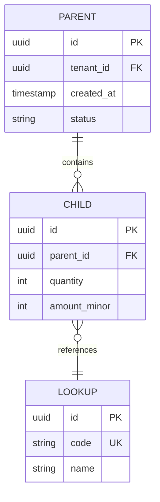
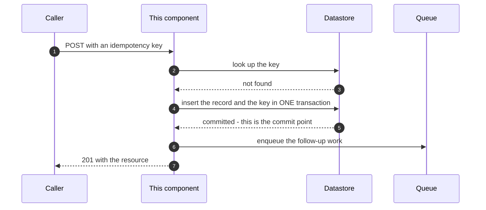
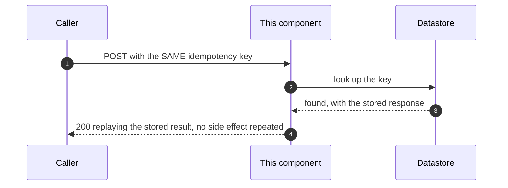
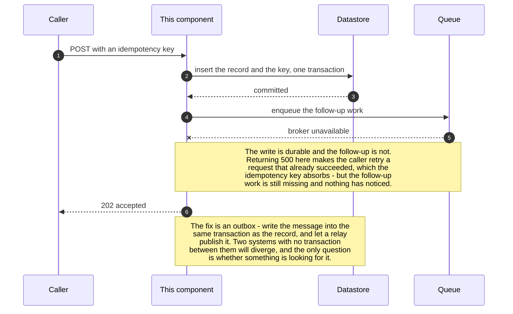
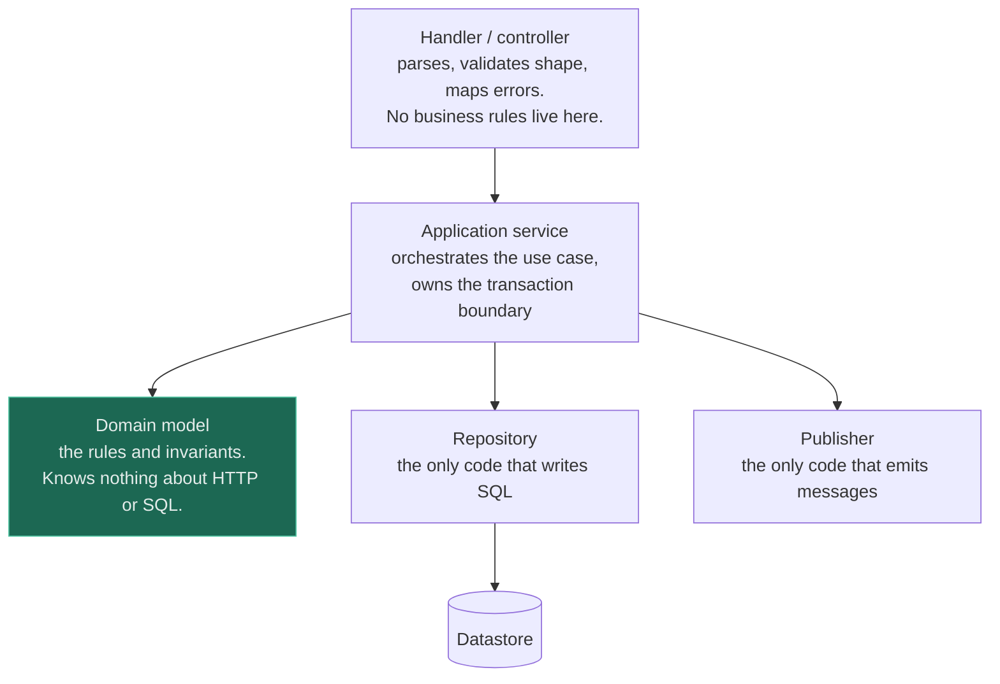
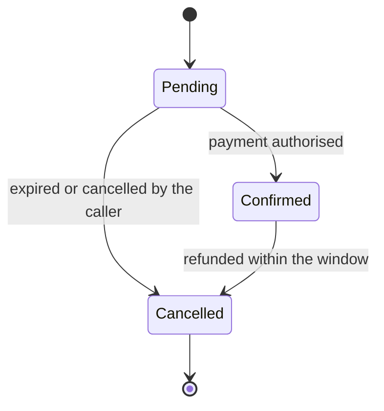

<!--
  THE LOW-LEVEL DESIGN TEMPLATE.

  An HLD answers WHAT and WHY. An LLD answers HOW, at the level where someone
  else could implement it without asking you questions -- and, just as
  importantly, at the level where a reviewer can find the bug before it is code.

  Five rules:

  1. This document has ONE component or service as its subject. If it has two,
     it is two documents. The moment you are describing an interaction between
     peers rather than the inside of one thing, you are back in the HLD.

  2. Contracts are normative. The schemas, the API shapes and the error codes in
     here are the specification -- if the implementation differs, one of the two
     is wrong and it needs saying which.

  3. Sections 6, 7 and 10 (error handling, idempotency, rollback) are where LLDs
     earn their keep. The happy path is the easy half and it is the half that
     gets written; every real defect lives in the other three.

  4. Show the FAILURE sequence, not just the success one. A sequence diagram
     with no error arrow describes a system that has never run.

  5. Diagrams follow the notation contract in 19-diagrams/. Quote every label;
     avoid ampersands, semicolons and parentheses inside labels.

  Delete this comment block.
-->

# LLD · \<Component Name\>

**One paragraph.** What this component is, which HLD it implements, and the one design decision
inside it that a reader most needs to know before reading anything else.

| | |
|---|---|
| **Parent HLD** | |
| **Status** | Draft / In review / Approved / Implemented |
| **Owning team** | |
| **Repository / package** | |
| **Runtime** | Language, framework, deployment target |

---

## 1. Scope

### In scope

The behaviour this document specifies. Be concrete enough that "is X covered?" has a yes or no
answer.

### Out of scope

What a reader might reasonably assume is here and is not — with a pointer to where it *is*. Adjacent
components, the infrastructure, the client, anything the parent HLD placed elsewhere.

### Interfaces this component depends on

| Dependency | Used for | Owner | Contract | What we do if it is unavailable |
|---|---|---|---|---|
| | | | | |

**The last column is the one to fill in first.** Every dependency without an answer there is an
outage you have not designed for.

## 2. Data model

### Entities



Read the cardinality markers rather than the boxes — they are the part that constrains the physical
design. Then say in prose what the diagram cannot: which side is hot, which relationship is
many-to-many in disguise, and which entity nobody in the business would have named.

### Tables

One block per table. Include the types, the nullability and the **reason** for each index — an index
with no named query behind it is a write cost with no reader.

| Column | Type | Null | Default | Notes |
|---|---|---|---|---|
| `id` | uuid | no | generated | |
| `tenant_id` | uuid | no | — | Part of the primary key, so a cross-tenant join cannot be expressed |
| `created_at` | timestamptz | no | `now()` | |

| Index | Columns | Serves which query | Unique? |
|---|---|---|---|
| | | | |

Questions to answer explicitly, because each of them is a decision that is expensive to change later:

- **Primary key**: natural or surrogate, and is the tenant part of it?
- **Money and time**: minor units as integers, never floats; timestamps with a zone, stored in UTC.
- **Soft delete or hard delete**, and what that means for uniqueness constraints and for erasure
  requests.
- **Growth**: rows per day, and which table is largest in a year. See
  [data modelling](../../05-databases/data-modelling/).
- **Enumerations**: constrained in the database or in the application, and how a new value is added.

### Invariants

The statements that must be true of the data at rest, and where each is enforced. **An invariant
enforced only in application code is an invariant with an expiry date** — some other writer, a
migration, or a support script will eventually not know about it.

| Invariant | Enforced by | What happens if it is violated |
|---|---|---|
| | Constraint / trigger / application / nothing | |

## 3. API contracts

One subsection per endpoint or message. These are normative.

### `POST /v1/<resource>`

| | |
|---|---|
| Purpose | |
| Auth | Which principal, which scope, and **which object-level check** |
| Idempotent? | Yes / no — and if yes, keyed on what |
| Rate limit | Per tenant, not per IP |
| Timeout | The value the caller should use, and the one we enforce |

**Request**

```json
{
  "field": "type, constraint, required or optional"
}
```

**Responses**

| Status | When | Body | Retryable by the caller? |
|---|---|---|---|
| `201` | Created | The resource | n/a |
| `200` | Replayed via idempotency key | The original resource | n/a |
| `400` | Validation failure | Error object with a field path | **No** |
| `401` / `403` | Not authenticated / not authorised for this object | | No |
| `409` | Conflicting concurrent modification | | Yes, after re-reading |
| `422` | Well-formed but rejected by a business rule | | No |
| `429` | Rate limit or quota | With `Retry-After` | Yes, after the delay |
| `503` | Dependency unavailable | | Yes, with backoff and jitter |

**Error body shape** — one shape for every error in this service, with a stable machine-readable
code. A caller cannot branch on prose.

```json
{
  "code": "stable_snake_case_identifier",
  "message": "human readable, safe to log, never contains secrets or other tenants' data",
  "field": "optional path for validation failures",
  "request_id": "for correlation with our logs"
}
```

**Compatibility.** State which changes to this contract are additive and which are breaking, and how
a breaking one would be shipped. See [versioning](../../07-api-design/versioning/): additive is safe,
removal is not, and the hard part is deprecation rather than versioning.

**Pagination**, if the endpoint returns a list: cursor-based, and say what the cursor encodes.
Offset pagination silently skips and duplicates rows when the underlying list changes — see
[pagination](../../07-api-design/pagination/).

## 4. Main flows

Two or three sequence diagrams: the primary success path, the idempotent replay, and **the failure
path**. The third is the one worth drawing.

### 4.1 Success



Say what to read off it: where the commit point is, what is durable before the response, and what is
still only in memory.

### 4.2 Idempotent replay



### 4.3 Failure and partial failure



**Every LLD needs this third diagram.** The interesting bug is almost never in the happy path; it is
in the gap between two writes that are not in one transaction.

## 5. Module structure

The internal decomposition. Names are load-bearing here — a reviewer should be able to guess where a
change goes.



| Module | Responsibility | Depends on | Must NOT know about |
|---|---|---|---|
| | | | |

State the **transaction boundary** explicitly: which layer opens it, which layer may not, and what is
forbidden inside it — network calls to other services being the usual answer, because a slow
dependency inside a transaction turns a timeout into lock contention.

If any entity has a lifecycle with more than two states, draw it, because implicit state machines are
where impossible states come from:



## 6. Error handling

**The classification is the design.** Everything else follows from which bucket an error lands in.

| Class | Examples | Retry? | Surfaced as | Logged at |
|---|---|---|---|---|
| **Caller error** | Bad input, unknown id, unauthorised | Never | `4xx`, with a stable code | Info — it is not your bug |
| **Transient dependency error** | Timeout, connection reset, `503`, deadlock | Yes, bounded, with jitter | `503` after exhaustion | Warn, error once exhausted |
| **Permanent dependency error** | `400` from a downstream, schema mismatch | Never | `500` | Error, with the correlation id |
| **Our bug** | Unhandled exception, invariant violated | No | `500`, no internals in the body | Error, and it should page if the rate moves |
| **Poison message** | A message that fails every attempt | Bounded, then a DLQ | n/a | Error, with a DLQ alert |

Rules to state explicitly for this component:

- **Timeouts on every outbound call**, with the value written down. A missing timeout is an unbounded
  wait that becomes thread exhaustion — the failure is yours, not the dependency's.
- **The timeout budget adds up.** If the caller's timeout is 2 s, your three sequential downstream
  calls cannot each be 1 s.
- **Never retry a `4xx`.** It will fail identically and you have turned one error into five.
- **Circuit breaking**, if a dependency's failure would otherwise saturate you.
- **What is never logged**: credentials, tokens, personal data, other tenants' identifiers.
- **Errors carry a correlation id** that the caller can quote — see
  [observability](../../11-observability/).

## 7. Idempotency and retries

The section that decides whether a retry is safe, and therefore whether anything above works.

| Operation | Naturally idempotent? | Made idempotent by | Key derived from | Key retained for |
|---|---|---|---|---|
| | | Idempotency key / unique constraint / conditional write / sequence number | | |

The mechanism, stated:

1. **Where the key comes from.** Caller-supplied is the honest default; derived from a natural
   business key is better when one exists. Never generate it server-side per attempt.
2. **Store the key with the result**, in the same transaction as the effect, so a replay returns the
   original response rather than re-executing. See
   [idempotency](../../07-api-design/idempotency/).
3. **The concurrent-duplicate case.** Two identical requests arrive at once. What does the second one
   get — a wait, a `409`, or the same answer? A unique constraint on the key is what makes this
   decidable rather than a race.
4. **Retention.** How long a key is honoured, and what happens on a replay after it expires. Longer
   than the longest client retry window, by a margin.
5. **Consumers are at-least-once.** Message delivery is at-least-once in every broker worth using, so
   handlers must be idempotent by construction — see [queues](../../06-messaging/queues/).

| Retry policy | Value |
|---|---|
| Max attempts | |
| Backoff | Exponential, with **jitter** — synchronised retries are a self-inflicted thundering herd |
| Overall deadline | Which must be shorter than the caller's timeout |
| Which errors are retried | By class, from section 6 |
| Dead-letter destination | And who is alerted, and how a message is replayed from it |

## 8. Migration plan

Only if this changes existing data or an existing schema. If it does, it is
[expand and contract](../../05-databases/schema-migration/), and the sequence is not optional: a
deploy is a window, not an instant, so the old code and the new code will share this database for the
length of the rollout.

| # | Step | Schema change | Code change | Reverted by |
|---|---|---|---|---|
| 1 | Expand | Add, nullable, no default | None | Dropping an untouched column |
| 2 | Dual-write | None | Write both shapes, read the old | Deploying the previous version |
| 3 | Backfill | None | Throttled, resumable, chunked by key range | Nothing to revert |
| 4 | Verify, then switch reads | None | Flag flip after counts and checksums agree | Flipping the flag back |
| 5 | Contract | Drop the old | Stop writing the old | **Nothing. One-way door** |

| | |
|---|---|
| Backfill volume and estimated duration | |
| Throttle signal | Replica lag is the usual right answer |
| Verification before the read switch | Counts **and** checksums **and** a sampled diff — a count alone proves every row has a value, not the right one |
| Gap between expand and contract | At least one full traffic cycle, including the weekly peak |

## 9. Test plan

State what each layer is responsible for proving, and be honest about the failure paths, which are
the ones that go untested.

| Layer | Proves | Notes |
|---|---|---|
| Unit | Domain rules and invariants | No database, no network |
| Integration | The repository against a real engine | An in-memory substitute does not have the locks |
| Contract | The API matches this document | Generated from the schema where possible |
| **Failure injection** | Timeouts, dependency `503`s, broker unavailable, duplicate delivery | The half that is normally skipped |
| Idempotency | The same key twice returns the same result and one effect | Including the concurrent case |
| Migration | Against a realistic row count | Locks and rewrites are proportional to rows; a thousand-row test proves nothing |
| Load | The stated non-functional numbers, at peak, with the real data distribution | Skew matters more than volume |

Specific cases worth naming, because they are the ones that break in production: the concurrent
duplicate, the retry after a timeout where the first attempt actually succeeded, the message delivered
twice, the dependency that is slow rather than down, and — if this is multi-tenant — **a test that
runs every query as two tenants and asserts the results are disjoint**. See
[multi-tenancy](../../09-scalability/multi-tenancy/).

## 10. Rollback

What a person does at 03:00 when this is wrong. Written before deployment, not after.

| Change | Reversible in seconds? | How | Prerequisite |
|---|---|---|---|
| Behaviour behind a flag | Yes | Flip the flag | The flag exists and is tested in both positions |
| Code deploy | Minutes | Redeploy the previous version | The previous version still parses the current schema |
| Additive schema change | Yes | Drop the column | Nothing has written it |
| Destructive schema change | **No** | — | Which is why it is a separate deploy, weeks later |
| Data written by the new path | | | Can it be identified and reverted? Say how |

| | |
|---|---|
| Rollback trigger | The specific metric and threshold that means "go back", decided in advance |
| Who may decide | And whether they need anyone's approval at 03:00 |
| Maximum acceptable rollback time | |
| What is **not** recoverable | The honest list. Every design has one |

**A rollback plan that says "redeploy the previous version" is incomplete if this change touched the
schema.** Say explicitly whether the previous version can run against the current schema, because
under pressure that is the assumption everyone makes and it is the one that is wrong.

## 11. Open questions

| # | Question | Blocking implementation? | Owner | Needed by |
|---|---|---|---|---|
| | | | | |

---

## Review checklist

- [ ] Every dependency has a stated behaviour for when it is unavailable
- [ ] Every index names the query it serves
- [ ] Every invariant names where it is enforced, and "application code only" is called out as such
- [ ] Every endpoint states whether it is idempotent, and keyed on what
- [ ] One error body shape, with stable machine-readable codes
- [ ] A **failure** sequence diagram exists, not only the happy path
- [ ] The transaction boundary is named, and network calls are excluded from it
- [ ] Every outbound call has a timeout, and the budget adds up within the caller's
- [ ] Retries have bounded attempts, jitter, and a dead-letter destination with an owner
- [ ] `4xx` is never retried
- [ ] Any schema change follows expand and contract, with contract in a separate deploy
- [ ] Failure paths are in the test plan, including duplicate delivery and slow dependencies
- [ ] The rollback section says whether the previous version runs against the new schema
- [ ] Nothing logs credentials, personal data, or another tenant's identifiers

## Related

- [High-level design template](../../_templates/hld.md) — the document this one refines
- [Data modelling](../../05-databases/data-modelling/) — section 2
- [Schema migration](../../05-databases/schema-migration/) — section 8
- [Idempotency](../../07-api-design/idempotency/) — section 7
- [Versioning](../../07-api-design/versioning/) · [Pagination](../../07-api-design/pagination/) — section 3
- [Queues](../../06-messaging/queues/) — at-least-once delivery, and why handlers must be idempotent
- [Observability](../../11-observability/) — correlation ids and what to alert on
- [Diagram notation contract](../../19-diagrams/README.md)
- [Glossary](../../GLOSSARY.md)
