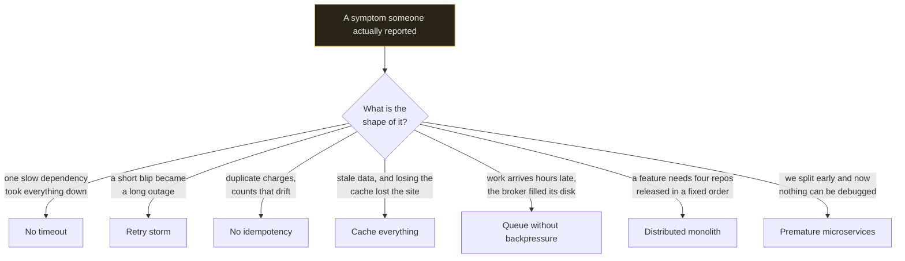

# Anti-patterns

`[INTERMEDIATE]` · Seven mistakes that are made deliberately, by competent people, for reasons that sounded good at the time — and the tells that let you spot each one in a code review before it ships.

---

## The rule these pages follow

Every page here has a section called **Why people do it**, and it comes before the criticism.

That order is not politeness. An anti-pattern nobody had a good reason for is a strawman, and a
strawman teaches nothing: you cannot recognise a mistake in your own work if the version you were
taught is a caricature of it. Real anti-patterns are made by people who had a defensible argument,
applied it in a situation where a hidden assumption did not hold, and got a result that looked fine
for six months.

> **The mistake is almost never the technique. It is the technique applied without the measurement
> that would have told you whether its precondition held.**

Caching is correct — over skewed access. Retries are correct — with backoff, jitter and idempotency.
Queues are correct — with a bound. Splitting into services is correct — when teams block each other.
Each page below is the same technique with its precondition removed.

Start from the symptom, not from the name. Nobody reports "we have a retry storm" — they report that
a thirty-second blip turned into a forty-minute outage, and that every restart of the dependency
knocked it over again. The left column of the table below is written the way the report actually
arrives.

---

## The seven

| Anti-pattern | The symptom someone reports | The reasonable-sounding reason | Level |
|---|---|---|---|
| [Premature microservices](premature-microservices/) | "We split six months ago and everything is slower and nobody can debug anything" | Boundaries are cheaper to draw early than to retrofit | `[I]` |
| [Cache everything](cache-everything/) | "Averages improved, users see stale data, and a cache restart took the site down" | Caching is the cheapest latency win there is, and it is reversible | `[B]` |
| [Retry storm](retry-storm/) | "A thirty-second blip became forty minutes, and it fell over again on every restart" | Most faults are transient. Not retrying means failing requests that would have worked | `[I]` |
| [Distributed monolith](distributed-monolith/) | "Shipping needs four services released in a specific order" | Every individual step of the migration was defensible | `[A]` |
| [Queue without backpressure](queue-without-backpressure/) | "The API was fast and green, then jobs arrived four hours late and the broker ran out of disk" | Absorbing spikes is the entire point of a queue. A limit gives that up | `[I]` |
| [No idempotency](no-idempotency/) | "Customers report double charges. Our logs show one request" | It is real work for a case that should not happen, and the happy path is correct | `[I]` |
| [No timeout](no-timeout/) | "One slow query took down services that do not use that database" | A timeout is a guess, and too low a guess fails requests that would have succeeded | `[B]` |

They compose, and that is where real incidents come from. **No timeout plus retries is a retry
storm. Retries plus no idempotency is data corruption. A queue without backpressure plus no
idempotency is corruption at a rate nobody can reconstruct afterwards.** Each page names the ones it
combines with.

## How to use these in a review

Every page has a section called **How to recognise it in a review** listing concrete tells — the
diff you can actually see, not the architecture you would have to infer. Those sections are the ones
to read first if you review other people's code, because all seven of these are far cheaper to catch
in a pull request than in an incident.

Three of them are visible in a single line of a diff: a client constructed without a timeout, a retry
policy with no jitter, and a queue declared without a bound. Those three are worth building a lint
rule for.

## Related

- [Trade-off framework](../TRADEOFF-FRAMEWORK.md) — the technique for not arriving here in the first place
- [System design thinking](../SYSTEM-DESIGN-THINKING.md) — the chain, which every page here is a break in
- [Design checklist](../DESIGN-CHECKLIST.md) — the short form, with most of these as checkboxes
- [ADRs](../ADRs/) — recording a decision and the condition that reverses it
- [Comparisons](../comparisons/) — the deciding question behind each recurring choice
- [Coverage gaps](../GAPS.md) · [Glossary](../GLOSSARY.md)
