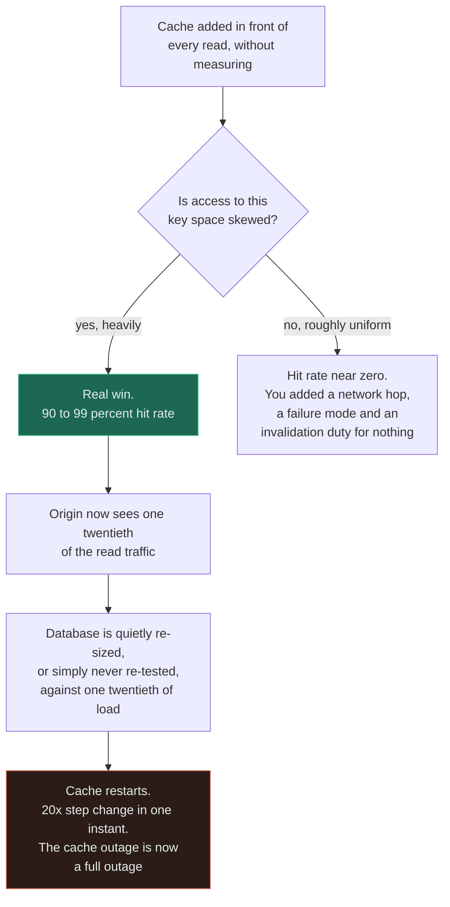

# Cache Everything

`[BEGINNER]` · A cache is added in front of every read on the theory that it can only help, and the system quietly acquires stale data, scattered invalidation, and a component it cannot survive losing.

---

## 1. What it looks like

> "We put caching in front of everything last quarter. Average response time looks great. But support
> keeps getting tickets about people seeing old data and we can never reproduce it. And when Redis
> restarted on Tuesday the whole site went down for eleven minutes — which is strange, because the
> cache is supposed to be optional."

Underneath that report you usually find:

- A **cache hit rate nobody has ever looked at**, which turns out to be 30% on several key spaces.
- **p99 unchanged** since the cache was added, while p50 halved. The tail is the miss path, and the
  miss path is the original slow query.
- `cache.delete(...)` calls scattered across a dozen write paths, one of which was added last month
  and does not have one.
- A cached endpoint that returns *someone else's* data occasionally, because a user-specific response
  was stored under a key that did not include the user.
- A database that has not been load-tested without the cache since the cache was added, and cannot
  survive it.

## 2. Why people do it

The reasoning is sound and mostly correct, which is exactly the problem.

**Caching is the cheapest large latency win in the field.** A memory read is roughly a thousand times
faster than an SSD read. No other single change available to you has that ratio. When a page is slow
and the deadline is Friday, a cache is the intervention with the best effort-to-improvement ratio
that exists.

**It is reversible.** Unlike a shard key or a service boundary, a cache can be removed. So the
[reversibility rule](../../TRADEOFF-FRAMEWORK.md#6-two-rules) says to deliberate less about it — and
that is correct advice, right up until the database can no longer live without it.

**Every system at scale does it.** This is true. Facebook's memcached tier is the canonical example,
the pattern is well understood, and the libraries are mature.

**A cache can only help hit rate.** Also literally true. If it hits, you win; if it misses, you paid
a millisecond and fell through. The asymmetry looks free.

**Nobody gets criticised for a page being too fast.** Adding a cache is uncontroversial in review in
a way that removing an index or changing a schema is not.

The hidden assumption is in the fourth argument. A cache is free *per request*. It is not free per
*system*, and the costs it adds are paid at times and places far from the code that added it.

## 3. What actually happens

A cache is a bet on two properties of the access pattern: **temporal locality** and **skew**. Cache
everything and you are placing that bet on every key space, including the ones where it is false.

Both branches are bad in different ways, and the **green branch is the more dangerous one**. The
right-hand path wasted effort and added a failure mode. The left-hand path *worked* — and success is
what converts the cache from an optimisation into a load-bearing dependency, while it continues to be
drawn as a dashed optional box on the architecture diagram.

Three mechanisms do the damage.

**Hit rate is a property of the workload, not of the cache.** A cache sized at 20% of the dataset
gives a 20% hit rate under uniform access and can give 95% under a Zipf distribution. Same cache,
same size, entirely different outcome, decided by a property nobody measured. Caching *everything*
guarantees you are on the wrong side of this for some of your key spaces.

**The cache hides slow queries instead of removing them.** Every miss pays the original cost, so a
95% hit rate means p50 looks wonderful and **p99 is still the uncached query**. The tail is what
users complain about, and it is now invisible in the dashboard everyone looks at. A missing index
that would have been found in a week survives for two years behind a cache.

**Invalidation spreads to every write path.** Cache-aside puts invalidation in application code. One
cache is one thing to remember; twenty caches across twenty key spaces is a rule every future
contributor must know about code they have not read. The path that forgets is found in production,
months later, by a customer.

## 4. How it fails

| Failure | Mechanism | What you see |
|---|---|---|
| **Cache outage becomes a full outage** | At a 95% hit rate the origin faces a 20× step change the instant the cache disappears | The "optional" component takes the site down. The most common way a cache kills you |
| **Near-zero hit rate** | Uniform access over a large keyspace. The bet on skew was never checked | A new component, a new failure mode, no measurable improvement |
| **p99 unchanged** | The tail *is* the miss path | p50 halves, the complaints continue, and the dashboard says everything is fine |
| **Stale reads** | One write path out of a dozen forgot to invalidate | Irreproducible support tickets. The user sees old data, you refresh and see new data |
| **Thundering herd** | A hot key expires and every concurrent reader misses at once with a byte-identical query | Periodic origin spikes at exactly the TTL interval, invisible in request-rate graphs |
| **Cross-user data leak** | User-specific data cached under a key that omits the user | A security incident, not a performance one. Reported as "I saw someone else's dashboard" |
| **A slow query survives for years** | Caching hid it before anyone profiled it | Removing the cache later is impossible because nobody knows what the origin can take |
| **Scan evicts the working set** | A nightly batch job reads every row and flushes LRU | Morning traffic arrives to a cold cache, every day, and nobody connects the two |
| **Unbounded staleness** | No TTL, on the theory that explicit invalidation covers it | Data that is wrong until something happens to evict it, which may be never |
| **Memory pressure and eviction churn** | Everything is cached, so nothing stays | Hit rate falls as more things are cached — the opposite of the intent |

## 5. The fix

**Measure the access distribution before caching anything.** It is one query against a day of logs:
what fraction of reads go to the top 0.1% of keys? If the answer is 90%, cache it and expect a large
win. If the answer is 5%, do not — fix the query, add an index, or partition. A cache over uniform
access is a failure mode you bought for nothing.

**Cache deliberately, per key space, with a stated reason.** "We cache short-code lookups because 92%
of reads are for the top 0.1% of codes" is a decision. "We cache reads" is a habit. See
[ADR-0001](../../ADRs/0001-cache-before-replicas.md) for the difference written down.

**Fix the query first.** If the origin is slow because it lacks an index, the index is a 10–100×
improvement, it is free, it is reversible, and it makes the *miss* path fast too — which is the only
thing that improves p99.

**Decide fail-open or fail-closed, in writing.** When the cache is down, do reads fall through to the
origin (risking it) or fail fast (protecting it)? Both are defensible. **The default is usually
neither, because nobody chose**, and that is how an eleven-minute outage happens.

**Load-test the origin without the cache, on a schedule.** The step change is a number. Know it, and
know whether the database survives it, before you find out at peak.

**Own invalidation in one place.** Prefer read-through or change-data-capture-driven invalidation
over hand-written `delete` calls sprinkled across write paths. If you must use cache-aside, keep
every invalidation for one key space in one module, and test it.

**Always set a TTL**, even when you also invalidate explicitly. The TTL is the bound on how wrong you
can be when the invalidation logic has a hole, and it always eventually has one.

**Put the user in the key** for anything user-specific — or better, do not put user-specific data in
a shared cache at all.

## 6. How to recognise it in a review

- **A cache added in the same pull request as the feature**, with no profiling data in the
  description. Ask what the hit rate is expected to be and why.
- **No TTL, or a TTL of zero meaning "forever".** Ask what bounds the staleness when the invalidation
  path has a bug — because it will.
- **A cache key built from a request parameter with no user or tenant component**, on an endpoint
  that returns personalised data. This is a security review finding, not a performance one.
- **A cache in front of a query with no supporting index.** The cache is hiding the real bug and the
  p99 will not move.
- **`cache.delete` in a service method**, rather than in one owned invalidation path. Count how many
  places write to that key space; the count is the number of chances to get it wrong.
- **No hit-rate metric exported.** If it is not measured it is not managed, and a slowly falling hit
  rate is the earliest warning that the access pattern is changing.
- **The design document does not say what happens when the cache is down.** That is the question, not
  a footnote.
- **A cache in front of a write path**, or write-behind used for anything a user was told was saved.
  Write-behind is the only strategy that can lose acknowledged data.

## 7. Exercises

**1.** A report endpoint takes four seconds. The query sequentially scans a 200-million-row table. An
engineer proposes caching the result. Do you approve it?

Answer

Not yet. The cache would hide a missing index rather than remove it, and hidden problems survive for
years.

Every miss still pays the four seconds, so p99 remains four seconds — the tail is the miss path — and
the first request after every invalidation is a user waiting for a full scan. If the report is
generated by a scheduled job, that job now warms nothing useful and evicts everything that was.

Fix the query first: an index here is routinely a 10–100× improvement, it is free, it is reversible,
and it improves the miss path, which is the only thing that moves p99. Cache afterwards if it is
still worth caching — and by then you will know, because you will have a number.

**If your options table has no row for "do nothing", you have not finished thinking.**

**2.** A team caches every read in the application. Six months later the cache tier is restarted
during a routine upgrade and the site is down for eleven minutes. Write the two-sentence post-mortem
finding, and name the decision that was never made.

Answer

**Finding:** at a 95% hit rate the database was serving one twentieth of read traffic, so the cache
restart presented it with a 20× step change in a single instant, which it could not absorb; the cache
had stopped being an optimisation and become a load-bearing dependency, while still being documented
as optional.

**The decision never made:** whether a cache outage should **fail open** — fall through to the origin
and risk it — or **fail closed** — serve errors or degraded responses and protect it. Both are
defensible. Neither was chosen, so the system did the first one by accident.

The follow-up actions are all measurements rather than code: load-test the origin with the cache
disabled and record the multiplier; add a circuit breaker or request coalescing on the fall-through
path; and either provision the origin for the step change or write down explicitly that you are
accepting the risk. Note the last option is legitimate — see
[ADR-0001](../../ADRs/0001-cache-before-replicas.md), which accepts exactly this risk on purpose and
says so in the runbook.

**3.** The dataset is 500 GB. Someone sizes the cache at 100 GB "because 20% is a reasonable
fraction". What did they not ask, and what should they size from instead?

Answer

They did not ask about the **access distribution**. Twenty percent of a uniform workload gives you a
20% hit rate and a new failure mode for nothing; 20% of a Zipf-distributed workload can give 95%. The
same number is either useless or transformative depending on a property nobody measured.

Size from the **working set** — the keys actually read in a window — not from a fraction of the
dataset. Measure it: take a day of access logs and compute the cumulative share of reads covered by
the top N keys. That curve tells you both whether to cache at all and how big to make it.

Then check where the extra nines pay. Going from 90% to 99% hit rate removes 90% of the *remaining*
origin load, which is often worth more than the first 90% was — and it is also the point at which the
origin quietly becomes unable to survive without you.

## 8. Related

- [Cache](../../04-caching/fundamentals/) — hit rate, placement, eviction, strategies, and the full failure table
- [ADR-0001: cache before more replicas](../../ADRs/0001-cache-before-replicas.md) — this decision made with the measurement
- [Redis vs Memcached](../../comparisons/redis-vs-memcached.md) — the product question, which matters far less than the skew question
- [Cache and database](../../14-component-combinations/cache-and-database/) — the canonical pairing and the canonical bug
- [Cache and queue](../../14-component-combinations/cache-and-queue/) — where a miss storm and a backlog amplify each other
- [LRU cache implementation](../../18-implementations/lru-cache/) — the scan vulnerability, measured
- [Consistency](../../00-foundations/consistency/) — a cache is a deliberate weakening, and TTL is the bound
- [Anti-pattern index](../README.md) · [Glossary: thundering herd](../../GLOSSARY.md#thundering-herd)
