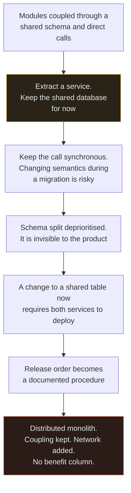

# Distributed Monolith

`[ADVANCED]` · Services that must be released together, with a network between them — every cost of distribution, none of the independence, and it is reached one defensible step at a time.

---

## 1. What it looks like

> "We have microservices. Shipping a feature means releasing four of them in a specific order, which
> is written down in a wiki page that is usually out of date. You can't run the system on a laptop.
> The only place it exists as a whole is staging, and staging is broken most of the time. When
> anything goes wrong, four teams get paged and spend the first half hour establishing that it was
> not them."

Diagnostic symptoms, in descending order of how conclusive they are:

| Symptom | What it actually means |
|---|---|
| Services must be released together, in order | You have one deployable wearing several hats |
| One feature touches four repositories | The boundaries do not match how the system changes |
| Services share a database schema | There is no boundary. There is a naming convention |
| You cannot run or test one service alone | The boundary exists on the deployment diagram and nowhere else |
| One service down takes everything down | Synchronous coupling with no fallback |
| Release order is documented somewhere | Deployment is a distributed transaction performed by humans |
| Teams coordinate every release in a chat channel | Conway's Law, reporting the truth about the organisation |

**The one measurement that settles the argument:** how many services must be released together for a
typical feature? If the answer is greater than one, this page is about your system. Chart it monthly;
it is the single best architectural health metric available.

## 2. Why people do it

**Nobody does this on purpose.** That is the defining property of this anti-pattern and the reason it
is the most common outcome of a service migration rather than an exotic one. Every individual step is
not merely defensible — it is the *recommended* step.

**"Extract the least-coupled module first."** Correct advice. So you extract one service. It still
needs data that lives in the main schema.

**"Do not do a big-bang data migration."** Also correct. So the new service reads the existing
database "temporarily", with a plan to split the schema in the next quarter. Everyone agrees this is
the pragmatic sequence.

**"Do not rewrite; strangle."** Correct again. So the old code path stays live behind a facade while
the new one proves itself. Two implementations now exist and both must be deployed.

**"Keep the call synchronous for now — making it asynchronous means designing for eventual
consistency, and we do not want to change semantics during a migration."** This is the most
reasonable sentence on the page and it is the one that does the damage.

**Deadline pressure supplies the rest.** Splitting the schema is the 80% of the work, it is invisible
to the product, and there is always something more urgent. So the temporary shared database becomes
permanent, not through negligence but through ordinary prioritisation.

The result is a sequence of correct decisions producing an architecture nobody would have chosen. It
is worth saying plainly: **teams that end up here are usually more disciplined than teams that do not
attempt the split at all.**

## 3. What actually happens

Coupling is not removed by a service boundary. It is **relocated** — from the compiler, where it is
visible and checkable, to the network, where it is invisible until runtime.

The amber box is the last point at which this is cheap to stop, and it is the step that looks most
obviously correct at the time. Follow the arrows and notice that **no step introduces the coupling —
every step preserves it** while adding something. That is what makes this so hard to catch in review:
there is no bad commit to point at.

What you are left with, on every axis:

| | Monolith | Distributed monolith | Microservices |
|---|---|---|---|
| Deploys | One | **Several, ordered** | Independent |
| Transactions | Real | **None** | None, by design, with sagas |
| Debugging | Stack trace | **Neither trace nor stack trace** | Distributed tracing |
| Failure | One process | **Partial, unhandled** | Partial, designed for |
| Availability | One term | **Multiplied** | Multiplied, with async boundaries |
| Team independence | None | **None** | High |
| Local development | Trivial | **Impossible** | Per service |

**There is no column where the middle one wins.** Every other anti-pattern on this site is a good
technique applied without its precondition; this one is the absence of a benefit. That is why the
correct response is frequently to *merge services back together* — an action nobody wants to take and
which is almost always right.

## 4. How it fails

| Failure | Mechanism | What you see |
|---|---|---|
| **Ordered releases** | Interfaces changed together, so version skew breaks | A deploy procedure with numbered steps and a rollback that must run in reverse |
| **Shared schema is not a boundary** | Two services write the same tables | Neither team can change a column. Migrations require a meeting |
| **Availability multiplies with no compensation** | Synchronous hops added, nothing made optional or async | Worse availability than the monolith, and no design decision anywhere accounts for it |
| **Partial failure nobody designed for** | Callers were written assuming an in-process call that cannot half-fail | Records in inconsistent states, discovered by reconciliation or by customers |
| **Local development dies** | The system only exists when everything runs | Everyone shares one staging environment, which is therefore always broken |
| **Debugging is worse than either alternative** | The stack trace was given up and tracing was never installed | Incidents start with half an hour of establishing whose problem it is |
| **Blame diffusion** | Ownership is split across a request path nobody owns end to end | Four teams paged, none accountable, mean time to recovery dominated by coordination |
| **The shared library becomes a fifth deployable** | Domain types extracted into `common` | Every service redeploys when it changes. You have re-created the monolith as a dependency |
| **Rollback is a distributed transaction** | Two services are already on the new version, one is not | The rollback plan has never been rehearsed and does not work |
| **Migration stalls permanently** | The remaining 80% of work is invisible to the product | "Temporary" shared database, three years old |

## 5. The fix

**Measure first: services released together per feature.** Chart it monthly. Everything else is
opinion until this number exists, and the number usually surprises everyone.

**Then choose one of two honest directions.** There is no third.

**Direction one — merge them back.** If two services always release together, share a schema, and
have no independent scaling profile, team, or availability target, they are one service pretending.
Merging is not a retreat. Recognising a wrong boundary and undoing it is a sign of competence, and it
is the cheapest fix available. Give particular attention to any service whose entire API is called by
exactly one other service, synchronously, on every request — that is a function with a network in
front of it.

**Direction two — finish the split properly.** In this order, and the order is the whole thing:

1. **Split the data.** This is the project. Until each service owns its tables and nothing else reads
   them, there is no boundary and everything else is decoration.
2. **Make every change backwards compatible** — expand, migrate, contract. When any version of A works
   with any version of B, release order stops mattering, and that is what "independent deploy"
   actually means. You need this regardless, because during any rolling deploy two versions are live
   at once whether you planned for it or not.
3. **Make the boundary asynchronous wherever the caller does not need the answer.** A queue removes
   the availability term entirely rather than merely bounding it. This is the highest-leverage change
   for reliability.
4. **Install distributed tracing** if it is not already there. You gave up the stack trace; something
   must replace it.
5. **Align teams with boundaries, or expect the boundaries to fuse.** Conway's Law is not a curiosity.
   Repository boundaries are a suggestion; team boundaries are a physical fact.

**What is not a fix:** a release-orchestration tool. It automates the symptom and makes the disease
comfortable, which guarantees it will never be addressed — and it adds a component whose failure
blocks all deploys.

## 6. How to recognise it in a review

- **A pull request spanning multiple repositories** with a merge order in the description. Conclusive
  on its own.
- **A database migration in one service's repository against a table another service reads.** Search
  for the table name across repositories; if it appears in two, there is no boundary.
- **A "release notes" or runbook section titled anything like *deployment order*.**
- **A `common` or `shared` library containing domain entities** rather than utilities. Check what
  redeploys when it changes.
- **Integration tests that require the whole system to be running.** If a service cannot be tested
  alone, it cannot be deployed alone.
- **A new synchronous call between two services**, added without a timeout, a fallback, or a sentence
  about what happens when the callee is down.
- **An API change that is not backwards compatible**, shipped with "we will deploy the consumer
  first". That sentence is the definition of coupled deployment.
- **Two services with credentials for the same database user.** Look at the configuration, not the
  diagram.

## 7. Exercises

**1.** A team's services each have their own repository and pipeline, but shipping a feature requires
releasing four in a specific order. Someone proposes a release-orchestration tool. What would you
say?

Answer

That the tool automates the symptom and entrenches the disease. Ordered multi-service releases are
the defining property of a distributed monolith: the coupling of one deployable with the failure
modes of a distributed one. An orchestrator makes that state comfortable, so it will never be fixed —
and it introduces a component whose own failure blocks every deployment in the company.

**Diagnose first.** If four services change together for a typical feature, the boundaries do not
match how the system changes. The commit history answers this without argument: which files change in
the same commit, consistently? Those belong together. Very often the honest conclusion is that three
of the four should be merged back.

**Where a split is genuinely right and ordering still bites, the fix is compatibility rather than
orchestration.** Make every change backwards compatible — expand, migrate, contract — so any version
of A works with any version of B and release order stops mattering. See
[versioning](../../07-api-design/versioning/) and
[schema migration](../../05-databases/schema-migration/). You need this anyway: during any rolling
deploy two versions are live simultaneously whether you designed for it or not.

**2.** Two services share a database. One team wants to add a column. Walk through what happens, and
explain why "we will just coordinate" is not a solution.

Answer

Adding a column is usually the easy case — it is additive, and a well-behaved reader ignores unknown
columns. The problem arrives on the *next* change: renaming, dropping, changing a type, or adding a
constraint. Any of those requires knowing every reader and writer, which means a meeting, a shared
timeline, and a deployment order.

"We will coordinate" fails for three reasons, and the third is the one that matters.

It does not scale: coordination cost grows with the number of services touching the table, and it is
paid on every change forever.

It has no enforcement: nothing stops a third service from starting to read the table next quarter,
and nobody will find out until a migration breaks it.

And it is exactly the cost the split was supposed to remove. Independent deployment is the *only*
benefit of microservices that survives scrutiny. A shared schema removes it while keeping every cost.
You have paid for distribution and are still holding a coordination meeting.

The real fix is ownership: one service owns the table, everyone else goes through its API or consumes
its events. That is a migration, and it is the 80% of the work that got deferred — which is precisely
why the system is in this state.

**3.** You inherit nine services owned by four engineers. Where do you start, and what would make you
decide to merge rather than fix?

Answer

**Start by measuring, not by re-architecting.** Three numbers: how many services must be released
together for a typical feature; how many synchronous hops are in the p99 request path; and which
services have had no commits in six months but still take deploys, patches and pages. Generate the
dependency graph from traces rather than trusting any diagram — the real graph is never the drawn
one.

**Then do the safety work that is right regardless of the eventual shape:** a timeout on every call,
tracing if it does not exist, and one on-call rotation with one runbook instead of nine.

**Merge — do not fix — when you find any of these.** Services that always release together: they are
one service pretending. Services sharing a database schema: there is no boundary to preserve, only
latency to remove. Services with no independent reason to exist — no separate scaling profile, no
separate team, no separate availability target. And any service whose entire API is called by exactly
one other service, synchronously, on every request.

The arithmetic makes the case without any architectural argument at all. Four engineers over nine
services means each person nominally owns two they touch once a quarter, so nobody knows how any of
them work at 2am — and nine synchronous 99.9% services give roughly 99.1% availability, about 79
hours a year, before counting deploys. Consolidating to three or four services aligned with the four
people is not a retreat; it is the only configuration this team can operate.

## 8. Related

- [Monolith vs microservices](../../02-architecture/monolith-vs-microservices/) — the distributed monolith table and the boundary heuristics
- [Premature microservices](../premature-microservices/) — how systems arrive here
- [Monolith vs microservices comparison](../../comparisons/monolith-vs-microservices.md) — the deciding question
- [ADR-0004: no microservices yet](../../ADRs/0004-no-microservices-yet.md) — the decision that prevents it
- [Schema migration](../../05-databases/schema-migration/) — expand-contract, which is what makes release order stop mattering
- [Versioning](../../07-api-design/versioning/) — the same discipline applied to interfaces
- [Availability](../../00-foundations/availability/) — the multiplication nobody accounted for
- [Anti-pattern index](../README.md) · [Glossary: distributed monolith](../../GLOSSARY.md#distributed-monolith)
