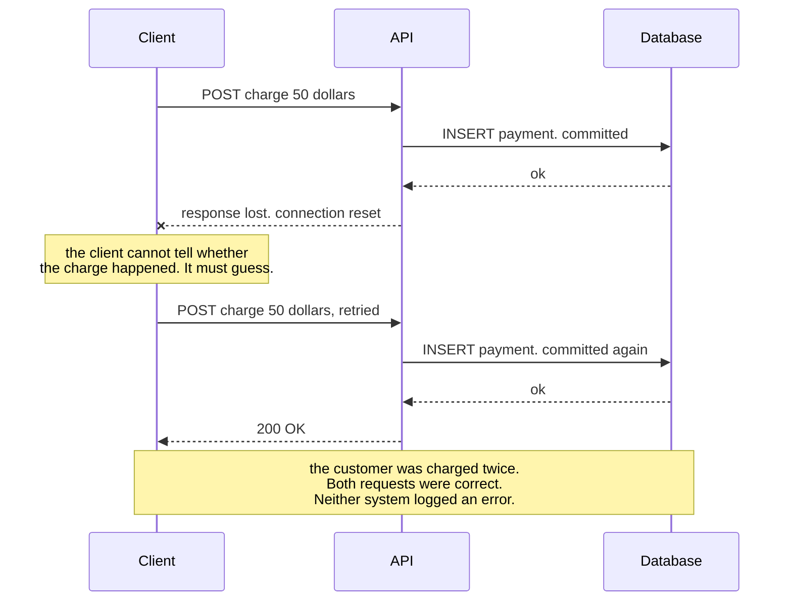

# No Idempotency

`[INTERMEDIATE]` · An operation with a side effect is exposed to a network that retries, so the same request is applied twice and the system's records stop matching reality.

---

## 1. What it looks like

> "Customers are reporting double charges. Our logs show one request. The payment provider shows two.
> We cannot reproduce it, it happens to maybe one order in two thousand, and it is always on mobile."

Or the same mechanism wearing a different costume:

- A counter that drifts upward and nobody can explain — it is always a little high, never low.
- Two identical rows in a table that has no unique constraint, created milliseconds apart.
- A customer receiving the same email three times, always during an incident.
- An inventory count that reconciliation finds wrong once a week.
- A support ticket that says "I clicked once".

**One in two thousand and always on mobile** is the fingerprint. Mobile networks time out more, so
the client retries more, so the duplicate rate correlates with connection quality rather than with
anything in your code — which is precisely why it cannot be reproduced in an office.

## 2. Why people do it

**It is real work for a case that should not happen.** An idempotency key needs a store, a TTL, a
uniqueness constraint, a concurrency story, and a decision about what to do when the same key arrives
with a different body. That is a day of work and a permanent piece of infrastructure, for a benefit
nobody sees when it is working.

**The happy path is correct.** Every test passes. The code is right for the case the author was
thinking about, and the case the author was thinking about is 99.95% of traffic.

**"At-least-once delivery" sounds like an infrastructure concern.** It appears in the queue's
documentation, not in the application's requirements, so it reads as somebody else's problem — and
the person who chose the queue is usually not the person writing the consumer.

**Retries are often invisible.** The HTTP client library retries. The load balancer retries on
connection failure. The service mesh retries. The queue redelivers. The user taps the button again.
Not one of these appears in the code being reviewed, so "we do not retry this" is frequently believed
and rarely true.

**Exactly-once is widely advertised**, so many engineers believe the platform provides it. It does not
exist end to end; what is sold under that name is at-least-once plus deduplication inside one
system's boundary — and the boundary never includes your side effect.

## 3. What actually happens

The mechanism rests on a single fact that is easy to state and hard to internalise:

> **A timeout is not a failure. It is the absence of information.**

When a caller times out it cannot distinguish "the request never arrived" from "the request was
processed successfully and the response was lost". Those two states require opposite responses —
retry, or do not retry — and the caller has no way to tell them apart. So it guesses, and the safe
guess for availability is to retry.

Read the last note carefully. **Nothing in this sequence is a bug in the conventional sense** — every
component did exactly what it was designed to do, no error was raised anywhere, and every log line
looks healthy. That is why the defect is found by customers rather than by monitoring.

Two further points make it worse than the diagram suggests.

**The retry does not have to come from the client you are thinking about.** Count the layers between
a user and your handler that can reissue a request on their own: the mobile OS, the HTTP library, the
CDN, the load balancer, the service mesh, the queue, and the user's finger. Idempotency is a property
you need whether or not *you* wrote a retry.

**A read-then-write check is not a fix.** "Look for an existing charge, and insert if absent" fails
under concurrency: two retries arriving simultaneously both read nothing and both insert. The
duplicate rate is highest precisely when duplicates are most likely — during an incident, when
retries are numerous and simultaneous.

## 4. How it fails

| Failure | Mechanism | What you see |
|---|---|---|
| **Duplicate side effects** | The response was lost after the effect committed | Double charges, double emails, double shipments. Financial and reputational, not merely technical |
| **Counter drift** | At-least-once redelivery increments twice | Numbers that are always slightly high. Nobody can say by how much, so nobody can correct them |
| **Duplicate rows** | No unique constraint on the natural key | Reconciliation finds them weekly. Downstream joins fan out and multiply the error |
| **Check-then-insert races** | Two concurrent retries both see "not present" | The bug appears only under load, which is when it matters most |
| **Correlated with incidents** | Retries cluster during degradation | The corruption is worst on the worst day, and it is discovered after the incident is closed |
| **Queue redelivery after a worker crash** | The work was half applied before the crash and is redelivered whole | Partially applied then fully applied — the hardest state to reason about |
| **Retry storms multiply it** | [Retry storms](../retry-storm/) turn one duplicate into many | A reliability mechanism producing a correctness failure at scale |
| **Compensation makes it worse** | A saga retries a compensating action that was not idempotent either | Refunds issued twice. The cleanup becomes a second incident |
| **Silent and unmeasurable** | No error is raised anywhere by design | You cannot know your current duplicate rate. That is a governance problem, not just a bug |
| **Retroactive repair is impossible** | Nothing distinguishes a genuine second purchase from a duplicate | Even after the fix, the historical data cannot be cleaned with confidence |

## 5. The fix

**The client supplies an idempotency key.** A UUID generated once per logical operation — not per
attempt — and sent on every retry of that operation. Only the client knows that two requests are the
same intent; the server cannot infer it, because two genuine identical purchases are also possible.

**Enforce it with a uniqueness constraint, not with a lookup.** A `UNIQUE` index on the key is
atomic; a read-then-write is not. Insert first and let the constraint reject the duplicate. This is
the difference between correct under concurrency and correct in testing.

**Store the response, not just the key.** A retry should return the *original* result — same status,
same body, same identifiers — so the caller gets what it would have got the first time. Returning a
bare 409 to a well-behaved retry converts a solved problem back into an error the caller must handle.

**Scope the key and give it a TTL.** Scope by endpoint and by caller, so keys cannot collide across
tenants. A TTL of 24 hours is typical: long enough to cover every plausible retry chain, short enough
to bound the storage.

**Handle the same key with a different body** deliberately: reject with a clear error. That
combination is a client bug, and silently applying either version hides it.

**Prefer naturally idempotent operations wherever the domain allows.** `SET balance = 100` is
idempotent; `INCREMENT balance BY 10` is not. `PUT` with the full resource state is idempotent;
`POST` that appends is not. Choosing the idempotent formulation at design time removes the problem
rather than managing it.

**Make consumers idempotent too, not just HTTP handlers.** Queues are at-least-once by definition,
so every consumer needs a deduplication key — usually the event ID — checked with the same atomic
insert discipline.

**Then measure it.** Export a counter of duplicate keys rejected. It tells you the mechanism is
working and gives you a number where previously there was silence.

## 6. How to recognise it in a review

- **A `POST` with a side effect and no idempotency key**, on an endpoint a client will retry. The
  most common single instance.
- **`INSERT` without a unique constraint on a natural or supplied key.** The constraint is the
  enforcement; everything else is a comment.
- **Check-then-insert**: a `SELECT` followed by an `INSERT` in application code, outside a
  transaction with the right isolation level. Ask what two concurrent copies do.
- **A queue consumer that increments, appends, or sends** without a deduplication key. At-least-once
  is the default; the consumer must assume redelivery.
- **A payment, email or external API call inside a block that is retried**, with no request
  identifier passed to the provider. Most providers support an idempotency key — use theirs.
- **A retry policy added to a client** without a corresponding change on the server side. Retries and
  idempotency are one change, not two.
- **A compensating action in a saga with no idempotency of its own.** Compensations are retried too,
  and a duplicated refund is worse than a duplicated charge.
- **An idempotency implementation with no TTL** on the key store, which grows without bound, or with
  a TTL shorter than the retry window, which quietly stops working.

## 7. Exercises

**1.** A client sends a payment request. The server processes it and the response is lost in transit.
The client retries. Whose responsibility is it to prevent a double charge, and why?

Answer

**Both, and the split is the interesting part.**

The client must supply an **idempotency key** generated once per logical operation and reused on
every retry of it. Only the client knows that the second request is the same intent as the first —
the server genuinely cannot infer it, because a customer buying the same item twice in ten seconds is
a legitimate thing that must still work.

The server must **enforce** the key atomically: insert it with a unique constraint in the same
transaction as the effect, and on a duplicate return the *original* stored response rather than an
error. A read-then-write check is not enough, because two retries can arrive concurrently and both
see nothing.

The reason neither side can do it alone is the fact this page turns on: **a timeout carries no
information.** The client cannot tell "never arrived" from "succeeded, response lost", so it must
retry to stay available; the server cannot tell a retry from a new request unless it is told. The key
is what carries that information across the gap.

**2.** A queue consumer increments a click counter. The queue guarantees at-least-once delivery. What
is wrong, and what are the two ways to fix it?

Answer

At-least-once means the same event will be delivered twice whenever a worker crashes after processing
but before acknowledging — which happens routinely on deploys, autoscaling and node replacement. The
counter increments twice and there is no way to detect it afterwards, because a counter that is 3%
high looks exactly like a counter that is correct.

**Fix one: deduplicate on an event ID.** Every event carries a UUID assigned by the producer. The
consumer records processed IDs and skips ones it has seen, using an atomic insert rather than a
lookup. Cost: a store, a TTL, and a decision about how far back to remember — which bounds how late a
duplicate can arrive and still be caught.

**Fix two: make the operation naturally idempotent.** Instead of `INCREMENT`, write the aggregate:
count distinct event IDs in a window and `SET` the total. The operation no longer cares how many times
it runs. This is generally the better answer where the domain allows it, because it removes the
problem rather than managing it — and it is exactly what a batching aggregator does anyway.

Whichever you pick, [ADR-0002](../../ADRs/0002-queue-for-click-analytics.md) is worth reading as the
worked version: it accepts a small residual duplicate rate across window boundaries explicitly rather
than pretending the problem is fully solved, which is the honest position.

**3.** A team adds an idempotency key stored in a table, and checks it with `SELECT ... WHERE key = ?`
before inserting the payment. Under load, duplicates still occur. Why?

Answer

Because check-then-act is not atomic. Two retries arriving concurrently both execute the `SELECT`,
both find nothing, and both proceed to insert. The window between the read and the write is small,
which is why it passes testing — and the arrival of concurrent retries is *correlated*, because
retries of the same operation naturally cluster, so the window is entered simultaneously far more
often than random chance would suggest.

The fix is to make the uniqueness check and the effect one atomic operation:

- Put a **`UNIQUE` constraint on the idempotency key** and insert first. The database resolves the
  race; one insert succeeds and the other receives a constraint violation, which the handler treats
  as "already done".
- Perform the key insert and the payment write **in the same transaction**, so either both happen or
  neither does. A key committed without the effect is worse than no key at all — the retry is now
  told the work was done when it was not.
- On the duplicate path, return the **stored original response**, not a 409, so a well-behaved retry
  gets the answer it would have received the first time.

The general lesson: **uniqueness is a database constraint, not an application check.** Any correctness
property enforced by a `SELECT` in application code is enforced only under low concurrency.

## 8. Related

- [Idempotency](../../07-api-design/idempotency/) — the full treatment, including the key mechanism and its edge cases
- [Reliability](../../00-foundations/reliability/) — idempotency is the property everything else depends on
- [Retry storm](../retry-storm/) — the mechanism that turns one duplicate into thousands
- [Queue without backpressure](../queue-without-backpressure/) — redelivery is the other source of duplicates
- [Queues](../../06-messaging/queues/) — at-least-once, and why exactly-once does not exist end to end
- [ADR-0002: queue for click analytics](../../ADRs/0002-queue-for-click-analytics.md) — deduplication designed in, with the residual rate stated
- [Anti-pattern index](../README.md) · [Glossary: idempotency](../../GLOSSARY.md#idempotency)
