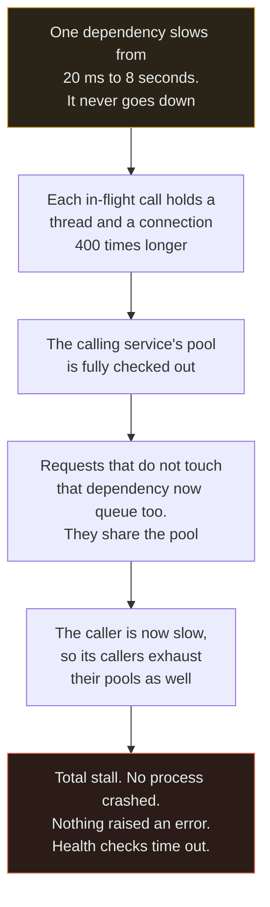

# No Timeout

`[BEGINNER]` · A network call is made with no deadline, so one slow dependency holds every thread that touches it and takes down services that do not even use it.

---

## 1. What it looks like

> "One slow query in the reporting database took the entire platform down for two hours — including
> the checkout service, which does not use that database at all. Nothing had crashed. Every process
> was running. They just were not answering."

The signature is **everything hanging, nothing erroring**. Health checks time out rather than fail.
CPU is low. Memory is normal. Restarting a service brings it back for ninety seconds and then it
hangs again. And the blast radius makes no sense on the dependency diagram, because the propagation
path is the thread pool, not the call graph.

You will usually also find: connection pools fully checked out with every borrower waiting; a
dependency that never actually went *down* — it went from 20 ms to 8 seconds; and an incident
timeline where the first alert fired forty minutes after the degradation began, because slow does not
trip an error-rate alarm.

## 2. Why people do it

**A timeout is a guess, and a wrong guess causes harm.** Set it too low and you fail requests that
would have succeeded, adding errors on a healthy system to protect against an unhealthy one you have
not seen yet. That is a real cost, paid every day, against a hypothetical benefit.

**Nobody knows the right value.** Picking one requires knowing the callee's latency distribution
under load, which is not the distribution you measure in staging. Faced with a number they cannot
justify, most engineers leave it unset rather than write down something arbitrary.

**The defaults are infinite, or effectively so.** Many HTTP clients, database drivers and RPC
libraries ship with no read timeout at all. So "no timeout" is not usually a decision — it is the
absence of one, and it is invisible in a diff because it is the code that was not written.

**The dependency is usually fast.** In every test, every staging run and every normal day, the call
returns in 30 ms. A timeout looks like defensive code for a case that has never occurred.

**A timeout raises a question nobody wants to answer:** what do you do when it fires? Falling back,
degrading, or failing gracefully is design work, and leaving the call unbounded defers it
indefinitely.

The hidden assumption is that the failure mode you are protecting against is the dependency going
*down*. It is not. It is the dependency getting *slow*, which is both more common and far more
damaging.

## 3. What actually happens

**Slow is worse than down.** A dead dependency fails fast: connections are refused, errors are
raised, callers route around it, breakers open, and the failure is loud and contained. A slow
dependency does none of that. It holds a resource of yours for every request that touches it, and
resources are finite.

The arithmetic is Little's Law and it is unforgiving. Concurrency required equals arrival rate
multiplied by latency:

| Arrival rate | Latency | Concurrent slots needed | Against a pool of 200 |
|---|---|---|---|
| 100 rps | 50 ms | 5 | comfortable |
| 100 rps | 500 ms | 50 | fine |
| 100 rps | 2 s | 200 | **saturated exactly** |
| 100 rps | 8 s | 800 | **4× over. Everything queues** |
| 100 rps | unbounded | unbounded | total stall |

Nothing about the traffic changed in that table. The only variable is the callee's latency, and a
40× slowdown in one dependency exhausts a pool that was comfortably sized at normal speed.

**The step from C to D is the one that surprises people.** The damage is not confined to callers of
the slow dependency, because the resource being exhausted — the thread pool, the connection pool, the
event loop's concurrency budget — is shared by every request the service handles. That is how a
reporting database takes down checkout.

The step from D to E is why it becomes a company-wide incident: a saturated service is
indistinguishable from a slow dependency to *its* callers, so the condition propagates upward through
the call graph, one pool at a time.

And a timeout is the mechanism that converts *slow* into *down* — deliberately, because *down* is the
failure mode you can actually handle. A loud failure can be retried, routed around, degraded or
shed. A hang can only be waited on.

## 4. How it fails

| Failure | Mechanism | What you see |
|---|---|---|
| **Thread or connection pool exhaustion** | Concurrency needed equals rate times latency, and latency grew | Every request queues, including ones with no relation to the slow dependency |
| **Blast radius beyond the dependency graph** | The exhausted resource is shared across all handlers | Services that do not use the slow component go down. The diagram does not explain the incident |
| **Cascade upward** | A saturated caller looks slow to *its* callers | The failure climbs the call graph, one pool at a time |
| **Health checks fail last** | Health endpoints share the same pool | The load balancer keeps sending traffic to a service that cannot answer, then pulls out everything at once |
| **Alerts fire late** | Slow does not raise errors | First alert arrives long after the degradation began, usually from a customer |
| **Restarts do not help** | The dependency is still slow | Recovery attempts fail in a loop, which looks like a crash loop and is misdiagnosed as one |
| **Retries make it worse** | Retrying a slow call holds more resources for longer | See [retry storm](../retry-storm/). Retries without timeouts are the worst combination on this site |
| **Connection acquisition has no timeout either** | The pool `borrow` blocks forever | The sneakiest variant: you set a socket timeout and still hang, waiting for a slot |
| **Timeouts increase down the chain** | An inner call has a longer timeout than its caller | The caller gives up while the callee keeps working, so the work is wasted and possibly repeated |
| **Graceful shutdown never completes** | Draining waits on in-flight requests that never finish | Deploys hang, then get force-killed mid-request |

## 5. The fix

**Put a timeout on every network call.** HTTP, RPC, database, cache, DNS, object storage, third-party
API. There are no exceptions, including calls that are "always fast" — the ones that are always fast
are the ones nobody has bounded.

**Derive timeouts from a deadline budget, not from per-hop constants.** The edge decides how long the
user will wait — say 2 seconds. Each hop passes the *remaining* budget downstream and no call may
exceed it. This is the only approach that composes: per-hop constants do not add up to anything in
particular, and the sum is what the user experiences.

**Every timeout must be shorter than its caller's.** If A waits 2 s and B waits 5 s on C, then B is
still working on a request A has already abandoned. Check them as a chain, not individually — the
mismatch usually lives in configuration files that nobody reads side by side.

**Set both the connect and the read timeout**, and separately the **connection-pool acquisition
timeout**. The last one is the most commonly missed: a perfectly bounded socket call still hangs
forever if borrowing a connection from an exhausted pool has no limit.

**Add a circuit breaker behind the timeout.** Timeouts bound each individual call; a breaker stops
making them at all once the dependency is clearly unwell, which is what actually gives the dependency
room to recover. See the [implementation](../../18-implementations/circuit-breaker/).

**Bulkhead the pools.** Give the slow, non-critical dependency its own bounded pool so that
exhausting it cannot starve checkout. This is what breaks the C-to-D step in the diagram, and it is
the difference between a degraded feature and an outage.

**Pick the number from p99 under load, then check it against user patience.** A timeout at roughly
2–3× the callee's p99 fails almost nothing that would have succeeded, and cuts off the tail that
causes the damage. Where the two conflict, user patience wins: a call that would need 30 seconds to
succeed has already failed from the user's point of view.

**Then decide what happens when it fires** — a cached last-known-good answer, a degraded response, a
clear error. A timeout with no handling converts a hang into a 500, which is better but not finished.

## 6. How to recognise it in a review

- **Any HTTP, database, cache or RPC client constructed without an explicit timeout.** One line, and
  it is the highest-value lint rule on this entire site.
- **A connection pool with no acquisition timeout.** Look for it specifically; it is almost always
  missing even where socket timeouts are set.
- **A timeout longer than the caller's own.** Trace the chain from the edge inward and check the
  numbers descend.
- **A 30-second timeout on a call whose p99 is 50 ms.** That is a timeout in name only — the pool is
  exhausted long before it fires.
- **A retry policy on a call with no timeout.** Retries and timeouts are one change. Retrying an
  unbounded call multiplies the resource hold.
- **A health endpoint that shares the main thread pool** or that calls dependencies without their own
  short deadline.
- **A new synchronous dependency added to a request path** with no note on what happens when it is
  slow. Not down — slow.
- **A background job or worker with no per-item deadline.** One stuck item can hold a worker
  indefinitely.
- **`timeout: 0` or `-1` in configuration**, which usually means infinite rather than instant. Check
  the library's convention; both meanings exist and they are opposites.

## 7. Exercises

**1.** A service calls a dependency whose latency rises from 20 ms to 8 seconds. Traffic is 100
requests per second and the thread pool holds 200. What happens, and how long does it take?

Answer

Concurrency required is arrival rate times latency: 100 × 8 = **800 concurrent slots** against a pool
of 200. The pool saturates in roughly two seconds, and after that every incoming request queues
behind an in-flight call that will not return for eight seconds.

The important part is what happens next, and it is not confined to callers of the slow dependency.
The exhausted pool is shared by **every** handler in the service, so endpoints with no relationship to
that dependency stop responding too. Then the service's own callers see *it* as slow, exhaust their
pools, and the condition climbs the call graph.

Note what does not happen: nothing crashes, no error rate rises, CPU stays low, and memory looks
normal. Health checks that use the same pool time out rather than fail, so the load balancer's view
degrades ambiguously. The first alert typically comes from a customer.

A timeout of, say, 200 ms would have converted this into a bounded failure: 100 rps × 0.2 s = 20
slots, well within the pool, with the excess surfacing as fast, visible errors that a breaker and a
fallback can act on. **That is the whole purpose of a timeout — it converts slow, which you cannot
handle, into down, which you can.**

**2.** Service A calls B with a 5-second timeout. B calls C with a 10-second timeout. What is wrong?

Answer

The inner timeout is longer than the outer one, so between 5 and 10 seconds B is doing work for a
request that A has already given up on. Three things go wrong at once.

**Wasted capacity.** B holds threads and connections for up to 5 extra seconds per abandoned request,
precisely when it is already struggling. Under load this is a large fraction of the pool.

**Wasted or duplicated side effects.** If A retries after its 5-second timeout, B may still be
completing the first attempt. If the operation is not idempotent, that is a duplicate — see
[no idempotency](../no-idempotency/), which is the standard companion to this bug.

**A misleading picture.** B's own metrics record the call as successful at 8 seconds. A recorded it
as a timeout. Neither service's dashboard shows what actually happened, and the two teams will
disagree about which one is broken.

The fix is a **deadline budget** rather than per-hop constants. A sets a deadline — 5 seconds — and
propagates the *remaining* time with the request. B takes what is left, subtracts its own overhead,
and passes a smaller number to C. Every timeout in the chain is then strictly smaller than its
caller's by construction, and adding a fourth hop later cannot break the invariant.

**3.** A team sets socket timeouts on every HTTP call. During the next incident, the service hangs
anyway. Name the timeout they forgot.

Answer

The **connection-pool acquisition timeout** — the bound on how long a thread waits to borrow a
connection, before any socket operation begins.

When a dependency is slow, every pooled connection is checked out and held. New requests block at the
`borrow` call, which in most clients waits indefinitely by default. The socket timeout is configured
correctly and never gets a chance to apply, because no socket was ever obtained.

Two neighbours of the same bug are worth checking at the same time. **Connect timeout** and **read
timeout** are separate settings in most libraries, and setting only the read timeout leaves TCP
connection establishment unbounded — which is exactly what hangs when a host is unreachable rather
than slow. And **DNS resolution** frequently sits outside every timeout the library exposes, so a
failing resolver produces the same symptom with none of the settings involved.

The general rule: a timeout bounds one specific wait, and a request contains several. Enumerate every
place a request can block — resolve, connect, acquire, write, read, and the total call — and bound
each of them. Then test it by making a dependency artificially slow rather than by taking it down,
because down is the failure mode that already works.

## 8. Related

- [Reliability](../../00-foundations/reliability/) — timeouts, retries, breakers, and why a loud failure beats a silent one
- [Circuit breaker implementation](../../18-implementations/circuit-breaker/) — what to do once the timeout fires
- [Retry storm](../retry-storm/) — retries without timeouts is the worst pairing on this site
- [No idempotency](../no-idempotency/) — a timeout is exactly the moment a caller cannot tell what happened
- [Latency](../../00-foundations/latency/) — p99 is the number a timeout should be derived from
- [Premature microservices](../premature-microservices/) — every extra hop is another unbounded call to get wrong
- [Circuit breaker and service](../../14-component-combinations/circuit-breaker-and-service/) — the pairing and its usual misconfiguration
- [Anti-pattern index](../README.md) · [Glossary: timeout](../../GLOSSARY.md#timeout)
