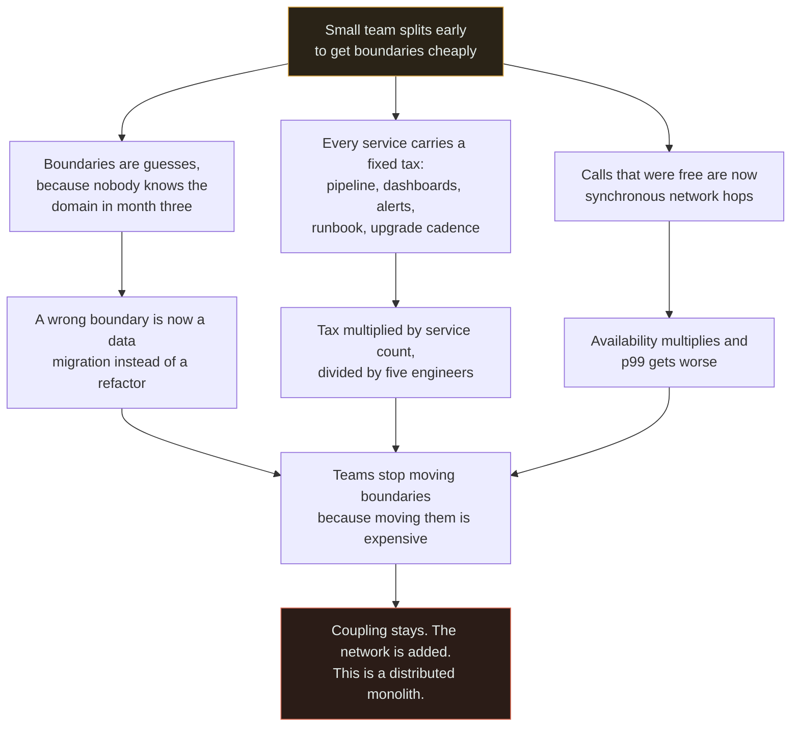

# Premature Microservices

`[INTERMEDIATE]` · A small team splits a young product into services before anyone knows where the boundaries are, and pays the full operational price of distribution for none of the organisational benefit.

---

## 1. What it looks like

The report, roughly verbatim, six to twelve months after the split:

> "We moved to microservices last year. Shipping a feature now takes three weeks instead of three
> days, because it touches four repositories and they have to go out in the right order. Nobody can
> run the system locally any more. p99 went up. When something breaks at night we spend the first
> forty minutes working out **which** service broke. And we still have the same four engineers."

Concrete numbers that accompany it: nine services and five engineers. A `docker-compose.yml` with
eleven entries that no laptop can run. A release checklist with an ordering section. A staging
environment that is the only place the system exists as a whole, and which is therefore permanently
broken. Availability that is worse than it was, while every individual service comfortably meets its
SLO.

The tell that distinguishes this from ordinary growing pains: **nobody can name which two teams the
split unblocked**, because there was only ever one team.

## 2. Why people do it

The argument is good, and pretending otherwise is why this mistake keeps being made. Here it is at
full strength:

**Boundaries are far cheaper to establish than to retrofit.** A monolith accretes coupling
continuously and nobody is ever given a quarter to pay it down. Every month you wait, the tangle
grows and the eventual extraction gets more expensive.

**The migration lands at the worst possible time.** If the product succeeds, the day you finally need
to split is the day the team is busiest, the system is most load-bearing, and the risk appetite is
lowest. Doing it early is doing it while it is cheap.

**The network enforces a boundary that willpower does not.** Everyone has watched a "modular"
monolith rot into a ball of mud because a deadline made one cross-module query irresistible. A
network boundary cannot be crossed by accident. That is a genuine, structural difference and it is
the strongest argument on this list.

**Independent scaling and independent failure are real properties**, and they are properties you
cannot retrofit in an afternoon.

**Hiring is easier.** Candidates ask about the stack. This is not a technical argument but it is a
real cost, and dismissing it is how architects lose credibility with the people paying salaries.

Every one of those is true. What makes the outcome bad is a precondition, and it is not on the list.

## 3. What actually happens

The precondition for microservices is **enough teams to get in each other's way**. Remove it and each
of the arguments above inverts, one at a time.

Read the three middle branches as independent costs that arrive together. The left one is
correctness, the middle one is operations, the right one is performance — and they converge on the
same place, because once the boundaries are expensive to move, nobody moves them, and a boundary you
cannot move is a coupling you have to live with.

The arithmetic that ends most arguments is in the right-hand branch. **Availability multiplies down a
synchronous chain.** Five services at 99.9% each in a request path give roughly 99.5% — about 44
hours a year — from five components that every dashboard would call healthy. Nobody missed an SLO.
The architecture did it on its own.

The tax in the middle branch is the one that is chronically underestimated because it is invisible
per-service and enormous in aggregate. A service costs the same to operate whether it is 200 lines or
20,000: a repository, a build pipeline, a deployment, a runtime to patch, a dashboard set, alerts
somebody tuned, a dependency-upgrade cadence, a security-patch cadence, a slot in the local
development setup, an entry in the runbook, and a place in somebody's head. **Nine of those across
five engineers means each person nominally owns two services they touch once a quarter**, which in
practice means nobody knows how any of them work when one breaks at 2am.

## 4. How it fails

| Failure | Mechanism | What you see |
|---|---|---|
| **Wrong boundaries** | The domain was unknown at month three. The boundary was drawn around nouns | A typical feature touches four services. The tell is measurable, and it is the single best architectural health metric |
| **Availability multiplies** | Every synchronous hop is a term in the product | Worse availability than the monolith, with every service meeting its SLO |
| **p99 gets worse** | In-process calls became network calls, and a request touching many services hits *someone's* p99 nearly every time | The latency graph gets worse after a change that was sold on performance |
| **Split invariants** | Two operations that must be atomic ended up in different services | A saga, compensating actions, reconciliation jobs, and a class of bug that only appears under partial failure |
| **Operational tax** | Fixed per-service cost, independent of service size | Engineers spend their time on pipelines and upgrades rather than on the product |
| **Debuggability collapses** | The stack trace was given up and distributed tracing was not installed first | Incidents begin with forty minutes of locating the failure |
| **Local development dies** | The system only exists when everything runs | Everyone develops against shared staging, which is permanently broken |
| **Chatty code becomes an outage** | A loop that called a module function 1,000 times per request is now 1,000 round trips | One endpoint is inexplicably 40× slower than the rest |
| **Retry amplification** | Retries compose multiplicatively down a chain | Three hops each retrying three times means 27× load on the service already struggling. See [retry storm](../retry-storm/) |
| **It ends as a distributed monolith** | Coupling was relocated, not removed | Ordered releases, shared schema, and the [worst of both](../distributed-monolith/) |

## 5. The fix

**Build a modular monolith and enforce the boundaries mechanically.** One deploy, one process, and
module boundaries checked by the build: package visibility, architecture tests in CI, one schema per
module, no cross-module table access, no shared mutable state. This answers the strongest argument in
§2 — the network is not the only thing that can enforce a boundary; a failing build does it earlier
and cheaper.

**Get the scaling benefit without the split.** Run the same artefact in multiple roles behind
separate autoscaling groups, each with its own instance type and limits. Independent scaling almost
never requires independent deployables, and this is the substitution that dissolves most of the
technical case. [ADR-0004](../../ADRs/0004-no-microservices-yet.md) is a worked example.

**Get the isolation benefit from asynchrony, not from services.** A queue between two modules removes
the availability term entirely, because the caller no longer needs the callee to be up. That is the
single most effective availability intervention available, and it works inside one artefact.

**Write down the trigger.** Not "we will revisit in a year" — a measured condition with a threshold
and an owner: median merge-to-production time above a working day, or more than two unrelated reverts
a month, sustained for a quarter. Then split when it fires, and not before.

**When you do split, extract the least-coupled module first**, not the most painful one. The first
extraction is how the team learns what a service actually costs. Learn that on something cheap.

**And merge back when you were wrong.** Recognising a bad boundary and undoing it is a sign of
competence. Almost nobody does it, and it is almost always the right call when a small team is
carrying more services than people.

## 6. How to recognise it in a review

Tells you can see, ranked by how conclusive they are:

- **The pull request touches more than one repository**, and the description says which order to
  merge in. This is the strongest single signal, and it is visible without knowing anything about the
  system.
- **Service count exceeds engineer count.** Just count. It is a one-minute diagnostic and it is
  usually decisive.
- **Two services share a database schema.** That is not a boundary, it is a naming convention with
  network latency attached — and it makes the real split harder later.
- **A service whose entire API is called by exactly one other service, synchronously, on every
  request.** That is a function with a network in front of it.
- **A new synchronous call added to a request path**, with no timeout, no fallback and no mention of
  what happens when the callee is down. Ask what the availability target is now.
- **A shared `common` library containing domain types**, not utilities. Every service now redeploys
  when it changes, which is the coupling you were trying to remove.
- **The design document justifies the split with "scale" or "performance"** and does not name two
  teams that are blocking each other.
- **Distributed tracing is listed as future work.** You have removed the stack trace without
  replacing it.

## 7. Exercises

**1.** A five-person startup is designing a new product. The CTO wants microservices "so we can scale
later". Give the strongest version of that argument, then answer it in a way that leaves the CTO's
actual concern satisfied.

Answer

**The strongest version.** Boundaries are much cheaper to establish at the start than to retrofit; a
monolith accretes coupling nobody is given time to pay down; hiring is easier with a modern stack;
and if the product succeeds, the migration lands exactly when the team has the least capacity to do
it. Doing it now is doing it while it is cheap.

**The answer has three parts, and only the third one actually resolves it.**

The boundaries will be wrong, because nobody knows the domain in month one — and a wrong boundary
inside one process is a refactor of an afternoon, while a wrong boundary across services is a data
migration, a dual-write period and a quarter.

Five people cannot operate a service estate. Each service is a pipeline, a runtime, dashboards,
alerts, a runbook and a slot in someone's head, and that tax is paid every week regardless of
traffic.

And the stated benefit is not the stated problem: "scale later" is about load, and microservices do
not address load. Horizontal scaling of one artefact behind a
[load balancer](../../03-load-balancing/fundamentals/) does, and it is available today.

**What to offer, so the concern is met rather than dismissed:** a modular monolith with boundaries
enforced by the build — package visibility, architecture tests in CI, one schema per module, no
cross-module table access. That delivers every discipline benefit the CTO wants, keeps transactions
and stack traces, and leaves each module extractable. Then write the trigger down now, while it is
uncontroversial: **when teams start measurably blocking each other on releases.** The CTO's real fear
is that the decision will never be revisited, and a written trigger is what removes it.

**2.** A team argues that their video-transcoding workload needs 100 CPU-bound machines while their
API needs four, so they must split into services. Is this a good argument?

Answer

It is a good *observation* and a bad *inference*. The scaling profiles genuinely diverge, which is
one of the few legitimate technical reasons on the list — but divergent scaling requires independent
**processes**, not independent **deployables**.

Run the same artefact in two roles behind separate autoscaling groups, with different instance types
and different limits. You get the entire scaling benefit and pay none of the distribution costs: one
build, one version, no version skew, one rollback, real transactions where the two roles touch shared
state, and one on-call rotation.

Notice too that the transcoder is almost certainly already behind a
[queue](../../06-messaging/queues/), because nobody transcodes video synchronously. If it is, the
availability boundary already exists and a service split would add nothing to the isolation either.

The argument becomes a good one when it changes shape: when the transcoder needs a *different
runtime* — a GPU, a native library that conflicts with the API's dependencies, a different language.
That is a technical constraint a role split cannot satisfy, and it is the honest trigger.

**3.** Six months after a split, a team measures that a typical feature requires releasing four
services in a specific order. Someone proposes buying a release-orchestration tool. What do you say?

Answer

That the tool would automate the symptom and entrench the disease. Ordered multi-service releases are
the defining property of a [distributed monolith](../distributed-monolith/): the coupling of one
deployable with the failure modes of a distributed one. An orchestrator makes that state comfortable,
which means it will never be fixed — and it adds a component whose own failure blocks every deploy.

Diagnose first. If four services change together for a typical feature, the boundaries do not match
how the system actually changes. The commit history tells you: which files change in the same commit,
consistently? Those belong together. Very often three of the four should be merged.

Where a split is genuinely right and ordering still bites, the fix is **compatibility, not
orchestration** — make every change backwards compatible so release order stops mattering. That is
expand-contract applied to service interfaces, and you need it anyway, because during any rolling
deploy two versions are live at once whether you planned for it or not. See
[versioning](../../07-api-design/versioning/).

## 8. Related

- [Monolith vs microservices](../../02-architecture/monolith-vs-microservices/) — the full treatment, with the availability and team-size tables
- [Monolith vs microservices comparison](../../comparisons/monolith-vs-microservices.md) — the deciding question in short form
- [ADR-0004: no microservices yet](../../ADRs/0004-no-microservices-yet.md) — this decision, made properly, with triggers
- [Distributed monolith](../distributed-monolith/) — where this ends up
- [No timeout](../no-timeout/) · [Retry storm](../retry-storm/) — the two failures that arrive with the network
- [Availability](../../00-foundations/availability/) — why synchronous hops multiply
- [Queues](../../06-messaging/queues/) — the only thing that stops the multiplication
- [Observability](../../11-observability/) — tracing replaces the stack trace you gave up
- [Anti-pattern index](../README.md) · [Glossary](../../GLOSSARY.md)
