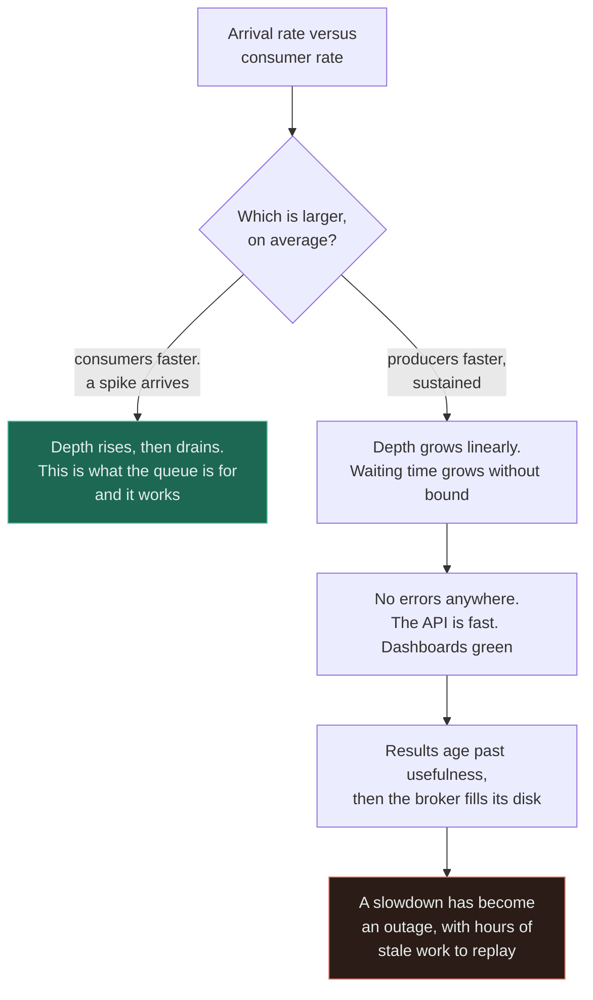

# Queue Without Backpressure

`[INTERMEDIATE]` · An unbounded buffer is added to absorb spikes, so a sustained overload stops producing errors and starts producing a silently growing backlog instead — until the disk fills or the results are too old to be worth having.

---

## 1. What it looks like

> "Everything was green. The API was fast, error rates were zero, the dashboards were fine. Then
> support started asking why order confirmation emails were arriving four hours late, and an hour
> after that the broker ran out of disk and we lost the queue."

The distinguishing feature is that **nothing looked wrong for hours**. That is not incidental — it is
the mechanism. An unbounded queue converts a capacity problem, which would have been loud and
immediate, into a latency problem, which is silent until it is enormous.

Common accompanying details: a depth graph rising in a straight line; an alert on depth that was set
at a threshold the queue passed at 3am and that nobody was awake for; a worker autoscaler configured
on CPU, which never fired because the workers were not CPU-bound; and a restart that replays hours of
work whose results are no longer wanted.

## 2. Why people do it

**Absorbing spikes is the entire point of a queue**, and this is not a misunderstanding — it is the
correct description of what queues are for. A traffic spike that would have exceeded capacity becomes
a few minutes of backlog and nobody notices. That is a real and large benefit.

**Adding a bound appears to give that benefit up.** If the queue can be full, then requests can be
rejected, and rejecting requests is the outcome the queue was bought to prevent. The reasoning is
direct and it feels like a regression.

**Rejecting work feels worse than delaying it.** Given a choice between telling a user "no" and
telling them "shortly", every product instinct says the second. And for a spike, the second is
genuinely better.

**Queues are usually introduced *because* something was already overloaded**, so the team's mental
model at the moment of adoption is "we did not have enough capacity, and now we can cope". Sizing a
bound requires knowing the sustainable consumer rate, which is exactly the number nobody has.

**Brokers default to unbounded**, or to a bound so large it is effectively unbounded. So this is
frequently not a decision at all.

The hidden assumption: that the overload is a *spike*. A queue buys time against a temporary
imbalance. Against a sustained one it buys nothing at all — it only changes how the failure presents.

## 3. What actually happens

**A queue does not add capacity. It defers work.** If the arrival rate exceeds the service rate on
average, depth grows linearly and waiting time grows without bound. No amount of buffer changes that;
buffer size only determines how long the illusion lasts.

The two branches use the same component and differ only in an inequality that nobody measured. The
green branch is why queues exist; the red one is the same queue meeting a condition it cannot help
with. **The decisive question is never "should we add a queue" — it is "what is the sustainable
consumer rate, and what do we do when arrivals exceed it".**

Three secondary mechanisms make it worse than the arithmetic suggests.

**The queue removes the backpressure the database used to provide.** On a synchronous path, a slow
database slows the caller, which throttles arrivals — an unplanned but effective control loop.
Behind a queue, workers hammer the database at their own pace with nothing pushing back, and a worker
pool can generate write load a synchronous path could never have produced. Adding a queue can make
the downstream *worse*.

**Stale work is still executed.** After four hours, the confirmation email, the cache warm, the
notification and the retry are all worth less than nothing — but the workers do not know that and
will faithfully process every one before reaching anything current.

**Depth is the wrong alarm.** Ten messages that are three hours old is a far worse signal than ten
thousand that are one second old, and a depth-only alert cannot tell the difference. Depth is a
function of both rate and age; age is the one the user experiences.

## 4. How it fails

| Failure | Mechanism | What you see |
|---|---|---|
| **Unbounded growth** | Arrivals exceed service rate on average | Depth rises linearly. Broker disk or memory exhausts. A slowdown becomes an outage |
| **Silent latency growth** | Work is deferred rather than rejected | Everything green for hours. Discovered by a customer, not by monitoring |
| **Stale results delivered** | The backlog is processed in order regardless of age | A four-hour-old "your order has shipped" email, and a cache warmed with data that has already changed |
| **Workers overwhelm the database** | The natural backpressure of the synchronous path is gone | Adding the queue made the downstream slower, which is the opposite of the intent |
| **Autoscaling never fires** | Consumers are scaled on CPU, but they are I/O-bound | Load rises, worker count does not, and the metric that would have shown it was not the one wired up |
| **Poison message stalls a partition** | One bad message retried forever with ordering guarantees | Depth grows for a subset of keys only, which is even harder to notice |
| **DLQ fills and is never read** | Failures move somewhere with no owner and no alert | Silent data loss, discovered during an unrelated investigation |
| **Restart replays hours of work** | The backlog survives the outage | Recovery takes longer than the outage, and the recovering system is loaded by its own backlog |
| **Retry amplification inside the queue** | Redelivery plus an application-level retry | Effective attempt count is the product. See [retry storm](../retry-storm/) |
| **Producer blocked unexpectedly** | The broker applies its own limit that nobody configured or documented | The failure mode you did not choose arrives anyway, at the broker's threshold rather than yours |

## 5. The fix

**Bound the queue, and decide explicitly what happens when it is full.** There are three answers and
all three are legitimate. What is not legitimate is not choosing, because then the broker chooses for
you at a threshold nobody picked.

| When the bound is reached | Behaviour | Right when |
|---|---|---|
| **Reject** | Return 429 or 503 with `Retry-After` | The producer is a client that can be told to slow down or come back |
| **Shed** | Drop the lowest-value work and count it | The work is individually disposable — telemetry, non-critical notifications |
| **Block the producer** | Apply the pressure upstream, all the way to the caller | The producer is internal and slowing it down is the correct system behaviour |

**Alert on message age, not only on depth.** Age is what the user experiences and it is the only
metric that catches slow consumers before they become a backlog.

**Autoscale consumers on depth or age, never on CPU.** Queue consumers are usually I/O-bound, so CPU
stays flat while the backlog grows. This one misconfiguration accounts for a large share of the
incidents on this page.

**Put a concurrency limit on the worker pool**, sized against what the downstream database can take.
The queue removed the natural control loop; the limit is how you put it back.

**Give messages a TTL** so that stale work is discarded rather than executed. Processing a four-hour-
old notification costs capacity and delivers negative value.

**Know your sustainable consumer rate**, and monitor arrivals against it. This is one division and
almost nobody does it. The queue only helps while arrivals are below that number on average.

**Propagate the pressure end to end.** Backpressure that stops at the queue boundary is not
backpressure — it is a bigger buffer. The signal has to reach whatever is generating the work.

## 6. How to recognise it in a review

- **A queue or topic declared with no maximum length, no retention limit, and no rejection policy.**
  Visible in one line of infrastructure configuration, and worth a lint rule.
- **An alert on depth but not on age**, or an alert on depth with a threshold nobody can justify.
- **A consumer autoscaling policy keyed on CPU utilisation.** Ask what the workers spend their time
  waiting on.
- **A worker pool with unbounded concurrency**, or with concurrency tuned against the broker rather
  than against the downstream database.
- **No message TTL**, on work that is time-sensitive. Ask what happens if this message is processed
  four hours late.
- **A DLQ with no alert and no named owner.** A DLQ nobody watches is a delete with extra steps.
- **A runbook whose only remediation is "scale up the workers"**, with no mention of a downstream
  concurrency cap.
- **A producer with no error handling for the publish call**, which reveals that nobody has
  considered the queue being full.
- **A design document that says the queue "absorbs load"** without stating the sustainable consumer
  rate.

## 7. Exercises

**1.** A queue is added in front of a service that was timing out under load. It works: errors go to
zero. Two weeks later the broker runs out of disk. What was misdiagnosed?

Answer

The overload was **sustained, not a spike**, and a queue only helps with spikes.

A queue defers work; it does not add capacity. If producers outpace consumers on average, depth grows
linearly forever and the only question is how much buffer there is before something breaks. Two weeks
was the answer.

What actually happened is worse than "the queue did not help": the queue **removed the signal**. The
timeouts were the system reporting a capacity deficit accurately and immediately. After the queue,
that report was replaced by silence, so nobody investigated for a fortnight — and during that
fortnight the deficit compounded.

The real fixes are all capacity or demand: more consumers, faster consumers, less work per item, or
less work admitted. The queue belongs in the design too, but with a bound, an age alert, and a stated
sustainable consumer rate against which arrivals are compared.

**2.** Queue depth is 10 and stable. Is the system healthy?

Answer

You cannot tell, and this is the trap the question exists for. **Depth is meaningless without age.**

Ten messages that are one second old means consumers are keeping up comfortably — the queue is doing
exactly what it should, and the depth is just the work in flight.

Ten messages that are three hours old means consumers are barely running, or one poison message is
blocking a partition, or the pool crashed and something is trickling through on a retry path. Depth
is low precisely *because* nothing is arriving or nothing is moving, and it will stay low while the
system is broken.

A depth-only alert cannot distinguish these, and it will happily stay green through the second one.
**Alert on the age of the oldest unprocessed message** — that is the number that corresponds to what
a user experiences — and use depth as a secondary signal for capacity planning and autoscaling.

**3.** Adding a queue in front of a database made the database *slower* under load than it was on the
synchronous path. Explain how.

Answer

The synchronous path had accidental backpressure and the queue removed it.

Before: a slow database slowed the request handler, which held connections, which slowed the caller,
which reduced the arrival rate. An unplanned control loop, but a real one — the database's own
slowness limited how much work could be sent to it.

After: producers hand work to the broker in microseconds and return. Workers pull at their own pace,
with a concurrency determined by the pool size rather than by anything the database says. Nothing in
the system reduces the load in response to the database struggling, so a worker pool of 200 will
happily maintain 200 concurrent slow queries indefinitely — a level of concurrency the synchronous
path could never have reached, because it was self-limiting.

The fix is to put the control loop back deliberately: a **hard concurrency limit on the worker pool**,
sized against what the database can serve, plus batching to reduce round trips. Then scale the pool on
queue depth, bounded by that limit. The general lesson is worth keeping: **asynchrony removes
feedback, and feedback you removed by accident has to be re-added on purpose.**

## 8. Related

- [Queues](../../06-messaging/queues/) — semantics, DLQs, ordering, and why depth alone is not an alert
- [Workers](../../06-messaging/workers/) — the consumer side, concurrency and poison messages
- [Queue and workers](../../14-component-combinations/queue-and-workers/) · [Queue and database](../../14-component-combinations/queue-and-database/) — the pairings where this bites
- [ADR-0002: queue for click analytics](../../ADRs/0002-queue-for-click-analytics.md) — a queue adopted with the bound and the alerts written down
- [No idempotency](../no-idempotency/) — at-least-once redelivery makes this mandatory
- [Retry storm](../retry-storm/) — redelivery plus application retries multiply
- [Throughput](../../00-foundations/throughput/) — arrival rate against service rate, which is the whole page
- [Anti-pattern index](../README.md) · [Glossary: backpressure](../../GLOSSARY.md#backpressure)
