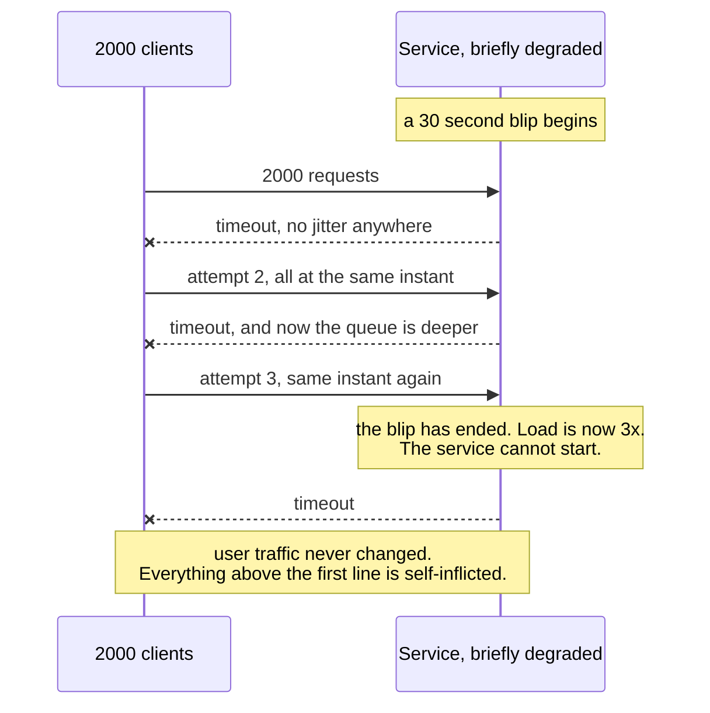

# Retry Storm

`[INTERMEDIATE]` · Every client retries a struggling service at the same moment, so the load that caused the problem is multiplied at precisely the instant the service was about to recover.

---

## 1. What it looks like

> "The payments service had a thirty-second blip. It was down for forty minutes. Every time we
> restarted it, it fell over again within seconds. Traffic from users never went up — the graph is
> flat. But the request rate *at the service* went to nine times normal and stayed there."

The signature is the divergence between two graphs that should track each other: **inbound user
traffic flat, downstream request rate multiplied.** Everything in between is self-inflicted.

Other symptoms that arrive with it: a recovery that never completes because each restart is
immediately re-saturated; load that arrives in synchronised waves rather than smoothly; connection
pools exhausted upstream while the downstream service reports low CPU because it is spending all its
time on connection setup; and — the one that turns an outage into an incident — duplicate side
effects, because the retries were not idempotent.

## 2. Why people do it

Retrying is correct. It is the single most effective reliability technique available and the argument
for it is unimpeachable:

**Most faults are transient.** A dropped packet, a brief GC pause, a node being replaced during a
rolling deploy, a connection reset. In every one of those cases the second attempt succeeds, and the
user never knows anything happened. Not retrying means failing requests that would have worked.

**Distributed systems make transient failure the normal case, not the exception.** At scale, rare
becomes constant. A design that does not retry is a design that surfaces infrastructure noise to
users as errors.

**Libraries retry by default,** often invisibly — the HTTP client, the SDK, the database driver, the
service mesh. So retries are frequently not a decision anyone made; they are a decision several
people made independently without knowing about each other.

**Not retrying looks negligent in review.** "What happens if this call fails?" is a question every
reviewer asks, and "we retry" is the answer that ends the conversation.

The hidden assumption is that a retry is *cheap*. It is cheap for one client against a healthy
service. Against a *degraded* service, with many clients, the cost inverts entirely — and the
condition under which retries fire is exactly the condition under which they are most expensive.

## 3. What actually happens

Three amplifications compose, and any one of them alone is survivable.

**Amplification down a chain.** Retries multiply, they do not add. Three hops, each retrying three
times, means the deepest service can see **27×** the original load. Every layer thinks it is being
prudent.

**Synchronisation.** All the clients failed at the same instant — that is what an outage means — so
without jitter they all back off by the same amount and retry at the same instant. The load arrives
as a series of spikes rather than a smooth stream, and each spike is large enough to re-break a
recovering service.

**The recovery trap.** The moment the service comes back, it faces the accumulated backlog of every
retrying client at once, plus the new traffic. It falls over. Everyone retries again.

Read the timeline rather than the arrow count. **The blip ends part-way down and the outage
continues**, which is the whole phenomenon: after that point the service is being held down by its
own clients' good intentions. The sequence also shows why jitter matters more than backoff — the
attempts are stacked at identical instants, so even a long backoff would only move the spike, not
flatten it.

A fourth mechanism deserves separate mention because it is invisible in graphs: **a client timeout
shorter than the server's work time creates pure waste.** The client gives up at two seconds, the
server keeps working for five and completes successfully, and the client retries — so the server does
the work twice and the client sees two failures. Load doubles while success rate falls, and nothing
in the client's logs suggests the server ever succeeded.

## 4. How it fails

| Failure | Mechanism | What you see |
|---|---|---|
| **Multiplicative amplification** | Retries compose down a chain: 3 attempts × 3 hops = 27× | The deepest service sees load it has never been provisioned for, at its worst moment |
| **Synchronised waves** | No jitter, so every client backs off by the same interval | Load arrives in spikes. Each spike re-breaks the recovering service |
| **Recovery is impossible** | The backlog of every retrying client arrives the moment the service starts | Restarts fail repeatedly. The outage lasts far longer than the fault |
| **Duplicate side effects** | Retries without [idempotency](../no-idempotency/) | Double charges, double emails, corrupted counters. A reliability measure that creates data problems |
| **Retrying non-retryable errors** | Retrying a 400 or a validation failure | Load with a guaranteed zero success rate — pure amplification |
| **Timeout shorter than server work** | The server succeeds after the client has given up | Work performed twice, reported as failed once |
| **Connection-pool exhaustion upstream** | Retries hold pool slots while waiting | The *caller* becomes unhealthy, and its callers follow. Cascading failure with a healthy-looking origin |
| **Thundering herd on recovery** | Everyone reconnects at once, including cache fills and connection setup | The service spends its first seconds on TLS handshakes rather than requests |
| **Retry inside retry** | The HTTP client retries, and the service around it also retries | Nobody knows the real attempt count. It is the product, not the sum |
| **Load shedding defeated** | The service sheds load to protect itself; clients treat the shed response as retryable | The protection mechanism becomes an amplifier |

## 5. The fix

**Exponential backoff with jitter — and jitter is the important half.** Backoff alone spreads
attempts in time but keeps them aligned with each other. Full jitter — sleeping a random duration
between zero and the current backoff ceiling — is what converts a spike into a smooth arrival curve.
This is the highest-value single change on this page.

**Retry budgets, not retry counts.** Cap retries as a *fraction of overall traffic* — for example, no
more than 10% of requests may be retries — rather than as a per-request maximum. A count of three
sounds modest and becomes 27× down a chain; a budget cannot, because it is a global property.

**Retry at exactly one layer.** Decide whether the HTTP client, the service, or the mesh owns retries,
and turn it off everywhere else. Retries at two layers multiply, and nobody reading either layer's
code can see the total.

**A circuit breaker.** After a threshold of failures, stop calling entirely for a cooling-off period
and fail fast. This is what gives the downstream service the quiet it needs to restart, and it is the
only mechanism on this list that actually reduces load to zero. See the
[implementation](../../18-implementations/circuit-breaker/).

**Retry only what is retryable.** Timeouts, 429, 503, connection resets. Never a 400, a 401, a 404 or
a validation error — those will fail identically forever.

**Idempotency, without exception.** Every retried operation must be safe to apply twice, or your
reliability work is a corruption mechanism. This is not optional and it is the thing most often
skipped, because retries are easy to add and idempotency is easy to forget.

**Honour `Retry-After`,** and send it. A server that is shedding load knows better than its clients
when to come back.

**Cap the total attempt window with a deadline**, propagated down the chain, so that no amount of
retrying at any layer can exceed the time the caller is still willing to wait.

## 6. How to recognise it in a review

- **A retry policy with `maxRetries` and no jitter.** The single most common tell, visible in one
  line, and the one worth a lint rule.
- **Retries configured in the HTTP client *and* handled in the calling code.** Multiply them and ask
  whether anyone intended that number.
- **A retry loop with no cap on total elapsed time.** Attempts have a limit; the wall clock does not.
- **Retry on any non-2xx**, rather than on a specific retryable set. Ask what happens on a 400.
- **A retried call with a side effect and no idempotency key.** A payment, an email, an `INSERT`, a
  counter increment. See [no idempotency](../no-idempotency/).
- **No circuit breaker on a synchronous dependency** that is on a request path.
- **A client timeout that is shorter than the callee's own p99.** Look them both up; the mismatch is
  usually there in configuration files nobody compares.
- **Retries around a call that is itself behind a queue.** The queue already redelivers. You now have
  two retry mechanisms stacked.
- **A load-shedding response — 429 or 503 — treated as a generic failure** by the caller's retry
  policy.

## 7. Exercises

**1.** A service has three hops in its request path. Each layer retries three times on failure. The
deepest service has a brief outage. Quantify what it experiences, and name the single change with the
largest effect.

Answer

It sees up to **27× normal load** — 3 × 3 × 3 — arriving exactly when it is least able to serve it.
Each layer is individually reasonable and nobody configured a 27× amplifier; it is the product of
three independently sensible decisions.

The single largest change is a **retry budget** expressed as a fraction of traffic rather than a
per-request count, enforced at each layer. A budget caps amplification globally no matter how deep
the chain gets, and it survives someone adding a fourth hop later. Counts cannot do that, because the
problem is compositional and a count is local.

Very close second: **full jitter**, because without it the 27× arrives as three synchronised spikes
rather than as elevated steady load, and a spike is what prevents restart. And the change that
actually ends the incident is a **circuit breaker**, which is the only one of the three that takes
load to zero long enough for the service to start.

**2.** During an incident review, someone proposes removing all retries. Is that right?

Answer

No, and the proposal is worth engaging with rather than dismissing, because it correctly identifies
that retries caused the amplification.

Removing them trades a rare, severe failure for a constant, mild one: every transient fault —
dropped packets, GC pauses, rolling deploys, node replacements — becomes a user-visible error.
At scale that is a large and permanent degradation, and it is the reason retries exist.

The fix is to make retries *bounded and desynchronised* rather than to remove them: full jitter,
a retry budget as a percentage of traffic, one retrying layer only, a circuit breaker, and retry only
on retryable status codes. That keeps the benefit for the transient case and removes the
amplification in the degraded case, which is the only case where retries hurt.

There is one narrower version of the proposal that is often right: **remove retries from the inner
layers and keep them at the edge.** Retrying once, close to the user, where the total attempt count is
visible and the deadline is known, is much safer than retrying at every hop.

**3.** A dependency starts returning 503 with `Retry-After: 30`. Your client's retry policy sees a
non-2xx and retries after 100 ms, three times. What is wrong, and what should it do?

Answer

The dependency is **shedding load to protect itself**, and the client is treating that protection as
a transient fault to be overcome. The retry policy has converted a working defence mechanism into an
amplifier — the service says "come back in thirty seconds", receives three more requests within 300
milliseconds, and is pushed further into the state it was trying to escape.

The client should honour `Retry-After` as an instruction rather than a suggestion: wait the stated
interval, apply jitter around it so that thousands of clients do not return in the same millisecond,
and count the 503 towards a circuit breaker so that sustained shedding stops the calls entirely.

The general principle is worth stating separately, because it generalises well beyond this status
code: **a response that tells you the server is overloaded is not a transient fault.** Transient
faults are things that happened *to* the request. Load shedding is a decision the server made about
the system, and the correct response to it is to reduce load, not to reissue it.

## 8. Related

- [Reliability](../../00-foundations/reliability/) — retries, backoff, jitter, timeouts and breakers in full
- [Circuit breaker implementation](../../18-implementations/circuit-breaker/) — working code with measured behaviour
- [No timeout](../no-timeout/) — the failure that makes this one much worse
- [No idempotency](../no-idempotency/) — what turns a retry storm into a data corruption incident
- [Rate limiter](../../18-implementations/rate-limiter/) — the server side of the same problem
- [Premature microservices](../premature-microservices/) — more hops means more multiplication
- [Circuit breaker and service](../../14-component-combinations/circuit-breaker-and-service/) — the pairing, and how it is usually misconfigured
- [Anti-pattern index](../README.md) · [Glossary: retry storm](../../GLOSSARY.md#retry-storm)
