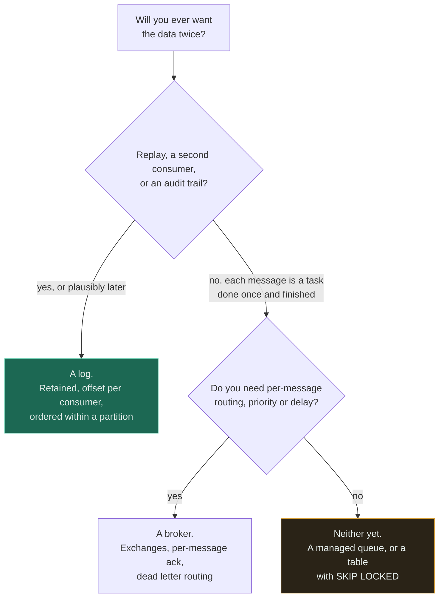

# Kafka vs RabbitMQ

**Verdict — if you will ever want the data twice, you want a log. If each message is a task that one
worker performs once and then it is finished, you want a broker. Everything else is detail.**

---

## The question that actually decides it

> ### Will you ever want the data twice?

Not "do you want it twice today". **Ever.** A bug found on Tuesday in code that processed Monday's
messages is fixable by replaying from Monday's offset — or it is not fixable at all, because the
messages were deleted the moment they were acknowledged. That single property decides more than
throughput, latency, routing or operational cost, and it is the one that cannot be added later.

The question has three practical forms, and a yes to any of them means a log:

- **Replay** — will you want to reprocess history after fixing a bug or changing the logic?
- **Multiple independent consumers** — will a second team want the same stream for a different
  purpose, without coordinating with the first?
- **Audit** — will anyone ask what the state was at a point in time?

The amber leaf is reached more often than either of the other two, and it is the one nobody puts on a
slide. Most systems that adopt a broker needed neither product — they needed somewhere to put work
that should not be on the request path.

## The comparison

| | **Kafka — a log** | **RabbitMQ — a broker** |
|---|---|---|
| After consumption | **Retained** for a configured period | **Deleted** on acknowledgement |
| Replay | Reset the offset | Impossible. It is gone |
| Consumers | Many independent groups, each with its own offset | One consumer gets each message |
| Ordering | Guaranteed **within a partition** | Best-effort, and lost with concurrent consumers |
| Scaling reads | Add consumer groups. They do not affect each other | Competing consumers on one queue |
| Scaling throughput | Add partitions — but partition count is sticky | Add queues and consumers |
| Routing | The consumer filters. The topic is dumb | **Rich** — topic, header, fanout exchanges |
| Per-message operations | Awkward. The offset moves forward | **Natural** — ack, nack, requeue, priority, delay, TTL |
| Backlog behaviour | Retained on disk by design. Depth is normal | Depth is memory pressure. A backlog is a problem |
| Delivery guarantee | At-least-once | At-least-once |
| Operational cost | Higher. Partitions, offsets, rebalances, retention | Lower. Familiar, single-node friendly |
| Latency at low volume | Good | Slightly better |
| Throughput ceiling | **Very high** — sequential disk writes | High, but lower |

Two rows do most of the deciding. **After consumption** is the deciding question restated as a
mechanism. **Per-message operations** is the reason a broker survives against a log for task queues:
retrying one message, delaying one message, prioritising one message and dead-lettering one message
are all natural in a broker and all awkward in a log, where progress is a single moving offset per
partition.

**Both are at-least-once.** Neither gives you exactly-once end to end, because it does not exist —
what is sold under that name is at-least-once plus deduplication inside one system's boundary.
Consumers must be [idempotent](../07-api-design/idempotency/) either way, and any comparison that
implies otherwise is selling something.

## When a log wins

- **Events, not commands.** "OrderPlaced" is a fact that several parties may care about; "SendEmail"
  is an instruction for exactly one.
- **A second consumer is plausible.** Analytics, search indexing, an audit store, a machine-learning
  pipeline — each reading the same stream at its own pace without knowing about the others.
- **Replay is your recovery plan** for consumer bugs, which are far more common than broker failures.
- **Ordering per key matters** — all events for one entity in sequence, which partitioning gives you.
- **Very high sustained throughput**, where sequential disk writes and batched fetches are the
  architecture.
- **The backlog is data**, not a problem. A consumer that is a day behind is catching up, not failing.
- **Stream processing** — windowed aggregation, joins between streams, materialised views.

[ADR-0002](../ADRs/0002-queue-for-click-analytics.md) is a worked instance: click events go to a log
specifically because the raw stream will be wanted for purposes nobody has specified yet.

## When a broker wins

- **Work queues** — each message is a task, done once, by one worker, and then it is finished.
- **Per-message control**: priority, delay, TTL, requeue with a count, and dead-lettering that is
  built in rather than assembled.
- **Complex routing** that you want the infrastructure to do — fanout to several queues, header or
  topic matching, per-consumer bindings.
- **Request-reply** patterns with correlation IDs.
- **Modest scale with a small team.** It is simpler to run, simpler to reason about, and the failure
  modes are more familiar.
- **You want depth to be an alarm.** In a broker, a growing queue means something is wrong — which is
  a useful property that a log deliberately does not have.

## When neither is the answer

The most likely outcome for a system that does not already have one of them.

**A database table with `SELECT ... FOR UPDATE SKIP LOCKED`.** A perfectly good queue up to a few
thousand jobs per second, transactional with the rest of your data — which removes a whole class of
dual-write bug — and it deletes an entire component from your architecture. This is the option that
should be beaten rather than skipped.

**A managed queue** — SQS or its equivalents. No brokers to run, no partitions to rebalance, no
upgrade path to own. If you want a work queue and do not want an operational burden, the honest
comparison is usually managed-queue versus table, and neither product on this page is in it.

**A cron job or a scheduler.** If the work is genuinely periodic, or if what you actually want is
"run this at 09:00", a queue is the wrong shape and you will end up building scheduling on top of it.

**An in-process bounded buffer.** For fire-and-forget work where losing a few seconds on restart is
acceptable, this is a few lines of code. See the alternatives table in
[ADR-0002](../ADRs/0002-queue-for-click-analytics.md), where it came second.

**A synchronous call.** If the caller needs the result and the work is fast, asynchrony is complexity
with no benefit. Being able to say this out loud is the mark of the discipline.

**And sometimes: both.** A log for events and a broker for task queues is a normal, defensible
architecture in a large system. It is two operational burdens, so it should be a decision rather than
an accumulation.

## Common mistakes

| Mistake | Why it is wrong |
|---|---|
| Choosing on throughput benchmarks | Almost nobody is near either product's ceiling. Retention semantics decide it |
| Using a log as a task queue | Per-message retry, delay and priority all fight the offset model |
| Using a broker for events | The second consumer arrives eventually and the data is already gone |
| Believing in exactly-once | It does not exist end to end. Make consumers idempotent regardless |
| Over-partitioning early | Partition count is sticky and each one has a cost. Ordering is per partition, so more partitions means weaker ordering |
| One partition to preserve global ordering | You have capped throughput at one consumer and called it a design |
| Ignoring consumer lag | The single most important metric for a log, and it is not depth |
| Alerting on depth only | In a log, depth is normal. **Age and lag** are the signals |
| Adopting Kafka for one queue | Partitions, offsets, rebalances and retention tuning, for work a table would have done |
| No dead-letter path | A poison message blocks a partition in a log and loops forever in a broker |

## Exercise

A team is choosing a message system for order events. Orders trigger emails today. They mention that
next quarter they will add analytics and fraud detection. Which do you choose, and what is the
argument that decides it?

Answer

**A log**, and the sentence that decides it is the one about next quarter.

Today the requirement looks like a work queue: one order, one email, done. A broker fits perfectly.
But analytics and fraud detection are two additional independent consumers of the *same* events, each
reading at its own pace with its own logic and its own failure modes. In a broker, serving them means
fanning out to three queues bound to an exchange, and each consumer's copy is still deleted on
acknowledgement — so a fraud model retrained in six months cannot be evaluated against last
quarter's orders, because they no longer exist.

The general test is the phrasing of the message. **"OrderPlaced" is a fact; "SendEmail" is an
instruction.** Facts attract consumers you did not anticipate. Instructions do not. A team writing
events in the past tense is usually describing a log whether they know it or not.

**The honest complication**, which should be raised in the same conversation: the email consumer is a
task queue and it will want per-message retry, delay and dead-lettering — the things a log is worst
at. The usual resolution is a log as the backbone with the email consumer maintaining its own retry
state, or a small managed queue fed from the log for that one job. Adopting a broker now and
migrating next quarter is the option that looks cheapest today and is not: **replaying history you
did not retain is impossible, and no amount of later effort recovers it.**

## Related

- [Queues](../06-messaging/queues/) — queue versus stream, delivery semantics, DLQs, and ordering
- [Workers](../06-messaging/workers/) — the consumer side, concurrency and poison messages
- [ADR-0002: queue for click analytics](../ADRs/0002-queue-for-click-analytics.md) — this question answered in a real design
- [Queue without backpressure](../anti-patterns/queue-without-backpressure/) — the failure both products share
- [No idempotency](../anti-patterns/no-idempotency/) — mandatory with at-least-once, which is both of them
- [Queue and workers](../14-component-combinations/queue-and-workers/) · [Queue and database](../14-component-combinations/queue-and-database/)
- [Comparison index](README.md) · [Glossary: backpressure](../GLOSSARY.md#backpressure)
