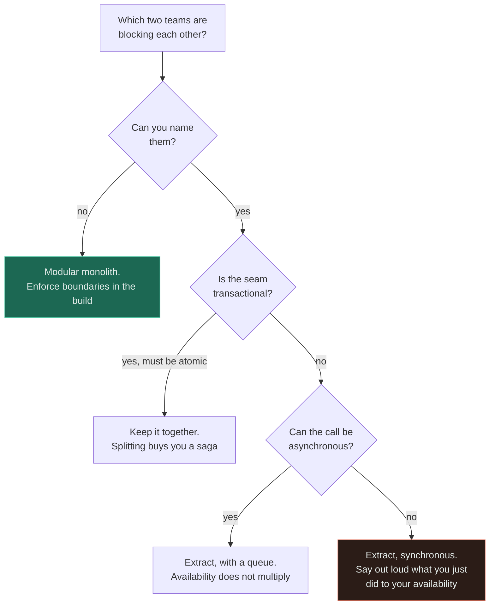

# Monolith vs Microservices

**Verdict — build a modular monolith. Microservices are an organisational answer to teams blocking
each other, not a technical answer to load, and the usual result of adopting them early is a
distributed monolith, which is worse than either.**

---

## The question that actually decides it

> ### Which two teams are blocking each other, and on what?

If you cannot name them — two specific teams, and the specific thing one waits on — the answer is a
monolith. Not "probably a monolith", not "a monolith for now": the answer is a monolith, because the
only benefit of microservices that survives scrutiny is the independent deploy, and an independent
deploy is worth nothing when there is nobody to be independent *of*.

Every other argument for splitting is either downstream of that one or available more cheaply:

| Argument for splitting | Honest assessment |
|---|---|
| Independent deployment | **Real, and the only one that survives scrutiny** |
| Independent scaling | Real, but achieved by running one artefact in several roles. Does not need separate deployables |
| Fault isolation | Real **only across an asynchronous boundary**. A synchronous call propagates failure rather than containing it |
| Smaller, comprehensible codebases | Available in a modular monolith at no cost |
| Technology diversity | Real, and usually a liability: five languages means five toolchains and five CVE feeds |
| Better performance | **False.** You replaced function calls with network calls |
| Easier to reason about | **False.** You replaced a stack trace with a distributed trace and a transaction with a saga |

The red leaf is not forbidden — plenty of correct architectures contain synchronous service calls. It
is marked because it is the branch people take without noticing there was a decision, and because it
is where the availability product silently changes.

## The comparison

| | **Ball of mud** | **Modular monolith** | **Microservices** |
|---|---|---|---|
| Deploy units | 1 | 1 | Many |
| Boundary enforced by | Nothing | Compiler, package visibility, CI architecture tests | The network |
| Cross-module call | Any function, any table | A published in-process interface | RPC |
| Transaction across modules | Yes | **Yes, trivially** | **No** — sagas and compensation |
| Cost of a wrong boundary | A rewrite | A refactor | A migration and a data split |
| Failure of one module | Whole process | Whole process | Contained *if* the boundary is async |
| Availability | One term | One term | **Multiplies per synchronous hop** |
| Debugging one request | A stack trace | A stack trace | Distributed tracing, or nothing |
| Team independence | None | Low | High |
| Operational cost | One pipeline, one rotation | One pipeline, one rotation | N of everything, forever |

The critical misreading this table exists to prevent: **"monolith" does not mean "unstructured".**
What people escape when they leave a monolith is usually column one. Microservices appear to fix it
because the network enforces boundaries the team was unwilling to enforce itself — but column two
gets you the same enforcement at compile time, with transactions and stack traces intact.

**Availability is the row that ends most arguments.** Ten synchronous services at 99.9% each give
99.0% — 3.7 days a year — with every service meeting its SLO and nobody at fault.

## When the monolith wins

- **Under roughly 20–25 engineers.** There are not enough teams for boundaries to be independent of,
  and Conway's Law makes fictional boundaries fuse anyway.
- **The domain is still moving.** Boundaries drawn now will be wrong, and being wrong inside one
  process is a refactor rather than a data migration.
- **Nobody is blocked.** If deploys are not queueing behind other teams, the benefit is zero.
- **Strong transactional invariants across the domain.** Splitting an invariant buys a saga, and a
  saga is a project.
- **Small operations capacity.** Three people cannot operate twelve services. Not "should not" —
  cannot.
- **You need to move fast.** One deploy, one rollback, one place to look.

## When microservices win

- **Named teams are measurably blocking each other on releases** — median merge-to-production above a
  working day, or repeated reverts caused by unrelated modules. The primary and often only reason.
- **A genuinely divergent runtime**, not merely a divergent scaling profile: a GPU, a JVM streaming
  framework, a native library that cannot coexist with the main artefact.
- **A divergent availability requirement with an asynchronous or fallback-able boundary.** Both halves
  matter; a synchronous split makes availability worse.
- **Regulatory or data-residency isolation** that the law requires and a module cannot provide.
- **An acquired or legacy system** with its own lifecycle. It was never going to be one deploy.
- **Above roughly 100 engineers**, which is the regime the pattern was invented in, by companies
  already in it.

## When neither is the answer

This is where most healthy systems actually live, and it is almost never presented as an option.

**A modular monolith plus two or three extracted services.** Extract only what earned it — the
compliance-isolated module, the one with the incompatible runtime — and leave the rest in one
artefact. Extremely common, usually right, and rarely named because it does not fit a slide with two
columns.

**One artefact run in several roles.** Separate autoscaling groups, separate instance types, separate
memory limits, same binary. This satisfies the divergent-scaling argument completely and costs
nothing: one build, one version, no skew, one rollback. If the argument for splitting was scaling,
this is the answer and it is available this afternoon.

**Coarse service-oriented architecture.** Three to five substantial services often beats thirty small
ones and is deeply unfashionable, which is the only real argument against it.

**The problem is not the architecture at all.** If deploys are slow because the test suite takes 40
minutes, splitting the codebase gives you seven slow test suites. Fix the pipeline. If the system is
slow, profile it, index it, cache it — splitting the process adds network hops to calls that were
free.

**Merging services back together.** If you are already split and it hurts, the answer may be fewer
services rather than better ones. Nobody wants to do this and it is frequently correct.

## Common mistakes

| Mistake | Why it is wrong |
|---|---|
| Microservices for performance | Function calls became network calls. Horizontal scaling was always available |
| Starting with microservices on a new product | The boundaries are wrong because the domain is unknown — and now they are data migrations |
| Splitting by noun — `User`, `Order`, `Product` | Guarantees chatty synchronous fan-out and invariants split across services |
| Services sharing a database | Not a boundary. A naming convention with latency, and it makes the real split harder |
| Ignoring the availability product | Ten 99.9% services in series is 99.0%, from components nobody would call unhealthy |
| Splitting without reorganising teams | Conway's Law wins. You get the same coupling over HTTP |
| More services than engineers | Nobody knows how any of them work when one breaks at 2am |
| No distributed tracing before the first split | You removed your ability to debug and did not replace it |
| Believing "monolith" means "no structure" | The modular monolith gets you boundaries without the network |
| Never merging services back | Undoing a wrong boundary is competence, not failure |

## Exercise

A team of six runs a modular monolith at 99.9% availability. They split it into eight synchronous
services, each also achieving 99.9%. Availability drops and nobody can explain it, because every
service is meeting its SLO. Explain it, and give the two changes with the largest effect.

Answer

Availability multiplies across synchronous dependencies. Eight services at 99.9% in one request path
give roughly 0.999⁸ ≈ **99.2%**, about 70 hours of downtime a year against the 8.8 hours they had.
Every service meets its SLO and the application is down eight times longer, because nobody owns the
*product* of the terms.

In practice it is worse than 99.2%: failures are correlated through the shared database and shared
deploy tooling, retries amplify load down the chain, and the split added eight new deploy surfaces —
and deploys, not hardware, cause most outages.

**The two highest-leverage changes.** Make hops asynchronous wherever the caller does not need the
answer: a [queue](../06-messaging/queues/) removes the term from the product entirely, because the
caller no longer requires the callee to be up. And make dependencies optional, with a fallback or a
cached last-known-good answer, so a failure degrades the response instead of failing it. Timeouts and
circuit breakers are necessary but they only bound the blast radius; they do not remove the
multiplication.

**The third option that should be on the table:** with six engineers and eight services, merging
several back together is very likely the correct engineering decision, and it is the one nobody will
propose.

## Related

- [Monolith vs microservices](../02-architecture/monolith-vs-microservices/) — the full treatment, with the team-size and availability tables
- [ADR-0004: no microservices yet](../ADRs/0004-no-microservices-yet.md) — this decision recorded, with measurable triggers
- [Premature microservices](../anti-patterns/premature-microservices/) · [Distributed monolith](../anti-patterns/distributed-monolith/)
- [Availability](../00-foundations/availability/) — the arithmetic that decides it
- [Queues](../06-messaging/queues/) — the asynchronous boundary that stops the multiplication
- [Comparison index](README.md) · [Glossary](../GLOSSARY.md)
