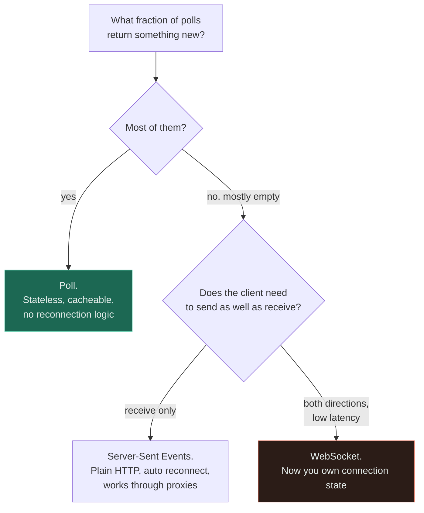

# Polling vs WebSocket

**Verdict — poll until the wasted requests cost more than a connection would, then use SSE. Reach for
WebSockets only when the client genuinely needs to send as well as receive.**

---

## The question that actually decides it

> ### How does the update rate compare with the freshness requirement?

It is a division, and it produces the number that decides everything: **the fraction of polls that
return something new.**

| Data changes every | Client needs it within | Polls per change | Useful polls |
|---|---|---|---|
| 5 minutes | 5 minutes | 1 | **100%** — polling is obviously right |
| 5 minutes | 5 seconds | 60 | 1.7% — 59 wasted requests per update |
| 1 second | 1 second | 1 | 100%, but at one request per second per client |
| 100 ms | 100 ms | 1 | Polling cannot keep up. The overhead is the payload |

Two thresholds fall out of that table and they are the whole decision.

**When most polls return something new, poll.** It is stateless, it is cacheable, it survives
restarts and load-balancer changes, it needs no reconnection logic, and it works through every proxy
ever built.

**When most polls return nothing, the client is asking a question it already knows the answer to** —
and the fix is for the server to speak instead. But note *which* fix: the next question is
directional.

> **Does the client need to send, or only to receive?**

Almost all "we need WebSockets" requirements are receive-only — notifications, live prices, progress
bars, feed updates, a job's status. Receive-only is what **Server-Sent Events** are for, and they are
plain HTTP with automatic reconnection built in.

The WebSocket leaf is marked red not because it is wrong but because it is the branch where the
architecture changes: you acquire per-connection state, a fan-out problem, and a deploy that drops
every connection at once. Those costs are invisible on a whiteboard and dominant in production.

## The comparison

| | **Short polling** | **Long polling** | **SSE** | **WebSocket** |
|---|---|---|---|---|
| Direction | Client asks | Client asks, server holds | **Server to client** | **Both** |
| Protocol | HTTP | HTTP | HTTP | Upgrade from HTTP, then its own framing |
| Latency to deliver a change | Up to the poll interval | Near immediate | Near immediate | **Lowest** |
| Wasted requests | **Many, when idle** | Few | None | None |
| Server state per client | None | One held request | One connection | One connection |
| Reconnection | Not applicable | Built in by nature | **Automatic, with event ID resume** | **You write it** |
| Proxy and firewall friendliness | Perfect | Good | Good | Occasionally blocked |
| Caching and CDN | **Yes** | Limited | No | No |
| Load balancer implications | None | Held connections consume slots | Long-lived connections | Long-lived, and often sticky |
| Deploy behaviour | Invisible | Brief blip | Reconnects itself | **Every client reconnects at once** |
| Binary payloads | Awkward | Awkward | No, text only | **Yes** |
| Complexity | **Lowest** | Low | Low | **Highest** |

**The row that decides most real arguments is "reconnection".** SSE reconnects on its own and can
resume from the last event ID; with WebSockets you write that logic, and you write it again for
backoff, for jitter, for authentication refresh, and for the case where ten thousand clients
reconnect in the same second after a deploy.

**And the row nobody costs in advance is "deploy behaviour".** A rolling deploy drops every
long-lived connection. Ten thousand clients reconnecting simultaneously is a
[thundering herd](../GLOSSARY.md#thundering-herd) against your own front door, and it happens on
every release rather than during an incident.

## When polling wins

- **The update rate is close to the freshness requirement**, so most polls return something.
- **Low client counts**, where the request overhead is irrelevant.
- **Freshness measured in tens of seconds or minutes** — order status, weather, a report that
  regenerates hourly.
- **The response is cacheable**, so a CDN or shared cache absorbs most of the load and the polls never
  reach your origin.
- **Reliability and simplicity matter more than latency.** Nothing to reconnect, nothing to keep
  alive, nothing sticky on the load balancer, no state to lose.
- **Mobile clients on unreliable networks**, where a long-lived connection is a battery and radio
  cost that a periodic request is not.
- **You are the client of someone else's API.** You do not get to choose their transport.

## When WebSockets win

- **The client genuinely sends as well as receives**, frequently and with low latency: chat,
  collaborative editing, multiplayer, live cursors, trading.
- **Sub-second latency in both directions** is a product requirement rather than a preference.
- **High message rates per connection**, where per-message HTTP overhead would dominate the payload.
- **Binary protocols** — audio, video signalling, custom framing.
- **You are prepared to own the operational consequences**: connection state, fan-out across servers,
  heartbeats, backpressure per connection, and a reconnect storm on every deploy.

## When neither is the answer

The most likely outcome, and the reason this page has four columns rather than two.

**Server-Sent Events, for anything receive-only.** Notifications, progress, live counters, dashboard
updates, price ticks. It is plain HTTP over one long-lived response, it reconnects automatically, it
resumes from a last-event ID, it works through the proxies that block WebSocket upgrades, and it
needs none of the bidirectional machinery. **Most systems that adopted WebSockets should have used
SSE**, and the tell is that the client never sends anything but heartbeats.

**Long polling**, which is unfashionable and still excellent: near-immediate delivery over ordinary
HTTP with no persistent-connection infrastructure. It is the right answer when SSE is unavailable and
the volume is modest.

**A webhook.** If the consumer is another server rather than a browser, do not make it hold a
connection or poll you — call it. This is the same decision inverted, and it is frequently missed
because the question was framed as a front-end one.

**Push notifications.** For mobile, the platform already runs one battery-optimised persistent
connection for every app on the device. Do not build a second one.

**Nothing at all — reconsider the requirement.** "Real time" is usually a product aspiration rather
than a measured need. Ask what happens if the number is five seconds old. Frequently the answer is
"nothing", and the entire piece of infrastructure disappears — the cheapest possible outcome, and the
one an architecture discussion is least likely to reach.

## Common mistakes

| Mistake | Why it is wrong |
|---|---|
| Choosing WebSockets for a receive-only feature | You took on connection state, fan-out and reconnect logic. SSE does it over plain HTTP |
| Polling every second "to feel real time" | 60 requests per client per minute for data that changes hourly, and it is your own traffic |
| Forgetting the fan-out problem | A message for a user must reach whichever server holds that connection. This forces a pub/sub layer, and it is the component nobody plans for |
| No heartbeat | Proxies and NATs silently drop idle connections. Both sides believe they are connected and neither is |
| No reconnect backoff or jitter | Every client reconnects in the same second after a deploy. See [retry storm](../anti-patterns/retry-storm/) |
| Ignoring deploy behaviour | A rolling deploy drops every connection. This happens on every release, not just in incidents |
| Assuming a connection is cheap | A million idle connections is a memory and file-descriptor problem before it is a bandwidth one |
| No per-connection backpressure | A slow client's send buffer grows until the server runs out of memory |
| Sticky sessions as the fan-out answer | It works until a server dies, and then it fails for exactly the clients it was protecting |
| Polling an uncacheable endpoint | Add caching headers first. The cheapest fix to polling load is usually a CDN, not a new protocol |

## Exercise

A dashboard shows a job's progress. Product asks for "real-time updates". The job takes about three
minutes and emits a progress event roughly every ten seconds. There are 50,000 concurrent viewers.
What do you build?

Answer

**Start with the division.** Updates arrive every 10 seconds. If the freshness requirement is also
about 10 seconds, then polling at that interval returns something new nearly every time — 100% useful
polls — and the correct answer is short polling with a cacheable response.

50,000 viewers polling every 10 seconds is 5,000 requests per second, which sounds like a lot and is
not, because **the response is identical for everyone watching the same job.** Put a two-second cache
in front of it and your origin sees a handful of requests per second per job regardless of viewer
count. That is the cheapest architecture available, it has no connection state, no reconnect logic,
no fan-out layer, and a deploy is invisible to every viewer.

**If product means one second rather than ten**, the arithmetic changes: 90% of polls would return
nothing, so the server should speak instead. That is **Server-Sent Events**, not WebSockets — the
client sends nothing, so the entire bidirectional apparatus is unused. SSE gives automatic
reconnection and last-event-ID resume for free, which is exactly the machinery you would otherwise be
writing by hand.

**WebSockets would be the wrong answer at either interval**, and the tell is in the requirement: no
part of "show job progress" involves the client sending anything. Choosing them would buy per-
connection state, a pub/sub fan-out layer so that the server holding the connection receives the
progress event, heartbeats, per-connection backpressure, and 50,000 simultaneous reconnections on
every deploy — all to deliver a number that a cached HTTP response already delivers.

**And ask the question behind the requirement.** "Real time" is rarely measured. If a five-second-old
progress bar is fine — and for a three-minute job it always is — the polling answer is not a
compromise, it is simply correct.

## Related

- [WebSockets](../01-networking/websockets/) — the full treatment, including fan-out, heartbeats and deploy behaviour
- [HTTP](../01-networking/http/) — what HTTP/2 and HTTP/3 changed about the cost of a request
- [Latency](../00-foundations/latency/) — the numbers behind "real time"
- [Cache](../04-caching/fundamentals/) — the cheapest fix for polling load is usually caching the response
- [Retry storm](../anti-patterns/retry-storm/) — reconnection without jitter is the same failure
- [Strong vs eventual consistency](strong-vs-eventual-consistency.md) — "how fresh" is the same question in a different costume
- [Comparison index](README.md) · [Glossary](../GLOSSARY.md)
