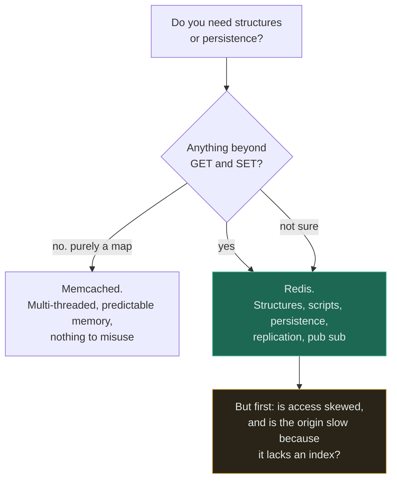

# Redis vs Memcached

**Verdict — Redis, unless you specifically want a pure, predictable, multi-threaded LRU map. But this
choice matters far less than whether your access is skewed, and that is the question worth arguing
about.**

---

## The question that actually decides it

> ### Do you need data structures and persistence, or just a fast map?

If your cache is `GET key` and `SET key value` and nothing else, Memcached does that superbly and
does nothing else, which is a real virtue: less to configure, less to misuse, less to go wrong,
predictable memory behaviour, and multiple threads per node without any of it being your problem.

The moment you want any of the following, Memcached is out and the decision is made:

- **Data structures** — sorted sets for leaderboards and rate limiters, lists for simple queues,
  hashes for partial updates, sets for membership, HyperLogLog for cardinality, streams for event
  logs.
- **Atomic multi-step operations** — a Lua script that reads, decides and writes as one unit. This is
  how token-bucket rate limiters are built.
- **Persistence or replication** — snapshots, an append-only file, replicas, failover.
- **Pub/sub or keyspace notifications.**
- **Per-key TTL manipulation** beyond set-and-forget.

The amber box is the point of the page. **The product choice is a rounding error next to the two
questions in it** — a cache over uniformly random access hits almost never regardless of which
product serves it, and a cache in front of a missing index hides the real problem in both.

## The comparison

| | **Redis** | **Memcached** |
|---|---|---|
| Data model | Strings, hashes, lists, sets, sorted sets, streams, bitmaps, HyperLogLog | Strings only |
| Atomic multi-step ops | **Yes** — Lua scripts, transactions | Only single-key operations plus CAS |
| Persistence | Snapshots and append-only file | **None.** Restart is an empty cache |
| Replication and failover | Built in, with Sentinel or Cluster | None natively |
| Threading | Single-threaded command execution, with I/O threads | **Multi-threaded** |
| Memory efficiency for plain strings | Good | **Slightly better**, and more predictable |
| Memory fragmentation | Can be significant with mixed sizes | Slab allocator makes it predictable and bounds it |
| Eviction | Several policies, configurable per instance | LRU, per slab class |
| Horizontal scale | Redis Cluster, with hash slots | Client-side sharding, usually consistent hashing |
| Pub/sub | Yes | No |
| Operational surface | **Larger** — more features, more ways to configure it wrongly | Small. It is difficult to misuse |
| Typical use | Cache, plus rate limiting, sessions, leaderboards, locks, queues | Cache |

**Two rows deserve more attention than the feature count suggests.**

*Threading:* Redis executes commands one at a time, which is a feature — it is what makes multi-step
operations atomic without locks — and a limit, because one slow command blocks everything behind it.
A `KEYS *` on a production Redis is an outage. Memcached's multi-threading makes it harder to stall
and harder to reason about atomically. Pick the property you need.

*Persistence:* the ability to survive a restart is genuinely useful for avoiding a cold-start
[thundering herd](../GLOSSARY.md#thundering-herd) on a large cache — and it is also the feature that
tempts teams to treat a cache as a database. Redis persistence is not a durability guarantee; a cache
is by definition allowed to lose everything at any moment, and any design that depends on it not
doing so has a data-loss bug waiting.

## When Redis wins

- **You need any structure beyond a string.** Sorted sets for leaderboards and sliding-window rate
  limiters, hashes for partial object updates, sets for membership tests.
- **Atomic read-modify-write.** A [rate limiter](../18-implementations/rate-limiter/) needs the
  check and the decrement to be one operation, and a Lua script gives that.
- **Restart survival matters** — a cold cache on a large dataset means a thundering herd against the
  origin at exactly the wrong moment.
- **You want replication and failover** without building it.
- **The cache is also a coordination point** — distributed locks, leader election hints, pub/sub
  fan-out for WebSocket delivery.
- **You already run Redis.** Not a technical argument, and usually the decisive one. A second cache
  technology is a second thing to operate for a marginal benefit.

## When Memcached wins

- **A pure, large, simple cache** — HTML fragments, serialised objects, query results, keyed by
  string.
- **Predictable memory behaviour matters.** The slab allocator bounds fragmentation, which makes
  capacity planning genuinely easier at very large sizes.
- **Multi-threaded throughput on big nodes**, where one Redis instance's single-threaded command loop
  becomes the ceiling and you would otherwise shard onto more instances.
- **You want a component that cannot be misused.** Nobody accidentally builds a queue, a session
  store, a lock manager and a leaderboard inside Memcached. Feature poverty is a form of operational
  discipline, and at scale that is worth real money.
- **Facebook-shaped problems** — an enormous, simple, horizontally sharded cache tier, which is the
  best-documented deployment of it in the field.

## When neither is the answer

More often than the framing of the question admits.

**The problem is not a cache.** Before adding either, check: is the origin slow because a query lacks
an index? An index is a 10–100× improvement, it is free, it is reversible, and — unlike a cache — it
makes the **miss** path fast, which is the only thing that improves p99. A cache in front of a
missing index hides it for years. See [cache everything](../anti-patterns/cache-everything/).

**Access is uniform, so no cache helps.** A cache is a bet on skew. Twenty percent of a uniform
workload gives a 20% hit rate; the same size over a Zipf distribution gives 95%. Measure the
distribution before choosing anything — that measurement matters more than everything else on this
page combined.

**A CDN is the right layer.** If the responses are identical for everyone and the problem is
distance, the fix is to be closer, and no amount of hardware addresses the speed of light.

**A read replica**, when you need consistency a cache cannot give. It is not a cache — it still pays
a query — but it helps load without a staleness window.

**A local in-process cache**, for tiny read-only reference data where sub-microsecond reads matter
and the fleet is small. Its hit rate degrades as the fleet grows, which rules it out for most cases,
but it is genuinely the fastest option when it applies.

**A materialised view**, when the expensive part is a *computation* rather than a lookup.

**Your cloud provider's managed offering**, which is what most teams should actually run. The
interesting decision is then Redis-compatible versus Memcached-compatible, and the operational
argument that dominates the technical one is that you do not want to be the person patching a cache
cluster at 3am.

## Common mistakes

| Mistake | Why it is wrong |
|---|---|
| Arguing about the product before measuring skew | The hit rate is a property of your workload, not of the cache |
| Treating Redis persistence as durability | A cache may lose everything at any moment. Persistence reduces cold starts; it does not make it a database |
| `KEYS *` in production | Single-threaded execution means it blocks every other command. An outage in one line |
| No maximum memory and no eviction policy | The cache grows until the host swaps or the OOM killer arrives |
| Storing large values | Both degrade with multi-megabyte values. Redis blocks on them; Memcached fragments |
| Using Redis as the only copy of anything | Sessions, job state, counters. One failover and it is gone |
| Ignoring the cold-start herd | An empty cache after a restart is a 20× step change at the origin |
| Caching user-specific data under a shared key | A cross-user data leak. A security bug, not a performance one |
| No hit-rate metric | The single most important cache SLI, and a falling one is your earliest warning |
| Running both, for no stated reason | Two technologies, two rotations, two failure modes, one benefit |

## Exercise

A team runs Memcached and wants to add a sliding-window rate limiter. Someone proposes doing it in
Memcached with increment and expiry, to avoid introducing Redis. Is that reasonable?

Answer

**It is reasonable to ask, and the answer is usually no — but for a subtler reason than "Memcached
lacks features".**

A fixed-window counter is genuinely implementable: `INCR` on a key named for the current window, with
a TTL. That is atomic and it works. Its flaw is the window boundary — a client can send the full
allowance at 09:59:59 and again at 10:00:00, so the effective limit is double the configured one for
a short interval. Sometimes acceptable, and worth stating explicitly rather than discovering.

A *sliding* window is where it breaks down. The usual implementation keeps timestamps in a sorted
set, trims those older than the window, counts what is left, and adds the new one — **as one atomic
operation.** Memcached has no sorted set and no scripting, so the read-trim-count-write sequence must
happen in application code across several round trips, and two concurrent requests can both pass a
check that only one should have passed. Under load, which is exactly when a rate limiter matters, the
limit leaks. A token bucket has the same problem: it is a read-modify-write and needs atomicity.

**So the honest options are three, not two.** Accept the fixed-window approximation and write down
its boundary behaviour. Add Redis, accepting a second technology and a second rotation. Or — the one
most likely to be right and least likely to be raised — **check whether the rate limiter belongs in
front of the application at all**: an API gateway, load balancer or CDN can usually enforce this
without either datastore, and it does so before the request consumes any of your capacity.

The [working implementation](../18-implementations/rate-limiter/) is worth reading alongside this,
because it makes the atomicity requirement concrete rather than theoretical.

## Related

- [Cache](../04-caching/fundamentals/) — placement, hit rate, eviction, and the failure table that matters more than this choice
- [Cache everything](../anti-patterns/cache-everything/) — what happens when this is chosen without measuring skew
- [ADR-0001: cache before more replicas](../ADRs/0001-cache-before-replicas.md) — a cache decision recorded, deliberately without naming a product
- [Rate limiter](../18-implementations/rate-limiter/) — why atomic read-modify-write is the deciding capability
- [LRU cache](../18-implementations/lru-cache/) — eviction and the scan vulnerability, measured
- [Cache and database](../14-component-combinations/cache-and-database/) — the canonical pairing and its canonical bug
- [Comparison index](README.md) · [Glossary: cache](../GLOSSARY.md#cache)
