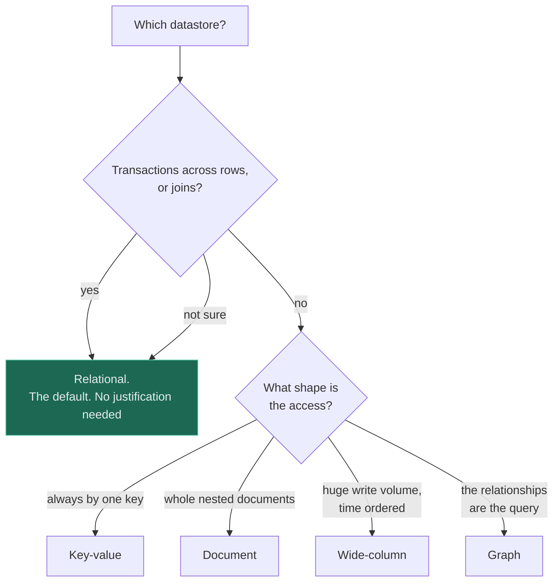

# SQL vs NoSQL

**Verdict — relational is the default and needs no justification. Everything else does, and "we might
need to scale" is not one until you have measured something.**

---

## The question that actually decides it

> ### Do you need transactions across rows?

If two or more rows must change together or not at all — an order and its line items, a transfer's
debit and credit, a booking and the seat it reserves — you need a relational database, and the
conversation is over. Every non-relational store makes you rebuild that guarantee in application
code, and rebuilding it is a project with its own failure modes rather than a feature you switch on.

If the answer is genuinely no, the second question is **what shape is the access?** — and it is the
*access pattern* that picks the store, never the data model in the abstract.

Note the middle branch. **"Not sure" resolves to relational**, because a relational database can
serve every access shape below it adequately, while none of the stores below can retrofit
transactions. The asymmetry is the whole argument: one direction is a performance compromise, the
other is a correctness one.

## The comparison

| | **Relational** | **Key-value** | **Document** | **Wide-column** | **Graph** |
|---|---|---|---|---|---|
| Transactions across rows | **Yes** | No | Within one document | Within a partition | Usually yes |
| Joins | Yes | No | No | No | Traversal is the point |
| Schema | Enforced | None | Optional | Column families | Enforced by shape |
| Query flexibility | **Very high** — ad hoc | By key only | By key plus indexes | By partition key | Traversal |
| Horizontal write scale | Hard, needs sharding | Trivial | Good | **Excellent** | Poor |
| Access shape it wants | Anything | One key | One aggregate | Time series by key | Multi-hop relationships |
| Operational maturity | Decades | High | High | Moderate | Lower |
| Cost of choosing it wrongly | You outgrow one node, eventually | You need a second access path and cannot have one | Documents grow unbounded | You need an ad hoc query and cannot run one | Nothing else fits |

**Read the last row before the others.** Choosing relational wrongly gives you a scaling problem you
will see coming and can solve with money, replicas, a cache and eventually sharding. Choosing a
key-value store wrongly gives you a query you cannot express, discovered six months in, with the data
already in a shape that cannot answer it. Those failures are not symmetrical and the deliberation
should not be either.

**"NoSQL" is not a category.** The four columns on the right have less in common with each other than
any of them has with relational. Anyone comparing "SQL vs NoSQL" as two things is comparing one
technology with the absence of one, which is why the question below the fold is *which* shape.

## When relational wins

- **Any invariant spanning rows.** Money, inventory, bookings, permissions, anything with a "must
  balance" property.
- **The access patterns are not all known yet.** A relational schema answers questions nobody
  anticipated; a denormalised store answers only the questions it was designed around.
- **Reporting and analytics matter**, even informally. Somebody will want a `GROUP BY` and they will
  want it soon.
- **The data is relational**, which most business data is. Entities with relationships and
  constraints between them.
- **Below a few terabytes and a few thousand writes per second**, which covers the overwhelming
  majority of systems. Postgres handles far more load than most people assume.
- **A small team.** One well-understood database beats three specialised ones with no expert in any
  of them.

## When a non-relational store wins

Each of these is a *specific* shape, and naming which one is part of the answer:

- **Key-value** — access is always by one key, the value is opaque, and you need enormous read or
  write throughput with predictable latency. Sessions, feature flags, short-code lookups, caches.
- **Document** — the aggregate is read and written whole, and its shape varies between instances.
  Product catalogues, CMS content, event payloads.
- **Wide-column** — very high write volume, time-ordered, queried by a partition key. Metrics,
  device telemetry, activity feeds, message history.
- **Graph** — the relationships *are* the query and traversals go several hops deep. Fraud rings,
  social graphs, permission inheritance, recommendations.
- **Genuine multi-region active-active writes**, where a relational primary cannot be everywhere and
  the domain tolerates conflict resolution.
- **Schema churn you cannot control** — data arriving from third parties whose shape changes without
  notice.

## When neither is the answer

The most common real outcome, and the one a two-column comparison cannot express.

**Both, deliberately — polyglot persistence.** The relational database is the system of record;
Elasticsearch serves search; Redis serves the hot lookups; the warehouse serves analytics. Each is
fed from the record store. This is normal and correct, and the cost to watch is that every additional
store is another thing to keep in sync and another 3am rotation.

**The thing you want is not a database.** A remarkable share of "we need NoSQL" conversations resolve
to: you need a **search index** and are trying to do full-text matching in SQL; you need a **cache**
and are trying to make the database fast enough; you need an **object store** and are putting files
in rows; you need a **queue** and are polling a table; or you need a **columnar warehouse** and are
running analytics against production.

**Postgres already does it.** Before adopting a document store, check `JSONB` with GIN indexes.
Before adopting a queue, check `SELECT ... FOR UPDATE SKIP LOCKED`. Before adopting a search engine,
check full-text search. Before adopting a time-series database, check partitioned tables. None of
these is as good as the specialist at the specialist's job — and all of them remove an entire
component from your architecture, which is a large and permanent saving.

**The answer is "not yet".** Sharding, splitting stores and denormalising are all reversible only at
great expense. If a single primary serves the load today, the correct decision is frequently to stay
and revisit at a measured threshold — see [ADR-0003](../ADRs/0003-shard-by-user-id.md), where the
"do not shard" row is explicitly the right answer below about 5 TB.

## Common mistakes

| Mistake | Why it is wrong |
|---|---|
| Choosing NoSQL "for scale" before measuring | Postgres handles far more than assumed, and you gave up transactions to solve a problem you did not have |
| Treating "NoSQL" as one thing | The four shapes have less in common with each other than with relational |
| Choosing by data model rather than access pattern | The query decides the store. The data usually fits several |
| Rebuilding transactions in application code | You have implemented a database, badly, and it is now your responsibility |
| Denormalising before knowing the queries | Denormalisation is optimisation for a specific read. Optimise for the wrong one and you cannot undo it |
| Assuming schemaless means no schema | It means the schema lives in application code, unenforced, in several versions at once |
| Using a document store for data with sharp relational edges | Every read fetches four documents and joins them in application memory |
| Ignoring operational maturity | Backups, point-in-time recovery, monitoring and upgrade paths differ enormously, and you find out during an incident |
| Running analytics on the production store | The store choice was never the problem; the workload mix was |

## Exercise

A team proposes moving from Postgres to a document store because "our schema changes a lot and we
expect to scale". They have 40 GB of data and 200 writes per second. What do you ask, and what is the
likely outcome?

Answer

**Ask three questions, in this order.**

*Do any invariants span rows?* If orders and line items, or balances and ledger entries, must change
together, the conversation ends here: a document store makes that guarantee your code's problem, and
implementing it correctly under concurrency is considerably harder than the schema churn they are
trying to escape.

*What does "the schema changes a lot" mean concretely?* Usually it means migrations are painful, not
that the data is genuinely polymorphic. Painful migrations are a tooling and process problem — see
[schema migration](../05-databases/schema-migration/), where expand-contract makes them
zero-downtime and routine. Moving to a schemaless store does not remove the schema; it moves it into
application code, unenforced, with several versions live simultaneously and no migration story at
all.

*What is the measured bottleneck?* At 40 GB and 200 writes per second there almost certainly is not
one. Those numbers are comfortable for a single modest Postgres instance, and "we expect to scale" is
a forecast rather than a measurement.

**The likely outcome:** stay on Postgres. If parts of the payload really are polymorphic, use `JSONB`
with a GIN index for those columns and keep the relational structure for everything with an
invariant — that is the honest hybrid and it is one migration rather than a platform change. Then
write down the revisit condition: a specific data size, a specific write rate, or a specific query
that the relational model genuinely cannot serve. **The migration they are proposing is nearly
irreversible; the one being suggested instead takes an afternoon.**

## Related

- [Database](../05-databases/fundamentals/) — types, indexing, transactions, isolation, and scaling in order
- [Data modelling](../05-databases/data-modelling/) — designing from the read path, which is what actually picks the store
- [Sharding](../05-databases/sharding/) — what you take on when one node stops being enough
- [Schema migration](../05-databases/schema-migration/) — expand-contract, and why schema churn is a process problem
- [ADR-0003: shard by user ID](../ADRs/0003-shard-by-user-id.md) — a worked shard-key decision, including the "do not shard" row
- [Strong vs eventual consistency](strong-vs-eventual-consistency.md) — the property underneath the store choice
- [Comparison index](README.md) · [Glossary](../GLOSSARY.md)
