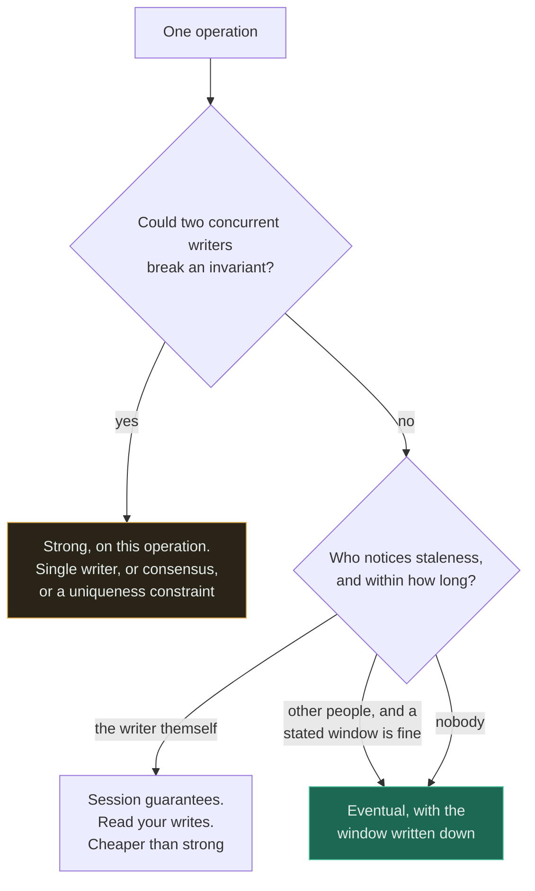

# Strong vs Eventual Consistency

**Verdict — this is not a system-wide choice. Pick it per operation: strong where two concurrent
writers could break an invariant, eventual everywhere else, and say how eventual.**

---

## The question that actually decides it

> ### Is there an invariant that two concurrent writers could break?

Not "is stale data acceptable" — that is the second question, and it is the one people ask first.
Staleness is usually survivable and always bounded; **a broken invariant is neither.**

The distinction matters because it separates two failures that get discussed as one:

| | Reading stale data | Breaking an invariant |
|---|---|---|
| Example | A dashboard shows a count from 200 ms ago | Two people book the last seat |
| Who notices | Sometimes nobody | Always somebody, eventually a lawyer |
| Self-corrects | Yes, on the next read | **No.** The damage is committed |
| Fix after the fact | Wait | Manual reconciliation, refunds, apologies |

If two concurrent operations can leave the system in a state that no single operation could have
produced — a negative balance, a double booking, a duplicate username, an oversold item — you need
strong consistency **on that operation**. If the worst outcome is that somebody sees a number that is
a moment out of date, you do not.

The second question then follows, and it must be answered numerically: **how eventual, and who
notices?** "Eventually consistent" without a stated bound is not a design.

The middle leaf is the one most designs miss. A large share of "we need strong consistency"
requirements are really **read-your-writes**: the user who just did something must see it. That is a
session guarantee, it is far cheaper than global strong consistency, and it does not cost you
availability under partition.

## The comparison

| | **Strong** | **Eventual** |
|---|---|---|
| A read sees | The latest committed write | Some past state. Converges if writes stop |
| Cost per write | Coordination — a quorum or a single writer | None beyond local |
| Latency | Higher, and bounded below by the slowest participant | Local speed |
| Under a network partition | Reduced availability. The minority side cannot serve | Stays available on both sides |
| Multi-region writes | Cross-region round trip per write | Local writes, asynchronous replication |
| Reasoning about the code | **Simple.** State is what you last wrote | Every read needs a staleness story |
| Conflict handling | Prevented | **Your problem** — last-write-wins, CRDTs or merge logic |
| Failure mode | Unavailable, loudly | Divergent, silently |
| Right for | Money, inventory, uniqueness, permissions | Feeds, counts, caches, search indexes, analytics |

**Neither is better; they are priced differently.** Strong consistency buys simple reasoning and pays
in latency and availability. Eventual buys latency and availability and pays in every read needing a
staleness story — a cost paid in application code, forever, by whoever writes the next feature.

The last-but-one row is the sharpest practical difference. **A strong system fails loudly and an
eventual system fails quietly**, and quiet failures propagate. That asymmetry is why the default for
anything involving money is strong, even where the arithmetic of staleness looks tolerable.

## When strong consistency wins

- **Money.** Balances, transfers, ledgers, refunds. There is no acceptable staleness window on a bank
  balance and no acceptable reconciliation story.
- **Finite inventory.** The last seat, the last ticket, the last unit in stock. Two writers, one
  resource.
- **Uniqueness.** Usernames, custom aliases, idempotency keys, email addresses. Uniqueness is an
  invariant across the whole keyspace, which is why it is the hardest thing to shard.
- **Permissions and authorisation.** A revoked credential that still works for thirty seconds is a
  security incident, not a staleness window.
- **Anything a regulator audits**, where "eventually correct" is not a defence.
- **State machines with ordering constraints** — you cannot ship an order that was cancelled.

## When eventual consistency wins

- **Read-heavy workloads where the data is descriptive, not decisive.** Feeds, timelines, search
  results, recommendations, view counts.
- **Multi-region, where the alternative is a cross-ocean round trip on every write.** Physics is not
  negotiable: 200 ms is 200 ms.
- **Caches and derived data by definition.** A cache is a deliberate weakening of consistency and TTL
  is the bound.
- **Analytics and reporting.** A dashboard 60 seconds behind is indistinguishable from a live one to
  every human looking at it — see [ADR-0002](../ADRs/0002-queue-for-click-analytics.md), which states
  the window rather than leaving it implicit.
- **Availability requirements above what coordination can deliver.** Under partition you must choose,
  and staying up is often the right answer.
- **Commutative operations**, where order does not affect the result, so there is nothing to conflict.

## When neither is the answer

Nearly always, in fact — because the question as posed assumes a system-wide setting, and almost no
real system has one.

**Both, chosen per operation.** The
[URL shortener](../15-real-world-problems/url-shortener/) is the clean example: **eventual
consistency on reads, strict durability on writes.** A code created 200 ms ago returning 404 in
another region is survivable; losing the mapping is not. Those are different properties on different
paths in one system, and conflating them is the most common error in this area.

**Session guarantees — the missing middle.** Read-your-writes, monotonic reads, and consistent
prefix. These give the user a coherent experience without global coordination, and they satisfy most
requirements that are stated as "strong". Route a user's reads to the region or replica that took
their write for a few seconds, and the requirement dissolves.

**Make the operation commutative and the question disappears.** A counter implemented as
`INCREMENT` needs no coordination; the same counter implemented as read-modify-write does. CRDTs
generalise this. Where the domain allows it, this is strictly better than choosing either side,
because there is no conflict to resolve rather than a cheap way to resolve one.

**Put the invariant behind a single writer.** Consistency is expensive because it needs agreement
between several parties. One partition, one shard, one process owning one invariant needs no
agreement at all. Sharding by the invariant's key converts a distributed consistency problem into a
local transaction — which is the trick behind most systems that appear to have both.

**Reservations with expiry** instead of distributed transactions. Hold the seat for ten minutes, let
it release itself if unconfirmed. This converts a distributed invariant into a local one plus a
timeout, and it is often the best real answer for booking-shaped problems.

## Common mistakes

| Mistake | Why it is wrong |
|---|---|
| Treating it as a system-wide setting | It is per operation. Most systems need both, on different paths |
| "Eventually consistent" with no stated bound | Not a design. Say how long, and who notices |
| Conflating staleness with lost data | A stale read is temporary. Losing an acknowledged write is permanent. Consistency and durability are different axes |
| Assuming strong consistency prevents all races | It prevents state races, not logic errors. Two valid operations can still produce a wrong outcome |
| Reading "CAP" as pick two of three | Partitions are not optional. The choice is A or C, **and only during a partition** |
| Ignoring the E in PACELC | Even with no partition you are choosing latency versus consistency, and that is where systems spend all their time |
| Using strong consistency everywhere "to be safe" | You bought latency and reduced availability for paths where nobody would have noticed |
| Discovering the eventual window in production | An eventual-consistency window is only a bug if nobody stated it |
| Last-write-wins as a conflict strategy by default | It is a decision to discard data silently. Sometimes correct, never accidental |
| Believing a read replica gives strong reads | It gives you a lagging copy, and a user who cannot see their own write |

## Exercise

At V7 the URL shortener replicates asynchronously to a second region with about 200 ms of lag. A user
in Frankfurt creates a link and immediately texts it to a colleague beside them, who gets a 404. Is
this a bug?

Answer

**It is a known and accepted trade, not a bug — provided it was decided rather than discovered.** The
200 ms cross-region replication lag was chosen deliberately at V7 in exchange for local reads in every
region, and the non-functional requirements say eventual consistency on reads is acceptable while
durability is not.

That distinction is the whole answer. **Losing the mapping would be unacceptable; showing it 200 ms
late is fine.** Consistency and durability are separate axes and this design is strict on one and
relaxed on the other, on purpose.

If it turns out to be unacceptable, the fixes in increasing cost: route reads to the creating region
for a few seconds after a write, which is a **session guarantee** and by far the cheapest; make
creation synchronously replicate before acknowledging; or accept a slower create globally. Notice
that all three make *creates* worse to make *this one read* better — which is the right shape given
the 100:1 read:write ratio, and the wrong shape if the ratio were inverted.

**The general rule worth keeping: an eventual-consistency window is only a bug if nobody stated it.**
The failure here would not be the 404; it would be a design document that said "eventually
consistent" without a number.

## Related

- [Consistency](../00-foundations/consistency/) — the models, the classic bug, and the full trade-off table
- [CAP theorem](../00-foundations/cap-theorem/) — what the choice actually is, and PACELC for normal operation
- [Replication](../05-databases/replication/) — synchronous versus asynchronous, and read-your-writes
- [URL shortener](../15-real-world-problems/url-shortener/) — eventual on reads, strict on durability, in one design
- [ADR-0002: queue for click analytics](../ADRs/0002-queue-for-click-analytics.md) — an eventual window with a number attached
- [SQL vs NoSQL](sql-vs-nosql.md) — the store choice that follows from the invariant question
- [Cache everything](../anti-patterns/cache-everything/) — the most common accidental weakening
- [Comparison index](README.md) · [Glossary: eventual consistency](../GLOSSARY.md#eventual-consistency)
